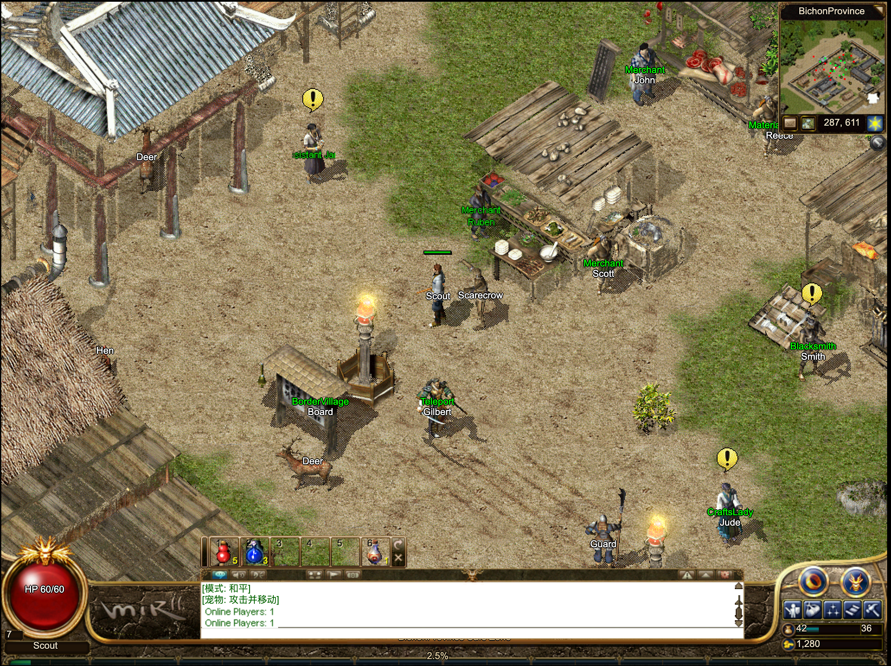
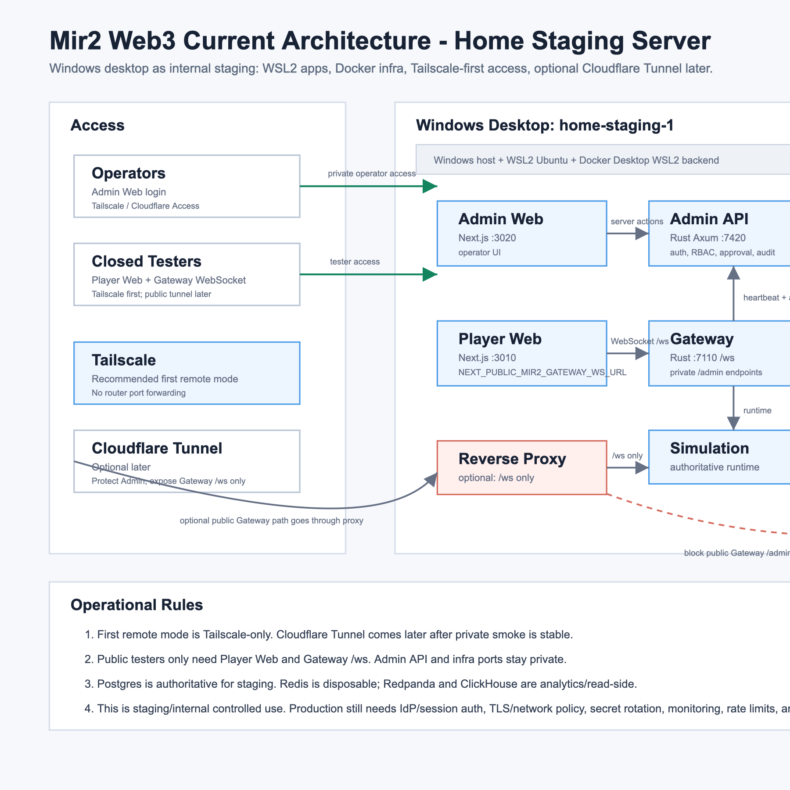

# Mir2 Web — Crystal 1:1

A modern web reimplementation of **Legend of Mir 2**, matching the Crystal / Mir 2
reference client in both **behavior** and **visuals**. The frontend is rendered
by Next.js + Bevy WASM (WebGPU / WebGL2); authoritative game state lives in a
Rust Gateway and Simulation backend.

> 

---

## ✨ Features

- **WebGPU + WebGL2 dual backend** with automatic runtime fallback
- **Pixel-parity visual comparison** against the native Crystal client,
  tracked with automated capture pipelines
- **Authoritative server-side simulation** — movement, combat, shared zones,
  NPCs, drops — owned by a Rust engine, not the client
- **One URL everywhere** — desktop browsers, mobile, and gamepad-enabled
  consoles adapt automatically (keyboard / touch / controller tutorials)
- **Low-end Android support** with adaptive memory budgets across
  a documented device tier (2–8 GiB): see `mir2-web3/docs/LOW-END-ANDROID-SUPPORT.md`

---

## 🚀 Quick Start

Requires only **Git** and **Docker Desktop**.

```bash
git clone --filter=blob:none --recurse-submodules https://github.com/Zombieliu/mir2.git
cd mir2/mir2-web3
./scripts/dev.sh up --open          # macOS
# .\scripts\dev.cmd up -OpenBrowser  # Windows
```

Open the printed URL, register an account, create a character, and enter the
game. Node, Rust, WASM, and the build toolchain are all provided by the
repo-locked developer image — no manual installation.

- Windows native toolchain (no Docker): see `INSTALL.md`
- Full setup & troubleshooting: see `INSTALL.md`
- macOS / Windows specifics: `mir2-web3/docs/LOCAL-DEVELOPMENT-MACOS.md`,
  `mir2-web3/docs/LOCAL-DEVELOPMENT-WINDOWS.md`

> **Note on assets**: the repository ships a small *Starter* asset set for
> quick start. The full visual pack (~18 GiB) and the R2 CDN release are
> **private** and require authorization — see [Licensing](#-licensing).

---

## 🧱 Architecture

| Layer | Repo path | Role |
| --- | --- | --- |
| Player Web | `apps/web` | Next.js client, resource cache, browser QA |
| Bevy Runtime | `apps/game-client/runtime` | WebGPU / WebGL2 WASM rendering |
| Gateway | `apps/gateway` | Rust TCP / HTTP / WebSocket server |
| Simulation | `apps/simulation` | Authoritative gameplay & shared Zone engine |
| Admin Web / API | `apps/admin-web`, `apps/admin-api` | Operations, audit, management |
| Packages | `packages` | Protocol, game data, conversion tooling |

Architecture deep-dive: `mir2-web3/docs/ARCHITECTURE.md`,
`mir2-web3/docs/ARCHITECTURE-CURRENT.md`.

Deployment / staging architecture:



---

## 📁 Project Layout

| Path | Purpose |
| --- | --- |
| `Crystal` | Crystal reference client/server submodule & parity tooling |
| `mir2-web3/apps/web` | Player Web, resource cache, browser QA |
| `mir2-web3/apps/game-client/runtime` | Bevy WebGPU/WebGL2 WASM runtime |
| `mir2-web3/apps/gateway` | Rust TCP/HTTP/WebSocket Gateway |
| `mir2-web3/apps/admin-api` | Operations API, audit, management queries |
| `mir2-web3/apps/simulation` | Authoritative gameplay & shared Zone simulation |
| `mir2-web3/packages` | Protocol, game data, conversion tools |
| `mir2-web3/docs` | Architecture, 1:1 roadmap, QA evidence, handoffs |

---

## 📊 Status & Roadmap

Driven toward **100% Candidate** Crystal / Mir 2 1:1 parity:

- `mir2-web3/docs/CRYSTAL-1TO1-ROADMAP.md` — visual & behavioral parity roadmap
- `mir2-web3/docs/FRONTEND-1TO1-GAPS.md` — remaining frontend gaps
- `mir2-web3/docs/BACKEND-1TO1-PROGRESS.md` — backend parity progress
- `mir2-web3/docs/AGENT-TASK-QUEUE.md` — current task queue (source of truth for work)

Acceptance is evidence-based: automated capture pipelines compare Web vs.
native Crystal renders, movement, and protocol traces under
`mir2-web3/docs/generated/player-qa/`.

---

## ⚖️ Licensing

**Original code** is licensed under the **GNU Affero General Public License
v3** (see [`LICENSE`](LICENSE)).

**Excluded from the license** (see the LICENSE addendum and
`mir2-web3/docs/LEGAL-AND-ASSET-RIGHTS.md`):

- All Legend of Mir 2 / Wemade assets: client data, textures, sprites, audio,
  maps, names, characters, and derived packs/atlases.
- The `Crystal` submodule and Crystal-derived code.
- All third-party trademarks.

These materials remain the property of their copyright holders and require
separate written authorization for redistribution or commercial use.

---

## 🤝 Contributing

Read [`CONTRIBUTING.md`](CONTRIBUTING.md) and
`mir2-web3/docs/AGENT-ORCHESTRATION.md` before starting. Do not commit account stores,
`.env.local`, R2 credentials, raw Crystal client files, or
`generated/crystal-packs/full`.
