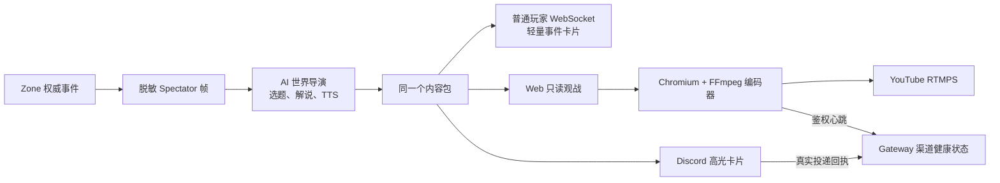

# AI 首发渠道闭环（Launch Channel Pack v1）

## 首发范围

第一版只接四个真正能形成业务闭环的入口：

| 渠道 | 给谁看 | 就绪证据 |
| --- | --- | --- |
| 游戏内 AI 世界事件 | 正在游戏的玩家 | Gateway 已把最新高光送入普通玩家 WebSocket，客户端出现“立即观战”卡片 |
| Web / HLS | 官网访客、社区运营 | 已配置公开只读观战地址，节目内容包带同源观战链接 |
| Discord Webhook | 社区成员 | Discord 实际接受过至少一条高分事件卡片 |
| YouTube RTMPS | 外部观众 | 独立编码容器每 10 秒向 Gateway 上报一次经过鉴权的 `live` 心跳 |

`Discord Go Live`、Clip、Twitch 和 Bilibili 不在首发范围内，默认保持关闭。控制台会把
它们标成后续阶段，不会用未实现的渠道凑“全绿”。

## 一条事件如何走完



AI 直播不进入玩家移动、战斗、背包或保存事务。YouTube、Discord 或模型故障时，玩家
游戏链路继续运行。

## Gateway 生产配置

以下值只放服务器环境变量或 Secret Manager：

```bash
export MIR2_PRODUCTION=1
export MIR2_SPECTATOR_ENABLED=1
export MIR2_AI_LIVE_ENABLED=1
export MIR2_AI_LIVE_MODE=shadow
export MIR2_AI_LIVE_OPERATOR_TOKEN='<long-random-operator-token>'

export MIR2_AI_DISTRIBUTION_GAME_OVERLAY_ENABLED=1
export MIR2_AI_LIVE_PUBLIC_URL='https://mir2.obelisk.build/'
export MIR2_AI_LIVE_DISCORD_WEBHOOK='https://discord.com/api/webhooks/...'

export MIR2_AI_DISTRIBUTION_RTMP_ENABLED=1
export MIR2_AI_DISTRIBUTION_RTMP_PLATFORM=youtube
export MIR2_AI_DISTRIBUTION_HEARTBEAT_TOKEN='<at-least-24-random-characters>'
```

`MIR2_AI_DISTRIBUTION_HEARTBEAT_TOKEN` 不等于导播令牌。前者只允许编码器报告自身状态，
不能切换直播模式或操作渠道。

## YouTube 编码器

复制专用模板到不会提交的 Secret 文件：

```bash
cp infra/ai-live/.env.youtube.example infra/ai-live/.env.youtube
```

填入 YouTube Studio 给出的完整 RTMPS 地址和推流密钥，同时确保编码器的
`MIR2_AI_DISTRIBUTION_HEARTBEAT_TOKEN` 与 Gateway 相同。然后启动：

```bash
docker compose \
  --env-file infra/ai-live/.env.youtube \
  -f infra/docker-compose.dev.yml \
  --profile ai-live up -d --build ai-live
```

控制台中的 YouTube 渠道只有收到新鲜 `live` 心跳才显示“已验证”。编码器退出、报告
错误或 45 秒没有心跳时，状态会自动变成“链路异常”。状态 API 只暴露平台、Worker ID、
运行状态和心跳时间，不返回 RTMPS 地址或推流密钥。

## 人工验收

1. 打开 Web `/ai-live`，首发渠道应显示 `2/4` 或更低，不能在没有外部凭据时全绿。
2. 启动 Gateway、Player Web，登录角色并进入地图。
3. 导播页切换“正式直播”，触发死亡、复活、高额伤害、稀有掉落或多人交战。
4. 普通玩家画面右上出现 AI 世界事件卡片；点击“立即观战”打开该地图的只读节目页。
5. Web/HLS 能持续看到画面、字幕和可选 TTS，玩家操作延迟不受编码器影响。
6. Discord 收到高光卡片后，`discordWebhook` 从“等待真实信号”变成“已验证”。
7. 启动 YouTube 编码器后，`rtmpBroadcast` 显示平台 `youtube`、Worker ID 和最近心跳。
8. 停止编码器并等待 45 秒，YouTube 状态应变为“链路异常”；玩家仍能正常移动和战斗。
9. `/ai-live/distribution` 不得包含 Discord Webhook、RTMPS 推流密钥、AI API Key 或玩家 IP。
10. 四个首发渠道都收到真实证据后，控制台显示“全部收到真实运行证据”。

## 自动检查

Gateway 在线时可发送一条无敏感信息的编码器验收心跳：

```bash
MIR2_AI_ACCEPT_GATEWAY_URL=http://127.0.0.1:7110 \
MIR2_AI_DISTRIBUTION_HEARTBEAT_TOKEN='<heartbeat-token>' \
./scripts/accept-ai-launch-channels.sh
```

仓库级检查：

```bash
cargo +1.89.0 test --manifest-path apps/gateway/Cargo.toml ai_distribution --lib
cargo +1.89.0 test --manifest-path apps/gateway/Cargo.toml ai_live --lib
cd apps/web && npx tsc --noEmit --pretty false
docker compose -f infra/docker-compose.dev.yml config --quiet
```

外部平台授权是唯一不能由仓库伪造的部分：验收人员必须自己提供 Discord Webhook 和
YouTube 推流密钥，并在各自平台上确认消息或直播画面真实出现。
