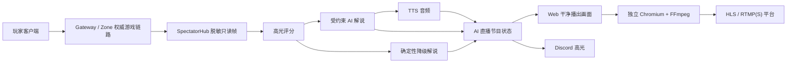

# Mir2 生产级 AI 直播

## 这次真正落地了什么

这不是把聊天机器人放在游戏画面旁边，而是把已完成的只读观战系统变成一条可播出的节目生产线：

1. 玩家照常连接 Gateway 和 Zone，AI 不在玩家请求路径上。
2. `SpectatorHub` 只发布脱敏后的地图、玩家位置、生命值与战斗事件。
3. AI Live Worker 对死亡、复活、掉落、高额伤害和多人交战做确定性评分。
4. 达到阈值后，模型只根据脱敏事件写解说，并且只能从当前可见、已脱敏的战斗单位白名单中选择镜头。
5. 模型失败时使用规则解说；TTS、任一分发渠道或推流失败也不会影响玩家。
6. 干净播出页负责画面、字幕、节目角标和可选语音。
7. 独立 Chromium + FFmpeg 容器把播出页编码为本地 HLS 或 RTMP/RTMPS。



## 三种工作模式

| 模式 | 用途 | 模型解说 | TTS | Discord |
| --- | --- | --- | --- | --- |
| `shadow` | 上线前彩排，默认值 | 是；失败则规则解说 | 否 | 否 |
| `live` | 正式播出 | 是；失败则规则解说 | 是 | 高分事件推送 |
| `paused` | 安全暂停 | 不生成新片段 | 否 | 否 |

正式环境必须设置操作令牌。控制页面不会把令牌写入 URL 或永久存储，只保留在当前浏览器标签页的 `sessionStorage`。

## Gateway 配置

最小本地彩排不需要任何模型密钥：

```bash
export MIR2_SPECTATOR_ENABLED=1
export MIR2_SPECTATOR_DIRECTOR_TOKEN='replace-with-a-long-random-token'
export MIR2_AI_LIVE_ENABLED=1
export MIR2_AI_LIVE_MODE=shadow
export MIR2_AI_LIVE_OPERATOR_TOKEN='replace-with-another-long-random-token'
```

接入 OpenAI 兼容文本接口、语音和 Discord：

```bash
export MIR2_AI_LIVE_TEXT_ENDPOINT='https://api.openai.com/v1/chat/completions'
export MIR2_AI_LIVE_TEXT_API_KEY='server-only-secret'
export MIR2_AI_LIVE_TEXT_MODEL='gpt-5-mini'

export MIR2_AI_LIVE_TTS_ENDPOINT='https://api.openai.com/v1/audio/speech'
export MIR2_AI_LIVE_TTS_API_KEY='server-only-secret'
export MIR2_AI_LIVE_TTS_MODEL='gpt-4o-mini-tts'
export MIR2_AI_LIVE_TTS_VOICE='alloy'

export MIR2_AI_LIVE_DISCORD_WEBHOOK='https://discord.com/api/webhooks/...'
export MIR2_AI_LIVE_PUBLIC_URL='https://mir2.obelisk.build/'
```

其他可调参数：

| 变量 | 默认 | 含义 |
| --- | ---: | --- |
| `MIR2_AI_LIVE_POLL_MS` | 500 | 读取新观战帧的周期 |
| `MIR2_AI_LIVE_MIN_SCORE` | 60 | 生成解说片段的最低分 |
| `MIR2_AI_LIVE_DISCORD_MIN_SCORE` | 90 | 推送 Discord 的最低分 |
| `MIR2_AI_LIVE_COOLDOWN_MS` | 8000 | 两段解说之间的最短间隔 |
| `MIR2_AI_LIVE_DATA_DIR` | `.mir2-data/ai-live` | JSONL 证据和 MP3 目录 |

`MIR2_PRODUCTION=1` 时会强制：

- 操作令牌不能为空；
- 模型、TTS、Discord 和公开链接必须使用 HTTPS；
- Discord Webhook 必须是 Discord 官方域名；
- 密钥不会出现在状态、指标、WebSocket 消息或日志中。

## 人工验收

1. 启动 Gateway 和 Player Web。
2. 打开 `/ai-live`。状态应显示 Gateway Worker 在线，默认模式为“彩排”。
3. 输入 `MIR2_AI_LIVE_OPERATOR_TOKEN`，切换“影子彩排”“正式直播”“安全暂停”。
4. 打开：

```text
http://127.0.0.1:3002/spectate?aiLive=1&spectateMode=director&spectateToken=<director-token>
```

5. 让测试角色发生死亡、复活、大额掉血或掉落事件。
6. 播出页应出现 HYPE 分数、事件原因、字幕、解说和 AI 选中的玩家镜头。
7. 关闭模型接口后重复测试，页面仍应出现“规则解说”，玩家不掉线。
8. `/ai-live/status` 返回脱敏节目状态；`/ai-live/metrics/prometheus` 可供 Prometheus 抓取。
9. `.mir2-data/ai-live/segments.jsonl` 保存每个片段的帧摘要、分数、来源和模型标识；语音在 `audio/`。
10. 所有推送渠道共用 `distribution-queue.json`，Gateway 重启后继续指数退避重试；超过 8 次进入 `distribution-dead-letter.jsonl`。旧的 `discord-queue.json` 会自动迁移。

自动检查：

```bash
cargo +1.89.0 test --manifest-path apps/gateway/Cargo.toml ai_live --lib
cd apps/web && npx tsc --noEmit --pretty false
docker compose -f infra/docker-compose.dev.yml config --quiet
```

Rust 的真实管线测试会启动本地 mock 文本模型、TTS 和 Discord 服务，验证严格 JSON、目标白名单、MP3 保存、JSONL 证据和 Discord 投递。

## 本地 HLS 与真实推流

先复制示例配置：

```bash
cp infra/ai-live/.env.example infra/ai-live/.env
```

本地 HLS：

```bash
docker compose \
  --env-file infra/ai-live/.env \
  -f infra/docker-compose.dev.yml \
  --profile ai-live up --build ai-live
```

输出位于：

```text
artifacts/ai-live/hls/live.m3u8
```

真实平台推流时，把 `MIR2_AI_LIVE_OUTPUT_FORMAT` 设为 `rtmp`，把平台提供的完整 RTMPS ingest URL 写入 `MIR2_AI_LIVE_OUTPUT_URL`。这个 URL 含推流密钥，只能进入服务器环境变量或 Secret Manager，不能提交到 Git。

编码器是独立容器：Chromium 加载干净播出页，PulseAudio 收集 AI 语音，FFmpeg 以 H.264/AAC 输出。进程异常会自动重启，健康检查同时验证浏览器、FFmpeg 和 HLS 产物。

## 运维入口

| 入口 | 说明 |
| --- | --- |
| `/ai-live` | 非技术导播控制台 |
| `/spectate?aiLive=1...` | 干净播出画面 |
| Gateway `/ai-live/status` | 脱敏状态与最近片段 |
| Gateway `/ai-live/metrics` | JSON 指标 |
| Gateway `/ai-live/metrics/prometheus` | Prometheus 文本指标 |
| Gateway `/ai-live/control` | 令牌保护的模式切换 |

如果 Web 与 Gateway 不在同一主机，给 Player Web 设置服务器侧 `MIR2_GATEWAY_HTTP_URL`。`/api/ai-live/*` 会在服务器侧代理控制请求，从而避免浏览器 CORS，同时不把操作令牌写进公开构建配置。

## 当前生产边界

代码已经完成从观战事件到节目、语音文件、Discord 消息和编码容器的闭环，并通过
[`AI Distribution Fabric v1`](AI-DISTRIBUTION-FABRIC.zh-CN.md) 将节目生产与渠道投递
解耦。真正向 YouTube、Twitch、Bilibili 或其他平台开播，还必须由运营方提供相应
平台的 RTMP/RTMPS 推流密钥；Discord Go Live 还需要独立桌面 Relay。仓库和验收环境
不会伪造这些外部授权。
