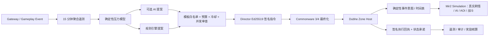

# Mir2 AI 世界导演 MVP

## 1. 目标

世界导演不负责“临场编程游戏”，而是持续观察世界状态，从游戏方预先批准的
事件模板中选择一个方案，经硬规则审查后，通过 Commonware 控制面发布确定性
指令，最后由 Dubhe Zone Host 执行并返回可验证回执。

首个样板事件为 **“比奇—沃玛教主复苏”**：

1. 比奇出现沃玛异动传闻，同时向 15–28 级玩家开放追赶任务；
2. 5 分钟后，沃玛寺庙一层 `D022` 出现先遣队，限定区域奖励修正为 115%；
3. 20 分钟后，沃玛教主地图 `D024` 启用 `director.awakened.v1` 变体；
4. 整场活动最多 40 分钟，预算不超过 150,000，模板冷却 6 小时。

MVP 已形成一个可运行、可测试的控制闭环，并已接入真实共享 Zone：

- 第二阶段从 Crystal 数据读取 D022 原生刷新锚点，生成 24 只
  `WoomaSoldier`；
- 第三阶段从 D024 原生刷新锚点生成 1 只强化 `WoomaTaurus`；
- 怪物进入现有 Zone AI、AOI、战斗、经验结算和检查点；
- 导演调度状态可以在进程重启后恢复，重复推进不会重复刷怪。
- 独立 Zone Host 可以通过受保护的 Operator API 导入 Commonware 最终化块，
  后台按服务器时间自动推进阶段；
- `/metrics` 已暴露最终化高度、已安装指令、已执行动作、事件怪物和广播累计值。

它不会直接修改玩家数据库、直接发金币、铸造链上资产、封禁玩家或下发自由
脚本。

## 2. 总体架构



控制职责分成三层：

| 层 | 能做什么 | 不能做什么 |
| --- | --- | --- |
| AI / 规则提案层 | 选择已批准模板、目标 Zone、持续时间、预算、随机种子 | 不能提供动作列表或代码 |
| Policy + Commonware | 校验阈值、地图、预算、冷却、并发；形成最终化顺序 | 不执行游戏逻辑 |
| Zone + Simulation | 按最终化高度、种子和模板确定性执行，产生回执 | 不能扩大预算或改变模板 |

## 3. 世界导演观察什么

`WorldTelemetrySnapshot` 只接受聚合指标，不接受账号、聊天、IP、精确背包等
个人数据：

- 每张地图的活跃人数、中位等级、新/回流人数；
- 击杀、Boss 击杀、死亡、完成任务数；
- 金币产出/回收和交易价格指数；
- 活跃公会数、最大公会人口及 Boss 击杀占比。

这些指标被转换成 0–10,000 bps 的五类压力：

- `populationImbalance`：玩家是否过度集中在少数地图；
- `contentFatigue`：大量重复击杀但任务/目标完成稀少；
- `progressionGap`：新人与世界主流等级差；
- `economyInflation`：金币净增发及市场价格变化；
- `guildDominance`：单一公会的人口或 Boss 控制程度。

压力模型是确定性的：同一份快照始终得到相同结果，便于回放、测试和解释。

## 4. AI 的正确接入方式

`AiDirectorProposalAdapter` 是模型供应商与游戏权威系统之间的窄接口。服务端
发给模型：

- 聚合世界快照；
- 压力分数；
- 可用模板摘要；
- 硬预算上限；
- “只能返回严格 JSON 提案”的指令。

模型只能返回 `DirectorProposal`：

```json
{
  "proposalId": "proposal:world-hk-15m-000001:...",
  "snapshotId": "world-hk-15m-000001",
  "templateId": "mir2.bichon-wooma-awakening.v1",
  "source": {
    "type": "ai",
    "provider": "model-gateway",
    "model": "world-director-small"
  },
  "targetZones": ["map:0", "map:D022", "map:D023", "map:D024"],
  "durationMs": 2400000,
  "rewardBudget": 150000,
  "seed": 123456,
  "generation": 1,
  "rationale": "沃玛区域内容疲劳超过阈值"
}
```

任何额外字段都会被拒绝。即使 JSON 结构正确，也必须再次通过模板、压力、
地图、预算、冷却和并发校验。因此模型故障最多导致“没有活动”，不会获得
数据库或资产权限。

## 5. 确定性与安全边界

- Director 指令使用 Ed25519 签名并绑定 `commandId`、快照、模板、种子、
  generation、有效期、预算、Zone 和完整阶段动作。
- 指令以 `obelisk.world-director.v1` 命名空间进入现有
  `CommonwareControlLog`；控制块仍保持“有事件才出块”。
- Zone Host 只接受可信 Director 公钥及已经最终化的正高度。
- `commandId` 同时作为控制日志幂等键；重复投递返回第一次的相同回执。
- 执行回执绑定 Commonware 高度、Zone Host、阶段时间表和 SHA-256 状态承诺，
  并由 Zone Host 再次签名。
- 当前动作枚举只有广播、受限遭遇、追赶任务、受限奖励倍率和 Boss 变体。
  不存在数据库 SQL、任意脚本、直接资产发放或封禁动作。

## 6. 一键人工验收

在仓库根目录执行：

```bash
cargo +1.89.0 test --locked -p mir2-gateway world_director --lib
cargo +1.89.0 run --locked -p mir2-gateway --bin world_director_demo
```

第一条命令当前匹配 8 个测试（7 个导演测试和 1 个 Operator 接口测试）并应
全部通过；Simulation 另有 2 个真实 Zone 刷怪测试。它们共同覆盖：

1. 压力分数确定且有界；
2. 非快照地图和超预算提案被拒绝；
3. AI 只能返回严格的模板提案；
4. 指令篡改和过期被拒绝；
5. 比奇—沃玛指令经 Commonware 最终化后，Zone 执行和重复投递回执一致。
6. 24 只沃玛先遣队和 1 只强化教主进入真实 Zone，调度重启后继续且不重刷；
7. 无玩家时怪物仍进入权威状态和检查点，在线玩家能收到 `ObjectMonster`。
8. 最终化链、待执行阶段和幂等键写入磁盘后，可以由新的运行时实例恢复。

第二条命令应输出 JSON，并同时满足：

```text
scenario = mir2-bichon-wooma-awakening
commonwareHeight = 1
commonwareSigners = 3 个
scheduledStageIds = bichon-rumor, temple-incursion, wooma-taurus-awakens
commandSignatureVerified = true
receiptSignatureVerified = true
idempotentReplayVerified = true
simulationSpawnedMonsters = 25
simulationRestartRecoveryVerified = true
woomaVanguardCount = 24
awakenedBossCount = 1
```

这是本地确定性演示，不需要模型 API Key，也不会连接生产数据库或真实玩家。

## 7. 在真实 Zone Host 上验收控制面

先生成一份“当前时间签发”的最终化块和演示证据：

```bash
LIVE_DIR="$(mktemp -d)"
MIR2_WORLD_DIRECTOR_ELAPSED_MS=1200000 \
MIR2_WORLD_DIRECTOR_FINALIZED_OUT="$LIVE_DIR/finalized.json" \
  cargo +1.89.0 run --locked -p mir2-gateway --bin world_director_demo \
  > "$LIVE_DIR/evidence.json"
DIRECTOR_KEY="$(jq -r .directorPublicKey "$LIVE_DIR/evidence.json")"
COMMITTEE="$(jq -r '.commonwareCommittee | join(",")' "$LIVE_DIR/evidence.json")"
```

在终端 A 启动真实 Zone Host。管理 Token 至少 32 字节，导演未配置时相关接口
默认关闭：

```bash
MIR2_ZONE_HOST_ADDR=127.0.0.1:17020 \
MIR2_ZONE_HOST_METRICS_ADDR=127.0.0.1:19100 \
MIR2_ZONE_HOST_MANAGEMENT_TOKEN=0123456789abcdef0123456789abcdef \
MIR2_ACCOUNT_STORE_PATH="$LIVE_DIR/accounts.json" \
MIR2_WORLD_DIRECTOR_TRUSTED_PUBLIC_KEY="$DIRECTOR_KEY" \
MIR2_WORLD_DIRECTOR_COMMITTEE="$COMMITTEE" \
MIR2_WORLD_DIRECTOR_CHECKPOINT_FILE="$LIVE_DIR/world-director-runtime.json" \
  cargo +1.89.0 run --locked -p mir2-gateway --bin zone_host
```

在终端 B 提交最终化块并查看运行状态：

```bash
TOKEN=0123456789abcdef0123456789abcdef
curl -fsS -X POST \
  -H "Authorization: Bearer $TOKEN" \
  -H "Content-Type: application/json" \
  --data-binary "@$LIVE_DIR/finalized.json" \
  http://127.0.0.1:19100/v1/world-director/finalized | jq

curl -fsS \
  -H "Authorization: Bearer $TOKEN" \
  http://127.0.0.1:19100/v1/world-director | jq

curl -fsS http://127.0.0.1:19100/metrics \
  | rg obelisk_world_director
```

首个响应应为 `accepted: true`、`finalizedHeight: 1`、
`advance.spawnedMonsters: 25`；状态中的
`worldEventMonstersByZone.map:D022` 为 24、`map:D024` 为 1。这里用
`MIR2_WORLD_DIRECTOR_ELAPSED_MS` 生成一条仍在有效期内、但活动时间已推进 20
分钟的验收指令，因此无需真的等待 20 分钟。正常签发不设置该变量，Zone Host
会每秒按服务器时间检查，并在约 5 分钟和 20 分钟触发对应阶段。重复提交同一
文件应为 `accepted: false`，不会重复执行动作；停止并用同一检查点文件重启
后，`finalizedHeight`、动作数和事件怪物计数仍会恢复。

Operator 接口不会接受裸 `SignedDirectorCommand`，只能接受
`FinalizedDirectorSubmission`。其中每个 Commonware signer 都必须提供对同一
区块的 Ed25519 签名；导入时同时检查区块摘要、父块、高度、提议者、委员会
法定人数、验证者签名、导演公钥签名和幂等键。

### 7.1 真实玩家战斗与重连验收

完成上一节的最终化块提交后，在终端 C 启动连接同一 Zone Host 的 Gateway：

```bash
QA_TOKEN=director-qa-0123456789abcdef
MIR2_GATEWAY_TCP_ADDR=127.0.0.1:17000 \
MIR2_GATEWAY_WEB_ADDR=127.0.0.1:17110 \
MIR2_ZONE_HOST_ADDR=127.0.0.1:17020 \
MIR2_ZONE_RPC_TIMEOUT_MS=30000 \
MIR2_ACCOUNT_STORE_PATH="$LIVE_DIR/accounts.json" \
MIR2_GATEWAY_QA_CONTROL_TOKEN="$QA_TOKEN" \
  cargo +1.89.0 run --locked -p mir2-gateway --bin mir2-gateway
```

在终端 D 运行真实 WebSocket 玩家验收：

```bash
TOKEN=0123456789abcdef0123456789abcdef
QA_TOKEN=director-qa-0123456789abcdef
MIR2_WORLD_DIRECTOR_PLAYER_WS_URL=ws://127.0.0.1:17110/ws \
MIR2_WORLD_DIRECTOR_OPERATOR_URL=http://127.0.0.1:19100 \
MIR2_WORLD_DIRECTOR_MANAGEMENT_TOKEN="$TOKEN" \
MIR2_WORLD_DIRECTOR_QA_CONTROL_TOKEN="$QA_TOKEN" \
MIR2_WORLD_DIRECTOR_PLAYER_TIMEOUT_MS=30000 \
  node apps/web/scripts/world-director-player-acceptance.mjs | jq
```

输出应满足 `accepted: true`，事件怪的 `refreshedHp` 小于 `initialHp`，
`firstSession.objectMonsterVisible` 和
`reconnectedSession.objectMonsterVisible` 都为 `true`，两个会话的
`errors` 都为空。脚本会创建测试账号、将测试角色提升到可验收等级、进入
D022、等待同地图传送的新权威快照、攻击真实事件怪，再用第二个 WebSocket
会话验证重连可见性。

`MIR2_GATEWAY_QA_CONTROL_TOKEN` 只用于本地或隔离开发服验收，不应配置到生产
Gateway。生产玩家仍通过正常升级、寻路和地图传送进入活动。

导演的地图目标和玩家使用同一份 `ZoneTopology`：单 Zone 模式映射到
`primary`，分地图或热点分线模式映射到实际拥有该地图的 Zone。因此导演不会
绕过 Gateway 另建一套“活动服务器”。事件怪出生点来自 Crystal 全图碰撞
校验后的可行走格，排除普通怪物出生点，并保证同一批事件怪坐标唯一；怪物
移动后，共享动作索引会随 Zone 的权威移动包同步。

## 8. 代码位置

| 文件 | 内容 |
| --- | --- |
| `apps/gateway/src/world_director.rs` | 遥测、压力、模板、审查、AI 边界、签名指令、调度恢复和 Simulation 适配 |
| `apps/gateway/src/bin/world_director_demo.rs` | 比奇—沃玛端到端可执行演示 |
| `apps/gateway/src/bin/zone_host.rs` | 生产运行时启用、后台推进和磁盘恢复 |
| `apps/gateway/src/operator.rs` | 最终化提交、状态查询、手动推进和 Prometheus |
| `apps/gateway/src/consensus_log.rs` | 被复用的 Commonware 事件驱动最终化控制日志 |
| `apps/gateway/src/node_identity.rs` | 被复用的 Ed25519 身份和验签 |
| `apps/gateway/src/routing.rs` | 事件怪与玩家共享的地图索引、原生战斗和动态坐标同步 |
| `apps/simulation/src/runtime/zone/runtime.rs` | 无需伪造玩家 Session 的权威事件刷怪入口 |
| `apps/web/scripts/world-director-player-acceptance.mjs` | 真实 WebSocket 玩家战斗和重连验收 |

## 9. 生产演进路线

MVP 之后不应立即增加大量“AI 玩法”。推荐依次完成：

1. **Live Telemetry**：Approval Beta 已将 Admin API 的 Gateway presence、
   ClickHouse gameplay summary、Postgres/账号读模型聚合成
   `WorldTelemetrySnapshot`，并持久化输入快照和决策记录；经济 mint/burn
   流量仍需补齐；
2. **Live Player Acceptance**：D022 的广播、怪物可见、真实战斗和重连恢复
   已自动化通过；下一步补 D024 Boss 死亡、掉落和多人争抢验收；
3. **Operator Console**：`/world-director` 已展示提案、压力证据、预算、签名、
   远程 Commonware 高度、Zone 回执，并支持修改、批准、拒绝、Finality 前取消、
   全局暂停和失败重试；活动中事件的补偿型撤场命令仍需后续完成；
4. **Shadow Mode**：AI 只提案、不执行，连续观察 7–14 天，比较运营人员判断；
5. **Limited Auto Mode**：只自动执行零资产或低预算模板，逐步扩大范围。

人工审批生产 Beta 的部署与验收见
`docs/AI-WORLD-DIRECTOR-APPROVAL-BETA.zh-CN.md`。

目前已证明事件怪物进入真实 ZoneRuntime，在线玩家会收到 `ObjectMonster`，
能对动态移动后的事件怪造成真实伤害，并在重连后继续看到相同权威对象。尚未
完成的是 D024 Boss 死亡/掉落的多人验收，以及追赶任务的完整接取/交付 UI；
现阶段 `OpenCatchupQuest` 仍只广播活动入口。奖励倍率已经写入事件怪物经验
值，但不会凭空生成掉落资产。
