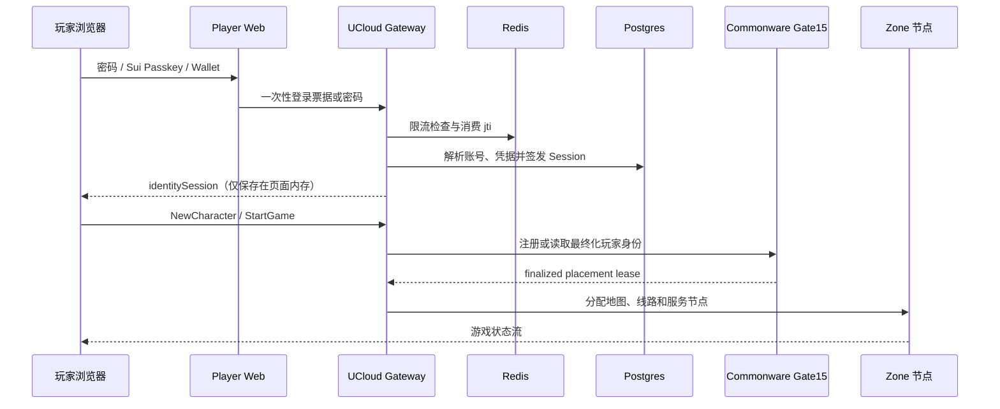

# 商业版账号、登录与恢复系统

本文定义玩家从首次登录到角色进入游戏、账号恢复和运营封禁的完整身份边界。
它不是“钱包登录按钮”，而是一条可审计、可撤销、可限流并能安全上线的身份链路。

## 1. 已实现能力

- 密码账号使用 Argon2id 和随机盐保存；旧明文或 `sha256$` 密码只在成功登录后透明迁移。
- Sui Passkey 与 Sui Wallet 使用 60 秒一次性 challenge，绑定来源、地址、登录方法和随机 `jti`。
- Gateway HMAC 验证登录票据，并在 Redis 通过 `SET NX` 一次性消费，阻止重放。
- 钱包可绑定已有 Obelisk 游戏账号，玩家无需为每个发行渠道创建不同角色档案。
- 登录成功签发短期身份 Session；Session 可单独撤销、全部登出，并跨 Gateway 传播撤销状态。
- 玩家可生成十枚一次性恢复码；恢复密码后撤销账号全部 Session。
- 登录失败按匿名网络指纹、账号、账号网络组合和设备指纹限流，不保存家庭原始 IP。
- WebSocket 生产环境只接受精确允许的浏览器 Origin；身份写接口拒绝跨站请求。
- 玩家端“账号安全”面板可查看会话、绑定或撤销凭据、轮换恢复码、登出其他设备。
- 运营后台 `/identity-security` 可查询账号会话、脱敏凭据和安全审计，并强制下线。

## 2. 登录到进入地图



密码、钱包和 Passkey 最终都解析成同一个内部 `account_id`。链上地址是凭据，
不是角色数据主键；撤销一个钱包不会删除角色，也不会影响仍有效的其他凭据。

## 3. 数据与隐私

Postgres migration `0010_commercial_identity.sql` 建立四类记录：凭据、Session、
恢复码和审计。数据库只保存 Argon2 密码摘要、恢复码的带 pepper HMAC、脱敏凭据
主体，以及经 HMAC 处理的网络指纹；不会保存恢复码明文、身份 Session 明文或家庭 IP。

浏览器只拿到当前身份 Session。管理 Token 和 Gateway 管理地址只存在 Admin Web
服务端环境，不进入前端 JavaScript。

## 4. 生产配置

Gateway 必需配置：

```dotenv
MIR2_ENV=production
MIR2_ACCOUNT_STORE_BACKEND=postgres
MIR2_ACCOUNT_STORE_REQUIRE_POSTGRES=1
MIR2_ACCOUNT_STORE_DATABASE_URL=postgres://...
MIR2_GATEWAY_REDIS_CACHE_URL=redis://...
MIR2_GATEWAY_REQUIRE_REDIS_CACHE=1
MIR2_IDENTITY_POLICY=commercial
MIR2_PASSKEY_AUTH_SECRET=<独立随机值，至少 32 字符>
MIR2_IDENTITY_SESSION_SECRET=<独立随机值，至少 32 字符>
MIR2_IDENTITY_RECOVERY_PEPPER=<独立随机值，至少 32 字符>
MIR2_GATEWAY_ADMIN_OPERATOR_TOKEN=<独立随机值，至少 32 字符>
MIR2_ALLOWED_WEB_ORIGINS=https://mir2.obelisk.build
```

Player Web：

```dotenv
MIR2_GATEWAY_HTTP_URL=https://<gateway-host>
MIR2_PASSKEY_AUTH_SECRET=<与 Gateway 相同>
MIR2_PASSKEY_ALLOWED_ORIGINS=https://mir2.obelisk.build
NEXT_PUBLIC_MIR2_GATEWAY_WS_URL=wss://<gateway-host>/ws
```

Admin Web：

```dotenv
MIR2_GATEWAY_ADMIN_URL=https://<gateway-host>
MIR2_GATEWAY_ADMIN_OPERATOR_TOKEN=<与 Gateway 相同>
```

生产环境不允许使用开发默认 Secret。轮换 Session Secret 会立即使所有现存身份
Session 失效；轮换恢复 pepper 会使旧恢复码失效，二者都应先公告并留审计记录。

## 5. 上线顺序与回滚

1. 备份 Postgres，执行 migration `0010`；迁移是新增表，不修改角色数据。
2. 写入四个独立 Secret、Origin、Postgres、Redis 和并发上限。
3. 在同一个 commit 构建 Gateway 与权威 Zone Host，记录 commit、Cargo.lock 和两个二进制的 SHA-256；涉及账号或模拟状态的发布不得只更新一端。
4. 备份两个服务的环境文件、当前软链和二进制哈希，先切换 Zone Host，再切换 Gateway；任一步失败均恢复两个旧软链。
5. 启动单个候选链路，验证健康检查、密码登录、Passkey、建角、Gate15 最终化和 StartGame。
6. 发布 Player Web 与 Admin Web，验证账号安全页面、恢复、会话撤销和运营强制下线。

回滚时默认同时恢复上一组 Gateway、Zone Host 软链及环境文件；`0010` 新表可保留，旧版本
不会读取。只有 diff 已证明变更完全不进入 Zone Host 编译和执行路径时，才允许单独滚动
Gateway，且仍须重跑本章完整验收。不要自动删除身份表或恢复旧密码摘要。若出现安全事件，
应先撤销账号全部 Session、轮换相关 Secret，再恢复服务。

## 6. UCloud 当前生产状态

2026-08-02 商业身份系统已经部署到 UCloud 生产环境：

- Postgres migration `0010` 已执行，身份凭据、Session、恢复码和审计四张表已建立。
- Gateway 当前 revision 为 `a2f05a346`，包含商业身份基线 `f02aa2acd`，以及 Postgres
  运行时隔离和有界账号动作队列；二进制 SHA-256 为
  `f4f93ba48d6366a7108dd4261ed39ae8ae439cb1bcfa1225601b949846039aae`。
- 权威 Zone Host 使用同一商业身份基线 `f02aa2acd`，二进制 SHA-256 为
  `1befec70b3eb5d4ed1461db72ee8b4d5cb3b25f58b6dbdf4ff1af618b4a44e55`。
  后续两个 Gateway-only commit 只修改 `identity.rs` 和 `web.rs`，不改变 Zone Host
  编译路径；其生产发布后已重新执行完整账号生命周期验收。
- Gateway 健康接口确认 `identity_backend=postgres`、Redis Session Cache 健康，Gate15
  四个验证者全部响应。
- Player Web 生产部署 `dpl_Hi7zKb5YPfjuTK1kxiCvqwydfrW7` 已绑定
  `https://mir2.obelisk.build`；Admin Web 生产部署
  `dpl_EZLvBtvDAtDPmmiiKorstucryoVh` 已绑定
  `https://mir2-telemetry.vercel.app`。

真实外网验收已连续通过两次：新账号、建角、首次 StartGame、Postgres 身份 Session、
十枚恢复码轮换、密码恢复、新密码重登、原角色重载、第二次 StartGame、当前 Session
撤销，以及撤销 Token 返回 HTTP 401。浏览器验收同时确认玩家站 HTTP 200、后台可登录
`/identity-security`、管理 API 已配置，两个页面均无运行时错误。

后台登录 Token 与 Gateway 管理 Token 相互独立，保存在运维 Mac 的 Keychain 中，不写入
仓库或文档。授权运维人员可在该机器执行以下命令取用：

```bash
security find-generic-password -a henryliu -s obelisk-mir2-admin-dashboard -w
```

## 7. 人工验收清单

- 新账号弱密码被拒绝，合规密码落库为 `$argon2id$`。
- 旧账号第一次成功登录后自动迁移，错误密码不能触发迁移。
- 同一个 Passkey challenge 第二次使用失败，错误 Origin 和错误地址失败。
- 钱包绑定后进入原账号角色列表；同一钱包不能绑定两个账号。
- 新角色创建后首次 StartGame 通过 Gate15，页面实际进入地图。
- 玩家撤销当前 Session 后下一次请求失败；“登出其他设备”只保留当前 Session。
- 恢复码只能使用一次；恢复后旧密码和全部旧 Session 均失效。
- 连续错误登录触发限流；Redis 不可用时生产登录关闭，而不是绕过保护。
- 后台能看到安全审计，能单独踢下线，也能账号全部下线；浏览器网络面板无管理 Token。
- 日志、接口和遥测均不出现密码、恢复码、完整 Session Token或家庭原始 IP。
