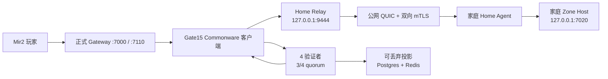

# Commonware UCloud + Gate15 线上部署与验收

截至 2026-07-28，UCloud 香港服务器已运行 Commonware `v2026.2.0`
四验证者线上 Devnet，正式 Mir2 Gateway 已启用 Gate15，并已打通玩家到家庭
Dubhe Node 的完整执行路径。

## 当前链路



玩家执行顺序：

1. Gateway 使用原有 Postgres 完成账号密码验证；
2. `StartGame` 前，Gate15 从 4 个验证者读取至少 3 个一致状态根；
3. Gate15 最终化玩家 Session lease，并读取 `primary` 的 placement；
4. Gateway 把 Zone RPC 发给服务器本地 Relay；
5. Relay 校验内部令牌、签名 placement、容量证书和家庭节点 mTLS 身份；
6. Relay 通过家庭节点主动建立的 QUIC 隧道转发；
7. Home Agent 校验 Relay 签名后，只向回环地址上的 Zone Host 转发；
8. Zone Host 使用受信任 Host ID 和单调 fencing token 执行游戏逻辑并回包。

家庭路由器不需要公网 IP 或端口映射。验证者 API、P2P、Gate14 控制网关和
投影器当前全部只监听 UCloud 的 `127.0.0.1`。

## 已部署服务

| 服务 | 作用 | 本机地址 |
| --- | --- | --- |
| `mir2-commonware-validator@0..3` | Commonware Simplex 四验证者 | P2P `19300..19303`，API `19400..19403` |
| `mir2-commonware-gateway` | Gate14 控制命令和路由读取 | `127.0.0.1:19500` |
| `mir2-commonware-projector` | 最终化状态投影到 Postgres/Redis | `127.0.0.1:19600` |
| `mir2-commonware-reconcile.timer` | 每 10 秒为重启/落后验证者补最终化记录 | systemd timer |
| `mir2-commonware-placement-renew.timer` | 每 15 分钟检查并提前续签 placement | systemd timer |
| `mir2-gateway` | 正式玩家 Gateway，Gate15 已启用 | `127.0.0.1:7000`、`0.0.0.0:7110` |
| `dubhe-home-relay` | Gateway 到家庭节点的 QUIC Relay | TCP `127.0.0.1:9444`、UDP `0.0.0.0:9443` |

验证者持久化数据在：

```text
/var/lib/mir2/commonware/validator-0
/var/lib/mir2/commonware/validator-1
/var/lib/mir2/commonware/validator-2
/var/lib/mir2/commonware/validator-3
```

Commonware Release：

```text
/opt/mir2/commonware/releases/20260727T170915Z-0341f17f
```

正式 Gateway Release：

```text
/opt/mir2/gateway/releases/20260727T173949Z-0341f17f-gate15
```

## 当前验收结果

- Commonware：4/4 响应、4/4 同高度、4/4 状态根一致；
- 共识阈值：3/4；
- Gate15：`enabled=true`、`healthy=true`，不再是 `null`；
- 旧服身份：1912 个账号和 1798 个角色全部最终化；
- placement：`primary`、generation 4、家庭节点为主 Host；
- 正式玩家：`connect → login → startGame → keepAlive` 全部成功；
- 单验证者故障：停掉 validator-3 后，3/4 quorum 下玩家仍成功；
- 自动恢复：validator-3 重启后，timer 自动导入缺少的 1 条最终化记录，
  四个节点重新同高度同状态根；
- 家庭节点：1 个在线、1 个 serving、128 Sessions / 8 Zones、家庭 IP 隐藏；
- 投影器：Postgres 和 Redis 均可用，但二者明确不是权威状态。

完整机器可读证据：

[production-acceptance-2026-07-28.json](generated/commonware-ucloud/production-acceptance-2026-07-28.json)

本次正式玩家探针总耗时 7.227 秒，其中 `connect` 2.448 秒、
`startGame` 4.069 秒。链路正确性已经通过，但这个延迟还不是商业服目标，后续
应把地图预热、RPC 往返次数和 Session lease 最终化路径作为独立性能 Gate。

## 人工巡检

登录服务器：

```bash
ssh -i ~/.ssh/mir2_gateway_hk_ed25519 \
  -o IdentitiesOnly=yes \
  ubuntu@165.154.65.136
```

检查全部服务：

```bash
systemctl is-active \
  mir2-gateway \
  mir2-commonware-validator@{0,1,2,3}.service \
  mir2-commonware-gateway \
  mir2-commonware-projector \
  dubhe-home-relay \
  dubhe-home-enrollment \
  dubhe-home-telemetry
```

检查正式 Gateway 的 Gate15：

```bash
curl -fsS http://127.0.0.1:7110/health | python3 -m json.tool
```

通过条件：

```text
ok = true
gate15.enabled = true
gate15.healthy = true
gate15.respondingValidators = 4
gate15.agreeingValidators 长度 = 4
gate15.placementCount = 1
```

检查四验证者：

```bash
for port in 19400 19401 19402 19403; do
  curl -fsS "http://127.0.0.1:$port/v1/status"
  echo
done
```

检查自动任务：

```bash
systemctl list-timers --all | grep mir2-commonware
journalctl -u mir2-commonware-reconcile.service -n 20 --no-pager
journalctl -u mir2-commonware-placement-renew.service -n 20 --no-pager
```

检查家庭节点聚合遥测：

```bash
curl -fsS \
  "http://127.0.0.1:18081/v1/public?expectedReports=1" |
  python3 -m json.tool
```

执行正式玩家探针：

```bash
sudo -u mir2 env \
  MIR2_HOME_PLAYER_GATEWAY_ADDR=127.0.0.1:7000 \
  MIR2_HOME_PLAYER_PROBE_OUT=/var/lib/mir2/commonware/manual-player-probe.json \
  MIR2_HOME_PLAYER_TIMEOUT_MS=30000 \
  /opt/mir2/gateway/current/home_player_probe
```

输出包含 `HOME_PLAYER_PROBE_PASS` 才算通过。只看进程或健康页在线，不能证明
游戏逻辑已经在家庭节点执行。

## 安装、迁移和切换工具

本目录提供可复跑工具：

```text
infra/commonware-ucloud/install-ucloud-devnet.sh
infra/commonware-ucloud/migrate-legacy-identities.py
infra/commonware-ucloud/reconcile-finality.py
infra/commonware-ucloud/renew-placement.py
infra/commonware-ucloud/activate-gate15-ucloud.sh
```

身份迁移器支持断点续跑。大批量迁移可使用 `--prestage`，它先把确定序列的同一
命令提交给 4 个验证者，再让 Commonware 连续最终化；不会跳过签名或 3/4
quorum。

## 回滚

Gate15 切换前的 Gateway 环境文件和 Release 地址保存在：

```text
/var/lib/mir2/commonware/cutover-backups/20260727T173949Z-0341f17f-gate15
```

回滚只影响 Gateway 接入，不删除 Commonware 数据：

```bash
backup=/var/lib/mir2/commonware/cutover-backups/20260727T173949Z-0341f17f-gate15
previous_release="$(sudo cat "$backup/previous-release")"
sudo cp -a "$backup/gateway.env" /etc/mir2/gateway.env
sudo ln -sfn "$previous_release" /opt/mir2/gateway/current
sudo systemctl restart mir2-gateway
curl -fsS http://127.0.0.1:7110/health
```

## 仍然存在的边界

这次是“真实线上闭环”，但还不是 Regional 最终形态。四个验证者目前是同一台
UCloud 主机上的四个独立进程，因此能验证共识、单进程故障、持久化和自动追平，
不能抵抗整机、机房或运营商故障。下一阶段应把验证者分散到至少三个独立故障域，
再做网络分区、整机掉电和跨机恢复验收。
