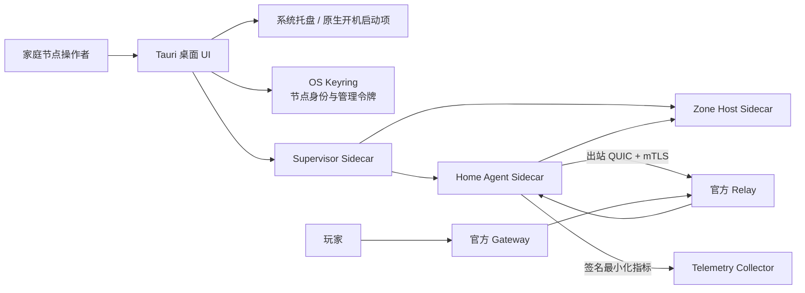

# Dubhe Node Desktop 三平台发行与验收

## 1. 验收边界

Dubhe Node Desktop 是家庭节点运营软件，不是 Mir2 玩家客户端。玩家仍连接官方
Gateway；桌面应用只负责节点身份、Enrollment、容量认证、Sidecar 生命周期、
出站 Relay 隧道、签名遥测和运营者控制。

本发行体系覆盖：

- macOS Apple Silicon 与 Intel；
- Windows x64；
- Linux x64；
- 托盘常驻、关闭到后台、开机自启；
- Supervisor、Zone Host、Home Agent 原生 Sidecar；
- Stable/Beta 签名更新；
- 最近一次已知良好版本的受控回滚；
- 安全卸载准备；
- 脱敏诊断导出；
- CI 未签名冒烟包与受保护的正式签名发布。

它不声称：

- 一个 macOS 本地构建等同于 Windows/Linux 已经实机通过；
- 没有 Apple/Windows 证书的包是正式签名包；
- 家庭节点提供公网入口；
- 用户可以绕过 Gateway 直接连接家庭 IP；
- 桌面应用是 root/Administrator 特权服务。

## 2. 运行结构



关闭主窗口只隐藏 UI，Supervisor 继续服务。托盘“停止节点并退出”调用带本机
Bearer Token 的 graceful shutdown：先 drain 新 Session，再等待存量 Session
退出并回收 Sidecar。桌面进程异常退出时 `kill_on_drop` 会 fail-closed 回收其
托管的 Supervisor，避免孤儿 Zone Host 在没有 UI/更新/凭据轮换的情况下继续
接客。

## 3. 本地构建

### 3.1 通用

```bash
cd apps/dubhe-node-desktop
npm ci
npm run build
cargo +1.89.0 test --manifest-path src-tauri/Cargo.toml
```

### 3.2 当前平台安装包

macOS：

```bash
npm run tauri build -- --bundles app,dmg
```

Windows：

```powershell
npm run tauri build -- --bundles nsis,msi
```

Linux：

```bash
npm run tauri build -- --bundles deb,appimage
```

`beforeBuildCommand` 会调用 `scripts/prepare-sidecars.mjs`，以当前目标三元组编译并
复制以下四个二进制：

```text
home_agent
home_agent_launcher
home_agent_supervisor
zone_host
```

禁止把 macOS Sidecar 复制进 Windows/Linux 包，也禁止用 Wine 或交叉编译结果
替代原生 Runner 验收。

## 4. CI 与正式发布

### 4.1 普通 CI

`.github/workflows/dubhe-node-desktop-ci.yml` 使用四个 Runner：

| Runner | Rust target | 产物 |
| --- | --- | --- |
| `macos-15` | `aarch64-apple-darwin` | app、DMG |
| `macos-15-intel` | `x86_64-apple-darwin` | app、DMG |
| `windows-2025` | `x86_64-pc-windows-msvc` | MSI、NSIS |
| `ubuntu-22.04` | `x86_64-unknown-linux-gnu` | deb、AppImage |

上传的 Artifact 名包含 `unsigned`，保留 7 天，只用于功能冒烟。

### 4.2 受保护的正式发布

在 GitHub 建立两个受保护 Environment：

```text
dubhe-node-beta
dubhe-node-stable
```

建议 Stable 要求两名 reviewer。配置：

| 名称 | 类型 | 用途 |
| --- | --- | --- |
| `TAURI_SIGNING_PRIVATE_KEY` | Secret | 更新产物离线签名私钥 |
| `TAURI_SIGNING_PRIVATE_KEY_PASSWORD` | Secret | 私钥口令 |
| `DUBHE_NODE_UPDATER_PUBLIC_KEY` | Variable | 编译进客户端的验签公钥 |
| `DUBHE_NODE_UPDATE_STABLE_URL` | Variable | Stable HTTPS 元数据 |
| `DUBHE_NODE_UPDATE_BETA_URL` | Variable | Beta HTTPS 元数据 |
| `DUBHE_NODE_UPDATE_ROLLBACK_URL` | Variable | 受控回滚 HTTPS 元数据 |
| `APPLE_CERTIFICATE` | Secret | Base64 Developer ID 证书 |
| `APPLE_CERTIFICATE_PASSWORD` | Secret | 证书口令 |
| `APPLE_SIGNING_IDENTITY` | Secret | Developer ID Application identity |
| `APPLE_ID` | Secret | 公证账户 |
| `APPLE_PASSWORD` | Secret | app-specific password |
| `APPLE_TEAM_ID` | Secret | Apple Team ID |
| `WINDOWS_CERTIFICATE_BASE64` | Secret | Base64 Authenticode PFX |
| `WINDOWS_CERTIFICATE_PASSWORD` | Secret | PFX 口令 |

创建版本时同时修改以下三处版本，`npm run release:check` 会阻止不一致：

```text
apps/dubhe-node-desktop/package.json
apps/dubhe-node-desktop/src-tauri/Cargo.toml
apps/dubhe-node-desktop/src-tauri/tauri.conf.json
```

然后建立不可变 tag，例如：

```bash
git tag dubhe-node-v0.2.0
git push origin dubhe-node-v0.2.0
```

手动运行 `Release Dubhe Node Desktop`，选择 `beta` 或 `stable` 并填写该 tag。工作流
只创建 Draft Release。四个平台构建结束后，独立 `signed-manifest` Job 下载所有
资产，生成确定性的 `SHA256SUMS`，再用同一离线发行密钥生成
`SHA256SUMS.sig`。四个平台人工验收全部通过后，才发布 Release 和对应更新元数据。

## 5. 更新与回滚

### 5.1 更新

客户端只从当前 Stable/Beta HTTPS 地址获取元数据，安装包必须通过编译进应用的
离线公钥验签。服务器 TLS 不是唯一信任根：即使 CDN 或 GitHub token 泄漏，攻击者
没有离线私钥仍不能生成客户端接受的更新。

升级前写入：

```json
{
  "fromVersion": "0.1.0",
  "toVersion": "0.2.0",
  "rollbackPolicy": "last-known-good-signed-release-only"
}
```

### 5.2 回滚

回滚不是“允许安装任意旧版本”。必须同时满足：

1. 当前版本等于最近一次记录的 `toVersion`；
2. 回滚目标精确等于 `fromVersion`；
3. 受保护回滚端点明确返回该版本；
4. 安装包通过相同离线发行公钥验签。

回滚开始前，记录文件移动为 `rollback-pending`；下载或安装失败时恢复原记录，防止
一次网络错误永久丢失恢复入口。

### 5.3 发布侧回滚操作

当新版本出现 P0/P1：

1. 停止 Stable 元数据继续推广；
2. 将回滚端点指向上一已知良好版本的签名 metadata；
3. 保留有问题版本和审计记录，不覆盖 tag；
4. 通知节点操作者在设置页执行“回滚到 vX.Y.Z”；
5. 遥测确认新版本在线数下降、旧版本恢复且 Session drain 正常；
6. 修复后发布更高版本，不重新使用旧版本号。

## 6. 卸载

先在设置页点击“准备卸载”。客户端会：

1. 禁用操作系统开机启动项；
2. 请求 Supervisor graceful shutdown；
3. 停止接收新玩家并等待存量 Session 退出；
4. 回收 Home Agent 和 Zone Host；
5. 保留 OS Keyring 中的节点身份。

然后使用系统入口：

- macOS：退出应用，将 `Dubhe Node.app` 移到废纸篓；
- Windows：设置 → 应用 → 已安装的应用 → Dubhe Node → 卸载；
- Linux deb：`sudo apt remove dubhe-node-desktop`；
- Linux AppImage：删除 AppImage 文件。

默认保留身份是为了重装恢复。若需要永久注销，先通过控制面撤销 Node/链上注册并
领取可退款质押，再使用受审计的身份删除工具；普通卸载器不得静默删除不可恢复密钥。

## 7. 三平台人工验收

每个平台都必须记录安装包 SHA-256、签名结果、版本、Node ID、测试时间和操作者。

### 7.1 安装与启动

1. 从 Draft Release 下载当前平台安装包；
2. 校验 SHA-256；
3. macOS 执行 `codesign --verify --deep --strict --verbose=2` 和
   `spctl --assess --type execute --verbose=4`；
4. Windows 在文件属性确认数字签名，或执行
   `Get-AuthenticodeSignature <installer>`；
5. Linux 校验 Release checksum/签名；
6. 安装并首次打开，确认生成 Node ID 且私钥不出现在诊断文件。

### 7.2 托盘与自启

1. 勾选开机自启；
2. 关闭窗口，确认进程仍在且托盘图标可重新打开；
3. 从托盘暂停/开始贡献，界面和 Collector 状态一致；
4. 注销并重新登录系统，确认应用隐藏启动且不会弹主窗口；
5. 从托盘“停止节点并退出”，确认 Supervisor、Agent、Zone Host 均退出。

### 7.3 玩家闭环

1. 完成 Enrollment 和容量认证；
2. 确认 Relay mTLS、Collector 回执和 placement 生效；
3. 玩家只连接官方 Gateway；
4. 完成 Login、StartGame、KeepAlive；
5. 在 Session 活跃时点击暂停，确认不再接新玩家但存量玩家不被强杀；
6. Session 清零后安全退出。

### 7.4 更新、回滚、卸载

1. 在 Beta 通道从 `N` 升级到 `N+1`；
2. 用错误签名替换测试元数据，确认安装被拒绝；
3. 发布侧批准 `N` 为 rollback，客户端回滚到 `N`；
4. 再次启动并完成玩家闭环；
5. 点击“准备卸载”，确认开机启动项消失、Sidecar 退出；
6. 卸载并重装，确认节点身份按策略恢复。

### 7.5 诊断隐私

设置页导出 `dubhe-node-diagnostics-*.json`，必须确认不含：

```text
Authorization
Bearer token
management token
private key
password
mTLS private key
家庭公网 IP
```

允许包含 Node ID、应用版本、OS/架构、Session 数、Zone/Relay/Collector 状态和
脱敏日志尾部。

## 8. 发布 Gate

只有以下条件全部满足才可把 Draft 改为公开 Release：

- 四个原生 Runner 全绿；
- Apple 签名与公证通过；
- Windows Authenticode 通过；
- Linux checksum/签名通过；
- 三平台托盘、自启、退出、升级、回滚、卸载验收通过；
- 玩家 Gateway → Relay → Home Agent → Zone Host 闭环通过；
- 诊断文件隐私检查通过；
- Beta 至少运行一个完整凭证轮换周期；
- Stable Environment reviewer 批准。
