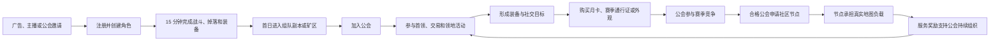
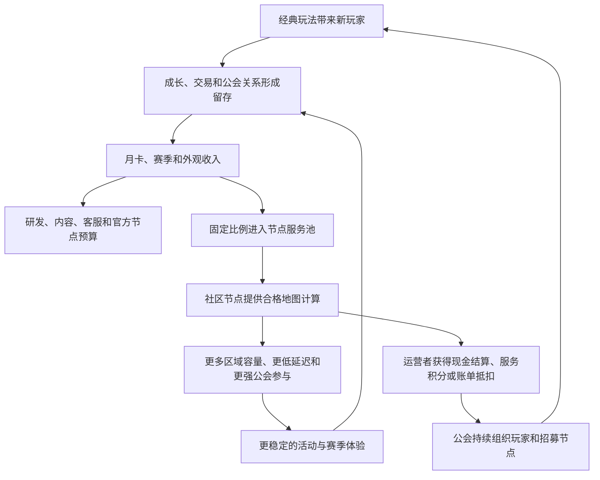
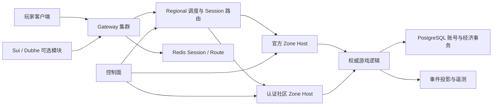

# 《Project Obelisk：烈焰边境》初期游戏策划与商业闭环

> 文档状态：立项草案 v0.2<br>
> 产品形态：PC / Web 优先的经典多人在线角色扮演游戏<br>
> 技术底座：Mir2 Rust 服务端 + Regional 分布式 Zone + Dubhe / Sui 可选能力
> 首发原则：先证明一款游戏成立，再证明社区节点网络可以改善游戏运营；不以发币、炒作资产或“完全去中心化”作为首发前提。

---

## 1. 一句话产品定义

《烈焰边境》是一款强调自由打宝、玩家交易、三职业协作和公会领地战争的经典
MMORPG。玩家以个人成长进入公会竞争；合格公会还可以运行社区游戏节点，和官方
节点共同承载地图，并根据真实、可审计的有效服务获得运营奖励。

产品的核心差异不是“游戏上链”，而是：

1. 一款先能独立成立的经典 MMORPG；
2. 地图计算可以由官方节点和认证社区节点共同承担；
3. 节点不掌握账号、资产和结算权，作恶时可被快速切走；
4. 公会的组织力同时作用于游戏玩法和服务器供给，但两套奖励账本严格隔离；
5. Sui / Dubhe 只承担适合公开验证的可选部分，不阻塞普通玩家登录和战斗。

---

## 2. 项目目标与首发边界

### 2.1 首发要证明的五件事

1. 经典战法道、打怪掉落和自由交易仍能形成稳定留存；
2. 公会战争能够制造周目标和赛季目标，而不是玩家满级即流失；
3. 装备、金币、材料的产出和消耗可以长期平衡；
4. 社区节点能真实承载地图，并达到与官方节点一致的安全和体验标准；
5. 收入能够同时覆盖研发运营、内容更新和节点服务成本。

### 2.2 首发不做

- 不承诺万人同一画面；
- 不追求 700 张地图同时活跃；
- 不把移动、攻击和普通掉落逐次写入公链；
- 不发行可以自由兑回法币的游戏代币；
- 不允许节点运营者修改地图规则、掉率、角色数据或经济结果；
- 不让运行节点直接产出可交易装备和金币；
- 不以复刻既有 Mir2 名称、美术、地图和剧情作为商业发行前提。

### 2.3 首发内容规模

建议首个可运营版本采用经典 1–50 级地理成长线，不追求地图数量：

| 内容 | 首发数量 |
| --- | ---: |
| 主城 | 比奇、盟重，共 2 座 |
| 核心野外 | 2 张 |
| 地下城家族 | 骷髅、僵尸、蜈蚣、石墓、祖玛，共 5 个 |
| 地下城实际层数 | 约 12 层 |
| 公会战争地图 | 1 张 |
| 世界首领 | 4 个以内 |
| 职业 | 战士、法师、道士 |
| 首发等级上限 | 50 |
| 一个赛季 | 8 周 |

首发总量控制在约 17 张实际地图。沃玛、封魔、骨魔、尸魔、牛魔和赤月等内容
保留为赛季候选，不和首发主线同时制作。底层可以根据负载将地图合并到共享
Zone、独占一个 Zone，或拆成多条线路。

---

## 3. 目标用户与产品定位

### 3.1 核心用户

- 喜欢经典 MMORPG 的 25–45 岁玩家；
- 重视打宝、交易、公会关系和长期角色积累；
- 接受较慢成长，但要求每次上线都有明确收益；
- 愿意为月卡、赛季、外观和便利性付费；
- 公会会长、主播和社区组织者；
- 对运行服务器节点感兴趣的技术型公会或游戏社区。

### 3.2 市场定位

不是“高画质大型 MMORPG”，也不是“链游理财产品”，而是：

> 中等内容成本、强社交关系、可持续赛季更新、由社区共同提供部分计算资源的
> 经典 MMORPG。

### 3.3 玩家承诺

- 不卖直接毕业的顶级装备；
- 付费玩家可以更方便、更好看，但不能绕过主要玩法；
- 核心经济结果有事务账本和审计记录；
- 社区节点与官方节点使用同一规则，节点运营者不能给自己公会改掉率；
- 公会战争结果来自游戏内行为，不由节点归属决定。

---

## 4. 核心体验支柱

### 4.1 打宝有惊喜

普通怪提供稳定材料，精英和首领提供可识别的稀有掉落。大部分强力装备来自真实
玩法，不直接在商城出售。

### 4.2 交易有价值

装备属性、职业需求、耐久和强化路线制造分工。交易行降低交易摩擦，面对面交易
保留经典社交体验。所有重要交易进入事务经济系统。

### 4.3 公会有共同目标

公会不只是聊天列表，而是共同完成：

- 公会科技和仓库；
- 世界首领；
- 矿区护送；
- 领地争夺；
- 每周要塞战；
- 赛季王城战；
- 可选的社区节点认证和运营。

### 4.4 世界有风险分层

- 安全区：新手、交易和基础生产；
- 普通区：稳定升级和材料；
- 争夺区：高收益、允许阵营或公会冲突；
- 深层矿区：资源丰富，但需要护送和组织；
- 战争地图：定时开放，明确规则，不干扰休闲玩家。

### 4.5 运营者贡献能被验证

社区节点获得奖励的前提是它真实承载了有效玩家和游戏 Tick，并满足延迟、在线率、
故障恢复和版本一致性要求。只开着空容器不等于贡献。

---

## 5. 玩家完整生命周期



### 5.1 前 15 分钟

1. 选职业；
2. 三分钟内完成第一次击杀；
3. 五分钟内获得第一件明确变强的装备；
4. 十分钟内完成第一次技能升级或强化；
5. 十五分钟内看到公共事件、世界首领预告或公会招募。

首日不能让玩家先理解钱包、节点或复杂经济。普通账号密码、Passkey 和钱包登录
都是入口，钱包不是必选项。

### 5.2 首日

- 达到 10–12 级；
- 完成一次双人或三人协作；
- 获得第一件可交易物品；
- 接触安全矿区；
- 收到公会邀请；
- 明确看到次日目标。

### 5.3 首周

- 达到 25–30 级；
- 完成职业构筑的第一次分叉；
- 加入稳定公会；
- 参加一次世界首领和一次公会活动；
- 完成第一次玩家交易；
- 购买或明确拒绝首个低价付费项。

### 5.4 首赛季

- 角色达到等级上限；
- 装备形成 2–3 套可选构筑；
- 公会争夺至少一个领地；
- 玩家参与赛季王城战；
- 新赛季保留身份、外观和部分长期成长，重置容易形成垄断的竞争资源。

---

## 6. 核心玩法循环

### 6.1 30 秒循环：战斗反馈

寻找目标 → 走位 → 攻击 / 施法 → 受击与配合 → 掉落 → 拾取 → 立即变强或积累。

要求：

- 战士强调贴身、爆发和承伤；
- 法师强调范围、距离和地形；
- 道士强调召唤、持续伤害、治疗和团队增益；
- 怪物必须有少量可读机制，不能只有数值木桩；
- 普通战斗 10–30 秒结束，精英 1–3 分钟，首领 5–15 分钟。

### 6.2 10 分钟循环：目标完成

任务 / 刷怪 / 挖矿 → 获得材料和装备 → 回城整理 → 强化、合成或交易 → 选择下一
目标。

### 6.3 每日循环

- 一次高收益但有上限的日常委托；
- 一次组队地下城；
- 世界首领或动态公共事件；
- 矿区生产；
- 交易行处理；
- 公会捐献和公会任务。

日常总时长分为 30、60、120 分钟三档，避免只服务重度玩家。

### 6.4 每周循环

- 公会目标；
- 领地资源争夺；
- 要塞战；
- 限时地下城词缀；
- 市场价格波动和材料需求变化；
- 节点运营周报与服务评分。

### 6.5 赛季循环

八周结构：

| 周期 | 玩法目标 |
| --- | --- |
| 第 1–2 周 | 升级、组队、公会形成 |
| 第 3–4 周 | 装备构筑、领地争夺 |
| 第 5–6 周 | 深层副本、公会联盟 |
| 第 7 周 | 王城资格赛 |
| 第 8 周 | 王城战、赛季结算 |

新赛季温和抬高装备上限，引入新地图机制和构筑，不让旧装备瞬间归零。

---

## 7. 战斗、成长与内容结构

### 7.1 角色成长

成长分为四层：

1. 等级：解锁地图、技能和装备阶级；
2. 装备：主要战力来源，可交易；
3. 技能：提供职业构筑选择；
4. 赛季专精：当季变化，赛季结束后部分转为收藏或长期成就。

### 7.2 装备结构

- 白装：基础消耗和分解来源；
- 蓝装：常规构筑；
- 紫装：副本和首领核心产物；
- 橙装：赛季稀有目标，不在商城直售；
- 唯一装备：全区或赛季限量，由事务账本保证唯一性。

装备消耗出口：

- 强化损耗；
- 耐久修理；
- 重铸；
- 镶嵌；
- 分解；
- 赛季升阶；
- 失败保护材料。

### 7.3 死亡与 PvP

普通 PvE 死亡以耐久和时间损失为主。争夺区可增加背包中“未绑定战利品”的掉落
风险，但不直接掉落已穿戴核心装备。战争地图采用独立积分和复活规则，减少恶意
堵门。

### 7.4 动态地图

地图调度不是玩家玩法规则本身：

- 冷地图：多个地图合并运行；
- 温地图：单独 Zone；
- 热地图：自动增加线路；
- 公会战：队伍、公会和比赛实例被固定到同一线路；
- 世界首领：优先使用有限人数战场或分阶段同步，不承诺数千人同屏。

### 7.5 首发 1–50 级地理成长线

首发沿用经典 Mir2 的“比奇起步、盟重成型、高级地图打宝”结构，但删去重复支线：

| 等级 | 常驻区域 | 核心地图 | 阶段目标 |
| --- | --- | --- | --- |
| 1–7 | 比奇 | 新手区、比奇野外 | 基础操作、第一件装备、启动金币 |
| 7–15 | 比奇 | 天然洞穴 / 兽人古墓 | 第一个地下城、基础职业技能 |
| 15–22 | 比奇 | 废弃矿区 / 僵尸洞 | 技能书、金币、职业成型 |
| 22–30 | 比奇至盟重 | 蜈蚣洞 | 第一次跨区域、稳定升级 |
| 30–35 | 盟重 | 蜈蚣洞深层、石墓前层 | 中级装备、组队效率 |
| 35–40 | 盟重 | 石墓阵、祖玛前层 | 核心技能、公会协作 |
| 40–45 | 盟重 | 祖玛深层 | 祖玛装备、公会打宝 |
| 45–50 | 盟重 | 祖玛七层、沙城战争 | 首赛季终局构筑与公会竞争 |

核心路径：

```text
比奇野外
→ 骷髅洞
→ 僵尸洞
→ 蜈蚣洞
→ 盟重
→ 石墓
→ 祖玛寺庙
→ 沙城战争
```

每个地图家族只承担一个清晰职责：

- 骷髅洞：学习地下城和补给；
- 僵尸洞：职业技能书与基础经济；
- 蜈蚣洞：高密度升级；
- 石墓：升级与沃玛级装备过渡；
- 祖玛：公会打宝与中高阶装备；
- 沙城：把个人成长转化为首赛季终局竞争。

升级效率线和打宝线必须分开。玩家可以为了稳定经验长期留在蜈蚣洞和石墓，也可
提前组队挑战祖玛；不能用强制主线任务把所有人锁成完全相同的单线流程。

### 7.6 Crystal 数据与产品路线的关系

Crystal 的地图地理与上述路线大体一致，但 Crystal 是可配置服务端和数据集，
不是一套已经完成商业平衡的 1–50 级策划。

当前仓库生成数据记录：

- `463` 张带刷怪数据的地图；
- `6,341` 条刷怪记录；
- `555` 个怪物模板；
- 包含 `BichonProvince`、`NaturalCave`、`OmaCave`、`DeadMine`、
  `InsectCave`、`SerpentValley`、`MongchonProvince`、石墓 1–7 层、
  祖玛 1–7 层和 `RedMoonRoom`。

数据来源：

- [`crystal_respawn_manifest.json`](../packages/game-data/data/generated/crystal_respawn_manifest.json)
- [`crystal_monster_manifest.json`](../packages/game-data/data/generated/crystal_monster_manifest.json)

现有快照可以验证地理、怪物、AI、刷怪和掉落接缝，但不能直接作为首发数值：

- 当前蜈蚣洞一层普通怪物约为 26–28 级；
- 石墓一层约为 28–35 级；
- 祖玛一层包含约 30–40 级怪物；
- 当前 `RedMoonRoom` 怪物达到约 52–64 级，因此不进入首赛季。

因此首发必须建立一份显式的 `regional-v1 content allowlist`，只开放约 17 张地图，
并重新冻结经验、掉落、Boss 强度、进入条件和补给距离。赤月作为第二赛季候选，
不为了凑齐地图而强行压到 50 级。其余 Crystal 地图是后续素材库，不是首发内容
承诺。当前工作树未检出 Crystal 子模块源码，上述结论来自已经导入并由运行时
使用的生成清单。

### 7.7 晚进玩家追赶系统

目标不是让新玩家一天追平老玩家，而是让其在七天内能与老玩家共同玩，在三周内
进入当季主要内容。老玩家保留身份、收藏、财富、关系和最后一段装备优势。

#### 世界参考线

每周按活跃角色等级中位数计算 `worldReferenceLevel`。落后参考线五级以上的玩家
获得经验加成：

```text
追赶经验加成
= min(200%, max(0, worldReferenceLevel - 5 - playerLevel) × 10%)
```

这表示最高获得额外 `200%` 经验，即总计最高三倍经验；进入参考线五级以内后
自动消失。加速的是等级，不同比例增加金币、可交易材料和稀有掉落。

#### 追赶装备

- 完成回归 / 新兵任务后获得绑定的基础套装；
- 套装强度约等于当季活跃玩家装备中位数的 `70%–80%`；
- 不能交易、分解或作为高级制造材料；
- 玩家必须通过当季地下城和交易把它替换掉；
- 不发放祖玛、赤月或唯一装备。

#### 核心技能保底

核心战斗技能不能永久被早期公会垄断。服务器进入下一世界阶段后，上一阶段的核心
技能书增加绑定任务兑换；可交易技能书仍可提前获得和流通，但晚进玩家最终有确定
路径。

#### 公会融入

- 公会带新任务按新成员的真实成长里程碑结算，不能按创建账号数结算；
- 新玩家在公会战中可以承担侦察、补给、护送和攻城器械，而非只有伤害排名；
- 正式战争提供最低生存属性基线，但保留老玩家约 `10%–20%` 的构筑和装备优势；
- 导师奖励以绑定外观、声望和服务积分为主，不直接发可交易金币。

#### 追赶边界

不会追赶：

- 历史称号和赛季奖杯；
- 稀有外观；
- 公会关系和领地历史；
- 玩家市场知识；
- 顶级装备的最后一段优化。

这样晚进玩家能参与内容，但早期投入仍然有长期意义。

### 7.8 内容供给系统

内容供给不能依赖“每赛季再画十张地图”。首发地图是固定舞台，持续内容主要来自
可复用规则组合：

```text
地图
+ 怪物池
+ 目标
+ 词缀
+ 奖励预算
+ 开放时间
= 一个可发布活动
```

#### 四层内容结构

| 层级 | 更新频率 | 供应内容 |
| --- | --- | --- |
| 常驻世界 | 长期 | 1–50 级路线、交易、公会和沙城 |
| 每日 | 每天轮换 | 1 个悬赏、1 个公共事件 |
| 每周 | 每周轮换 | 1 张热点地下城、2 个 Boss 词缀、1 个公会目标 |
| 赛季 | 8 周 | 1 个新 Boss、1 个旧图变体、1 套装备、1 条公会目标 |

首发后的单赛季内容预算坚持“一加一”：

- 最多一个全新 Boss；
- 最多一个既有地图规则变体；
- 一套新装备外观与有限属性分支；
- 一条公会竞争规则；
- 不默认新增大陆和十余张地图。

#### 旧地图复用

- 将当周一张旧地图设为热点，改变怪物组合而非复制地图；
- 使用护送、防守、限时清理、资源争夺和世界 Boss 五种目标模板；
- 高级玩家进入低级地图参与活动时使用奖励预算隔离，不能挤占新手基础怪；
- 低级地图的常规金币和材料不因热点无限提高；
- 过季装备可作为下一赛季制造材料的一部分，但不能直接升级成毕业装备。

#### 内容生产流水线

每个内容包必须数据化、签名并经过自动模拟：

1. 选择允许开放的 Crystal 地图和怪物；
2. 配置目标、刷怪、掉落预算和活动时间；
3. 自动模拟每小时经验、金币、材料、死亡率和 Boss 击杀时间；
4. 在隔离测试 Zone 运行；
5. 人工验收可玩性；
6. 签名发布并逐步调度；
7. 监控经济与参与率，结束后自动回收。

活动发布必须携带版本、开始结束时间、经济 faucet 上限和回滚版本。社区节点只能
运行签名内容包，公会可以提案和测试活动，但首期不能上传任意执行代码或自行定义
掉率。

---

## 8. 公会、领地与社区节点

### 8.1 公会成长

公会通过成员活跃、任务、首领和领地活动获得公会声望。声望解锁仓库、招募栏、
传送、制造台和战争功能。

### 8.2 领地收益

领地提供：

- 传送折扣；
- 公会制造便利；
- 公会外观和称号；
- 有上限的资源加工效率；
- 领地税收的一部分进入公会内部预算。

领地不能直接控制普通玩家登录，也不能垄断基础升级材料。

### 8.3 节点不是领地主权

运行某地图节点的公会不等于拥有该地图。调度系统可以把任何 Zone 切换到官方或
其他社区节点。节点只执行签名版本的游戏逻辑，不能改变：

- 掉率；
- 怪物属性；
- PvP 判定；
- 经济结果；
- 玩家资产；
- 线路分配规则。

### 8.4 社区节点准入

初期采用认证制：

1. 提交节点申请；
2. 完成身份和联系信息验证；
3. 运行标准 Docker 镜像；
4. 通过容量、网络、磁盘和 24 小时稳定性测试；
5. 缴纳可退还的服务保证金或签署服务协议；
6. 进入低风险地图灰度；
7. 达到评分后才能承载热点地图；
8. 多次不达标则降级、暂停或退出。

默认官方节点始终作为最后保障，避免社区供给不足时游戏无法运行。

---

## 9. 游戏经济模型

### 9.1 三类价值单位

| 单位 | 获得方式 | 用途 | 是否可回兑 |
| --- | --- | --- | --- |
| 金币 | 打怪、任务、交易 | 修理、传送、制造、交易税 | 否 |
| 绑定点券 | 活动、补偿、赛季 | 指定便利和绑定外观 | 否 |
| 付费点券 | 法币购买 | 月卡、通行证、外观、便利 | 否 |

初期不设计法币回兑。玩家之间交易使用金币；付费点券不直接进入玩家自由交易。

### 9.2 经济水龙头

- 怪物金币；
- 任务奖励；
- 装备和材料掉落；
- 矿石产出；
- 公会活动奖励；
- 赛季结算。

### 9.3 经济排水口

- 修理和传送；
- 制造和强化；
- 重铸与镶嵌；
- 交易税；
- 公会建设；
- 战争报名；
- 高级药剂和消耗品；
- 赛季升阶。

### 9.4 平衡规则

- 核心金币“产出 / 消耗”按周目标控制在 `0.9–1.1`；
- 基础材料价格出现连续两周异常时，优先调整消耗配方和活动，不直接暗改个人掉落；
- 稀有装备不设无限复制来源；
- 每次经济写入都有稳定幂等键；
- 交易、奖励、消耗和唯一装备归属通过 PostgreSQL 事务账本结算；
- Zone 主备切换不能重复提交经济结果；
- 运营发放必须使用可审计的 adjustment 类型，禁止直接改数据库余额。

### 9.5 智能矿场的首发定位

链上矿场是可选赛季玩法，不是基础经济入口：

- 普通安全矿区完全在游戏服务端结算；
- 一个“公开矿场”试点可以使用 Dubhe / Sui；
- 采用批量挥击、项目方赞助 Gas 和链上排放上限；
- 链上产物优先用于外观、称号或有限制造分支，不成为唯一毕业材料；
- 链出现拥堵或索引器故障时，普通游戏继续运行；
- 正式商业化前需要单独完成目标市场的法律、支付和资产合规评估。

---

## 10. 付费设计

### 10.1 首发收入构成

建议收入占比目标：

| 收入项 | 目标占比 | 说明 |
| --- | ---: | --- |
| 月卡 | 25% | 便利、仓库、每日绑定奖励 |
| 赛季通行证 | 30% | 外观、表情、绑定材料和赛季任务 |
| 外观 | 30% | 角色、武器、宠物、传送特效 |
| 改名 / 扩展服务 | 10% | 改名、角色栏、仓库页 |
| 交易与活动服务 | 5% | 合规前提下的非强制服务 |

### 10.2 可售卖内容

- 30 天月卡；
- 8 周赛季通行证；
- 角色和武器外观；
- 非战斗宠物；
- 回城和传送特效；
- 额外仓库页；
- 角色栏；
- 改名和公会改名；
- 不增加属性的节点运营者纪念外观。

### 10.3 禁售内容

- 顶级装备；
- 直接等级毕业；
- 公会战争伤害加成；
- 节点调度优先权；
- 掉率修改权；
- 可以自由兑换法币的保收益资产；
- 只有付费才能获得的核心战斗技能。

### 10.4 可接受的便利边界

月卡可以提供远程仓库次数、交易行挂单位、自动整理、额外传送折扣等便利，但免费
玩家必须能通过正常玩法完成同样的核心成长。

---

## 11. 节点奖励模型

### 11.1 奖励来源

节点奖励不通过无限增发游戏币产生。每月从游戏的“可分配净收入”中提取固定比例
进入节点服务池。

建议初期：

```text
可分配净收入
= 玩家实付收入
- 税费
- 渠道费用
- 退款与拒付

节点服务池 = 可分配净收入 × 8%～12%
```

公测前也可以由项目方预算补贴服务池，但必须披露补贴，不伪装成自然收入。

### 11.2 有效服务分计算

每个结算周期的运营者得分：

```text
有效服务分
= 35% × 有效玩家分钟
 + 20% × 权威游戏 Tick / 命令量
 + 20% × 可用性与延迟
 + 10% × 故障恢复表现
 + 10% × 需求地区供给
 +  5% × 版本与安全合规
- 处罚项
```

只有经过 Gateway、Session lease 和 Zone owner generation 确认的真实会话与命令
计入。空连接、自发压测、同设备批量账号和重复事件不计入。

### 11.3 结算公式

```text
运营者奖励
= 节点服务池
 × 运营者有效服务分 / 全网有效服务分
 × 质量系数
```

质量系数建议范围 `0–1.2`，但总池不突破预算。超额部分按比例归一。

### 11.4 处罚

- 版本不一致：停止调度；
- 在线率或延迟不达标：降低质量系数；
- 伪造遥测：取消当期奖励；
- 尝试修改镜像或玩法：立即隔离；
- 重复严重故障：降级到冷地图；
- 经济或安全攻击：没收服务保证金并进入人工调查。

### 11.5 为什么节点奖励不能直接发装备或金币

如果计算贡献直接产生游戏资产，运营者会有动力制造机器人、假会话和无意义 Tick，
导致服务器成本、通胀和作弊同时上升。节点是基础设施供应商，应该获得服务结算；
玩家则通过玩法获得游戏资产，两者只在公会身份和荣誉上连接。

---

## 12. 完整商业闭环



闭环成立的必要条件：

1. 没有社区节点时游戏仍然可玩；
2. 没有链上资产时商业模式仍然成立；
3. 节点池来自真实收入或明确补贴；
4. 节点奖励购买的是可验证服务，不是拉人头；
5. 玩家付费购买的是内容、身份和便利，不是收益承诺；
6. 赛季持续产生新的社交冲突和装备需求；
7. 经济排水口能够覆盖持续产出。

---

## 13. 技术与产品分工



### 13.1 游戏公司负责

- 客户端、玩法规则和内容；
- Gateway、账号、支付与客服；
- PostgreSQL / Redis 权威数据；
- Zone 镜像签名和发布；
- 调度、准入、容量认证和处罚；
- 官方保底节点；
- 反作弊、风控和运营活动；
- 节点服务池和月度结算。

### 13.2 社区节点负责

- 提供合格 CPU、内存、网络和磁盘；
- 运行官方签名容器；
- 接受遥测、健康检查、滚动升级和故障演练；
- 承载被调度的地图 Zone；
- 遵守服务协议。

### 13.3 链负责的可选部分

- 节点身份或认证记录；
- 可公开验证的矿场试点；
- 部分赛季纪念凭证；
- 可审计但不影响实时战斗的公开记录。

实时战斗、移动、AI 和普通经济结算不依赖公链确认。

---

## 14. 首期运营计划

### 14.1 阶段 A：核心玩家验证

- 规模：100–300 人；
- 目标：验证 15 分钟体验、三职业、打宝和交易；
- 内容：比奇、1 张野外、骷髅洞和僵尸洞；
- 等级：1–22 级；
- 商业化：关闭付费，只记录意愿；
- 节点：全部官方。

退出条件：

- 新手战斗完成率 ≥ 80%；
- 首日完成组队或公共事件 ≥ 40%；
- 严重经济漏洞为 0；
- 玩家能说清“为什么明天还要上线”。

### 14.2 阶段 B：经济与付费验证

- 规模：500–1,000 人；
- 开放月卡、通行证模拟购买或退款测试；
- 开放盟重、蜈蚣洞、石墓、交易行、公会和第一次沙城测试；
- 等级：开放到 40 级；
- 使用正式事务经济与对账；
- 邀请 3–5 个社区节点灰度承载冷地图。

退出条件：

- D1 ≥ 35%，D7 ≥ 15%；
- 交易参与率 ≥ 25%；
- 公会加入率 ≥ 40%；
- 每周金币产消比处于 `0.9–1.1`；
- 社区节点无资产一致性事故。

### 14.3 阶段 C：Regional 公测

- 规模：目标 3,000 CCU；
- 120 个同时活跃 Zone；
- 热点地图自动分线；
- 官方节点和认证社区节点混合调度；
- 完成 72 小时容量与故障认证；
- 开放祖玛深层、沙城战争和 50 级首赛季终局；
- 验证晚进玩家七日参与和三周追赶目标；
- 开放真实月卡、赛季和外观付费。

退出条件：

- 游戏命令 p95 `<200ms`，p99 `<500ms`；
- 错误率 `<0.1%`；
- Zone 故障恢复 `<5s`；
- 经济重复、负余额和孤儿事务为 0；
- 社区节点服务结算可复核。

---

## 15. 核心指标

### 15.1 产品指标

| 指标 | 初期目标 |
| --- | ---: |
| 新手 15 分钟完成率 | ≥ 80% |
| D1 留存 | ≥ 35% |
| D7 留存 | ≥ 15% |
| D30 留存 | ≥ 6% |
| 第 3 日公会加入率 | ≥ 40% |
| 周交易参与率 | ≥ 25% |
| 赛季活动参与率 | ≥ 30% |
| 晚进玩家 7 日进入公会共同内容 | ≥ 70% |
| 晚进玩家 21 日进入当季主内容 | ≥ 50% |
| 追赶装备进入市场的异常数量 | 0 |

### 15.2 商业指标

| 指标 | 初期假设 |
| --- | ---: |
| 月付费率 | 5%–10% |
| 月 ARPPU | 80–150 元 |
| 月卡 / 通行证收入占比 | ≥ 50% |
| 退款与拒付率 | < 2% |
| LTV / CAC | > 3 |
| CAC 回收期 | < 90 天 |

这些是需要测试的经营假设，不是已有成绩。

### 15.3 经济指标

- 金币产消比；
- 金币中位数与分位数；
- 核心材料周通胀；
- 交易成交率和价格波动；
- 唯一装备归属；
- 机器人产出占比；
- 经济事务重复、负余额和对账异常。

### 15.4 节点指标

- 有效玩家分钟；
- p50 / p95 / p99 延迟；
- 在线率；
- 故障恢复时间；
- 版本一致率；
- 单位有效玩家分钟成本；
- 官方 / 社区节点负载占比；
- 最大运营者集中度；
- 被判定为无效或作弊的工作量。

---

## 16. 初期单位经济模型示例

以下仅用于检验闭环，不是营收承诺。

假设一个月：

- MAU：10,000；
- 付费率：8%；
- ARPPU：120 元；
- 玩家实付收入：96,000 元；
- 税费、渠道、退款合计按 20% 估算；
- 可分配净收入：76,800 元；
- 节点服务池按 10%：7,680 元。

其余 69,120 元用于研发内容、官方节点、客服、营销、支付和利润。这个规模下社区
节点奖励只能是补贴性质，不能被包装成高收益业务。只有收入和有效负载增长后，
节点运营才可能成为稳定的服务市场。

因此初期节点价值主要是：

1. 验证真实社区供给；
2. 培养公会运营者；
3. 改善特定地区延迟；
4. 为大型活动提供弹性容量；
5. 建立未来多游戏共享节点的标准。

---

## 17. 反作弊、治理与合规边界

### 17.1 反作弊

- 客户端输入不可信，战斗和掉落由 Zone 权威判定；
- 节点镜像需要签名和度量；
- 经济写入需要 owner generation、source sequence 和幂等键；
- 玩家会话通过 Session lease 保证唯一在线；
- 节点遥测与 Gateway 侧观测交叉验证；
- 异常操作进入审计和人工复核；
- 节点不能直接访问支付密钥和完整账号凭据。

### 17.2 治理

首期由游戏公司治理：

- 版本发布；
- 节点准入和退出；
- 服务评分；
- 赛季规则；
- 争议处理；
- 经济紧急措施。

社区投票可以决定外观、活动和下赛季候选内容，但不能直接修改账本、封禁结果或
掉率。

### 17.3 商业发行边界

- Mir2 服务端代码的开源许可不自动授予原游戏名称、美术、音乐、地图、剧情和
  商标的商业使用权；
- 正式发行应采用自有名称、世界观和美术，除非已经取得完整授权；
- 支付、未成年人、随机付费、虚拟财产、用户数据和社区节点结算必须按发行地区
  单独评估；
- 中国大陆版本不应把可兑回资产或代币收益作为首发商业闭环；
- 本文是产品设计，不替代正式法律意见。

---

## 18. 开发里程碑

### M0：规则与内容底表（2 周）

- 冻结三职业首发技能；
- 完成等级、装备、怪物、掉落和制造表；
- 从 Crystal 数据中冻结约 17 张首发地图 allowlist；
- 完成 1–50 级地图、怪物、技能和装备成长线；
- 完成世界参考等级、经验追赶和绑定追赶装备规则；
- 完成每日、每周和赛季活动模板；
- 完成经济水龙头 / 排水口模拟；
- 完成首赛季活动日历；
- 明确自有 IP 和资源替换计划。

### M1：可玩垂直切片（6–8 周）

- 比奇、1 张野外、骷髅洞和僵尸洞；
- 1–22 级；
- 三职业；
- 打怪、掉落、装备、组队和交易；
- 100–300 人封闭测试；
- 只使用官方节点。

### M2：商业闭环 Alpha（6–8 周）

- 开放盟重、蜈蚣洞和石墓，等级上限 40；
- 公会、领地、赛季和交易行；
- 月卡、通行证和外观商城；
- 晚进 / 回归追赶系统；
- 第一套周活动模板；
- 数据埋点、客服和风控；
- 经济事务全量接入；
- 500–1,000 人测试。

### M3：社区节点试运营（4–6 周）

- 节点申请、容量认证和签名镜像；
- 3–5 家公会节点；
- 服务评分和模拟结算；
- 冷地图到温地图逐级放量；
- 故障切换和滚动升级演练。

### M4：Regional 公测认证

- Gate 20 热点和 1,000 人正式验收；
- Gate 21 3,000 人、120 活跃 Zone、72 小时正式验收；
- 开放祖玛深层、沙城战争和 50 级首赛季终局；
- 真实节点服务池；
- 第一个 8 周赛季；
- 达到数据目标后再决定是否扩展更大规模。

---

## 19. 当前最重要的产品决策

在继续堆技术前，需要冻结以下十项：

1. 游戏最终采用自有 IP 还是取得 Mir2 商业授权；
2. 首发区域和支付渠道；
3. 画面采用原版复古、高清 2D 还是 2.5D；
4. PK 是否允许未绑定战利品掉落；
5. 装备强化失败的损失强度；
6. 月卡的便利边界；
7. 赛季重置哪些内容；
8. 公会领地收益上限；
9. 节点奖励使用现金、账单抵扣还是两者组合；
10. 链上矿场是否进入首赛季，还是只在测试服试点。

---

## 20. 结论

项目最合理的首发叙事不是：

> “我们做了一条链，让公会开节点挖币。”

而是：

> “我们做了一款有打宝、交易和公会战争的经典 MMORPG。公会不但能争夺游戏
> 世界，还能在通过认证后为这个世界提供真实计算服务，并从游戏的真实收入中获得
> 可审计的服务报酬。”

这个闭环只有在游戏本身能留住玩家时成立。因此开发优先级必须始终是：

```text
核心战斗与内容
→ 留存和公会关系
→ 经济与付费
→ 社区节点供给
→ 可选链上玩法
```

首发内容策略同样遵循减法：

```text
固定的经典 1–50 级地理路线
→ 数据驱动的每日 / 每周规则变化
→ 每赛季只增加一个 Boss 和一个地图变体
```

晚进玩家通过经验追赶、绑定基础装备、核心技能保底和公会协作角色进入当季内容；
老玩家的身份、收藏、关系、市场积累和最后一段装备优势不会被抹平。

Regional 是首发能够承载并验证这套模式的基础设施目标；它不是产品本身，也不能
代替内容、运营和商业设计。
