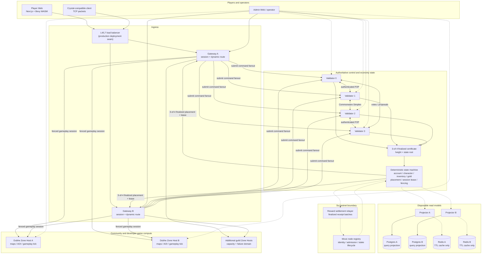

# Gate 14: No-Single-Point Vertical POC

Gate 14 is the first executable vertical slice of the proposed distributed Mir2
architecture. It combines a real four-validator Commonware control network, two
stateless routing Gateways, two Dubhe Zone Hosts, a deterministic authoritative
state machine, and disposable Postgres/Redis read models.

This is a locally reproducible POC, not a production security or capacity
certification. The acceptance suite deliberately stops individual services and
proves that authority, routing, and projections recover without treating a
database or cache as the source of truth.

## Delivered milestones

| Milestone | Delivered behavior | Automated acceptance |
| --- | --- | --- |
| Gate 14.1 | Four authenticated Commonware `v2026.2.0` validators run Simplex consensus with a 3-of-4 quorum, persistent journals, finalization certificates, and event-driven proposals. Idle time produces no empty control blocks. | Stop validator 3, finalize a command with the remaining three, restart validator 3, verify certificate import and identical state root. |
| Gate 14.2 | Gateway A/B resolve Zone placement only from finalized control state. Session leases carry monotonically increasing fencing tokens, so a stale Gateway cannot overwrite a newer owner. | Stop Gateway A and acquire the same session through Gateway B with fencing token 2. |
| Gate 14.3 | Account, character, gold, inventory, verified loot, Zone placement, and session leases are deterministic replayable authority state. Postgres A/B and Redis A/B are replaceable projections and caches. | Stop Redis A and continue; stop Postgres A, continue through projector B, then rebuild projector A to the same height and root. |
| Gate 14.4 | The complete Docker topology, metrics, fault injection, recovery checks, and machine-readable evidence are automated. | Stop Dubhe A, finalize placement generation 2 on Dubhe B, recover every service, and compare four validator roots plus both database projections. |

The accepted run finalized 14 commands at state root
`611790df4dd2cf1ce68a13c6854dd541c17847af73b26aedb1095c58da225b3e`.
Both Postgres projections rebuilt to gold `115`, `red-potion` quantity `5`,
and the same 14-command history. The canonical evidence is
[`docs/generated/gate14/gate14-acceptance.json`](generated/gate14/gate14-acceptance.json).

## Whole-project architecture after Gate 14

Solid arrows are active request or data paths. Dashed arrows are asynchronous
projection, telemetry, or settlement paths. The public load balancer is the
production deployment seam; the local Docker POC exposes both Gateways
directly.



### Authority boundaries

| Data | Authority | Rebuildable consumer |
| --- | --- | --- |
| Node identity, admission, stake lifecycle | Sui Move registry on testnet | Commonware admission view, Admin Web |
| Placement, session ownership, account/character economy commands | Commonware-finalized deterministic state | Gateway memory, Postgres A/B, Redis A/B |
| Live map tick, AOI, movement, combat execution | The fenced Dubhe Zone Host selected by finalized placement | Gateway event stream and checkpoints |
| Operator queries and history | Postgres projection plus live service telemetry | Admin Web |
| Fast TTL lookup | Never authoritative | Redis A/B |

Postgres loss therefore causes a temporary query/read-model outage, not loss of
authority. Redis loss removes a speed optimization, not placement or session
ownership. A Gateway may serve only when at least three validators agree on the
same height and state root.

## Run the automated acceptance

Requirements:

- Docker Desktop with Compose v2;
- enough free space for the Rust build cache and the Postgres images;
- network access on the first build for crates and the Rust 1.95 toolchain;
- local ports listed below must be free.

From `mir2-web3`:

```bash
python3 scripts/gate14_acceptance.py --reset
```

`--reset` removes only the `obelisk-gate14` Compose stack and its named POC
volumes. A passing run leaves the fully recovered stack running for manual
inspection. Re-run without compiling images:

```bash
python3 scripts/gate14_acceptance.py --reset --skip-build
```

Stop and remove the POC after inspection:

```bash
docker compose -f infra/gate14/docker-compose.yml down -v
```

## Manual inspection

| Surface | URL or command |
| --- | --- |
| Validator status | `http://127.0.0.1:19400/v1/status` through port `19403` |
| Validator metrics | `http://127.0.0.1:19400/metrics` through port `19403` |
| Gateway A/B status | `http://127.0.0.1:19500/v1/status`, `http://127.0.0.1:19501/v1/status` |
| Final Zone route | `http://127.0.0.1:19501/v1/routes/mir2-map-0` |
| Session lease | `http://127.0.0.1:19501/v1/sessions/gate14-session` |
| Projector A/B status | `http://127.0.0.1:19600/v1/status`, `http://127.0.0.1:19601/v1/status` |
| Dubhe A/B telemetry | `http://127.0.0.1:19100/healthz`, `http://127.0.0.1:19101/healthz` |
| Running topology | `docker compose -f infra/gate14/docker-compose.yml ps` |
| Acceptance evidence | `docs/generated/gate14/gate14-acceptance.json` |

Expected final facts:

- every validator reports `committeeSize: 4`, `quorum: 3`,
  `finalizedHeight: 14`, and one identical non-empty `stateRoot`;
- Gateway B owns `gate14-session` with fencing token `2`;
- `mir2-map-0` placement generation is `2` and primary endpoint is
  `dubhe-b:7020`;
- both projectors report height `14` and the validator state root;
- both Postgres projections contain gold `115` and five `red-potion` items.

Optional Admin Web:

```bash
docker compose -f infra/gate14/docker-compose.yml --profile ui up -d admin-web
```

Open `http://127.0.0.1:13020`.

## Sui testnet boundary

Gate 14 retains the already executed testnet registry lifecycle:

| Object | Value |
| --- | --- |
| Package | `0x4201a90b22b8a6e000a032fff075be6bc6fdd531c6163465c902107ea285c53e` |
| Registry | `0x7622e3ec2b5664e584a147d530aaab8084d6e793325b8d71f1ae386da9a266a7` |
| Publish transaction | `GxxvU7FpBKH1ud2ukmXAR98BbNsTE7o15GZYn391fhm` |
| Active-node registration | `FuvLLhCaNJswJcZCj2uRYdSC2YbHN79SZ8nEgdaEBVYH` |

The Sui profile is intentionally opt-in:

```bash
docker compose -f infra/gate14/docker-compose.yml \
  --profile sui-testnet up sui-relayer
```

Never place a settlement key in a guild Zone Host. Commonware finalizes game
receipts; the dedicated relayer is the only component allowed to submit a
settlement batch.

## POC limits before production

- Command ingress is HTTP fanout to all four validators. Consensus voting and
  certificates are real Commonware P2P, but production ingress should use an
  authenticated leader-aware/mempool transport with bounded retries.
- The validator committee and deterministic seeds are static POC configuration.
  Production requires asymmetric node keys, rotation, remote attestation or
  capacity admission, and secure secret delivery.
- The POC Gate 14 image starts as root because Docker named volumes are initially
  root-owned. Production packaging must initialize ownership and drop
  privileges before starting the validator.
- The two Postgres databases are independent replay targets, not a synchronous
  database cluster. That is deliberate: correctness comes from finalized log
  replay, while database HA and backup policy remain deployment concerns.
- The Zone Host placement is authoritative and fenced, but full live-player
  checkpoint/handoff continuity under process death still needs production
  soak, latency, and adversarial testing.
- The load balancer, public TLS, DDoS protection, secure operator identity, and
  multi-region networking are deployment work and are not created by this local
  Compose file.
