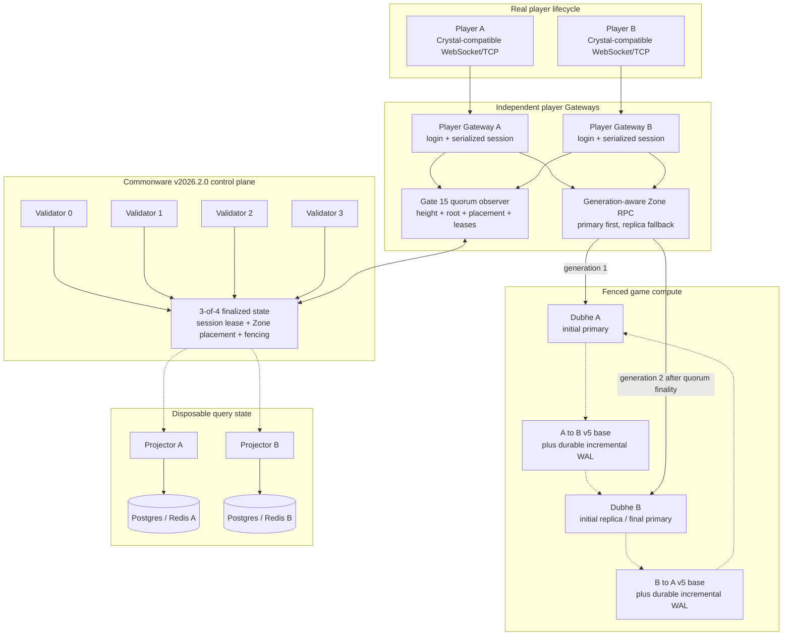

# Gate 15: Real Player Continuity

Gate 15 connects the real Mir2 Gateway player lifecycle to the Gate 14
Commonware control plane. Two independent Crystal-compatible players can log
in through two different Gateways, acquire quorum-finalized session leases,
enter the same remotely hosted Zone, survive loss of the active Dubhe Zone
Host, and continue issuing fenced gameplay commands on the promoted standby
without reconnecting.

This is a reproducible local fault-continuity POC. It proves the integration
boundary and recovery semantics; it is not yet a production latency, capacity,
security, or multi-region certification.

## Delivered milestones

| Milestone | Delivered behavior | Automated acceptance |
| --- | --- | --- |
| Gate 15.1 | WebSocket and Crystal TCP `StartGame` resolve the authenticated account/character against finalized state and acquire a Commonware session lease before entering the world. | Two real accounts and character slots enter through separate player Gateways; two canonical `player:<account>:<characterIndex>` leases finalize. |
| Gate 15.2 | Each Gateway observes a 3-of-4 validator quorum, derives the current Zone placement, refreshes the owner generation at the serialized command boundary, and rebuilds its Zone RPC route when the finalized generation or endpoints change. | Both Gateways observe the same height/root and adopt placement generation 2 without dropping either player socket. |
| Gate 15.3 | Zone Host v5 replication carries a restorable base plus ordered player-command and authoritative cadence-tick mutations. The replica disables its own clock and isolates shadow account writes. | Dubhe B installs the cursor-0 v5 base, incrementally catches up two live sessions, and both sessions continue returning `UserLocation` after A is stopped. |
| Gate 15.4 | Docker fault injection, reverse v5 recovery, final quorum checks, projector recovery, and machine-readable evidence are automated. | Dubhe A is recovered as standby, B-to-A replication installs a cursor-708/two-session v5 base, all validators agree, and both disposable projectors finish healthy. |

The accepted run finalized height `16` at state root
`a8e84b5d80e263685722f52b9e6f7ed9975aa78f5bddd4de99d05544ae275ec9`.
After the failover marker, player A and player B received `68` and `47`
additional `UserLocation` responses respectively, with neither WebSocket
closing unexpectedly. The canonical evidence is
[`docs/generated/gate15/gate15-acceptance.json`](generated/gate15/gate15-acceptance.json).

## Runtime architecture

Commonware is the control and fencing authority, not the high-frequency game
loop. Gameplay packets travel directly from Gateway to the currently finalized
Dubhe Zone Host.



### Failure sequence

1. Both players authenticate and `StartGame` finalizes one session lease per
   account/character through Commonware.
2. Placement generation 1 names Dubhe A as primary and Dubhe B as replica.
   Gateways execute movement on A while the replicator applies v5 mutation
   batches on B.
3. The acceptance runner stops A, finalizes placement generation 2 with B as
   primary, and writes the player-visible failover marker.
4. Each Gateway observer sees height 16, refreshes its owner fencing token, and
   rebuilds the RPC endpoint order to B then A.
5. The same player sockets continue `Turn`/`Walk`/`Run` on B. Short
   `standby`/`stale placement` errors during the finality window are expected
   and do not close the connection.
6. A restarts as standby and the reverse replicator installs B's current v5
   base, then incrementally catches up before the environment is handed to the
   operator.

## Run the automated acceptance

Requirements:

- Docker Desktop with Compose v2;
- Rust toolchains `1.89.0` and `1.95.0` available to the image build;
- Node.js and Python 3 on the host;
- local Gate 15 ports listed below are free.

From `mir2-web3`:

```bash
python3 scripts/gate15_acceptance.py --reset
```

The Gate 15 Compose overlay uses project name `obelisk-gate15`, its own subnet,
ports, containers, and volumes. `--reset` removes only that Gate 15 environment;
it does not remove the separately accepted Gate 14 stack.

Re-run using the already built images:

```bash
python3 scripts/gate15_acceptance.py --reset --skip-build
```

A passing run deliberately leaves the recovered environment running. Pause it
after inspection while retaining containers, images, and named volumes with:

```bash
docker compose \
  -f infra/gate14/docker-compose.yml \
  -f infra/gate15/docker-compose.yml \
  --profile reverse stop
```

Use `down -v --remove-orphans` only when intentionally resetting the Gate 15
environment and deleting its named volumes.

The Gate 15 replicators use a 100 ms cadence while players are active and a
5-second cadence after the active Zone reaches zero sessions.
The Zone simulation continues advancing while idle; only disaster-recovery
sampling slows down.

The earlier Gate 16.3 acceptance used a bridge: each direction owned a
persistent receive-WAL volume, fsynced command-journal batches, and then
installed the existing v4 checkpoint. Gate 16.4a also persisted a
cursor-bound, gzip-compressed base snapshot through an atomic rename. That
historical run wrote A-to-B base cursor `11` and B-to-A base cursor `712`;
their JSON files were `25,827` and `29,700` bytes.

The current Gate 16.5 acceptance uses the WAL-enabled v5 path in both
directions. A-to-B installs an empty, restorable cursor-0 base before players
arrive and then incrementally applies ordered player/tick batches. B-to-A
installs the current cursor-708 two-session base during reverse recovery. No v4
checkpoint is installed in the accepted run; v4 remains only the no-WAL
fallback. Before switching, the script quiesces A, requires an exact B
readiness receipt, proves that promotion is rejected before the owner fence,
finalizes Commonware generation 2, and consumes the receipt once to promote B.
The old active then loses tick authority under the new fence.

The Zone Host keeps its cryptographic telemetry identity as
`ed25519:<public-key>`, while the Commonware control plane may use a stable
operator alias such as `dubhe-a`. Each process must explicitly bind its accepted
control-plane identities through `MIR2_ZONE_HOST_OWNER_ALIASES`. Quiesce,
resume, promotion, and autonomous-tick authorization all use that fail-closed
allowlist; an arbitrary placement owner string is never treated as the local
host.

The final accepted run finalized height `16`, assessed the standby at `4 ms`
lag, rejected promotion before the generation-2 fence, promoted Dubhe B only
after finalization, and kept both player sockets connected. The two players
completed `105` and `48` Zone responses after failover. All 17 machine
assertions are true in
[`docs/generated/gate15/gate15-acceptance.json`](generated/gate15/gate15-acceptance.json).

## Manual inspection

| Surface | URL or command |
| --- | --- |
| Real player Gateway A/B health | `http://127.0.0.1:19710/health`, `http://127.0.0.1:19711/health` |
| Crystal TCP ingress A/B | `127.0.0.1:19700`, `127.0.0.1:19701` |
| Validator status | `http://127.0.0.1:20400/v1/status` through port `20403` |
| Final Zone route | `http://127.0.0.1:20501/v1/routes/mir2-map-0` |
| Projector A/B status | `http://127.0.0.1:20600/v1/status`, `http://127.0.0.1:20601/v1/status` |
| Dubhe A/B Prometheus metrics | `http://127.0.0.1:29100/metrics`, `http://127.0.0.1:29101/metrics` |
| Running recovered topology | `docker compose -f infra/gate14/docker-compose.yml -f infra/gate15/docker-compose.yml --profile reverse ps` |
| Player fault report | `docs/generated/gate15/gate15-players.json` |
| Canonical acceptance evidence | `docs/generated/gate15/gate15-acceptance.json` |
| A-to-B mutation WAL | named volume `obelisk-gate15_gate16-wal-a-to-b` |
| B-to-A mutation WAL | named volume `obelisk-gate15_gate16-wal-b-to-a` |
| Base snapshot in each direction | `base-snapshot-v5.json` in the corresponding WAL volume |

Expected final facts:

- all four validators report height `16` and the same non-empty state root;
- both player Gateway health payloads report `gate15.healthy: true`,
  four agreeing validators, one placement, and two finalized session leases;
- `mir2-map-0` is generation `2`, primary `dubhe-b`, replica `dubhe-a`;
- both player fault assertions report reached game, observed failover, stayed
  connected, and executed Zone commands after failover;
- both projectors report healthy at height `16`;
- both Dubhe hosts are healthy and `zone-replicator-b-to-a` is running.
- both replicator log tails contain `persisted mutation WAL`.
- both replicator log tails contain `persisted base snapshot`.
- both replicator log tails contain `installed v5 base`.

## Correctness decisions

- Gate 15 is opt-in through `MIR2_GATE15_VALIDATOR_URLS`; ordinary local Gateway
  behavior is unchanged when it is absent.
- A player command never invents a route locally. It uses a placement observed
  at quorum-finalized height and carries that generation as the Zone owner
  fencing token.
- The legacy Web movement fast path snapshots a lease. Gate 15 therefore routes
  movement through the serialized Session/RPC boundary until that optimization
  gains a dynamically shared fencing token.
- Base install validates a fully isolated Session/Zone image before publishing
  one Zone. Post-base batches remain fenced by build, cursor, and digest; replica
  account writes do not reach the active file/PostgreSQL repository.
- Postgres and Redis remain projections/caches. Their restart or rebuild cannot
  grant a session, choose a Zone owner, or advance a fencing generation.

## Limits before production

- The accepted failure window is local Docker networking. Multi-host,
  multi-region packet loss, clock skew, bandwidth pressure, and long-running
  soak remain separate gates.
- Session lease acquisition is finalized at `StartGame`; continuous
  Commonware renewal/revocation enforcement for sessions longer than the POC
  lease window is not yet implemented at every player command boundary.
- During the placement finality window, players can receive transient
  `standby` or `stale placement` error messages. The connection survives, but a
  production client should expose a reconnecting/route-switch UI instead of raw
  diagnostics.
- The conservative serialized movement path favors correctness over peak
  throughput. A dynamic-fence low-latency ingress and dedicated performance
  benchmark are required before production sizing.
- Static committee identities, development tokens, local Docker secrets, and
  root-running POC images are not a production trust model.
- This gate does not add a public load balancer, TLS, DDoS protection,
  cross-region checkpoint transport, or automatic capacity admission.
- The existing Sui testnet registry remains the node identity/admission and
  settlement boundary. Gate 15 does not place the live Mir2 game loop on Sui.
