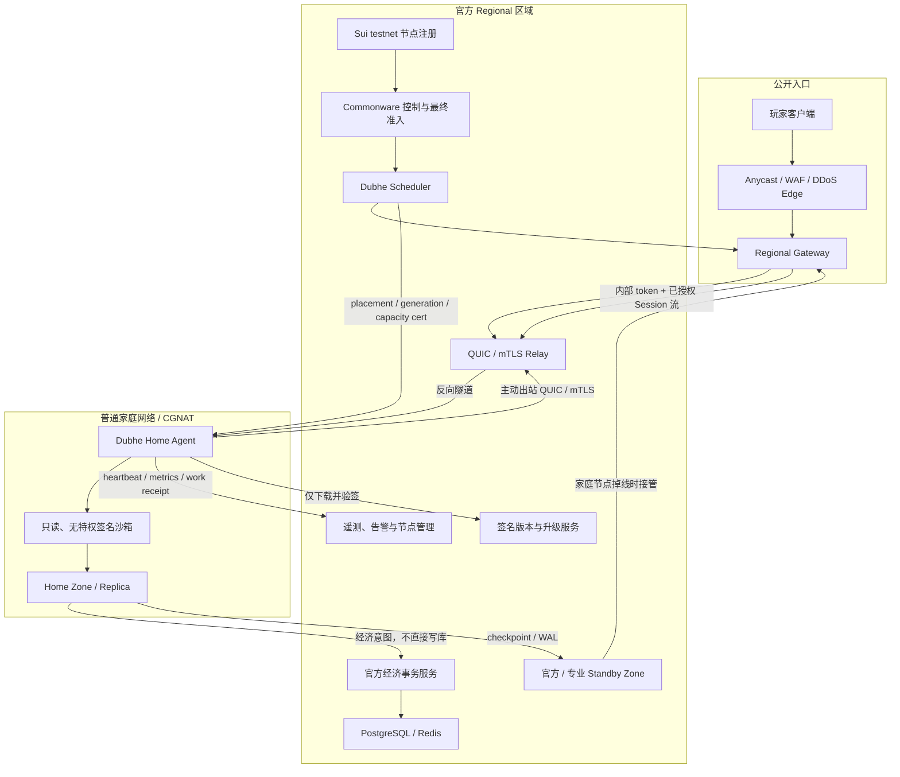

# Dubhe Home Node：家庭节点现状与落地路线

## 结论

当前仓库已经完成社区节点的身份、Sui testnet 生命周期、远程容量挑战、短期容量
证书、Commonware 最终准入、Zone Host、复制/晋升和 verified-work 奖励 POC。
Gate 22–24 已具备可重复的工程验收；Gate 25 已完成遥测、奖励对账和真实网络
证据验证器，但还没有三家真实运营商的签名现场证据。它仍不能被宣传成“普通用户
安装后即可承载商业服玩家”的生产认证产品。

不得把 Gate 13 的远程挑战或 Gate 14 的本地双节点 POC 宣传成家庭网络生产认证。

## 已实现

- Ed25519 非对称节点身份和轮换；
- Sui testnet 注册、撤销、质押与退款生命周期；
- nonce 绑定的远程容量挑战和短期证书；
- 证书到期、撤销和超过声明容量时 fail closed；
- Commonware 3-of-4 最终准入；
- signed work receipt、质量权重、预算上限和 Merkle 奖励批次；
- 独立 Zone Host 承载真实 Mir2 Session；
- PostgreSQL owner fence、checkpoint、durable WAL、主备复制和 promotion；
- Gateway 路由重试、Session 刷新和经济幂等。
- 出站 QUIC/mTLS Relay、签名 challenge/registration/placement/stream；
- Docker public/private 网络隔离下的真实 Mir2 登录、进图、心跳与 Agent 重启恢复；
- QUIC UDP socket rebind、mTLS 非信任 CA 拒绝和协议重放/回滚拒绝。
- macOS/Windows/Linux Home Agent 打包入口、系统密钥库、签名升级/回滚和 drain；
- 只读、非 root、cap-drop、seccomp、资源上限和网络隔离沙箱验收；
- 签名分层遥测、IP rotating pseudonym、retention/delete 和公开聚合视图；
- 真实 Home Agent → Zone `/healthz` → 签名 HTTPS Collector 的端到端遥测；
- 家庭节点 work units 与 quorum `VerifiedWorkReceipt` 的零信任奖励对账；
- 三运营商真实家庭网络双签证据格式和 fail-closed 生产 cohort 验证器。
- Tauri 2 桌面控制层、品牌化 macOS/Windows/Linux 构建入口；
- Supervisor 管理令牌独立进入系统密钥库，桌面 WebView 不接触令牌；
- 签名远程 enrollment、本机容量挑战、CSR/mTLS 签发和生产 Bundle 原子落盘；
- Relay 与 Telemetry 动态加载 Authority 发布的 placement/admission，无需人工改节点；
- 真实玩家 TCP 经官方 Gateway、内部鉴权 Relay、出站 QUIC 到 Home Zone；
- 绑定 Node/build/有效期的签名 Beta 计划和无任意 Shell 的固定动作状态机；
- 节点签名与运营方离线复签分离，避免两把私钥出现在同一执行环境。

## 尚未实现

- 云厂商 WAF/DDoS 的真实压测与账单证据；
- Apple notarization、Windows Authenticode 和 Linux 仓库发布签名；
- 家庭宽带丢包、断网、换 IP、路由器重启的持续故障矩阵；
- 硬件远程证明和独立第三方恶意节点安全审计；
- 在真实不同运营商家庭网络上的容量与奖励 Beta。
- 桌面托管进程到开机自启系统服务的受控迁移。

## 整体架构



玩家不直接连接家庭 IP。家庭节点不持有 PostgreSQL、Sui settlement 或奖励签名
密钥；它只接收已授权的 Zone 命令，并用 node generation/sequence 提交结果。
经济副作用由官方事务服务验证和落账。

这不是“客户端直接连公会电脑”，而是两条明确分开的路径：

1. **数据面**：玩家 → DDoS Edge → Gateway → Relay → Home Agent → Zone；
2. **控制面**：注册/证书 → Commonware 最终准入 → Scheduler placement；
3. **状态面**：Home Zone 持续把 checkpoint/WAL 复制到不同故障域 standby；
4. **经济面**：家庭节点只提交带 generation/sequence 的意图，官方服务验签、
   去重并写 PostgreSQL；
5. **运维面**：Home Agent 把脱敏遥测上报，并只运行验签成功的版本。

因此 Relay 解决“怎么找到 CGNAT 后的节点”和“怎么隐藏家庭 IP”，standby
解决“家里断网后玩家怎么办”，沙箱和经济隔离解决“陌生电脑是否可信”。

## 遥测与隐私

家庭节点通过主动出站 HTTPS 向 Collector 发送遥测，不开放新的入站端口；
Relay 数据隧道与遥测通道相互独立，避免数据面故障掩盖运维告警。遥测数据按
受众分层：

Collector 只接受 Authority 动态发布的签名生产 Bundle。Node ID、public key、
key generation、容量证书 ID、placement generation 和有效期任一不匹配都会
拒绝；未完成容量认证时界面没有远程遥测是预期行为，而不是功能缺失。桌面端
只有在 Collector 已接受报告、且本机运行态回执 Node ID 匹配并小于 90 秒时才
显示遥测在线；这个显示回执不参与奖励结算，但会作为是否允许新玩家进入 Home
Zone 的 fail-closed 条件。

| 受众 | 可见内容 |
| --- | --- |
| 节点主人 | CPU、内存、磁盘、带宽、温度、地图、Session、收益和 drain |
| 游戏/平台运营方 | Node ID、粗粒度地区、ASN、RTT、丢包、证书、Zone、checkpoint lag、故障率 |
| 公会/玩家公开页 | 公会名、节点数、服务地图、在线率、聚合容量和历史质量分 |

公开页不得显示精确 IP、家庭地址、机器用户名、磁盘路径或家庭局域网信息。
Regional Relay 为建立传输会短暂处理来源 IP；观测系统只保存带轮换盐的哈希和
粗粒度地区，原始 Relay 连接日志使用短保留期并限制安全人员访问。

家庭节点卡片至少显示：

```text
Node ID / Home、Replica 或 Professional 等级
Serving、Draining、Replica、Offline 状态
粗粒度地区和到 Relay RTT
容量证书：Sessions / Zones / 到期时间
当前 Sessions / Zones / 带宽 / checkpoint lag
30 天在线率、故障次数、质量分和 reward work units
版本、签名状态和是否需要升级
IP hidden by Regional Relay
```

## 节点等级

| 等级 | 能力 | 是否承载玩家 |
| --- | --- | --- |
| Observer | 验证控制结果与 checkpoint | 否 |
| Replica | 保存冷地图副本并保持 readiness | 默认否 |
| Home Zone | 10–30 人冷地图或私人副本 | 是 |
| Certified Zone | 50–128 Session，短期容量证书 | 是 |
| Professional Zone | 热点线路、长期在线和更高故障预算 | 是 |

家庭节点 Beta 从 Observer/Replica 开始，之后只开放冷地图。热点地图必须等真实
家庭网络故障矩阵、隐私 Relay 和快速接管全部通过后再开放。

## 谁负责什么

| 参与方 | 负责 | 不负责 |
| --- | --- | --- |
| 游戏方 | 客户端、Gateway、玩法版本、数据库、经济规则和官方 standby | 要求家庭用户开放公网端口 |
| Dubhe / Regional | 节点注册、调度、Relay、容量证书、遥测、奖励证明和升级 | 替家庭节点保管玩家资产私钥 |
| 公会/家庭节点 | 提供受限 CPU、内存、带宽，运行指定 Zone/Replica | 自行修改玩法、直接写经济数据库 |
| Commonware | 多方控制决定、placement/fence 最终性、work receipt 聚合 | 承载逐帧游戏流量 |
| Sui testnet | 节点注册、轮换、撤销和质押生命周期证明 | 实时移动、战斗和地图 Tick |

## 家庭节点最低建议

- 4 CPU / 8GiB，可用 SSD 至少 100GiB；
- 稳定上行 20–50Mbps；
- 到 Regional Relay RTT 最好低于 50ms；
- 运行期间禁止休眠，或休眠前完成 drain；
- active 必须有不同故障域的 standby；
- 容量证书短期有效，持续心跳和抽样挑战；
- 用户开始高负载游戏时停止接新 Session，现有 Session 有序迁移。

## 剩余里程碑

### Gate 22：Outbound Tunnel

**工程验收已通过。** 代码、Docker 拓扑、自动验收和生产边界见
[`../infra/gate22/README.zh-CN.md`](../infra/gate22/README.zh-CN.md)。真实三运营商
CGNAT/换 IP/路由器重启证据仍归 Gate 25，不能用本地 Docker 结果代替。

- [x] 家庭节点主动建立 QUIC/mTLS 隧道；
- [x] Gateway 通过 Relay 完成真实 Session 登录、进图、心跳和 Agent 重启恢复；
- [x] 真实玩家 TCP 先进入官方 Gateway，再经 Relay 完成 Login、StartGame、
      KeepAlive；玩家不感知家庭节点；
- [x] Relay 私有 Gateway 监听使用内部 token，非 loopback 未配置时拒绝启动；
- [x] 只接受匹配 Node ID、generation、短期容量证书和 placement 的流；
- [x] 家庭端没有任何必须开放的 TCP/UDP 入站端口；
- [x] UDP rebind 后 Session 继续工作；QUIC 合法乱序可执行，重复
      nonce/sequence 和旧 generation fail closed；
- [ ] 真实三运营商 CGNAT、换 IP 和路由器重启证据（Gate 25）。

### Gate 23：Home Agent

**本地工程验收已通过。** 见
[`../infra/gate23/README.zh-CN.md`](../infra/gate23/README.zh-CN.md)。

- [x] Windows、macOS、Linux 打包与服务安装入口、本地 loopback 管理页；
- [x] Launcher 管理 Supervisor、Zone Host 与 Agent，子进程退出 fail closed；
- [x] 签名版本清单、SHA-256、anti-rollback、失败隔离与回滚；
- [x] 空闲 CPU/内存策略和超限自动 drain；
- [x] 休眠、退出和升级前 drain；
- [x] 私钥进入系统密钥库，不写日志、环境文件或容器镜像；
- [ ] 外部 notarization/AuthentiCode/Linux repository signing 证据。

### Gate 24：Privacy Relay 与沙箱

**本地 Docker 硬化验收已通过。** 见
[`../infra/gate24/README.zh-CN.md`](../infra/gate24/README.zh-CN.md)。

- [x] 玩家和公开遥测结构不包含家庭 IP；
- [x] 家庭 Agent 不暴露端口，Zone 位于 internal-only 网络；
- [x] 只读根文件系统、非 root、无特权、cap-drop、seccomp 和资源限制；
- [x] 无宿主 socket，禁止 PostgreSQL/Sui/reward/admin 等密钥环境变量；
- [x] 修改镜像、超额连接/stream、错误 generation 和 secret 注入 fail closed；
- [ ] 云 WAF/DDoS 与独立第三方渗透测试证据。

### Gate 25：真实家庭网络 Beta

**协议与本地验收器已完成，生产现场证据待执行。** 见
[`../infra/gate25/README.zh-CN.md`](../infra/gate25/README.zh-CN.md)。

- [x] Observer/Replica → Home Zone → Certified Zone 的证据字段和容量边界；
- [x] 三家运营商、CGNAT、换 IP、路由器重启、休眠、丢包、拥塞的强制矩阵；
- [x] standby `<5s`、Session 全恢复和 economy zero-duplicate 强校验；
- [x] 遥测三种受众、IP rotating HMAC、保留期和删除接口；
- [x] Agent 读取真实 Zone 健康状态、签名上报、Collector 验签/重放/鉴权/删除；
- [x] Collector 动态加载签名 enrollment admission，拒绝身份、容量证书或
      placement generation 不匹配的遥测；
- [x] 桌面 Supervisor 校验 Relay 连接和 Collector 接收回执；回执缺失、过期
      或 Node ID 不匹配时保持 drain；
- [x] 容量、Session 分钟和 quorum work receipt 奖励对账；
- [x] 节点 + 运营方双签，拒绝模拟/实验室证据的 production validator；
- [ ] 至少三家真实家庭运营商的双签现场证据。

Gate 25 通过之前只能称为 Home Node POC/Beta，不能宣称家庭节点可以承载生产
商业服。即使 Gate 25 通过，热点攻城、沙巴克和高价值经济地图仍应优先放在
Professional Zone；Home Zone 先承载冷地图、私人副本和 standby replica。

功能 POC 预计约一周 AI 工程时间；达到公开家庭节点 Beta，预计 2–4 周并需要
真实家庭网络参与测试。时间估计不包含外部安全审计和大规模运营观察期。
