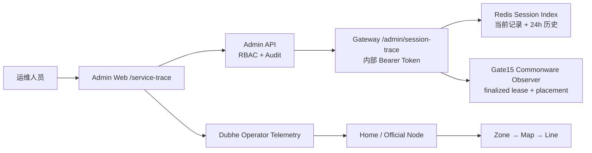

# 玩家 → 服务节点运维查询：部署与人工验收

## 目标

运维人员输入账号、角色名、`account:index` 角色 ID 或在线对象 ID 后，应能回答：

- 玩家是否在线，当前 Gateway Session 是什么；
- Gate15/Commonware 是否存在有效的 finalized session lease；
- 流量经过哪个 Relay；
- 哪个 Home/Official Node 正在承载；
- 当前 Zone、地图和热点分线是什么；
- 最近是否发生重连、换图、节点迁移或故障切换；
- 某个数据源不可用时，具体缺的是哪一段。

页面入口：`/service-trace`。玩家详情页也有“服务节点追踪”快捷入口。

## 数据链路



每次查询都会写入 Admin Audit Store。默认返回脱敏账号和端点；
`sensitive=true` 需要同时具备 `character_read` 与 `server_control`。

## 生产配置

Gateway：

```dotenv
MIR2_GATEWAY_REDIS_CACHE_URL=redis://redis:6379
MIR2_GATEWAY_REQUIRE_REDIS_CACHE=1
MIR2_GATEWAY_SESSION_CACHE_TTL_SECONDS=30
MIR2_GATEWAY_ROUTE_LEASE_TTL_SECONDS=30
MIR2_GATEWAY_TRACE_HISTORY_TTL_SECONDS=86400
MIR2_GATEWAY_ADMIN_OPERATOR_TOKEN=<32-byte-or-longer-random-secret>
MIR2_GATEWAY_ID=hk-gateway-1
MIR2_GATEWAY_PUBLIC_ENDPOINT=https://gateway.example.com
MIR2_GATEWAY_RELAY_ID=relay-hk-1
MIR2_GATEWAY_RELAY_ENDPOINT=relay-hk.example.com:443
MIR2_GATEWAY_NODE_KIND=home
```

Admin API：

```dotenv
ADMIN_GATEWAY_SERVICE_TRACE_URL=http://mir2-gateway:7110/admin/session-trace
MIR2_GATEWAY_ADMIN_OPERATOR_TOKEN=<same-internal-secret>
# 仅作为旧部署回退；真实 Gateway 返回 Gate15 数据时不使用：
ADMIN_COMMONWARE_GATEWAY_URL=http://gate14-gateway:9500
```

Admin Web：

```dotenv
ADMIN_API_BASE_URL=http://mir2-admin-api:7420
DUBHE_HOME_TELEMETRY_URL=https://relay-hk.example.com/home/telemetry
DUBHE_HOME_TELEMETRY_OPERATOR_TOKEN=<collector-read-token>
```

`/admin/session-trace` 只能走服务内网，不应由 Cloudflare、负载均衡器或
公网 Ingress 直接暴露。

## 自动化验证

```bash
cargo +1.89.0 test -p mir2-gateway cache::tests::in_memory_trace_records_assignment_transfer_failover_and_disconnect
cargo +1.89.0 test -p mir2-gateway web::tests::admin_sessions_and_control_endpoints_are_queryable
cargo +1.89.0 test -p mir2-admin-api service_trace_helpers_resolve_identity_line_and_default_redaction

cd apps/admin-web
npx tsc --noEmit --pretty false
npm run build
```

## 人工验收

### 1. 无查询

1. 登录 Admin Web。
2. 打开 `/service-trace`。
3. 页面应显示搜索框，不得在 HTML 或浏览器网络请求中出现 Gateway/Telemetry Token。

### 2. 在线玩家完整链路

1. 用玩家客户端登录并进入地图。
2. 在页面输入角色名。
3. 10 秒内应显示六段链路：
   `Player → Gateway → Commonware → Relay → Service Node → Zone/Map`。
4. Gateway Session ID、Commonware finalized height、generation、fencing token、
   Node ID、Zone 与地图必须有值。
5. “匹配节点遥测”中的 Session、Zone、地图应与 Dubhe Node 页面一致。

### 3. 换图和热点分线

1. 让同一玩家跨地图，或从 `map:<file>:line:1` 进入 line 2。
2. 页面刷新后当前 Zone/Map/Line 应变化。
3. 时间线新增 `map_transfer`，保留旧 Zone/地图信息。

### 4. 节点迁移 / 故障切换

1. 在测试环境触发 placement generation 增长或 primary host 切换。
2. 当前 Service Node、generation、fencing token 应更新。
3. 时间线新增 `placement_changed`，描述节点所有权或 fencing 变化。

### 5. 离线与历史

1. 玩家正常退出，等待当前 Session TTL 到期或主动清理。
2. 页面状态应为“玩家离线”或“Session 已过期”。
3. 当前链路可以为空，但 24 小时内仍应显示保留历史和断开事件。

### 6. 无结果与数据源故障

- 不存在的角色：显示“未找到玩家”，不能伪造节点。
- 同一账号多个角色：显示候选列表，要求选精确角色。
- Gateway 不可用：显示 `gateway_session_cache unavailable`。
- Gate15 不可用：在线状态降级，并明确 Commonware 缺失。
- 遥测不可用：仍保留 placement，但节点卡片说明遥测不可用。

### 7. 权限、脱敏与审计

1. 只有 `character_read` 的操作员可以默认查询。
2. 默认账号应显示为掩码，私网 IP/localhost 应显示 `private-endpoint`。
3. 勾选“显示受保护端点”时，没有 `server_control` 应返回 403。
4. 有权限时可显示完整端点。
5. 在 `/audit` 中应找到对应 `CharacterRead`、目标角色和 `service-trace-*` trace id。

## 验收判定

以下全部满足才算通过：

- 在线完整链路可查；
- Gate15 数据来自真实 Gateway observer，不是前端静态数据；
- 节点遥测、Zone、地图/分线匹配；
- 换图与故障切换留有历史；
- 离线、无结果、数据源故障均有明确原因；
- 默认脱敏、敏感查询权限与读审计有效；
- Rust 测试、TypeScript 类型检查和 Next.js 生产构建通过。
