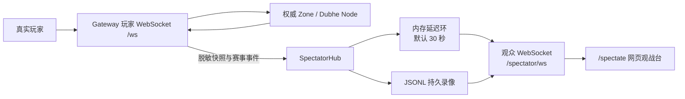

# Mir2 生产观战与录像系统

## 已实现的结果

本仓库现在包含一条与玩家 Session 完全隔离的只读观战链路：



观众连接不会创建 `GatewaySession`，也不会进入玩家命令解析器。因此移动、
战斗、交易、聊天、背包操作等命令不是靠前端按钮隐藏，而是在服务端结构上
无法执行。公开观众默认至少延迟 30 秒；只有持有导播凭据的内部人员可以把
延迟降到 0，并使用自动导播或自由镜头。

当前能力：

- 按赛事/地图查看实时世界，跟随任意可见玩家；
- 导播凭据、自动导播、自由镜头；
- 公开地图白名单以及服务端强制 30–120 秒延迟；
- 背包、仓库、任务、技能等私密状态脱敏；
- 移动、血量、死亡/复活、实体出现/消失、掉落生成/移除事件轴；
- 小时级 JSONL 录像、播放/暂停、0.25–8 倍速和时间轴跳转；
- 内存帧数、单帧大小、实体数、录像条数、保留周期等边界；
- 过期实体清理，避免断线玩家或旧怪物永久留在合并画面；
- WebSocket 总容量限流、恒定时间凭据比较、控制操作审计；
- `/health` 和 `/spectator/metrics` 暴露观众数、地图数、缓冲/持久帧及错误数；
- 断线 1 秒自动重连，网页可通过 `render_game_to_text()` 输出机器可验收状态。

## 启动配置

生产环境至少应显式设置：

```bash
export MIR2_SPECTATOR_ENABLED=1
export MIR2_SPECTATOR_PUBLIC=1
export MIR2_SPECTATOR_PUBLIC_MAPS=0,1,2
export MIR2_SPECTATOR_DIRECTOR_TOKEN='使用密钥管理系统生成的高熵凭据'
export MIR2_SPECTATOR_PUBLIC_DELAY_MS=30000
export MIR2_SPECTATOR_MAX_DELAY_MS=120000
export MIR2_SPECTATOR_DATA_DIR=/var/lib/mir2/spectator
```

| 变量 | 默认值 | 作用 |
| --- | ---: | --- |
| `MIR2_SPECTATOR_ENABLED` | `true` | 总开关 |
| `MIR2_SPECTATOR_PUBLIC` | `true` | 是否允许无凭据公开观战 |
| `MIR2_SPECTATOR_PUBLIC_MAPS` | `0` | 公开地图，逗号分隔；`*` 表示全部 |
| `MIR2_SPECTATOR_DIRECTOR_TOKEN` | 空 | 内部导播凭据 |
| `MIR2_SPECTATOR_CAPTURE_INTERVAL_MS` | `250` | 录像采样间隔 |
| `MIR2_SPECTATOR_PUBLIC_DELAY_MS` | `30000` | 公开观众最小延迟 |
| `MIR2_SPECTATOR_MAX_DELAY_MS` | `120000` | 请求最大延迟 |
| `MIR2_SPECTATOR_RING_FRAMES` | `2400` | 每张地图的内存帧数 |
| `MIR2_SPECTATOR_MAX_ENTITIES` | `2048` | 单次输入实体上限 |
| `MIR2_SPECTATOR_ENTITY_STALE_MS` | `15000` | 过期实体清理时间 |
| `MIR2_SPECTATOR_REPLAY_LIMIT` | `10000` | 单次读取最大帧数 |
| `MIR2_SPECTATOR_RETENTION_HOURS` | `168` | 本地录像保留小时数 |
| `MIR2_SPECTATOR_DATA_DIR` | `.mir2-data/spectator` | JSONL 录像目录 |

容器部署时应把录像目录挂载到持久卷。导播凭据只能通过 Secret 注入，不能
写进镜像、公开 URL、日志或前端构建变量。生产入口应由 TLS 反向代理提供
`wss://`，并在边缘层增加连接速率限制。

## 对外入口

| 入口 | 用途 |
| --- | --- |
| `GET /spectator/matches` | 可观看地图和人数目录 |
| `GET /spectator/recordings` | 录像目录 |
| `GET /spectator/replay?replayId=...` | 读取脱敏录像 |
| `GET /spectator/metrics` | 观战运行指标 |
| `WS /spectator/ws` | 实时/回放传输 |
| `/spectate` | 网页观战入口 |

公开观战：

```text
/spectate?spectateMap=0&spectateTarget=Scout&spectateDelayMs=30000
```

内部导播（不要把真实凭据分享给公开观众）：

```text
/spectate?spectateMap=0&spectateMode=director&spectateDelayMs=0&spectateToken=...
```

回放：

```text
/spectate?replayId=0-495901
```

## 自动验收

先运行 Gateway，再执行：

```bash
cd apps/web
npm run smoke:spectator
```

它真实创建玩家和观众连接，验证同图画面、导播授权、私密字段脱敏、非法
`walk` 拒绝、观众指标、录像持久化和重新读取。

启动网页后执行：

```bash
npm run smoke:spectator-ui
```

浏览器验收检查只读徽标、赛事和目标选择、导播、回放、
`render_game_to_text()` 与浏览器异常，并输出：

- `apps/web/artifacts/spectator/spectator-smoke.json`
- `apps/web/artifacts/spectator/spectator-ui-smoke.json`
- `apps/web/artifacts/spectator/spectator-ui.png`

## 人工验收

1. 用正常网页登录 `demo/demo` 并进入地图 0。
2. 打开 `/spectate?spectateMap=0`，确认约 30 秒后出现同一玩家。
3. 玩家移动、受伤、死亡或丢出物品，确认事件轴出现对应事件。
4. 切换跟随玩家，确认镜头中心改变。
5. 使用内部导播链接，验证自动导播和四向自由镜头。
6. 从 `/spectator/recordings` 复制 `recordingId`，验证暂停、倍速和拖动。
7. 查看 `/health`，确认 `spectator.activeViewers` 和
   `spectator.recordingErrorsTotal` 符合预期。
8. 重启 Gateway 后确认 JSONL 录像仍可读取；断网恢复后确认观众自动重连。

## 安全与容量边界

- 录像只包含脱敏公开世界状态，不可替代权威角色存档。
- 公开延迟由服务器计算，前端请求更低延迟会被提升到最小值。
- 导播凭据拥有实时视角，应放进密钥管理系统并定期轮换。
- 当前录像是单机 JSONL；多 Gateway 生产部署应使用共享对象存储或独立
  录像汇聚服务，不应让多个实例并发追加同一个本地文件。
- `activeViewers` 使用现有 Gateway WebSocket 容量配额；大型活动应增加
  CDN/边缘 WebSocket 扇出，避免大量观众直接占用玩家 Gateway。
- 产品侧仍需确定公开地图、角色匿名化和 GM 隐身规则。
