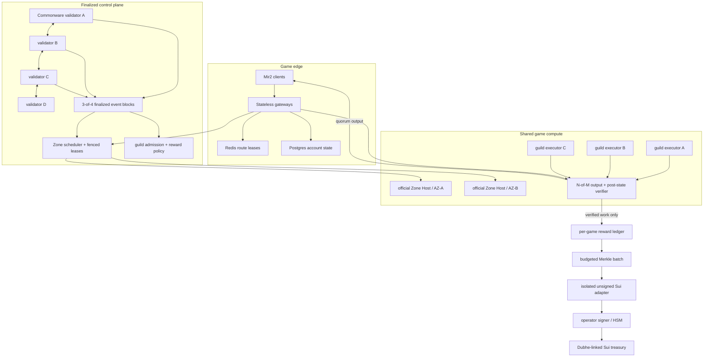

# Gate 10 — Production Beta Acceptance and Operations

Gate 10 closes the POC as an **operator-controlled production beta**. It adds one fail-closed
readiness model, Prometheus evidence, a repeatable end-to-end acceptance binary, a fault matrix,
and an operating/rollback contract for the Gate 5.3–9 stack.

This gate does not claim permissionless mainnet readiness. The Commonware integration is the
application finality adapter pinned to `v2026.2.0`; a public P2P validator deployment and fully
on-chain Merkle proof verification remain post-beta work. The Sui acceptance path compiles/tests
the real Move treasury and unsigned transaction builder without committing a private key or
spending testnet funds.

## Deployed shape



## Readiness contract

`ProductionBetaReadinessProbe` returns ready only when every configured check is true:

1. the projected Commonware height meets the minimum;
2. enough active, heartbeat-healthy Zone Hosts exist;
3. those hosts span enough failure domains;
4. every required Zone has a live placement whose primary and replicas are healthy;
5. enough non-expired, non-quarantined guild executors remain;
6. an optional required reward batch is finalized on Sui.

It emits JSON plus the following gauges:

- `obelisk_beta_ready`
- `obelisk_beta_control_height`
- `obelisk_beta_check{check="..."}`
- `obelisk_beta_acceptance_iterations`

Any missing dependency is a failed check, not an optimistic default. Production traffic should be
enabled only while `obelisk_beta_ready == 1`.

## Automated acceptance

The no-secret acceptance binary exercises one complete transaction path:

1. 3-of-4 finalizes three Zone Host registrations across three failure domains, a Zone placement,
   three guild admissions, and a Mir2 reward policy;
2. three independent game runtimes execute a real protocol command at a 2-of-3 threshold;
3. one deliberately divergent runtime is quarantined and excluded from the receipt;
4. the two agreeing nodes produce one verified work receipt;
5. 3-of-4 finalizes epoch closure, deterministic allocations, and a Merkle batch;
6. the settlement state observes an idempotent finalized Sui checkpoint;
7. all six readiness checks turn green and JSON/Prometheus evidence is printed.

Run once:

```bash
cargo +1.89.0 run -p mir2-gateway --bin gate10_acceptance
```

Run a deterministic soak (every iteration must produce the same batch/root/amount):

```bash
GATE10_ACCEPTANCE_ITERATIONS=100 cargo +1.89.0 run \
  -p mir2-gateway --bin gate10_acceptance
```

The iteration count is bounded to `1..=10000` to prevent accidental unbounded local runs.

## Gate acceptance matrix

| Gate | Automated evidence |
|---|---|
| 5.3 remote reliability | Zone RPC reconnect, checkpoint, restart, replica failover, fencing, and dynamic durability integration tests |
| 5.4 topology | grouped/dedicated map routing and independent cadence tests |
| 5.5 handoff | atomic transfer, destination rollback, owner fencing, and global cross-Zone message tests |
| 6 scheduler | three real TCP hosts, capacity, failure-domain placement, drain, and generation failover |
| 7 untrusted nodes | expiry, 2-of-3 canonical commitment, disagreement strike, quarantine, and verified receipt tests |
| 8 finality | no-empty-block, 3-of-4 quorum, fork/replay/equivocation, projection, and pinned upstream Commonware type tests |
| 9 rewards | game isolation, dedup, budget/cap, proof, Commonware policy/close, unsigned Sui transactions, and 15 Move tests |
| 10 beta | fail-closed readiness, divergent-node end-to-end acceptance, deterministic soak, JSON, and Prometheus output |
| 11 real recovery | Crystal combat/drop/handoff, complete v4 Zone image, four-session/two-map/two-failure fencing, and atomic JSON evidence |
| 12 distribution | non-root Docker images, two-host Compose, signed node heartbeat, Prometheus/Grafana, and live-container primary failure acceptance |

Full local acceptance:

```bash
cargo +1.89.0 test -p mir2-gateway --lib
cargo +1.89.0 test -p mir2-gateway --test zone_rpc -- --test-threads=1
cargo +1.89.0 check -p mir2-gateway --all-targets
cargo +1.95.0 test -p mir2-gateway --features commonware-2026-2 \
  consensus_log --lib

cd onchain
pnpm install --frozen-lockfile
pnpm typecheck
pnpm test:relayer
sui move test --path src/mir2_mine
```

## Production minimums

- Four control validators in at least three failure domains; require 3-of-4 finality.
- Three official Zone Hosts across at least three failure domains before accepting community load.
- Three independently operated guild replicas at 2-of-3 verification for a rewardable Zone.
- Redis for route leases and Postgres for authoritative account state; in-memory backends are
  development-only.
- Unique, high-entropy `MIR2_ZONE_HOST_TOKEN`; a non-loopback Zone bind already fails without it.
- Separate HSM/KMS identities for control validation and Sui `RewardAdminCap`; never place either
  secret on a guild host.
- Persist Zone checkpoints and Commonware finalized blocks before acknowledging a generation
  switch. Back up the Sui package/registry/cap object IDs separately from secrets.
- Run `gate11_full_acceptance -- --output <release-evidence.json>` for the exact candidate binary
  and retain the accepted manifest with the deployment record.

## Startup sequence

1. Start Postgres and Redis; verify migrations, backups, and route-lease TTL policy.
2. Start official Zone Hosts on private addresses with authentication and bounded RPC limits.
3. Restore checkpoints, then register heartbeat/capacity/failure-domain metadata through finalized
   control commands.
4. Start the four validator/reporting processes and replay finalized blocks into the projector.
5. Place required maps; do not expose traffic until the readiness report is green.
6. Admit community nodes with short expiries and narrow capabilities; rotate admissions rather than
   granting permanent access.
7. Fund the Sui reward treasury, publish policy through finality, and keep the admin cap in the
   settlement signer only.

## Fault drills and expected behavior

| Fault | Expected response |
|---|---|
| Primary Zone Host disappears | Heartbeat expiry invalidates placement; checkpointed replica is selected with a higher generation; old owner token is fenced. |
| Host maintenance | Mark data plane draining, finalize `BeginZoneHostDrain`, move checkpoints, observe replacement generation, then finish drain. |
| Guild runtime diverges | Output is not released from that digest group; strike/quarantine increments; no reward allocation. |
| Guild quorum drops below threshold | Gameplay for that community placement fails closed and routes to an official placement; no receipt. |
| One of four validators is lost | 3-of-4 continues. Losing two stops control finality without fabricating empty blocks; existing unexpired placements may continue. |
| Sui RPC/signing outage | Keep the batch pending and retry idempotently. Gameplay continues, but readiness is red when that batch is explicitly required. |
| Bad reward submission | Different transaction digests for the same batch are rejected; Move rejects duplicate epoch and claim keys. |

## Rollback

1. Stop admitting new guild nodes and finalize revocations.
2. Drain community placements onto official hosts; wait for checkpoint installation and a higher
   placement generation before disconnecting the old hosts.
3. Pause new reward epoch closures. Preserve pending batches and retry them after rollback; never
   generate a second root for an already finalized game/epoch.
4. Roll gateway/Zone binaries back together if the Zone RPC protocol changes. Protocol v5 peers
   reject incompatible versions rather than silently decoding them.
5. Keep the finalized Commonware log and Sui registry immutable. Rebuild projectors/ledgers by
   replay; do not edit historical control blocks or payout events.

## Known beta boundaries

- `CommonwareControlLog` consumes Simplex finality/certificate results but this repository does not
  yet ship the public P2P validator networking process.
- The Sui module pays real SUI and enforces capability, epoch, budget, treasury, and duplicate-claim
  fences; the operator verifies the Merkle proof before signing. Fully on-chain proof verification
  is post-beta.
- The checked acceptance marks an observed Sui checkpoint without broadcasting a funded
  transaction. Live testnet publication is an operator ceremony because it requires a private key,
  gas, registry/cap object IDs, and an intentional external write.
- Host checkpoint v4 commits an exact durable active-character record plus the private
  player/session projection and complete shared-Zone state, including equipment durability,
  monster AI/timers, combat vitals, pending effects, public drops/claims, doors, hazards,
  trades/rentals, and NPC state. Gate 11 validates two consecutive fenced takeovers.
- The Gate 11 measurements use localhost TCP hosts. Production RTO/SLO claims still require the
  same manifest to pass under the deployed network, durable checkpoint store, and scheduler.

The real Mir2 workload acceptance continues in
[`GATE11-REAL-MIR2-WORKLOAD.md`](GATE11-REAL-MIR2-WORKLOAD.md).
The operator distribution and telemetry package continues in
[`GATE12-DISTRIBUTION-NODE-TELEMETRY.md`](GATE12-DISTRIBUTION-NODE-TELEMETRY.md).
