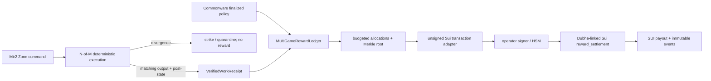

# Gate 9 — Shared Compute Rewards and Sui/Dubhe Settlement

Gate 9 converts work performed by admitted community Zone hosts into deterministic, auditable
rewards. It does **not** reward self-reported CPU time. Only nodes that participate in a successful
N-of-M deterministic execution quorum appear in a `VerifiedWorkReceipt`.

## Acceptance surface

| Requirement | Implementation |
|---|---|
| Multi-game isolation | Every policy, receipt, allocation, Merkle leaf, batch, and dedup key is namespaced by `game_id` and epoch. |
| Verifiable work | `VerifiedGuildZoneTransport` emits receipts only after packets plus post-state reach digest quorum. Divergent, failed, expired, revoked, or quarantined nodes are excluded. |
| Finalized governance | Reward policy registration and epoch closure are `ReplicatedControlCommand`s projected only from a finalized Commonware control block. |
| Bounded economics | Per-game epoch budget, unit price, per-node cap, minimum availability, and minimum quorum are validated; deterministic pro-rata rounding never exceeds the budget. |
| Claim evidence | Allocations are sorted deterministically and committed into a domain-separated SHA-256 Merkle root. Rust generates and verifies each node claim proof. |
| Idempotency | Receipt ingestion, epoch closure, Sui submission, and Sui claim keys are all replay-safe. |
| Real settlement | The Sui Move module stores one root per game/epoch, holds a SUI treasury, prevents duplicate claims, enforces remaining batch budget, pays recipients, and emits audit events. |
| Key isolation | Guild nodes never receive the `RewardAdminCap` or a Sui signing key. The TypeScript adapter only builds unsigned transactions for an operator signer/HSM. |
| Dubhe reuse | `reward_settlement` ships in the existing `mir2_mine` package pinned to Dubhe `v1.2.0-pre.124`; it coexists with Dubhe `DappStorage` game state and the current Sui relayer toolchain. |

## Data flow



The reward epoch can close only at a Commonware-finalized height. A receipt referencing a newer
control height is rejected, which prevents a settlement batch from outrunning placement, admission,
or policy finality.

## Economic calculation

For every successful execution, each agreeing node receives the same work score:

```text
score = work_units * availability_bps / 10_000
desired_reward = min(score * unit_price, per_node_cap)
```

If total desired reward exceeds the game epoch budget, allocations are reduced proportionally.
Integer remainder units go to the greatest fractional remainder, then lexicographically by node id.
This makes independent replay byte-identical and guarantees `sum(allocations) <= reward_budget`.

The initial Move treasury pays SUI (`0x2::sui::SUI`). Supporting arbitrary game coins is an explicit
post-beta extension; Gate 9 rejects other configured coin types instead of silently mis-settling.

## Trust boundary

The Merkle proof is verified in the Rust/operator layer before the payout transaction is signed.
Move independently enforces capability ownership, one batch per `(game_id, epoch)`, one payout per
`(batch_id, node_id)`, remaining batch funds, and treasury solvency. This beta design keeps keys away
from guild machines while preserving an on-chain audit trail. Moving proof verification fully into
Move is a later hardening step, not required for Gate 9 acceptance.

## Acceptance commands

From `mir2-web3/`:

```bash
cargo +1.89.0 test -p mir2-gateway rewards --lib
cargo +1.89.0 test -p mir2-gateway node_security --lib
cargo +1.89.0 test -p mir2-gateway consensus_log --lib
```

From `mir2-web3/onchain/`:

```bash
pnpm install --frozen-lockfile
pnpm typecheck
pnpm test:relayer
sui move test --path src/mir2_mine
```

Expected beta evidence: Rust reward, verifier, and consensus tests pass; TypeScript builds unsigned
publish/claim transactions and rejects malformed input; all Move tests pass including duplicate
game-epoch rejection.
