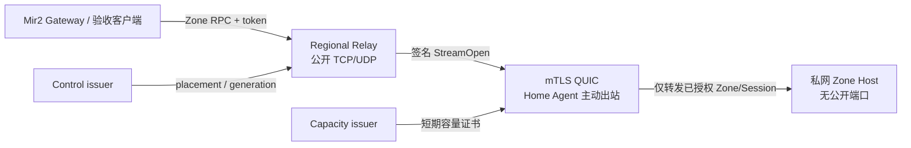

# Gate 22：CGNAT 出站 Home Tunnel

Gate 22 把家庭节点从“必须有公网可达地址的 Zone Host”推进为“只需主动出站即可
承载受授权 Mir2 Session”的可部署数据面。它使用 QUIC、双向 TLS、节点签名、
短期容量证书和签名 placement，所有授权失败都 fail closed。

## 已验证架构



Docker 网络故意把 Relay 和 Zone Host 放在互不连通的网络。只有 Home Agent 同时
加入公开 Relay 网络和家庭私网；Relay 不具备直连 Zone Host 的路由。

## 安全不变量

- Relay 和 Agent 必须同时验证对方的 mTLS 证书链与 ALPN；
- Agent 注册签名绑定 Node ID、公钥、key generation、容量证书、Relay ID、
  TLS 叶证书 SHA-256、实例 ID 和单调 registration sequence；
- placement 绑定 Zone、Node、Relay、generation、控制高度、并发容量和有效期；
- 每条 Session 流都有签名 nonce 与严格递增 sequence；
- challenge、registration、stream nonce 和 stream sequence 均防重放；
- 超期/撤销/issuer 不匹配/Node 不匹配/generation 回滚/超容量均拒绝；
- Zone RPC 在非 loopback 地址强制 token；隧道只搬运密文解封后的既有认证帧；
- 家庭端无需发布 TCP 或 UDP 端口，Agent 支持 QUIC UDP socket rebind。

家庭节点仍会与官方 Relay 建立网络连接，因此 Relay 的受限安全日志能够看到来源
IP。Gate 24 才负责日志脱敏、短保留期、访问控制和公开遥测隐私策略。

## 一键自动验收

前置条件：Docker Desktop、OpenSSL、Rust `1.89.0`。

```bash
./infra/gate22/verify-gate22.sh
```

脚本会：

1. 生成两天有效的临时测试 CA、Relay/Agent mTLS 证书；
2. 生成节点、Relay、Control、Capacity Ed25519 测试身份；
3. 签发短期容量证书和 Zone placement；
4. 构建非 root Zone Host、Relay、Home Agent 和验收镜像；
5. 启动隔离的 public/private Docker 网络；
6. 经由 Relay + 出站 QUIC 隧道执行真实 Mir2 Login、StartGame、KeepAlive；
7. 重启 Home Agent，要求重新注册，再用新 Session 重复真实游戏流；
8. 原子保留两份 JSON 证据并清理容器和网络。

成功标志：

```text
GATE22_DOCKER_ACCEPTED
```

证据：

- `docs/generated/home-node/gate22-docker-initial.json`
- `docs/generated/home-node/gate22-docker-reconnect.json`

## 负向和协议测试

```bash
cargo +1.89.0 test --locked -p mir2-gateway \
  --test home_tunnel -- --test-threads=1

cargo +1.89.0 test --locked -p mir2-gateway \
  home_tunnel --lib -- --test-threads=1
```

测试覆盖真实 Mir2 Session、JSON/MessagePack 路由提示、UDP rebind、非信任客户端
CA 拒绝，以及 challenge/registration/placement/nonce/sequence/capacity 的篡改、
重放和回滚拒绝。

## 生产配置

测试 fixture 仅用于本地验收，不可进入生产。生产部署必须：

- CA、节点身份和 issuer 私钥来自独立 PKI/HSM；Relay 不持有 Control/Capacity
  issuer 私钥；
- mTLS 证书短期轮换并有在线撤销机制；
- placement 来自已最终确认的 Commonware 控制状态，而不是静态 JSON；
- `MIR2_ZONE_HOST_TOKEN` 由密钥管理系统注入并轮换；
- Relay 的 UDP/TCP 入口放在 Regional DDoS Edge 后；
- active Home Zone 必须有不同故障域的增量 standby；
- 容量证书、版本、遥测和奖励必须通过 Gate 23–25 的完整验收。

主要环境变量：

| 组件 | 变量 | 用途 |
| --- | --- | --- |
| Relay | `MIR2_HOME_RELAY_QUIC_BIND` | Agent 出站 QUIC/mTLS 入口 |
| Relay | `MIR2_HOME_RELAY_GATEWAY_BIND` | Gateway Zone RPC 入口 |
| Relay | `MIR2_HOME_PLACEMENTS_FILE` | 已签名 placement 集合 |
| Relay | `MIR2_HOME_RELAY_TLS_*_DER` | CA、证书链、PKCS#8 私钥 |
| Agent | `MIR2_HOME_RELAY_ADDR` | 可使用 DNS 的 Relay 地址 |
| Agent | `MIR2_HOME_LOCAL_ZONE_RPC_ADDR` | 家庭私网 Zone Host 地址 |
| Agent | `MIR2_HOME_CAPACITY_CERTIFICATE_FILE` | 短期容量证书 |
| Agent | `MIR2_HOME_AGENT_SIGNING_KEY_FILE` | 节点签名种子；Gate 23 改由系统密钥库 |

## 当前认证边界

Gate 22 的本地 Docker 与 Rust 集成测试已经证明协议和容器拓扑可重复工作，但它
不能替代真实 CGNAT、跨运营商换 IP、路由器重启、长期丢包/拥塞或云 DDoS
验收。那些证据属于 Gate 25；未取得对应真实网络记录前只能称为 Gate 22
工程验收通过，不能宣称整个 Home Node 已生产认证。
