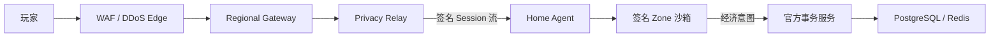

# Gate 24：Privacy Relay 与生产沙箱

Gate 24 的目标是把不可信家庭电脑限制成一个狭窄的 Mir2 Zone 执行单元：玩家只
接触官方入口，家庭 IP 不进入公开遥测，Zone 没有数据库/链/奖励私钥，也无法接触
宿主容器控制面或任意公网出口。

## 信任边界



- 玩家/Gateway 从不获得家庭 IP；
- Relay 只保存活跃 mTLS 连接，不把来源 IP放进 Session、work receipt 或公开遥测；
- Zone 只能位于 internal private network；Relay 不在该网络，必须经过 Home Agent；
- Zone 只收到 Zone RPC token，不持有 PostgreSQL、Redis、Sui、settlement、reward
  issuer、Docker socket 或管理员密钥；
- 经济写入仍由官方事务服务执行 generation/sequence/idempotency 校验。

## 沙箱不变量

每个 Zone workload 都必须有 Ed25519 签名 manifest，绑定 image content digest、
Node ID、placement generation、有效期、非 root UID/GID、seccomp digest、网络、
可写路径、环境变量 allowlist 和资源上限。启动后的 Docker inspect 必须与签名
manifest 再对账。

运行时强制：

- `65534:65534`、`read_only`、`privileged=false`；
- `cap_drop=ALL`、`no-new-privileges`、显式 seccomp profile；
- CPU、内存、PID、nofile 上限；
- 只读 rootfs，临时数据只进入 noexec/nosuid/nodev tmpfs；
- 无 Docker/containerd socket、无 host network、无 host PID/IPC；
- Home Zone 网络 `internal=true`，公网 egress fail closed；
- Relay 的 Agent/Gateway 连接和每 Node 并发 Stream 有硬上限。

## 自动验收

```bash
./infra/gate24/verify-gate24.sh
```

它会构建并运行真实 hardened 容器，穿过 Gate 22 隧道执行 Mir2 Session，然后：

- 对签名 sandbox manifest 与 `docker inspect` 做逐字段验签/对账；
- 尝试写 `/usr/local/bin`，必须失败；
- 验证进程 UID 为 65534；
- 从 Relay 解析/直连 private Zone，必须失败；
- 从 Zone 访问公网，必须失败；
- 验证 Home Agent 没有发布端口；
- 执行 mTLS 非信任 CA、连接预算、重放、篡改和 stale generation 测试。

成功标志为 `GATE24_SANDBOX_ACCEPTED`，证据位于
`docs/generated/home-node/gate24-sandbox-acceptance.json`。

## DDoS 和隐私边界

仓库能证明只有官方 Relay 暴露端口、家庭节点无入站端口、帧/连接/Stream 有界，
但本机 Docker 不能证明云厂商 Anycast 清洗容量、真实攻击下 SLA 或第三方渗透
测试。正式上线还必须取得 DDoS 服务商压测报告、日志保留/访问控制审计和独立安全
评估；证据缺失时相应字段保持 `false`，不得宣称 Gate 24 外部认证完成。
