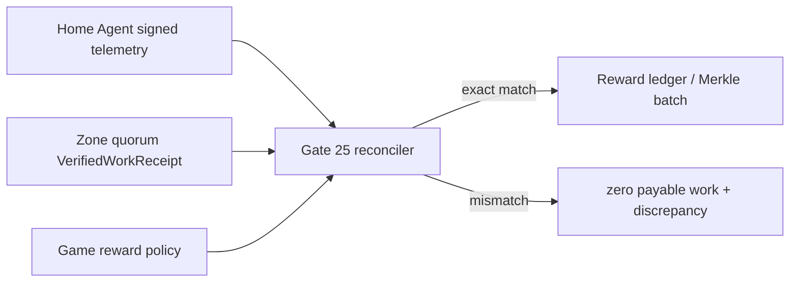

# Gate 25：家庭网络 Beta、遥测隐私与奖励对账

## 当前结论

Gate 25 的协议、签名、重放保护、隐私分层、奖励对账和生产证据验证器已经可以
自动验收。本地验收只证明代码和策略成立，**不会**把 Docker、实验室或模拟网络
标记为生产通过。

生产 Gate 25 只有在提供至少三份真实家庭宽带证据后才会通过。三份证据必须来自
不同 Node ID、运营商、ASN 和故障域，且每份都由家庭节点与受信运营方双签。

## 已实现的生产约束

- 节点遥测使用 Ed25519 签名，绑定 Node ID、key generation、Agent instance 和
  单调 sequence；过期、未来、重放和乱序报告全部拒绝。
- `home_agent` 从本机 Zone Host 的 loopback `/healthz` 读取真实 Session、Zone、
  drain、CPU 和内存状态，通过主动出站 HTTPS 上报；生产 URL 禁止 HTTP、内嵌
  凭据、fragment 和代理重定向。本地验收只能显式允许 loopback HTTP。
- `home_telemetry_collector` 默认只绑定 loopback；非 loopback 必须声明受信
  TLS/privacy proxy。入口限制 1MiB，验签后才写入内存热状态。
- 数据结构不接受原始 IPv4/IPv6 字符串；Relay 只生成按周期换盐的 HMAC
  pseudonym，不把原始 IP 写入遥测对象。
- 遥测有 owner、operator、public 三种视图。公开视图只有区域级聚合值，不包含
  Node ID、运营商、Zone ID、机器数据或 IP。
- 内存热状态有最大 90 天的显式 retention、prune 和按 Node ID 删除接口；长期
  存储应接平台的受控时序数据库并复用相同保留策略。
- 家庭节点声明的 work units 不能直接发奖。对账器只接受同 game/epoch/Zone、
  placement generation、finalized control height、时间窗口、可用率和 quorum
  均匹配的 `VerifiedWorkReceipt`。
- 遥测 work units 与去重后的 quorum receipt 总数不完全一致时，计费工作量归零，
  输出明确 discrepancy；Session 分钟只用于容量审计，默认不直接计价。
- 真实 Beta run 包含完整故障矩阵、机器证据 SHA-256、构建 commit、CGNAT、
  inbound-port 状态、Relay 隐私、Session 连续性、经济重复数和 RTO。
- 生产验证器强制 15 分钟以上、每个故障恢复 `< 5,000ms`、Session 全恢复、
  economy duplicate `= 0`。
- `PhysicalHomeNetwork` 才能进入生产 cohort；`LabNetwork` 和
  `SimulatedNetwork` 即使指标很好也会 fail closed。

核心文件：

- `apps/gateway/src/home_beta.rs`
- `apps/gateway/src/bin/home_beta_policy.rs`
- `apps/gateway/src/bin/home_beta_local_acceptance.rs`
- `apps/gateway/src/bin/home_agent.rs`
- `apps/gateway/src/bin/home_telemetry_collector.rs`
- `infra/gate25/verify-gate25-local.sh`
- `infra/gate25/verify-gate25-production.sh`

## 本地自动验收

依赖：Rust 1.89、`jq`。

```bash
./infra/gate25/verify-gate25-local.sh
```

预期最后两行：

```text
GATE25_LOCAL_POLICY_ACCEPTED ...
GATE25_PRODUCTION_NOT_ACCEPTED reason=three_physical_isp_evidence_required
```

输出位于：

```text
docs/generated/home-node/gate25-local/
├── collector-operator-telemetry.json
├── collector-public-telemetry.json
├── gate25-local-acceptance.json
├── home-agent-operator-telemetry.json
├── home-agent-public-telemetry.json
├── public-telemetry.json
├── reward-reconciliation.json
├── signed-telemetry.json
└── simulated-beta-run.json
```

策略工具也有独立的非 root 容器目标，生产控制器可固定镜像 digest 后运行：

```bash
docker build --target home-beta-policy -t dubhe-home-beta-policy:local .
docker run --rm dubhe-home-beta-policy:local
```

容器默认只显示命令用法；签名私钥只能通过只读 secret mount 提供，不能构建进
镜像或写入普通环境变量。

人工检查：

```bash
jq . docs/generated/home-node/gate25-local/gate25-local-acceptance.json
jq . docs/generated/home-node/gate25-local/reward-reconciliation.json
jq . docs/generated/home-node/gate25-local/public-telemetry.json
```

必须看到：

1. `productionHomeBetaAccepted=false`；
2. `simulatedRunProductionRejected=true`；
3. `rewardReconciliationPayable=true`；
4. `publicViewContainsNodeId=false`；
5. `externalThreeIspEvidenceProvided=false`。
6. `homeAgentTelemetryEmissionVerified=true`；
7. `homeAgentTelemetryUsesRealZoneHealth=true`；
8. `homeAgentSelfReportedBillableWorkUnits=0`。

Collector 可单独构建。生产必须由 TLS/privacy proxy 暴露，并通过 secret mount
注入至少 32 字节的 Operator token：

```bash
docker build --target home-telemetry-collector \
  -t dubhe-home-telemetry-collector:local .
docker run --rm --read-only --cap-drop ALL \
  -e MIR2_HOME_TELEMETRY_OPERATOR_TOKEN_FILE=/run/secrets/operator-token \
  -v /secure/operator-token:/run/secrets/operator-token:ro \
  dubhe-home-telemetry-collector:local
```

生产环境应使用 `MIR2_HOME_TELEMETRY_OPERATOR_TOKEN_FILE`；内联
`MIR2_HOME_TELEMETRY_OPERATOR_TOKEN` 仅用于本地验收。两者同时存在会 fail
closed。token 不得写进镜像或可被同机普通用户读取的环境文件。

## 生成真实家庭网络证据

每个家庭节点先生成自己的 payload。时间戳必须来自测试控制器，所有 fault
observation 都要关联不可变原始报告的 SHA-256。不要手填“通过”；测试控制器应从
Gateway、Relay、Zone standby、经济数据库和 packet capture 的实际结果生成字段。

节点签名文件与运营方签名文件必须是只读 secret mount 或系统密钥库导出的短时
签名句柄，不得写进 payload、Git、环境文件或镜像：

```bash
export MIR2_HOME_NODE_SIGNING_KEY_FILE=/run/secrets/home-node-signing.key
export MIR2_HOME_BETA_OPERATOR_SIGNING_KEY_FILE=/run/secrets/beta-operator-signing.key

cargo +1.89.0 run -p mir2-gateway --bin home_beta_policy -- \
  sign-run run-payload.json signed-run.json
```

运营方在签名前必须人工核对：

- 家庭宽带账单/运营商控制台与 ASN；
- 测试机器和 Node ID；
- Relay 日志只保留 rotating pseudonym；
- Gateway Session 数、standby promotion receipt、checkpoint/WAL 连续性；
- PostgreSQL 经济幂等键和 duplicate counter；
- 故障注入控制器的开始、恢复和单调时钟；
- 构建 commit 与受信发行清单。

单份证据可先验证：

```bash
cargo +1.89.0 run -p mir2-gateway --bin home_beta_policy -- \
  verify-run signed-run.json production '<trusted-operator-public-key>'
```

## 三运营商生产验收

```bash
./infra/gate25/verify-gate25-production.sh \
  '<trusted-operator-public-key>' \
  docs/generated/home-node/gate25-production.json \
  /secure-evidence/isp-a.json \
  /secure-evidence/isp-b.json \
  /secure-evidence/isp-c.json
```

只有全部密码学和 SLO 校验通过才输出：

```text
GATE25_PRODUCTION_ACCEPTED ...
```

生产验收器会拒绝：

- 少于三份证据；
- 模拟、Docker 或实验室环境；
- 重复 Node、provider、ASN、failure domain 或 run ID；
- 节点签名/运营方签名不匹配或被篡改；
- 测试不足 15 分钟；
- 未证明 CGNAT、需要开放入站端口或家庭 IP 未隐藏；
- 缺少换 IP、路由器重启、休眠、丢包、拥塞或 active failover 任一项；
- 任一 Session 未恢复、RTO `>= 5,000ms` 或经济重复不为零。

## 故障矩阵

| 事件 | 实际操作 | 通过条件 |
| --- | --- | --- |
| CGNAT baseline | 从公网探测家庭端口，同时建立出站 QUIC | 无入站端口；Relay Session 正常 |
| Dynamic IP change | WAN 重拨或切换家庭出口 | 新 QUIC path/连接恢复，旧 generation 失效 |
| Router restart | 断电/重启家庭路由器 | standby 接管，Session 全恢复 |
| Host sleep/wake | 系统真实休眠并唤醒 | Agent drain 或 standby 接管 |
| Packet loss | 在真实家庭出口注入受控丢包 | 命令错误率和 Session 连续性达标 |
| Bandwidth congestion | 持续占用上行带宽 | 资源策略停止接新 Session，已有 Session 恢复 |
| Active failure | kill active Zone/Agent | 不同故障域 standby `<5s` 接管 |

每项 observation 的 `evidenceSha256` 必须指向保存在受控 evidence bucket 的原始
机器可读报告。仓库只提交脱敏摘要，不提交家庭 IP、账单、用户名、pcap 或密钥。

## 隐私与保留

Relay 建链时操作系统必然短暂看到来源 IP，因此“完全不处理 IP”是不真实的。
正确边界是：

1. 数据面内存中只用于连接；
2. 遥测写入前用至少 32 字节、按日或更短周期轮换的秘密做 HMAC；
3. 安全原始日志单独存储、最短保留、严格 RBAC，并与产品遥测隔离；
4. public/operator API 永不返回原始 IP；
5. 节点删除请求清除热状态、重放状态和长期存储索引；
6. salt rotation 后不同周期 pseudonym 不可直接关联。

## 奖励对账



节点不能靠虚报 CPU、在线时长或 Session 数增加奖励。可计费基准是服务器权威 Zone
执行形成的 quorum receipt；可用率会折算 work score，reward policy 再应用单价、
单节点上限和总预算。最终结算仍由现有 `MultiGameRewardLedger` 生成 Merkle batch。

## 威胁模型与仍需外部完成的项

| 威胁 | 当前控制 |
| --- | --- |
| 伪造节点遥测 | Node ID 派生 + Ed25519 + key generation |
| 重放/乱序 | Agent instance + 单调 sequence replay guard |
| 虚报工作量 | quorum receipt 精确对账，不一致归零 |
| 把模拟证据冒充生产 | environment 强类型 + production validator |
| 篡改 Beta JSON | 节点签名后再由运营方 countersign |
| 关联家庭 IP | 无 raw-IP 字段 + rotating HMAC + 分层视图 |
| 单运营商伪多样性 | provider、ASN、failure domain、Node ID 四重去重 |

以下项目不能在单台开发机上伪造，当前仓库也不会宣称已完成：

- 三家真实家庭运营商的签名证据；
- 云 WAF/DDoS 压测和账单级证据；
- Apple notarization、Windows Authenticode、Linux 仓库签名；
- 独立第三方渗透测试和安全审计；
- 长期真实流量运营观察。

因此本地脚本通过后的准确说法是“Gate 25 协议与验收器完成，生产现场证据待执行”，
而不是“家庭节点已经生产认证”。
