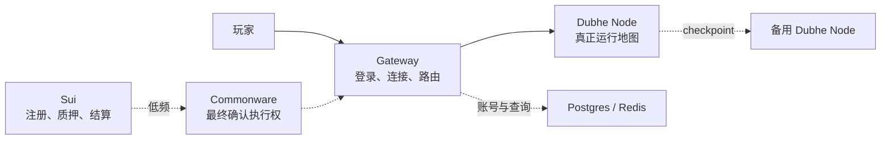
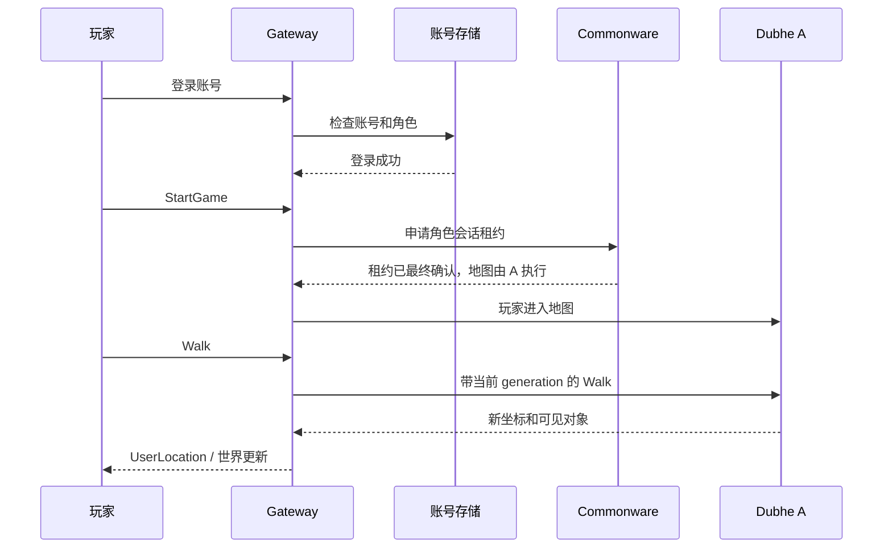
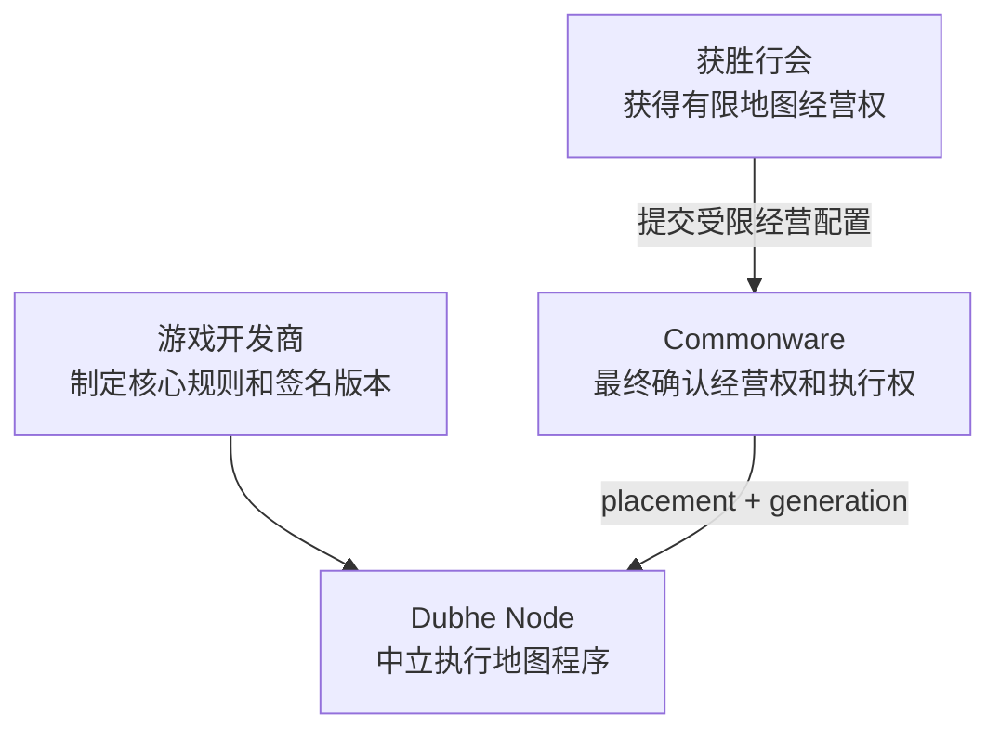
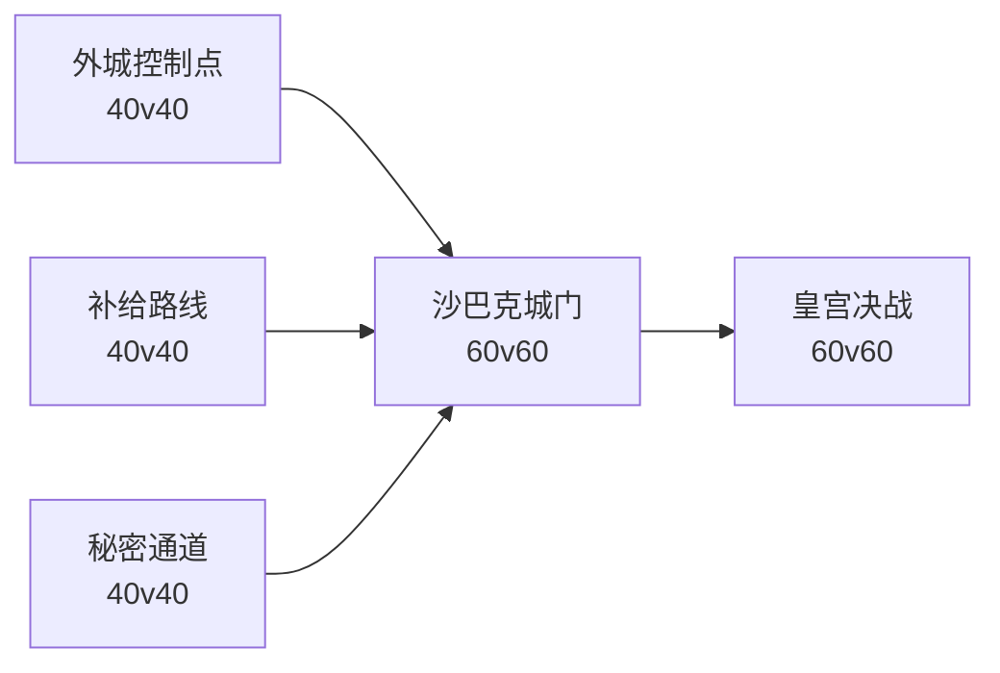

# Mir2 Web3 / Dubhe Node 中文说明

> 本文是本项目的中文总入口。它先解释玩家实际连接了什么，再说明
> Commonware、Dubhe Node、Sui、Postgres 和 Redis 各自负责什么，最后把
> 这套基础设施落到 Mir2 的行会、地图、打宝、攻城和商业模式中。
>
> 文中明确区分“已经实现并验收的能力”和“下一阶段产品设计”。不要把
> 产品构想误读为已经上线的生产功能。

## 一句话理解项目

玩家始终连接 Gateway；Gateway 把实时游戏操作交给当前负责地图的
Dubhe Node；Commonware 只决定“哪个节点有权运行哪张地图”，不处理玩家
每一步移动；Sui 只负责节点注册、质押和低频结算，不进入实时游戏循环。

```text
玩家连接 Gateway
        ↓
Commonware 告诉 Gateway 地图当前归谁执行
        ↓
Gateway 把 Walk / Attack / Skill 发给对应 Dubhe Node
        ↓
Dubhe Node 运行真正的地图、怪物、战斗和掉落
        ↓
节点故障时 Commonware 更换执行者，Gateway 尽量保持玩家连接
```

## 为什么要做这套系统

传统 MMO 通常由游戏公司独自购买和维护全部游戏服务器。本项目尝试把
地图计算拆成可以被社区、行会和游戏公司共同承载的标准化工作单元，同时
保留服务端权威、防作弊、故障切换和统一游戏规则。

目标不是把每个游戏操作写入区块链，而是解决四个问题：

1. 大量地图怎样分散到不同节点运行；
2. 社区节点怎样证明身份、容量和实际工作；
3. 主节点故障时怎样阻止旧节点继续修改世界；
4. 玩家、公会、节点运营者和游戏开发商怎样形成可持续关系。

## 先认识五个角色

| 角色 | 主要职责 | 不应该拥有的权力 |
| --- | --- | --- |
| 玩家客户端 | 显示画面、发送输入、本地预测 | 决定战斗结果和掉落 |
| Gateway | 登录、协议、会话、稳定连接、地图路由 | 自行指定地图所有者 |
| Dubhe Node | 运行地图、AOI、移动、怪物、战斗、掉落 | 修改游戏规则或伪造经营权 |
| Commonware | 最终确认节点准入、会话租约、地图 placement 和 fencing generation | 执行高频游戏 tick |
| Sui | 节点身份、质押生命周期和低频奖励结算 | 转发 Walk、Attack 等实时包 |

Postgres、Redis 和 Projector 是辅助系统：

- Postgres 保存查询投影和运营数据；
- Redis 提供短期缓存和快速路由查询；
- Projector 把 Commonware 最终状态投影进数据库；
- 它们都不能授予地图执行权，也不能推进 fencing generation；
- 投影损坏后应当能够从最终日志重建。

## 最小架构图



最重要的实时路径只有：

```text
玩家 → Gateway → Dubhe Node → Gateway → 玩家
```

不是：

```text
玩家 → Gateway → Sui/Commonware 共识 → Dubhe Node
```

后一种路径延迟过高，不适合实时 MMO。

## 一个玩家从登录到走一步



Commonware 管的是“权力”，Dubhe Node 管的是“游戏”。

## 主节点故障时发生什么

正常状态下，Commonware 最终状态可能是：

```text
地图：mir2-map-0
主节点：Dubhe A
备用节点：Dubhe B
版本：Generation 1
```

Dubhe A 持续把可验证 checkpoint 复制给 Dubhe B。A 故障后，验证器最终
确认新的 placement：

```text
地图：mir2-map-0
主节点：Dubhe B
备用节点：Dubhe A
版本：Generation 2
```

Generation 类似地图管理员的公章：

- `Generation 1` 是 A 的旧公章；
- `Generation 2` 是 B 的新公章；
- A 即使重新上线，也不能拿旧公章继续修改地图；
- Gateway 观察到新 generation 后，把同一玩家连接的后续操作改发给 B。

这就是 fencing。它避免两个节点同时认为自己是同一张地图的主节点。

## 地图怎样扩展到整个 Mir2 世界

当前导入的 Crystal 数据包含：

| 内容 | 当前数据量 |
| --- | ---: |
| 地图 | 463 |
| 怪物刷新记录 | 6,341 |
| 怪物 | 555 |
| 物品 | 1,628 |
| 技能 | 110 |
| 掉落表 | 1,640 |
| 掉落记录 | 70,542 |

地图不是全部永久占用一个节点：

- 比奇、沙巴克、热门 Boss 地图可以使用独立 Zone；
- 沃玛、祖玛等多层区域可以按热点拆分；
- 冷门练级地图可以共享一个 Zone；
- 第一个玩家进入时再按需启动空闲地图；
- 玩家跨地图时，由 Gateway 完成原 Zone 离开和新 Zone 加入；
- 沙巴克等极端热点地图使用独立高规格节点和专门降级策略。

因此系统的基本扩展单位不是“整款游戏”，而是：

```text
一张地图或一组相关地图 = 一个可调度 Zone
```

## Mir2 产品设计：沙城共治

以下是建议的产品方向，尚未全部实现。

产品定位：

> 保留 Mir2 的升级、打宝、PK、行会和攻沙核心，新增“行会经营地图、
> 社区节点承载地图、赛季争夺世界经营权”。

### 世界领地

不应该把 463 张地图分别出售。应当按照完整玩法区域组成领地：

| 领地 | 示例地图 | 玩法定位 | 建议经营模式 |
| --- | --- | --- | --- |
| 比奇王国 | `BichonProvince`、Woomyon Woods、新手洞穴 | 新手、交易、教学 | 官方永久运营，不收领地税 |
| 沃玛领地 | Wooma Temple Entrance、1F、2F、Palace | 中级打宝、沃玛教主 | 行会周期经营 |
| 祖玛领地 | Zuma 1F～7F、Maze、Palace | 高级打宝、祖玛教主 | 行会周期经营 |
| 赤月领地 | 赤月系列地图、`RedMoonRoom` | 高风险打宝、自由 PK | 行会周期经营 |
| 远古祖玛 | Ancient Zuma Lobby、1F～3F | 赛季副本、限时活动 | 按需启动 |
| 沙巴克 | `SabukSecretGate`、城墙、Palace | 全服战争 | 攻城胜者经营 |

比奇等新手区域必须保持官方中立，避免公会通过税收或节点权力伤害新玩家。

### 三权分立



| 权力 | 所有者 |
| --- | --- |
| 核心战斗、掉落和经济规则 | 游戏开发商 |
| 有限地图经营权 | 获胜行会 |
| 当前地图执行权 | Commonware 最终确认的 Dubhe Node |

公会可以申请成为节点运营者，但不能保证自己的地图一定运行在自己的机器
上。技术调度必须依据容量、延迟、故障域和服务质量，不能依据公会关系。

### 公会可以做什么

- 设置行会旗帜、领地名称和无属性外观；
- 在例如 `0%～2%` 的安全范围设置部分 NPC 服务税；
- 从官方审核模板中选择本周活动；
- 使用行会金库修复城门、城墙和守卫；
- 补贴传送费用；
- 发布 Boss、护送、防守和资源任务；
- 获得城主称号、领地 NPC 展示和赛季声望；
- 使用领地金库举办公开活动。

公会不能：

- 修改装备掉率；
- 生成金币或装备；
- 修改角色属性；
- 拒绝敌对玩家的合法请求；
- 查看后台位置或隐私数据；
- 通过自己的节点制造延迟优势；
- 绕过服务端权威决定战斗结果。

### 五职业在领地战争中的价值

| 职业 | 战争职责 |
| --- | --- |
| 战士 | 冲门、卡位、保护旗手和拆除城防 |
| 法师 | 狭窄区域的群体压制 |
| 道士 | 治疗、毒、召唤和持续作战 |
| 刺客 | 侦察、切后排和破坏补给 |
| 弓箭手 | 城墙防守、远程压制和通道控制 |

### 一周玩法循环

1. **周一：宣战。** 行会选择沃玛、祖玛、赤月或沙巴克资格战；
2. **周二至周四：准备。** 玩家采矿、炼制、打 Boss、护送和争夺补给；
3. **周五：资格战。** 多行会使用 Control Points 等模式争夺最终资格；
4. **周六：攻城。** 外城、补给线、秘密通道和皇宫组成多战场战争；
5. **周日：结算。** Commonware 最终确认经营权，节点和行会分别结算。

第一版不应直接追求千人同屏。可以先采用多个 `40v40` 战场，最后进行
`60v60` 皇宫决战：



外围战场运行在不同 Zone，结果转化为最终战的时间、复活次数、城门状态
或秘密入口。这既保留攻沙体验，也让地图级横向扩展真正参与玩法。

## 商业模式

商业模式必须把“玩游戏”和“提供服务器服务”分开。

### 两套账

**游戏经济账：**

- 金币、装备、NPC 税、行会金库和赛季声望；
- 服务于游戏内循环；
- 第一阶段不承诺兑换现金。

**基础设施结算账：**

- 游戏方提供真实算力预算；
- Dubhe Node 根据可验证工作领取服务费；
- 通过独立运营结算，不向普通玩家暴露 Gas 或区块确认。

不要让“多刷金币”直接等于“节点获得更多现金”，否则会快速产生机器人、
RMT、经济通胀和合规问题。

### 玩家付费内容

建议收入来源：

- 角色、武器和技能外观；
- 城主和行会无属性时装；
- 行会旗帜与城堡皮肤；
- 赛季通行证；
- 攻城纪念外观；
- 名称、角色展示和账号服务；
- 跨服赛事、观战和商业赞助。

不建议出售：

- 属性装备；
- 掉率；
- 城池所有权；
- 节点带来的战斗优势；
- 直接获得攻城胜利的资格。

### 一个可讨论的预算起点

每 100 单位净收入可以先按内部预算分配：

| 用途 | 示例预算 |
| --- | ---: |
| 游戏开发和持续运营 | 60 |
| 官方节点和基础设施 | 15 |
| 社区 Dubhe Node 服务池 | 10 |
| 新内容和地图创作者 | 5 |
| 赛事与公会生态 | 5 |
| 容灾、安全和赔付储备 | 5 |

这只是产品建模起点，不是已经承诺的收益率或证券化分配方案。

### 节点奖励

节点不能仅凭自报 CPU、在线时间或会话数量获得报酬。建议：

```text
节点报酬
= 有效玩家会话工作量
+ 实际地图计算工作量
+ checkpoint 正确性
+ 故障恢复表现
+ 延迟与可用性质量
- SLA、分歧和作弊惩罚
```

当前 Gate 9 的基础设计采用 verified work receipt、每游戏/每 epoch 预算、
单节点上限和确定性 Merkle 分配，避免奖励超过游戏方预算。Sui 只处理最终
批次结算；行会节点不持有结算管理密钥。

## 当前已经实现并验收的能力

以下是工程能力，不等于生产上线认证：

| 阶段 | 已验收能力 |
| --- | --- |
| Gate 5 | 确定性 Zone 回放、远程 Zone Host、checkpoint、故障转移、Map-to-Zone 拓扑和原子地图切换 |
| Gate 6 | 节点注册、容量调度、placement、drain 和 rebalance |
| Gate 7 | 不可信行会节点的过期准入、执行一致性、strike 和 quarantine |
| Gate 8 | 固定 Commonware `v2026.2.0` 的最终控制日志 |
| Gate 9 | 多游戏隔离的 verified work、预算奖励和 Sui 结算基础 |
| Gate 10～11 | 生产候选边界和真实 Mir2 工作负载验证 |
| Gate 12 | Docker 节点包、Prometheus、Grafana、Ed25519 心跳和真实客户端故障演练 |
| Gate 13 | Sui testnet 节点注册、轮换、撤销、质押退款、容量证书和奖励资格 |
| Gate 14 | 四验证器、双 Gateway、双 Dubhe、双投影的无单点纵向 POC |
| Gate 15 | 两个真实玩家通过不同 Gateway 进入同一 Zone，并在主 Dubhe 故障后保持连接继续操作 |
| Gate 16.1 | v4 全量 checkpoint 的低基数遥测、历史规模基准和 2C2G 容器证据 |
| Gate 16.2 | 每 Zone v5 Head、连续 cursor、摘要链和显式 readiness 安全闸 |
| Gate 16.3 | 有界可验证 mutation batch、fsync 后 ACK 的持久接收 WAL 和双向故障演练 |

Gate 15 已接受的核心结果：

- 四个验证器以 `3-of-4` 达成最终状态；
- 两个真实玩家分别获得会话租约；
- placement 从 Dubhe A 的 generation 1 切换到 Dubhe B 的 generation 2；
- 两个玩家连接都没有意外关闭；
- 恢复后的 A 从 B 安装反向 checkpoint；
- 两个 Projector 最终健康且状态一致。

完整证据见：

- [`docs/GATE15-REAL-PLAYER-FAILOVER.md`](docs/GATE15-REAL-PLAYER-FAILOVER.md)
- [`docs/generated/gate15/gate15-acceptance.json`](docs/generated/gate15/gate15-acceptance.json)
- [`docs/generated/gate15/gate15-players.json`](docs/generated/gate15/gate15-players.json)

Gate 16.1 已把当前全量复制成本量化：2C2G 容器中，700 条历史生成的
checkpoint 为 215,622 bytes，导出约 18.91 ms，但备用节点从头安装和重放
约 4.16 秒。100 ms 活跃复制的 payload 等效带宽约 17.25 Mbps。这个结果
证明后续优化重点必须是每 Zone 增量 mutation、持久 WAL 和周期 base
snapshot，而不是只压缩 checkpoint 文件。

Gate 16 设计、指标和复测方法见
[`docs/GATE16-INCREMENTAL-REPLICATION.md`](docs/GATE16-INCREMENTAL-REPLICATION.md)。

Gate 16.2 已增加每 Zone 独立的 v5 Head、连续 cursor、摘要链和 build
identity。Gate 16.3 已增加默认最多 512 entries / 1 MiB 的可验证 mutation
batch，以及写入、`flush`、`fsync` 全部成功后才确认的接收 WAL。最新完整故障
演练中，A→B 和 B→A 分别持久化到 cursor `21` 和 `699`，两个真实玩家仍在
主节点故障后继续执行 Zone 命令。

当前 Head 仍明确返回 `mutationCoverage=commandJournal` 和
`promotionReady=false`。replicator 会先持久化 v5 新增命令，再继续安装 v4
checkpoint；自主 tick、怪物 AI、增量 standby 应用、base snapshot 和 WAL
截断将在 Gate 16.4 完成。现在得到的是“重启不丢接收确认位置”的安全桥接，
不是已经可以只靠 v5 晋升的生产复制闭环。

## 本地验收 Gate 15

要求：

- Docker Desktop 和 Compose v2；
- Rust `1.89.0`、`1.95.0`；
- Node.js；
- Python 3。

完整构建并验收：

```bash
python3 scripts/gate15_acceptance.py --reset
```

复用已构建镜像：

```bash
python3 scripts/gate15_acceptance.py --reset --skip-build
```

验收通过后会保留恢复完成的环境，便于人工检查：

| 检查面 | 地址 |
| --- | --- |
| 玩家 Gateway A/B | `http://127.0.0.1:19710/health`、`http://127.0.0.1:19711/health` |
| Crystal TCP A/B | `127.0.0.1:19700`、`127.0.0.1:19701` |
| 四个验证器 | `http://127.0.0.1:20400/v1/status` 至 `20403` |
| 最终地图路由 | `http://127.0.0.1:20501/v1/routes/mir2-map-0` |
| Projector A/B | `http://127.0.0.1:20600/v1/status`、`http://127.0.0.1:20601/v1/status` |
| Dubhe A/B metrics | `http://127.0.0.1:29100/metrics`、`http://127.0.0.1:29101/metrics` |

验收后只暂停容器并保留镜像、容器和数据卷：

```bash
docker compose \
  -f infra/gate14/docker-compose.yml \
  -f infra/gate15/docker-compose.yml \
  --profile reverse stop
```

Gate 15 在有在线会话时每 100ms 复制一次 checkpoint；会话归零后自动降到
每 5 秒一次。地图里的怪物、掉落和计时器仍会继续运行，只降低灾备采样频率，
避免无人在线时反复重放完整历史日志。只有明确要重置环境时，才使用
`down -v --remove-orphans` 删除数据卷。

## 容量应该怎样理解

地图成本不取决于地图像素面积，而取决于：

```text
同时在线人数 × 同屏密度 × 战斗频率 × 网络广播量
```

当前 `2c2g-5mbps-100gb` 容量基线中，125 个玩家在一个密集 Zone 的
移动/AOI 模型通过计算与网络预算；150 个玩家首先触碰网络预算。分布式调度
可以把 300 个玩家拆成 `6 × 50` 个 Zone，但这不等于已经证明 300 人在
同一个沙巴克平面进行完整技能和怪物战斗。

当前容量结论：

- 普通冷门地图可以合并承载；
- 比奇等城市应独立运行；
- Boss 和活动地图需要独立 Zone；
- 沙巴克需要独立高规格节点；
- 真正的大规模同地图攻城仍需统一战斗权威、时间膨胀、可见对象裁剪、
  AoE 批处理和专项压测。

详见 [`docs/SCALABILITY-AND-CAPACITY.md`](docs/SCALABILITY-AND-CAPACITY.md)。

## Sui 当前扮演什么角色

Sui testnet 已执行真实节点生命周期：

| 项目 | 值 |
| --- | --- |
| Package | `0x4201a90b22b8a6e000a032fff075be6bc6fdd531c6163465c902107ea285c53e` |
| Registry | `0x7622e3ec2b5664e584a147d530aaab8084d6e793325b8d71f1ae386da9a266a7` |
| 发布交易 | `GxxvU7FpBKH1ud2ukmXAR98BbNsTE7o15GZYn391fhm` |
| 活跃节点注册 | `FuvLLhCaNJswJcZCj2uRYdSC2YbHN79SZ8nEgdaEBVYH` |

注册、轮换、撤销和质押退款已经在 testnet 真实执行，但这不代表已具备
permissionless mainnet、生产 Token 经济或最终法律合规。

## 当前明确没有完成的事情

- 多地域、跨运营商长期 soak；
- 公网 TLS/mTLS、DDoS 防护和生产负载均衡；
- 生产密钥、HSM、正式验证器委员会和安全升级治理；
- 任意第三方游戏代码的安全沙箱；
- 每个长会话边界上的持续租约续期和撤销执行；
- 沙巴克级完整战斗容量认证；
- 完整 Crystal Conquest 调度、四种胜利模式、城防战斗和税收协议；
- Sui mainnet 节点经济与法律合规；
- 公开资产发行和 Wemade/Crystal 相关权利确认。

短暂的 `standby` 或 `stale placement` 错误在 placement 最终确认窗口内
仍可能出现。Gate 15 证明连接能够存活，不代表玩家完全感知不到切换。

## 建议的下一产品里程碑：沃玛契约

这是建议的 Gate 16 产品方向，尚未实现：

```text
比奇官方地图
→ 沃玛寺庙行会任务
→ 两个行会争夺沃玛经营权
→ Dubhe A/B 承载沃玛地图
→ 沃玛教主活动
→ 主节点故障切换
→ 周期结算节点服务费和行会金库
```

验收目标：

1. 普通玩家不使用钱包也能完整游玩；
2. 两个行会可以报名并完成资格战；
3. 获胜行会可以设置旗帜、活动模板和有限税率；
4. 沃玛原始掉落表不可被节点或行会修改；
5. 地图能在两个社区节点间故障切换；
6. 玩家不因节点故障重新登录；
7. 节点奖励能追溯到真实会话和 checkpoint；
8. 玩家能在管理网页查看领地、节点和结算状态。

这个纵向切片验证成功后，再开放祖玛、赤月、多战场沙巴克和跨游戏节点
网络。

## 法律和资产边界

当前仓库访问权限、公开可读状态或格式转换，不自动产生开源许可、素材
复制权或商业发行权。Wemade / Legend of Mir 2 名称、图像、声音、客户端
数据以及基于它们生成的图集，在公开或商业发布前必须完成权利确认。

在权利未确认前：

- 保持仓库、完整素材包和对象存储为私有；
- 不公开分发原始 `.Lib`、客户端安装包或完整派生图集；
- 不把 GitHub 可访问误解为已获得开源许可；
- 发布前审查第三方依赖许可证和 notices；
- 由目标司法辖区的专业人士审查知识产权、支付、隐私和消费者合规。

详见 [`docs/LEGAL-AND-ASSET-RIGHTS.md`](docs/LEGAL-AND-ASSET-RIGHTS.md)。

## 推荐阅读顺序

1. 本文：理解整个项目和产品方向；
2. [`docs/GATE15-REAL-PLAYER-FAILOVER.md`](docs/GATE15-REAL-PLAYER-FAILOVER.md)：
   查看当前最新真实玩家故障转移；
3. [`docs/GATE14-NO-SINGLE-POINT-POC.md`](docs/GATE14-NO-SINGLE-POINT-POC.md)：
   查看完整无单点架构；
4. [`docs/client/GATE13-PERMISSIONLESS-GUILD-NODE-FOUNDATION.md`](docs/client/GATE13-PERMISSIONLESS-GUILD-NODE-FOUNDATION.md)：
   查看节点身份、Sui 注册和容量认证；
5. [`docs/client/GATE9-SHARED-COMPUTE-REWARDS.md`](docs/client/GATE9-SHARED-COMPUTE-REWARDS.md)：
   查看 verified work 与奖励结算；
6. [`docs/SCALABILITY-AND-CAPACITY.md`](docs/SCALABILITY-AND-CAPACITY.md)：
   查看容量数据和沙巴克技术边界；
7. [`docs/CRYSTAL-EXACT-BLUEPRINTS.md`](docs/CRYSTAL-EXACT-BLUEPRINTS.md)：
   查看炼制、配方、宝石和 Conquest 的真实实现进度；
8. [`docs/LEGAL-AND-ASSET-RIGHTS.md`](docs/LEGAL-AND-ASSET-RIGHTS.md)：
   查看代码和素材权利边界。

## 术语表

| 术语 | 中文理解 |
| --- | --- |
| Zone | 一张地图或一组相关地图的独立游戏运行单元 |
| Dubhe Node / Zone Host | 真正执行 Zone 游戏逻辑的节点 |
| Gateway | 玩家稳定入口、登录会话和动态路由层 |
| Placement | 某个 Zone 当前主节点、备用节点和 endpoint 的最终分配 |
| Generation | 每次地图执行权切换后递增的 fencing 版本 |
| Fencing | 拒绝旧 generation 命令，避免双主 |
| Checkpoint | 可以安装到备用节点的 Zone 状态和命令日志 |
| Commonware | 最终确认控制状态的共识组件 |
| Projector | 把最终日志转换成 Postgres/Redis 查询状态的进程 |
| Verified Work Receipt | 多节点一致执行后产生的可验证工作凭证 |
| Sui Registry | 节点身份、质押、轮换和撤销的链上登记边界 |
