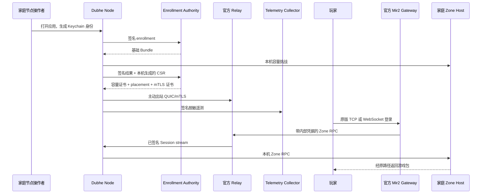

# Dubhe Node Desktop

面向家庭节点运营者的一键式 Dubhe Node 客户端。桌面界面只连接本机
Supervisor，节点身份和管理令牌保存在操作系统密钥库中。

当前功能：

- 首次启动创建或加载 Ed25519 节点身份；
- 通过 challenge/response 完成签名 enrollment；
- 在本机 Zone Host 执行容量挑战，申请短期容量证书和 Relay mTLS 客户端证书；
- 自动托管 Supervisor、Zone Host 和认证后的 Home Agent；
- 查看本机 Supervisor、Zone Host、Relay、Session 和签名遥测状态；
- 安全开启或暂停新 Session；
- 家庭网络只建立出站 QUIC，不要求公网 IP 或路由器端口映射。

## 节点、遥测与玩家如何串起来



玩家不安装 Dubhe Node，也不会连接家庭 IP。玩家继续连接游戏方的 Gateway；
Commonware 最终确认的 Zone Host endpoint 指向官方 Relay 的私有 Gateway
监听地址，Relay 再把该 Zone 的流量转给已认证家庭节点。

界面在 enrollment 或容量认证前显示“无远程遥测”，不是客户端不支持遥测：
未认证节点没有容量证书 ID、placement generation 和 Collector admission，服务端
必须拒绝它的报告，避免任意电脑污染容量、在线率和奖励数据。完成容量认证且
Home Agent 连上 Relay 后，遥测会自动上报。界面中的“已接收”不是根据 URL
或进程是否存在推测出来的：Agent 只有在 Collector 返回成功状态后才原子写入
本机运行态回执，Supervisor 再校验 Node ID 和 90 秒新鲜度。Relay 未连接、
首份报告未接受、回执过期或节点身份不匹配时，Supervisor 都保持 drain，不接收
新玩家。

## 本地开发

```bash
npm install
npm run tauri dev
```

仅构建前端：

```bash
npm run build
```

构建当前平台安装包：

```bash
npm run tauri build
```

Tauri 构建会先编译并打包 `home_agent_supervisor`、`home_agent_launcher`、
`home_agent` 和 `zone_host` sidecar。首次打开会自动创建节点身份并启动
Supervisor。签名 enrollment 后启动 Zone Host；只有容量证书、placement 和
Relay mTLS 凭据三者齐备才启动 Home Agent。桌面前端不会接触 Supervisor
Bearer Token 或 TLS 私钥；所有管理请求都由 Rust/Tauri 后端从系统密钥库加载
令牌后发往 `127.0.0.1`。

开发环境可通过环境变量配置 Authority；非 loopback 地址强制 HTTPS：

```bash
export MIR2_HOME_ENROLLMENT_URL=http://127.0.0.1:18080
export MIR2_HOME_ENROLLMENT_ISSUER_PUBLIC_KEY='<authority-public-key>'
npm run tauri dev
```

macOS 重新构建的 debug `.app` 第一次读取旧身份时会出现 Keychain 授权框。点击
“允许”或“始终允许”后才能继续；这是 macOS 对新签名二进制的密钥库保护，不是
enrollment 或 Relay 故障。

## 自动验收

在桌面应用目录执行一条命令：

```bash
npm run acceptance
```

它会串行执行以下可重复检查：

```bash
cargo +1.89.0 test -p mir2-gateway --bin home_enrollment_service
cargo +1.89.0 test -p mir2-gateway --bin home_telemetry_collector
cargo +1.89.0 test -p mir2-gateway --bin home_agent_supervisor
cargo +1.89.0 test -p mir2-gateway home_tunnel --lib
cargo +1.89.0 test -p mir2-gateway --test home_tunnel
```

最后一项真实经过：

```text
Mir2 玩家 TCP
  -> 官方 Gateway
  -> 带内部 token 的 Relay Gateway listener
  -> 出站 QUIC + mTLS
  -> Home Agent
  -> Zone Host
  -> Login / StartGame / KeepAlive
```

并验证错误 Gateway token、非信任客户端 CA 和重复 stream 被拒绝，动态
placement generation 无需重启 Relay 即可生效，UDP rebind 后玩家 Session
继续工作。
