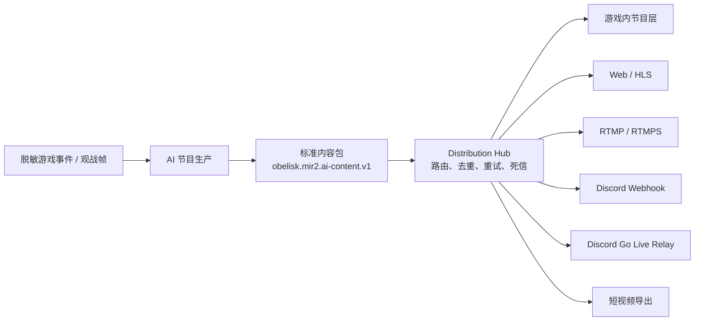

# AI Distribution Fabric v1

## 目标

这层解决的不是“再接一个直播平台”，而是让 AI 世界导演、AI 解说、TTS、日报和
未来的短视频只生产一次内容，再安全地分发到不同渠道。任何渠道故障都不能进入玩家
请求路径，也不能改变 Gateway、Zone 或数据库中的权威游戏状态。



## 当前六个渠道

| 渠道 | 工作方式 | v1 行为 |
| --- | --- | --- |
| `gameOverlay` | `push` | 调用游戏内节目接入端；未配置时不宣称玩家客户端已接入 |
| `webBroadcast` | `pull` | 干净播出页由浏览器、HLS 编码器或官网读取 |
| `rtmpBroadcast` | `relay` | 独立 Chromium + FFmpeg 编码容器推送 RTMP/RTMPS |
| `discordWebhook` | `push` | 高分内容包转换为 Discord 高光卡片 |
| `discordGoLive` | `push` | 调用受信任 Windows 播出 Relay；未配置时明确显示 `unconfigured` |
| `clipExport` | `push` | 调用外部裁片/竖版视频 Worker；未配置时不创建虚假任务 |

Discord Go Live 不是 Discord Webhook。Webhook 只发布卡片；Go Live 需要一个独立的
桌面播出 Relay。v1 已定义并实现 Relay 接口、鉴权、通用任务和失败恢复，但不会伪装
成已经存在的 Discord 官方 RTMP 入口。

## 标准内容包

每个 AI 高光只生成一个 `AiContentPackage`：

- `contentId`：全渠道共享的节目 ID；
- `kind`：当前为 `liveHighlight`；
- `title`、`body`、`subtitle`：标题、正文和播出字幕；
- `score`、`reason`：确定性选题分和原因；
- `narrativeSource`、`model`：模型或规则降级来源；
- `assets`：TTS 音频和安全观战链接；
- `context`：地图、镜头目标、帧摘要、序号和事件类型；
- `expiresAtMs`、`locale`：有效期和语言。

渠道适配器不得重新调用模型，也不得接触原始玩家会话。这样同一条内容在 Discord、
官网和直播平台上具有相同的事实基础，并且能用同一个 `contentId` 审计。

## 路由规则

- 正式直播模式才进入分发层；影子模式只生成和验证内容。
- 游戏内、Web、RTMP 对每个合格节目包生效。
- Discord Webhook 默认要求分数至少 `90`。
- Discord Go Live Relay 默认要求分数至少 `90`。
- 短视频导出默认要求分数至少 `92`。
- 未配置或被运维暂停的渠道不会接收任务。

## 可靠性

推送渠道使用统一的 `DistributionJob`，而不是 Discord 专用队列：

- 标准内容包追加保存到 `content-packages.jsonl`，供审计和离线重放；
- AI 生产任务只入队，不等待 Discord、Game 或外部 Relay；独立投递循环处理网络请求；
- 幂等键：`<contentId>:<channel>`；
- 同一渠道、同一内容不会重复进入等待队列；
- 失败后指数退避，最多 8 次；
- 队列持久化在 `distribution-queue.json`；
- 耗尽重试或容量溢出进入 `distribution-dead-letter.jsonl`；
- 渠道启停状态持久化在 `distribution-channels.json`；
- 老的 `discord-queue.json` 会在首次启动时自动读取并转换。

语义是“至少一次投递”。外部 Relay 必须同时使用 `X-Idempotency-Key` 去重，不能仅依赖
网络请求是否返回成功。

## 配置

原有配置继续兼容：

```bash
export MIR2_AI_LIVE_DISCORD_WEBHOOK='https://discord.com/api/webhooks/...'
export MIR2_AI_LIVE_DISCORD_MIN_SCORE=90
export MIR2_AI_LIVE_PUBLIC_URL='https://mir2.obelisk.build/'
```

多渠道配置：

```bash
# 编码容器确实接入 RTMP/RTMPS 时，在 Gateway 同步声明渠道已配置。
export MIR2_AI_DISTRIBUTION_RTMP_ENABLED=1

# 游戏客户端或活动系统的受信任接入端。
export MIR2_AI_DISTRIBUTION_GAME_ENDPOINT='https://game.example/v1/programs'

# 受信任的 Windows Discord 播出 Relay。
export MIR2_AI_DISTRIBUTION_DISCORD_GO_LIVE_ENDPOINT='https://relay.example/v1/programs'
export MIR2_AI_DISTRIBUTION_DISCORD_GO_LIVE_MIN_SCORE=90

# 受信任的裁片服务。
export MIR2_AI_DISTRIBUTION_CLIP_ENDPOINT='https://clips.example/v1/jobs'
export MIR2_AI_DISTRIBUTION_CLIP_MIN_SCORE=92

# Game、Go Live 和 Clip Relay 共用的服务端鉴权令牌。
export MIR2_AI_DISTRIBUTION_ADAPTER_TOKEN='replace-with-secret-manager-value'
```

生产环境要求所有外部地址使用 HTTPS。配置 Game、Go Live 或 Clip 推送端点时必须提供
`MIR2_AI_DISTRIBUTION_ADAPTER_TOKEN`。

## 运维入口

| 入口 | 用途 |
| --- | --- |
| `GET /ai-live/status` | AI 节目和完整分发状态 |
| `GET /ai-live/distribution` | 六个渠道、队列和最近投递 |
| `POST /ai-live/distribution` | 启用、暂停或立即重试某一渠道 |
| `GET /ai-live/metrics/prometheus` | 节目和通用分发指标 |
| Web `/ai-live` | 非技术运维页面 |

控制请求示例：

```bash
curl -X POST http://127.0.0.1:7110/ai-live/distribution \
  -H 'Content-Type: application/json' \
  -H 'Authorization: Bearer <operator-token>' \
  -d '{"channel":"discordWebhook","action":"disable"}'
```

支持的 `action` 为 `enable`、`disable`、`retry`。未配置渠道不能被误启用。

## 人工验收

1. 以影子模式启动，触发死亡事件；节目生成，但分发成功数不增加。
2. 配置 Game Adapter 后切换正式直播，再触发死亡；`gameOverlay` 投递成功。
3. 未配置 Game Adapter 时必须显示 `unconfigured`，不能把观战页误报为玩家客户端接入。
4. 配置公开观战 URL 后，`webBroadcast` 显示 `ready`，内容包带安全观战链接。
5. 配置测试 Discord Webhook；高分事件投递成功，Discord 指标增加。
6. 把 Webhook 改为不可达地址；任务进入通用等待队列，控制台显示 `degraded`。
7. 重启 Gateway；等待任务仍存在。
8. 修复地址并执行“立即重试”；任务成功后队列清空。
9. 暂停 Discord 渠道；Game 和 Web 渠道继续工作。
10. 查看 `segments.jsonl` 和 `distribution-queue.json`，确认不含 API Key、玩家 IP 或
   原始账号凭据。

自动验证：

```bash
cargo +1.89.0 test --manifest-path apps/gateway/Cargo.toml ai_distribution --lib
cargo +1.89.0 test --manifest-path apps/gateway/Cargo.toml ai_live --lib
cd apps/web && npx tsc --noEmit --pretty false
docker compose -f infra/docker-compose.dev.yml config --quiet
```
