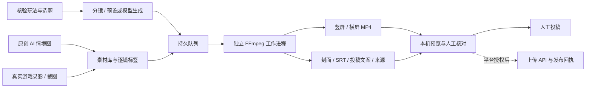

# 游戏宣传 AI 短视频方案与首版交付

2026-10-10。范围为 Numeron - Legend of Rebirth 宣传素材制作，独立于经典玩法 Goal、游戏网关、角色保存和安装器发布。本轮不提升 Crystal 玩法完成度。

## 是否参考《疯狂水世界》

可以参考其“角色故事 + 可记住的游戏主题 + 多渠道内容”的方式。《疯狂水世界》官方在 2026-08-16 宣布 AI 真人短剧上线，并开放短剧二创征集。[官方短剧公告](https://www.taptap.cn/moment/837368329973796000)、[官方二创征集](https://www.taptap.cn/moment/837405605000906469)。这些公告证明它采用了这种内容形式，没有提供留存、投放回报或转换率；本方案不推断其营销效果。

我们的题材是复古在线 RPG。建议先做“下班回比奇、老朋友重逢、三职业选择、矿洞探险”的原创故事，前几秒给一个具体情境，中间展示真实玩法，最后邀请加入测试。剧情和游戏画面明确标注，各自承担吸引注意与证明玩法的作用。首版先用 AI 原创情境图与实录混剪；连续 AI 人物表演需要独立的视频模型、角色一致性与口型验收，尚未接入。

## 内容安排

| 内容 | 时长 | 可用材料 | 首轮状态 |
| --- | --- | --- | --- |
| 今晚，回比奇。 | 30 秒 | 原创 AI 重逢图 + 比奇实录 | 繁中、英文分镜；双画幅成片验收 |
| 这次，带上矿镐。 | 32 秒 | 购买 / 装备 / 进洞 / 挥镐实录 | 模板已录入，需要对应实录后生成 |
| 这次，你选谁？ | 32 秒 | 战士、法师、道士各自实录或截图 | 模板已录入，逐镜绑定职业标签 |
| 真实战斗高光 | 20–45 秒 | 连续录像 + 可信事件时间索引 | 后续，不能从 JSON 快照生成真实战斗 |

先小批量比较开场：A“下班了。回比奇？”、B“老朋友，还在等你”。同一素材可比较两个开场版本；每条视频保存独立 campaign / job / 来源哈希。建议先由运营者每日择优投稿一至两条，不预设无证据的发布量或付费投放预算。三秒留存、完播率、简介链接点击、下载与实际登录转换由平台 / 下载统计填入；当前未连接平台分析，不能据本机渲染推断传播效果。

## 当前架构

入口为 `tools/promo-studio/server.py` 和浏览器界面，监听 `127.0.0.1:3921`。支持上传文件与本机路径导入、三个选题、繁中 / 英文比奇分镜、背景编码、播放和下载。重启恢复排队任务，中断渲染显示错误。工作目录有独占锁；磁盘 / 状态存储失败明确展示，并阻止继续排队。

媒体处理先核验签名，再固定读取格式与协议，不接受播放列表伪装。游戏完整画幅保留；视频镜头连续取段，AI 原创图轻微推近。事实索引绑定固定选题顺序，逐镜标签防止街景误用成挖矿 / 三职业展示；标签仍需素材上传者如实填写并核对实际内容。

文件位置和使用说明见 [工作室 README](../tools/promo-studio/README.zh-CN.md)。代码与原创图在项目内；本轮原始录像、失败记录和完整成片保存在开发机 `C:/mir2-promo-studio-20261010`，不向 Git 推送录像或角色资料。

## 真实素材与来源

原创情境图由 Codex 内置 imagegen 在本轮生成，已保存在 `tools/promo-studio/assets/bichon-reunion-ai.png`；实际提示词随 [素材说明](../tools/promo-studio/assets/creative-prompts.md) 保存。没有借用竞品片段、演员或角色。

比奇素材来自真实 Windows 测试服的公共只读 Web 观战页，普通自有 QA 账号在线提供共享区域画面。录制序号 213→227，实际约 21.965 秒；217 张截图按实际间隔保持，再编码为约 21.967 秒、30fps。最大校准帧龄上界 5.169 秒，含服务器 3 秒观战延迟。它是网页观战录像，**不是原生 Windows 客户端原始 30fps 录影**，也不是 Boss / PK 高光。本轮素材没有展示战斗或矿区，不拿它替代未录制玩法。

原 1440×900 录像保留；剪辑输入仅去除浏览器空白边缘，保留经测量的 1024×768 完整游戏区域和 HUD。原始过期录制和有意触发编码器缺失的失败记录也保留，不算实时录制通过。普通 QA 已正常 LogOut；本轮读取到游戏网关 revision `c70436f34eabb432d769e0082c0afa23303294b0`，没有替换、配置或重启该网关。

## AI、旁白与投稿的边界

预设脚本由 Codex 编写，原图由内置 imagegen 生成。当前没有配置工作室的付费文本模型接口，即时分镜按钮明确使用预设。可配置自有 OpenAI compatible 服务；供应商响应只能重新组合已核验文案和创意词组，失败时报错。实际付费服务尚未验收。

首轮配音用本机 Windows Huihui / Zira 系统语音，免费且无需上传游戏数据，**不冒充神经网络 AI 配音**。后续可接自有神经网络语音服务，需验收发音、时长、重试、费用上限与授权声音；不能仅凭配置字段宣称已可用。

B站 ARC_BASE 权限由用户确认仍待审核；当前没有上传或投稿。YouTube 上传 OAuth 也未接。平台授权之后再加可撤回的上传、明确发布设置与投稿回执；“已生成、已上传、已投稿”分别保存。

现有网关 `clipExport` 仅将内容 JSON 投到外部适配器，2xx代表接收成功。后续接切片需先存录像、建立时间索引，再以内容 ID 幂等入队，本工具目前没有启用网关该通道。录制、模型、编码与平台失败均不进入玩家战斗 / 保存链路。

## 验收

本轮运行结果和保留的失败见 [验收记录](generated/player-qa/promo-studio-20261010/README.md)。完成标准是实际 MP4 能播放、字幕和素材对应、投稿素材完整、来源能核对；不会以“HTTP 200”或“脚本创建成功”代替成片验收。

独立引擎测试 42/42 通过，真实浏览器完成上传、英文异步制作、播放、206 下载及手机宽度验收。繁中和英文各导出直式 / 横式一条，共四条约 30 秒 H.264 / AAC 视频，配套 SRT、封面与投稿来源 JSON；中文版用 Huihui，英文用 Zira。开场、游戏中段、结尾截图已检查；原始游戏录影三个镜头连续取段 0、6、12 秒。末次复核固定每个可信镜头的事实索引，避免元数据错绑。

首轮投稿素材包位于 `C:/mir2-promo-studio-20261010/deliverables/Numeron-Promo-Starter-20261010.zip`。打开工作室可继续导入自己的 Windows 原生录影、编辑分镜与生成。发布前核对内容和填入实际下载链接；当前尚未上传平台。
