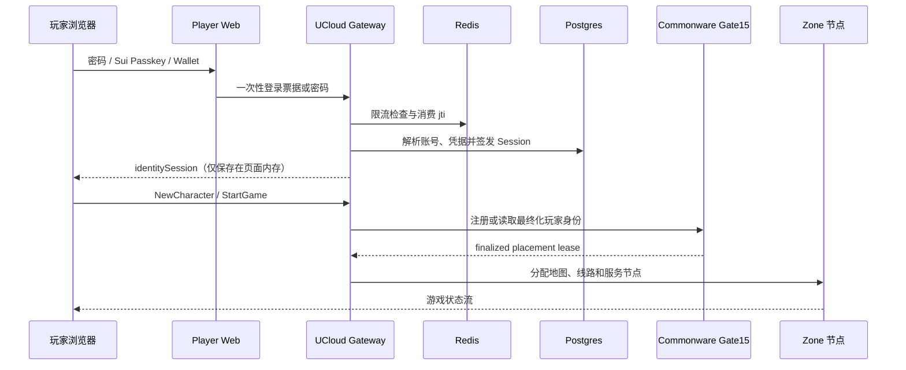

# 商业版账号、登录与恢复系统

本文定义玩家从首次登录到角色进入游戏、账号恢复和运营封禁的完整身份边界。
它不是“钱包登录按钮”，而是一条可审计、可撤销、可限流并能安全上线的身份链路。

## 1. 已实现能力

- 密码账号使用 Argon2id 和随机盐保存；旧明文或 `sha256$` 密码只在成功登录后透明迁移。
- Sui Passkey 与 Sui Wallet 使用 60 秒一次性 challenge，绑定来源、地址、登录方法和随机 `jti`。
- Gateway HMAC 验证登录票据，并在 Redis 通过 `SET NX` 一次性消费，阻止重放。
- 钱包可绑定已有 Obelisk 游戏账号，玩家无需为每个发行渠道创建不同角色档案。
- 登录成功签发短期身份 Session；Session 可单独撤销、全部登出，并跨 Gateway 传播撤销状态。
- 玩家可生成十枚一次性恢复码；恢复密码后撤销账号全部 Session。
- 登录失败按匿名网络指纹、账号、账号网络组合和设备指纹限流，不保存家庭原始 IP。
- WebSocket 生产环境只接受精确允许的浏览器 Origin；身份写接口拒绝跨站请求。
- 玩家端“账号安全”面板可查看会话、绑定或撤销凭据、轮换恢复码、登出其他设备。
- 运营后台 `/identity-security` 可查询账号会话、脱敏凭据和安全审计，并强制下线。

## 2. 登录到进入地图



密码、钱包和 Passkey 最终都解析成同一个内部 `account_id`。链上地址是凭据，
不是角色数据主键；撤销一个钱包不会删除角色，也不会影响仍有效的其他凭据。

## 3. 数据与隐私

Postgres migration `0008_commercial_identity.sql` 建立四类记录：凭据、Session、
恢复码和审计。数据库只保存 Argon2 密码摘要、恢复码的带 pepper HMAC、脱敏凭据
主体，以及经 HMAC 处理的网络指纹；不会保存恢复码明文、身份 Session 明文或家庭 IP。

浏览器只拿到当前身份 Session。管理 Token 和 Gateway 管理地址只存在 Admin Web
服务端环境，不进入前端 JavaScript。

## 4. 生产配置

Gateway 必需配置：

```dotenv
MIR2_ENV=production
MIR2_ACCOUNT_STORE_BACKEND=postgres
MIR2_ACCOUNT_STORE_REQUIRE_POSTGRES=1
MIR2_ACCOUNT_STORE_DATABASE_URL=postgres://...
MIR2_GATEWAY_REDIS_CACHE_URL=redis://...
MIR2_GATEWAY_REQUIRE_REDIS_CACHE=1
MIR2_IDENTITY_POLICY=commercial
MIR2_PASSKEY_AUTH_SECRET=<独立随机值，至少 32 字符>
MIR2_IDENTITY_SESSION_SECRET=<独立随机值，至少 32 字符>
MIR2_IDENTITY_RECOVERY_PEPPER=<独立随机值，至少 32 字符>
MIR2_GATEWAY_ADMIN_OPERATOR_TOKEN=<独立随机值，至少 32 字符>
MIR2_ALLOWED_WEB_ORIGINS=https://mir2.obelisk.build
```

Player Web：

```dotenv
MIR2_GATEWAY_HTTP_URL=https://<gateway-host>
MIR2_PASSKEY_AUTH_SECRET=<与 Gateway 相同>
MIR2_PASSKEY_ALLOWED_ORIGINS=https://mir2.obelisk.build
NEXT_PUBLIC_MIR2_GATEWAY_WS_URL=wss://<gateway-host>/ws
```

Admin Web：

```dotenv
MIR2_GATEWAY_ADMIN_URL=https://<gateway-host>
MIR2_GATEWAY_ADMIN_OPERATOR_TOKEN=<与 Gateway 相同>
```

生产环境不允许使用开发默认 Secret。轮换 Session Secret 会立即使所有现存身份
Session 失效；轮换恢复 pepper 会使旧恢复码失效，二者都应先公告并留审计记录。

## 5. 上线顺序与回滚

1. 备份 Postgres，执行 migration `0008`；迁移是新增表，不修改角色数据。
2. 写入四个独立 Secret、Origin、Postgres、Redis 和并发上限。
3. 在与线上功能同源的 commit 构建 Gateway，记录 commit、Cargo.lock 与二进制 SHA-256。
4. 先启动单个候选实例，验证健康检查、密码登录、Passkey、建角和 StartGame。
5. 验证新角色已通过 Gate15 最终化并进入 Zone，再切换其余流量。
6. 发布 Player Web 与 Admin Web，验证账号安全页面和强制下线。

回滚时恢复上一版本 Gateway 二进制和环境文件即可；`0008` 新表可保留，旧版本不会读取。
不要自动删除身份表或恢复旧密码摘要。若出现安全事件，应先撤销账号全部 Session、轮换
相关 Secret，再恢复服务。

## 6. UCloud 当前发布边界

2026-08-02 已在生产源码基线 `b6e0b21e` 上移植 Gate15 新角色最终化修复，并发布
`20260802-gate15-new-player`（git revision `8681d9451`）。发布包与包内二进制均通过
SHA-256 校验；上一版本和环境文件已保留，可立即回滚。线上新建 QA 账号、角色与
`StartGame` 分别在 Commonware 高度 5452、5453、5454 最终化，客户端验收结果为
`ready=1`、`startedGames=1`、`errors=0`。

这次热修复只解决“新角色被 Gate15 拒绝”，没有把本章商业身份系统发布到 UCloud。
生产仍包含 `main` 尚未具备的观战、AI Live 和渠道身份能力，不能直接用 `main` 覆盖。
商业身份正式发布前，必须把本分支移植或合并到可复现的生产源码线，执行 migration
`0008`，配置独立 Secret，并按第 5 节进行候选实例和回滚验收。

## 7. 人工验收清单

- 新账号弱密码被拒绝，合规密码落库为 `$argon2id$`。
- 旧账号第一次成功登录后自动迁移，错误密码不能触发迁移。
- 同一个 Passkey challenge 第二次使用失败，错误 Origin 和错误地址失败。
- 钱包绑定后进入原账号角色列表；同一钱包不能绑定两个账号。
- 新角色创建后首次 StartGame 通过 Gate15，页面实际进入地图。
- 玩家撤销当前 Session 后下一次请求失败；“登出其他设备”只保留当前 Session。
- 恢复码只能使用一次；恢复后旧密码和全部旧 Session 均失效。
- 连续错误登录触发限流；Redis 不可用时生产登录关闭，而不是绕过保护。
- 后台能看到安全审计，能单独踢下线，也能账号全部下线；浏览器网络面板无管理 Token。
- 日志、接口和遥测均不出现密码、恢复码、完整 Session Token或家庭原始 IP。
