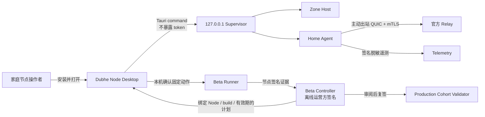

# Dubhe Node 桌面客户端与生产 Beta

## 当前结论

仓库已经有可构建的 Tauri 2 桌面控制层，以及 Windows、macOS、Linux 的平台
图标和构建入口。桌面客户端可以创建节点身份、读取本机 Supervisor 状态并安全
开启或暂停新 Session。生产 Beta 的测试计划、节点证据和运营方复签已经拆成
三个不同权限边界。

当前仍是 **Home Node Beta**，不是可公开承诺 SLA 的正式发行版：

- 桌面安装包尚未捆绑 Gate 23 后台服务，测试前仍需安装 Home Agent；
- Apple notarization、Windows Authenticode 和 Linux 仓库签名尚未接入；
- 尚无三家真实家庭运营商的完整现场证据；
- 桌面客户端的远程 enrollment API 尚未接入，签名测试计划暂由 CLI 导入。

## 操作者看到的产品



WebView 不能读取节点私钥或 Supervisor Bearer Token。桌面 Rust 后端只接受
`127.0.0.1`、`localhost` 或 `::1` 的无凭据 HTTP URL，并且禁用代理和重定向。
节点身份和管理令牌分别存放在操作系统密钥库。

## 本地构建桌面客户端

```bash
cd apps/dubhe-node-desktop
npm ci
npm run build
npm run tauri build -- --debug --bundles app
```

macOS 产物：

```text
target/debug/bundle/macos/Dubhe Node.app
```

同一工程可在 Windows x64 和 Linux x64 原生 Runner 上执行上述命令，分别生成
MSI/NSIS 与 deb/AppImage/RPM。当前仓库凭据没有 GitHub `workflow` scope，
自动构建矩阵尚未提交；生成的未签名验收包不能直接作为正式下载页发行包。

## 启动后台节点

桌面控制层依赖 Gate 23 的 `home_agent_supervisor`。开发验收先按
`infra/gate23/README.zh-CN.md` 安装后台服务；Supervisor 默认只监听
`127.0.0.1:17990`。如果没有显式提供管理令牌，Supervisor 和桌面端会使用相同
keyring account 创建或读取独立的 32 字节管理令牌。

打开客户端后应看到：

1. Node ID 和系统密钥库状态；
2. Supervisor、Zone Host 和托管进程状态；
3. CPU、可用内存、Session 数和最近观测时间；
4. “开始贡献 / 暂停贡献”控制；
5. 家庭网络只出站、IP 由 Relay 隐藏的边界说明。

## 生产 Beta：运营方签发计划

先由节点提供 public key 和当前 build commit。Controller 生成固定动作模板：

```bash
cargo run -p mir2-gateway --bin home_beta_controller -- \
  template <node-public-key> <build-commit> <plan-id> plan-payload.json
```

运营方在隔离环境设置签名密钥并签发：

```bash
export MIR2_HOME_BETA_OPERATOR_SIGNING_KEY_FILE=/secure/operator.seed
cargo run -p mir2-gateway --bin home_beta_controller -- \
  issue-plan plan-payload.json signed-plan.json
```

计划只能包含以下白名单动作：

- CGNAT 基线被动观测；
- 本机用户确认换 IP、路由器重启、休眠/唤醒；
- 有时限的丢包和带宽拥塞探针；
- standby 接管验证。

协议中没有 Shell、脚本路径、URL 下载执行或任意命令字段。计划绑定 Node ID、
节点 public key、key generation、build commit、动作顺序、SLO 和最多 24 小时
有效期。

## 家庭节点执行计划

Runner 从系统密钥库加载节点身份，不接收私钥参数：

```bash
cargo run -p mir2-gateway --bin home_beta_runner -- \
  begin signed-plan.json <trusted-operator-public-key> <build-commit> journal.json

cargo run -p mir2-gateway --bin home_beta_runner -- \
  start-action journal.json <build-commit>
```

操作者按输出提示在本机完成对应动作，然后记录恢复 Session 数、经济重复数和
原始证据文件：

```bash
cargo run -p mir2-gateway --bin home_beta_runner -- \
  complete-action journal.json <build-commit> \
  <sessions-before> <sessions-recovered> <duplicate-count> evidence.json
```

七个动作完成且运行不少于 15 分钟后生成节点签名结果：

```bash
cargo run -p mir2-gateway --bin home_beta_runner -- \
  finish journal.json <build-commit> <provider-code> <provider-asn> \
  <failure-domain> <coarse-region> <active-session-minutes> \
  machine-attestation.json node-signed-run.json
```

证据文件只进入 SHA-256 承诺，不把家庭 IP、用户名或磁盘路径写入公开结果。

## 运营方复签与 cohort 验收

运营方先审阅原始证据，再在隔离环境复签：

```bash
export MIR2_HOME_BETA_OPERATOR_SIGNING_KEY_FILE=/secure/operator.seed
cargo run -p mir2-gateway --bin home_beta_policy -- \
  operator-countersign-run node-signed-run.json signed-run.json
```

三家不同运营商、ASN、Node 和故障域的物理家庭网络结果才能组成生产 cohort：

```bash
cargo run -p mir2-gateway --bin home_beta_policy -- \
  verify-cohort <trusted-operator-public-key> cohort.json \
  signed-run-a.json signed-run-b.json signed-run-c.json
```

模拟网络、缺失动作、Session 未完整恢复、RTO 超过 4,999ms、任何经济重复、
节点/构建不匹配、过期计划或错误签名都会 fail closed。

## 威胁边界

| 威胁 | 当前控制 |
| --- | --- |
| 恶意网页读取节点密钥 | WebView 无密钥 API；密钥只在 Rust/keyring |
| 本机其他用户调用管理口 | 独立随机 Bearer Token；loopback bind |
| 代理劫持本机管理请求 | 桌面客户端禁用代理与重定向 |
| 官方远程执行任意代码 | 签名计划只有固定 enum，无 Shell/脚本字段 |
| 旧计划换机器重放 | 绑定 Node ID、public key、key generation 和 build |
| 操作者修改中间证据 | 证据 SHA-256、节点签名、运营方复核再复签 |
| 单个家庭网络伪装生产通过 | cohort 强制三 Node、三运营商、三 ASN、三故障域 |

尚未覆盖恶意管理员内核、硬件级远程证明、发行证书泄露和云端 DDoS 实压。这些
必须通过独立安全审计、正式代码签名和真实运营观察补齐。
