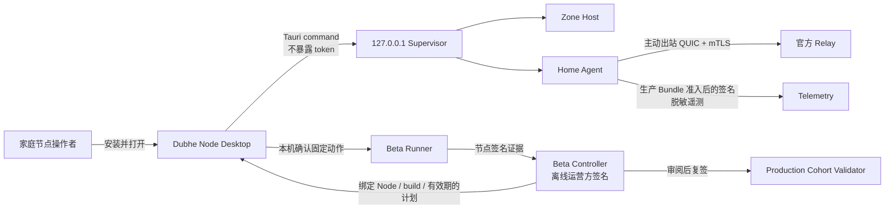
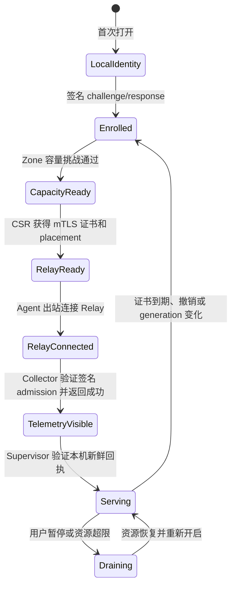
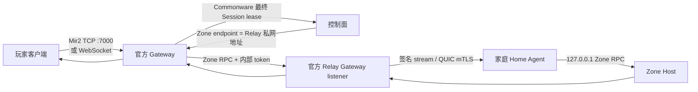

# Dubhe Node 桌面客户端与生产 Beta

## 当前结论

仓库已经有可构建的 Tauri 2 桌面控制层，以及 Windows、macOS、Linux 的平台
图标和构建入口。桌面客户端可以创建节点身份、读取本机 Supervisor 状态并安全
开启或暂停新 Session。生产 Beta 的测试计划、节点证据和运营方复签已经拆成
三个不同权限边界。

当前仍是 **Home Node Beta**，不是可公开承诺 SLA 的正式发行版：

- Apple notarization、Windows Authenticode 和 Linux 仓库签名尚未接入；
- 尚无三家真实家庭运营商的完整现场证据；
- 关闭桌面应用会停止它临时托管的 Supervisor；开机自启和系统服务迁移尚未接入。

远程签名 enrollment、容量挑战、短期容量证书、CSR/mTLS 证书签发、动态
placement、Relay 连接和签名遥测已经接入桌面流程。它们的本地自动化验收不能
替代真实 Sui testnet 活跃注册、正式 TLS/发行证书和三运营商现场证据。

## 操作者看到的产品



WebView 不能读取节点私钥或 Supervisor Bearer Token。桌面 Rust 后端只接受
`127.0.0.1`、`localhost` 或 `::1` 的无凭据 HTTP URL，并且禁用代理和重定向。
节点身份和管理令牌分别存放在操作系统密钥库。

## 本地构建桌面客户端

```bash
cd apps/dubhe-node-desktop
npm ci
npm run build
npm run tauri build -- --debug --bundles app
```

macOS 产物：

```text
target/debug/bundle/macos/Dubhe Node.app
```

同一工程可在 Windows x64 和 Linux x64 原生 Runner 上执行上述命令，分别生成
MSI/NSIS 与 deb/AppImage/RPM。当前仓库凭据没有 GitHub `workflow` scope，
自动构建矩阵尚未提交；生成的未签名验收包不能直接作为正式下载页发行包。

## 启动后台节点

Tauri 构建会先以锁定依赖编译 `home_agent_supervisor`、
`home_agent_launcher`、`home_agent` 和 `zone_host`，再把四个目标平台原生
sidecar 放入安装包。首次打开会自动启动 Supervisor；用户不需要先开终端。

Supervisor 默认只监听 `127.0.0.1:17990`。管理令牌由桌面 Rust 后端创建并
保存在独立 keyring entry，只通过子进程环境传给 Supervisor；Node ID 和
public key 可以传递，节点私钥不会进入子进程环境。签名 enrollment 完成后启动
Zone Host；只有容量证书、placement 和 Relay mTLS 客户端证书完整且在有效期内，
Home Agent 才启动，“开始贡献”才可用。

打开客户端后应看到：

1. Node ID 和系统密钥库状态；
2. Supervisor、Zone Host 和托管进程状态；
3. CPU、可用内存、Session 数和最近观测时间；
4. “开始贡献 / 暂停贡献”控制；
5. 家庭网络只出站、IP 由 Relay 隐藏的边界说明。

## 为什么认证前显示“无遥测”

桌面客户端支持遥测，但生产 Collector 不接受匿名机器。每份报告必须同时匹配：

- Enrollment Bundle 中的 Node ID 和 Ed25519 public key；
- 当前 key generation；
- 短期容量证书 ID 与有效期；
- Commonware/控制面签发的 placement generation；
- Collector 动态加载的签名 admission。

因此初次打开时看到 `—`、`等待 enrollment` 或 `Relay 未连接` 是正确的
fail-closed 状态。此时只能显示本机 CPU、内存和 Supervisor 状态，不能把本地
自报值计入公开容量、在线率或奖励。

桌面端现在区分三件事：`遥测 URL 已配置`、`Home Agent 已启动`、`Collector
已接受签名报告`。只有 Collector 返回成功后，Agent 才把不含密钥的运行态回执
原子写入应用数据目录；Supervisor 校验回执的 Node ID 和 90 秒新鲜度后才向
界面显示报告序号与接收时间。回执缺失、过期或身份不符时会自动 drain。
完整流程如下：



## 玩家怎么玩

Dubhe Node 是节点运营软件，不是游戏客户端。玩家仍使用原版 TCP 客户端或 Web
客户端，并只连接官方 Gateway：



家庭节点不开放端口，玩家看不到家庭 IP。Relay 的 Gateway listener 对非
loopback 绑定强制配置 `MIR2_HOME_RELAY_GATEWAY_TOKEN`；官方 Gateway 使用相同
值作为 `MIR2_ZONE_HOST_TOKEN`。该官方凭据在 Relay 验证后立即终止，不会传给
家庭节点。Home Agent 在验证 Relay 签名的 stream 后，把认证字段替换为仅存在于
本机的随机 Zone RPC token，再通过 loopback 交给 Zone Host。错误官方 token 在
建立 Home stream 前即被拒绝；即使官方 token 泄漏，它也不能直接授权家庭
Zone Host。

Relay 连接中断时，Home Agent 保持进程和本机 Zone Host 存活，将
`relayConnected=false` 写入运行态，并按 `1/2/4/8/16/32s` 封顶退避重新连接。
每次重连递增注册序列，避免被 Relay 的 replay guard 误判。Supervisor 在 Relay
断开或新的 Collector 回执尚未到达时持续 drain；两者恢复后才自动 resume。
Collector 短暂不可达时，遥测任务同样退避重试，不会结束 Agent 或 Zone Host。

## 本地人工验收

1. 启动 Enrollment Authority、Telemetry Collector 和 Relay 所需的测试配置。
2. 给桌面客户端设置 Authority URL 和可信 issuer public key。
3. 打开应用；macOS 如出现 Keychain 弹窗，点击“允许”。
4. 点击签名 enrollment，确认界面进入“待容量认证”，Zone Host 为健康。
5. 点击“执行容量认证并申请 Relay mTLS”。
6. 确认 `capacity ready`、`Relay ready`、Agent 已托管并出现远程遥测。
7. 用 Mir2 客户端连接官方 Gateway，不连接桌面应用或家庭 IP，完成 Login、
   StartGame 和 KeepAlive。

本仓库当前桌面节点的 Sui testnet 最终确认注册证据位于
`docs/generated/gate13/testnet/dubhe-desktop-registration.json`。本地 Authority
读取的是该最终确认记录，而不是自行伪造一个“已上链”布尔值。用于开发的
Relay CA、Authority 私钥和内部 token 只能生成到临时目录，不能提交或用于公网。

当 Gateway 已经以 `MIR2_ZONE_HOST_ADDR=<Relay private listener>` 和
`MIR2_ZONE_HOST_TOKEN=<internal token>` 启动后，运行独立玩家探针：

```bash
MIR2_HOME_PLAYER_GATEWAY_ADDR=127.0.0.1:17000 \
MIR2_HOME_PLAYER_PROBE_OUT=docs/generated/home-node/live-player-probe.json \
cargo +1.89.0 run -p mir2-gateway --bin home_player_probe
```

通过标志是 `HOME_PLAYER_PROBE_PASS`。JSON 证据必须同时包含 `connect`、
`login`、`startGame` 和 `keepAlive` 四步；只看到进程在线、端口打开或桌面绿灯
都不能替代玩家协议验收。探针默认单步超时 30 秒，以容纳 debug 世界初始化；
记录的实际延迟仍会保留，但不能替代 release/Regional 性能 SLO。

仓库级可重复验收：

```bash
cd apps/dubhe-node-desktop
npm run acceptance
```

等价的分项命令：

```bash
cargo +1.89.0 test -p mir2-gateway --bin home_enrollment_service
cargo +1.89.0 test -p mir2-gateway --bin home_telemetry_collector
cargo +1.89.0 test -p mir2-gateway --bin home_agent_supervisor
cargo +1.89.0 check -p mir2-gateway --bin home_local_stack_fixture
cargo +1.89.0 check -p mir2-gateway --bin home_player_probe
cargo +1.89.0 test -p mir2-gateway home_tunnel --lib
cargo +1.89.0 test -p mir2-gateway --test home_tunnel
cd apps/dubhe-node-desktop
npm run build
npm run tauri build -- --debug --bundles app
```

`home_tunnel` 集成验收通过真正的玩家 TCP Gateway 完成 Login、StartGame 和
KeepAlive，同时覆盖 Gateway 内部凭据拒绝、mTLS 非信任 CA、QUIC 合法乱序、
精确重放拒绝、动态 placement reload、UDP rebind，以及真实 Home Agent
子进程在 Relay 重启期间保持存活并自动重新注册。

## 生产 Beta：运营方签发计划

先由节点提供 public key 和当前 build commit。Controller 生成固定动作模板：

```bash
cargo run -p mir2-gateway --bin home_beta_controller -- \
  template <node-public-key> <build-commit> <plan-id> plan-payload.json
```

运营方在隔离环境设置签名密钥并签发：

```bash
export MIR2_HOME_BETA_OPERATOR_SIGNING_KEY_FILE=/secure/operator.seed
cargo run -p mir2-gateway --bin home_beta_controller -- \
  issue-plan plan-payload.json signed-plan.json
```

计划只能包含以下白名单动作：

- CGNAT 基线被动观测；
- 本机用户确认换 IP、路由器重启、休眠/唤醒；
- 有时限的丢包和带宽拥塞探针；
- standby 接管验证。

协议中没有 Shell、脚本路径、URL 下载执行或任意命令字段。计划绑定 Node ID、
节点 public key、key generation、build commit、动作顺序、SLO 和最多 24 小时
有效期。

## 家庭节点执行计划

Runner 从系统密钥库加载节点身份，不接收私钥参数：

```bash
cargo run -p mir2-gateway --bin home_beta_runner -- \
  begin signed-plan.json <trusted-operator-public-key> <build-commit> journal.json

cargo run -p mir2-gateway --bin home_beta_runner -- \
  start-action journal.json <build-commit>
```

操作者按输出提示在本机完成对应动作，然后记录恢复 Session 数、经济重复数和
原始证据文件：

```bash
cargo run -p mir2-gateway --bin home_beta_runner -- \
  complete-action journal.json <build-commit> \
  <sessions-before> <sessions-recovered> <duplicate-count> evidence.json
```

七个动作完成且运行不少于 15 分钟后生成节点签名结果：

```bash
cargo run -p mir2-gateway --bin home_beta_runner -- \
  finish journal.json <build-commit> <provider-code> <provider-asn> \
  <failure-domain> <coarse-region> <active-session-minutes> \
  machine-attestation.json node-signed-run.json
```

证据文件只进入 SHA-256 承诺，不把家庭 IP、用户名或磁盘路径写入公开结果。

## 运营方复签与 cohort 验收

运营方先审阅原始证据，再在隔离环境复签：

```bash
export MIR2_HOME_BETA_OPERATOR_SIGNING_KEY_FILE=/secure/operator.seed
cargo run -p mir2-gateway --bin home_beta_policy -- \
  operator-countersign-run node-signed-run.json signed-run.json
```

三家不同运营商、ASN、Node 和故障域的物理家庭网络结果才能组成生产 cohort：

```bash
cargo run -p mir2-gateway --bin home_beta_policy -- \
  verify-cohort <trusted-operator-public-key> cohort.json \
  signed-run-a.json signed-run-b.json signed-run-c.json
```

模拟网络、缺失动作、Session 未完整恢复、RTO 超过 4,999ms、任何经济重复、
节点/构建不匹配、过期计划或错误签名都会 fail closed。

## 威胁边界

| 威胁 | 当前控制 |
| --- | --- |
| 恶意网页读取节点密钥 | WebView 无密钥 API；密钥只在 Rust/keyring |
| 本机其他用户调用管理口 | 独立随机 Bearer Token；loopback bind |
| 代理劫持本机管理请求 | 桌面客户端禁用代理与重定向 |
| 官方远程执行任意代码 | 签名计划只有固定 enum，无 Shell/脚本字段 |
| 旧计划换机器重放 | 绑定 Node ID、public key、key generation 和 build |
| 操作者修改中间证据 | 证据 SHA-256、节点签名、运营方复核再复签 |
| 单个家庭网络伪装生产通过 | cohort 强制三 Node、三运营商、三 ASN、三故障域 |

尚未覆盖恶意管理员内核、硬件级远程证明、发行证书泄露和云端 DDoS 实压。这些
必须通过独立安全审计、正式代码签名和真实运营观察补齐。
