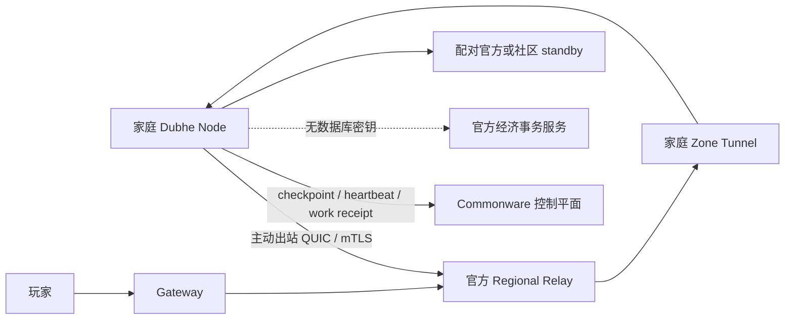

# Dubhe Home Node：家庭节点现状与落地路线

## 结论

当前仓库已经完成社区节点的身份、Sui testnet 生命周期、远程容量挑战、短期容量
证书、Commonware 最终准入、Zone Host、复制/晋升和 verified-work 奖励 POC。
它还不是“普通用户安装后无需公网 IP 即可承载商业服玩家”的完整家庭节点产品。

不得把 Gate 13 的远程挑战或 Gate 14 的本地双节点 POC 宣传成家庭网络生产认证。

## 已实现

- Ed25519 非对称节点身份和轮换；
- Sui testnet 注册、撤销、质押与退款生命周期；
- nonce 绑定的远程容量挑战和短期证书；
- 证书到期、撤销和超过声明容量时 fail closed；
- Commonware 3-of-4 最终准入；
- signed work receipt、质量权重、预算上限和 Merkle 奖励批次；
- 独立 Zone Host 承载真实 Mir2 Session；
- PostgreSQL owner fence、checkpoint、durable WAL、主备复制和 promotion；
- Gateway 路由重试、Session 刷新和经济幂等。

## 尚未实现

- CGNAT/动态 IP 下只使用出站连接的 QUIC/mTLS 反向隧道；
- 隐藏家庭 IP 的官方 Relay 和抗 DDoS 边界；
- 家庭节点桌面安装器、托盘管理、自动升级和签名镜像；
- 游戏运行时自动降载、空闲算力模式、休眠前 drain；
- 家庭宽带丢包、断网、换 IP、路由器重启的持续故障矩阵；
- 生产级代码沙箱、远程证明和恶意节点对抗；
- 在真实不同运营商家庭网络上的容量与奖励 Beta。

## 目标网络

玩家不直接连接家庭 IP。家庭节点不持有 PostgreSQL、Sui settlement 或奖励签名
密钥；它只接收已授权的 Zone 命令，并用 node generation/sequence 提交结果。
经济副作用由官方事务服务验证和落账。

## 节点等级

| 等级 | 能力 | 是否承载玩家 |
| --- | --- | --- |
| Observer | 验证控制结果与 checkpoint | 否 |
| Replica | 保存冷地图副本并保持 readiness | 默认否 |
| Home Zone | 10–30 人冷地图或私人副本 | 是 |
| Certified Zone | 50–128 Session，短期容量证书 | 是 |
| Professional Zone | 热点线路、长期在线和更高故障预算 | 是 |

家庭节点 Beta 从 Observer/Replica 开始，之后只开放冷地图。热点地图必须等真实
家庭网络故障矩阵、隐私 Relay 和快速接管全部通过后再开放。

## 家庭节点最低建议

- 4 CPU / 8GiB，可用 SSD 至少 100GiB；
- 稳定上行 20–50Mbps；
- 到 Regional Relay RTT 最好低于 50ms；
- 运行期间禁止休眠，或休眠前完成 drain；
- active 必须有不同故障域的 standby；
- 容量证书短期有效，持续心跳和抽样挑战；
- 用户开始高负载游戏时停止接新 Session，现有 Session 有序迁移。

## 剩余里程碑

1. Outbound Tunnel POC：家庭节点在 CGNAT 后主动连接 Relay，Gateway 通过隧道
   完成一个真实 Session 的登录、移动、断线恢复。
2. Home Replica Beta：只复制 checkpoint/WAL，验证断网、换 IP、休眠和恢复。
3. Home Zone Beta：10–30 人冷地图，配对官方 standby，故障恢复小于 5 秒。
4. Certified Home Node：签名安装包、自动更新、资源策略、隐私 Relay、容量挑战
   和真实奖励结算。

功能 POC 预计约一周 AI 工程时间；达到公开家庭节点 Beta，预计 2–4 周并需要
真实家庭网络参与测试。时间估计不包含外部安全审计和大规模运营观察期。
