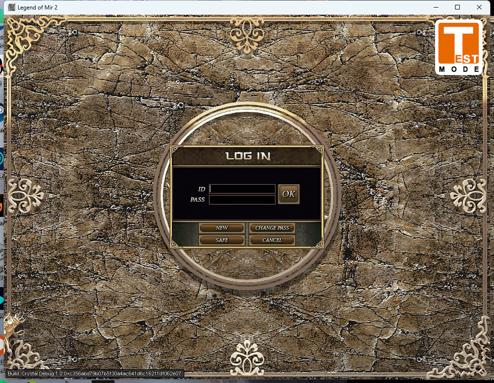
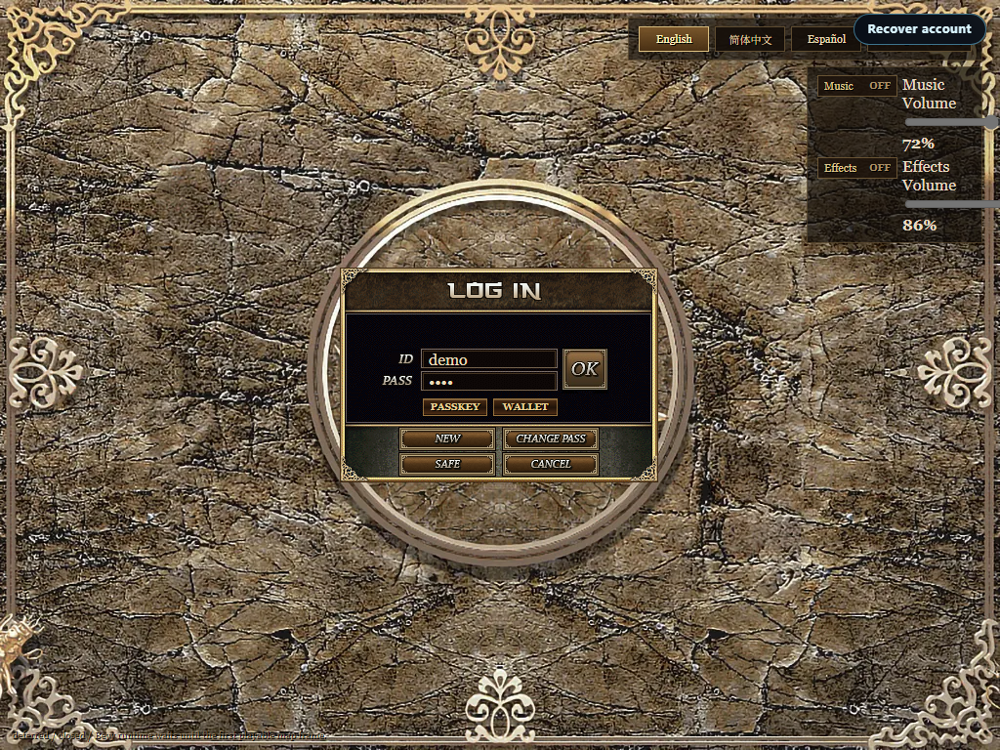

# 登录界面 · 对拍报告 · 原版 Crystal vs 本地 Web

> 阶段：UI 对齐。生成 2026-08-18。
> **对拍前提修正**：进行对拍前先确认两张截图是**同一界面**。本组两张登录界面均已确认
> （原版 VIA pywinauto/手动；Web CDP DOM `hasAccount:true, hasPass:true`）。

## 0. 素材（均为真实登录界面截图）

| 侧 | 图 | 确认依据 |
|---|---|---|
| 原版 | `docs/ref/original-login.png`（1040×807）| 原版 Client 登录界面（Window 1040×807）|
| Web | `docs/ref/web-login.png`（1024×768）| CDP DOM `screen/login, hasAccount, hasPass` |

## 1. 视觉对比

**量化**：缩放至 1024×768 逐像素 diff ≈ **99.9%**（几乎每个像素不同）。

**风格基调：接近**（都偏复古/岩石纹理/金色边框/庄重感）。
**具体差异**：

| 维度 | 原版 | Web |
|---|---|---|
| 登录面板形状 | **方形** LOG IN 面板 | **圆形** 登录框 |
| 面板内按钮 | **多**：OK / NEW / SAFE / CHANGE PASS / CANCEL | 相对精简 |
| 按钮填充 | 金框 + 棕填充（配黑字）| 深棕圆角 + 白字 |
| 顶部设置 | 无（语言/音量在别处或默认）| 有语言选择 + 音量控制 |
| Logo/标题 | 经典 | 顶部有语言/音效等工具条 |
| 尺寸 | 1040×807 | 1024×768 |

## 2. 结论
- **登录界面对比成立**（同一界面）。当前 Web 与原版**风格基调接近但布局形状不同**（方形 panel vs 圆形；按钮集/圆角/白字差异；Web 多顶部设置栏）。
- diff≈99.9% 说明若要像素级一致需大幅调整登录框形状、按钮样式、额外元素。
- 需人工目测确认哪些是"可接受的 Web 化差异" vs "必须对齐的 Crystal 规范"。

## 附
- 图片：`docs/ref/original-login.png`、`docs/ref/web-login.png`
- 工具：pywinauto（原版截图）+ `apps/web/scripts/capture-web-login.mjs`（Web CDP）
