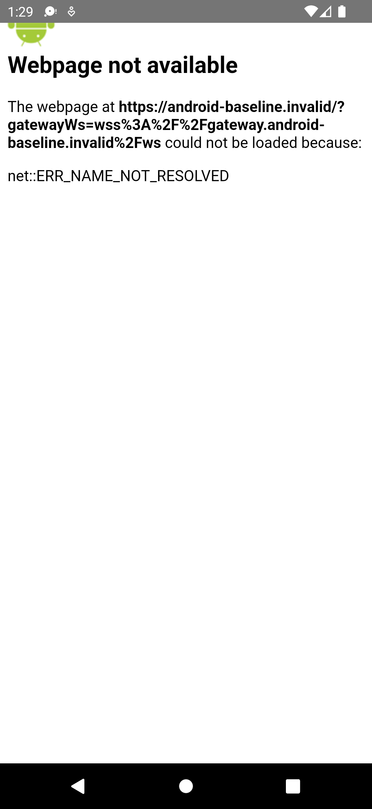

# Android emulator negative-path baseline — 2026-09-04

## Scope

This evidence extends the macOS packaging baseline with installation, cold launch, and background/resume checks on the available Android emulator. The APK intentionally embeds reserved `.invalid` Web and Gateway hosts, so this is a loader and lifecycle negative-path test, not AND-MAC-02 player-loop acceptance.

- Branch: `codex/android-player-journey`
- Parent evidence commit: `dc14b31b13c390bf5110cd9f990f31fbec799d18`
- Source baseline: `58eab9a4a6684b2d2d11d2c533049b64995e7458`
- APK SHA-256: `762d897ed6b6f8fe5b2e382f564081a262ca4d06eb2128b5dacf0700f32e0d78`
- Package: `com.obelisklabs.mir2`
- Version: `1.0` (`versionCode` 1)
- Test date: 2026-09-04 (Asia/Shanghai)

## Emulator

| Field | Observed value |
| --- | --- |
| AVD | `Pixel_5_API_31` |
| ADB serial | `emulator-5554` |
| Android | 12 / API 31 |
| Manufacturer / model | Google / `sdk_gphone64_arm64` |
| ABI | `arm64-v8a` |
| Build fingerprint | `google/sdk_gphone64_arm64/emulator64_arm64:12/SE1A.220630.001/8789670:userdebug/dev-keys` |
| Display | 1080 x 2340, 440 dpi |
| Android System WebView | 91.0.4472.114 |
| Android Emulator | 31.3.10.0 (build 8807927) |
| Physical device | none |

The emulator was started without `-wipe-data`. `adb devices -l` showed exactly one target before installation. The package was not previously installed, so no existing application data was replaced or cleared.

The emulator reported that it is out of date, an unexpected system-image feature string, and a missing `emulator/bin64/e2fsck` executable while attempting to resize userdata from 800 MB to 20,480 MB. These warnings did not prevent this run, but the emulator/tooling installation should be refreshed before performance or longer soak acceptance.

## Installation and cold launch

```text
adb install -r app-debug.apk
  PASS — Performing Streamed Install / Success

adb shell am start -W -n com.obelisklabs.mir2/.MainActivity
  PASS — COLD launch; Activity com.obelisklabs.mir2/.MainActivity
  TotalTime: 792 ms
  WaitTime: 798 ms
```

The process remained alive after launch. Capacitor loaded its local `https://localhost` shell and then navigated to the expected build-time target:

```text
https://android-baseline.invalid/?gatewayWs=wss%3A%2F%2Fgateway.android-baseline.invalid%2Fws
```

The WebView displayed `net::ERR_NAME_NOT_RESOLVED`, which is the expected result for the reserved `.invalid` host. This proves the packaged loader consumed the intended endpoint values; it does not prove access to a real Web release or Gateway.



Screenshot SHA-256: `7f43ac5f7dccb836607fb59c7c9ac48fb7f5b66cf29e9f2717d25b72bda88d53`

## Background and resume

The app was sent to the launcher for four seconds and then brought to the foreground again.

```text
PID before background: 11121
PID while backgrounded: 11121
PID after resume: 11121
LaunchState: HOT
TotalTime: 51 ms
WaitTime: 53 ms

Capacitor: App paused
Capacitor: App stopped
Capacitor: App restarted
Capacitor: App started
Capacitor: App resumed
```

No `FATAL EXCEPTION`, Android runtime crash, ANR, or process replacement was observed. The resumed screen remained in the same expected DNS failure state.


Screenshot SHA-256: `257940deb5bfa5f11fde3366c78a8dd45a78afe049c8698c87fda2d633e91d0c`

Capacitor logged the following Console error on both pause and resume:

```text
File: chrome-error://chromewebdata/ - Line 1 - Msg: Uncaught TypeError: Cannot read property 'triggerEvent' of undefined
```

The error came from the WebView-generated error document rather than the unavailable Mir2 page. It did not crash or restart the app. It is retained as a negative-path observation; no lifecycle or shared Web code was changed on this evidence-only round.

## Emulator reboot persistence

After the first run, the emulator was shut down normally and restarted with `-no-snapshot-load` to force a full Android boot from persisted userdata. The package remained installed at the same version, and its install timestamps were unchanged:

```text
package:/data/app/.../com.obelisklabs.mir2-.../base.apk
versionCode=1
versionName=1.0
firstInstallTime=2026-09-04 13:28:38
lastUpdateTime=2026-09-04 13:28:38
```

A second post-reboot cold launch succeeded with `TotalTime: 539 ms` and `WaitTime: 543 ms`. Capacitor emitted `App started` and `App resumed`; no app ANR, fatal exception, or process crash was observed. This confirms package and basic app-lifecycle persistence only, not player-state persistence.

## Diagnostic snapshot

| Metric | Observed value |
| --- | --- |
| Total PSS | 93,854 KB |
| Total RSS | 210,248 KB |
| Java heap PSS | 8,640 KB |
| Native heap PSS | 17,792 KB |
| Frames rendered | 45 |
| Janky frames | 0 / 45 |
| Frame-time percentiles | p50 16 ms, p90 20 ms, p95 65 ms, p99 400 ms |

These are low-sample diagnostics for a static WebView error page. They are not game performance, map-load, thermal, or soak acceptance.

## Result boundary

Passed in this round:

- unique emulator selection
- debug APK installation
- package/activity/version verification
- cold launch
- build-time endpoint propagation
- background/resume without process replacement, ANR, or crash
- package persistence and cold launch after a full emulator reboot without loading a snapshot
- durable screenshots with SHA-256 values

Still unaccepted:

- approved test Web, asset, and Gateway revision provenance
- successful remote page and WebSocket connection
- normal authentication, character selection, and Bichon entry
- movement, combat, pickup, inventory/equipment, NPC, and quest interactions
- offline/reconnect behavior in a functioning game session
- exit/re-entry persistence
- physical-device input, WebView compatibility, performance, thermal, and soak evidence
- updated emulator tooling and a clean userdata-resize warning baseline
- native Bevy Android networking and host integration

## Next gate

Rebuild the same Capacitor shell with approved non-production HTTPS/WSS endpoints and record their Web SHA, asset manifest/hash, and Gateway version. Then repeat installation on the emulator and begin the AND-MAC-02 player loop. Authentication secrets must be entered through the normal UI and must not be written to the repository or evidence logs.
