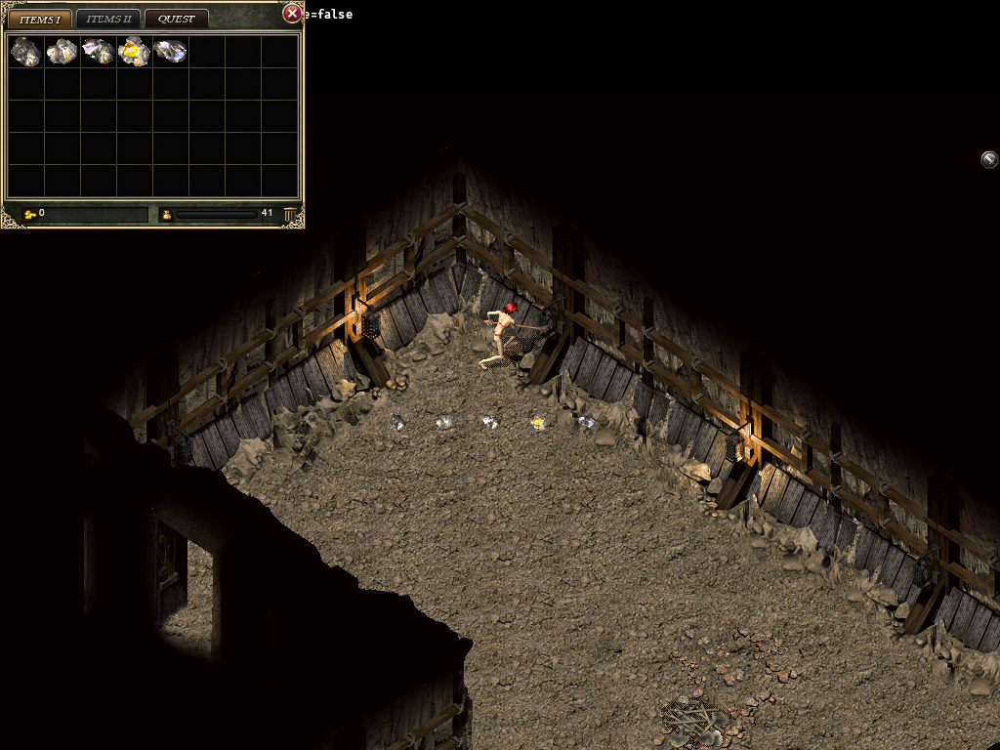

# Shared mining evidence — 2026-10-07

Scope and ordinary-player instructions:
[SHARED-CRYSTAL-MINING-20261007](../../../SHARED-CRYSTAL-MINING-20261007.md).
Base source: `3c255155b3b04f1c415913d5c8af024200bf7455`, isolated classic lane.
Public Gateway/feed/installation and actual player saves were not changed.

## Actual bounded results

| Verification | Actual result | Evidence |
| --- | --- | --- |
| Simulation filtered mining, including v7 integrity and authenticated v6 custody | 9 library + 5 external tests pass | [raw](raw/mining-simulation-20261006-02.log) |
| Complete game-data tests and scope/content loops | 61 library + 5 resource + 3 content tests pass; one unrelated library test remains ignored | [raw](raw/mining-game-data-20261007-final.log) |
| Ordinary Gateway three-class inventory and failure boundaries | All seven mining cases pass | [raw](raw/mining-gateway-qa-20261007-08-tests.log) |
| Actual TCP/WebSocket attack/refill/cooldown/logout/reentry | One isolated repeat passes, 19.36s | [raw](raw/mining-gateway-qa-20261007-08-ws-02.log) |
| Original D401 strict checkpoint and continued mining | One passes; stone/sequence/clock/effect tampering rejected | [raw](raw/mining-gateway-qa-20261007-09-d401.log) |
| Corrected existing atomic restore assertion | One passes with full stable live-authority equality | [raw](raw/mining-gateway-qa-20261007-09-atomic.log) |
| Default repository-fixture real WebSocket | One repeat passes, 19.41s; no external map-root env | [raw](raw/mining-gateway-qa-20261007-09-ws-repo-fixture.log) |
| Existing Gateway checkpoint/custody/claim/harvest/melee regressions | Six pass; one existing unstable cold-image byte assertion fails in Candidate and old pre-mining binary | [Candidate](raw/mining-gateway-adjacent-20261007.log), [old binary](raw/mining-checkpoint-baseline-20261007.log) |
| Windows current gesture, cancellation, sender saturation, owner/observer action | 10 pass; GPU case is explicitly ignored in this run and executed separately | [raw](raw/mining-native-20261006-final-02-tests.log) |
| Windows existing movement, combat and corpse harvest | Eight pass | [raw](raw/mining-native-20261006-adjacent-02-tests.log) |
| Separate Bevy normal/retry queue cancellation | One passes | [raw](raw/mining-client-bevy-20261007-queue-test.log) |
| Production packet/pose/atlas and inventory offscreen GPU | One passes; 96 source geometry cases, four actual PNGs | [raw](raw/mining-native-20261006-gpu-02.log), [report](visual/mining-visual-report.json) |
| Entire unchanged item-icon catalogue closure | 1628 item rows, 924 unique images pass source PNG/RGBA hash and geometry checks | [raw](raw/mining-item-icon-closure-20261007-04.log) |
| Exact source generator/profile bundle | 23 mines/two sets and 14 dependencies verified | [generator](raw/mining-generator-20261007-final.log), [bundle](raw/mining-profile-bundle-20261007-final.log) |
| Default production Gateway library | Rust1.89 check passes | [raw](raw/mining-gateway-production-20261007-final.log) |

Counts are not added into a parity percentage. Related repeated runs overlap.
Source/docs staged whitespace validation passes with this owned `raw/` directory
excluded. Raw tool logs intentionally preserve trailing spaces and final blank
lines byte-for-byte rather than rewriting failed evidence.
Gateway fixtures use ordinary account/character/NPC/shop/equipment/item packets;
only level, gold, wall location and deterministic payout-branch times are trusted
test preparation. Original hit/drop/stone/regen/attack rules are unchanged.
The WebSocket fixture pre-equips a source pick before ordinary StartGame; the
separate three-class Gateway tests actually purchase/equip through source Smith.
This is not a natural level-12 journey or elapsed-time mining acceptance.

## Visual review

Phase 0 frames are retained for [male](visual/mine-Male-right-0.png) and
[female](visual/mine-Female-right-0.png). Worker reviewed all four; root independently
reviewed the displayed mine/ore/inventory fixture. Actual original D401 terrain,
body/weapon geometry and source ore icons are used. The report explicitly sets
`runtimeWorldRenderer=false` and `liveAcceptance=false`. These images cannot replace
the normal-player Windows/server press-and-hold, movement and disconnect witness.

## Failures preserved

- Old game-data bundle denominator 13 failed after adding the 14th dependency;
  corrected to 14 with an explicit mining-manifest assertion, then the whole
  package passed. [Original failure](raw/mining-game-data-20261006-01.log).
- Gateway fixtures first failed type/MAC setup and original-map format assumptions:
  original D401 uses v1 XOR cells; Bichon uses v100. Logs 01–04 retain these failures;
  parsing now handles the real source formats without inventing wall data.
- Warm native/Gateway test EXEs were locked by an unknown process (LNK1104). No
  user/security program was stopped; dependencies were reused with distinct owned
  final output names. [Gateway failure](raw/mining-gateway-qa-20261007-05.log),
  [actual alternate build](raw/mining-gateway-qa-20261007-08-build.log).
- The first combined Gateway run has seven passes and one WebSocket ordinary Login
  timeout at the existing 10s helper. It is preserved, not overwritten by the
  successful isolated WS run. The repeat also retains its ordinary-close diagnostic.
- The initial GPU fixture lacked audio asset storage; it failed rather than showing
  an invented screenshot. Registering the production WAV asset type, with no device
  or window, allowed the explicit offline test. [Failure](raw/mining-native-20261006-gpu-01.log).
- Item-icon verification first lacked `sharp`; subsequent scratch loader attempts
  had path errors. Final verification ran the unchanged repository checker with
  read-only dependency resolution to the installed Sharp package. The original
  failed logs are in `raw/`; production source and pixel gates were not weakened.
- The existing atomic cold-restore test compares a newly rotated online identity
  namespace each time. The old binary has the same failure. The correction compares
  the entire stable live authority before and after failed install, retaining all
  field equality and invalid-version rejection. Final recheck is recorded separately.

## Remaining acceptance

Original D401 strict checkpoint restoration and corrected atomic assertion pass;
source/generator/profile and default production compilation also pass. Independent
Linux CI execution is tracked separately from
packaging/publication/install/human acceptance. Mining audio 10091 is not available
as a real resource in the inspected asset roots and remains open. Full checkpoint
acceptance does not authorize incremental active/standby replay, whose current
replay clock changes random mining rolls. Full P6 weapon refining and P1–P8 stay open.
