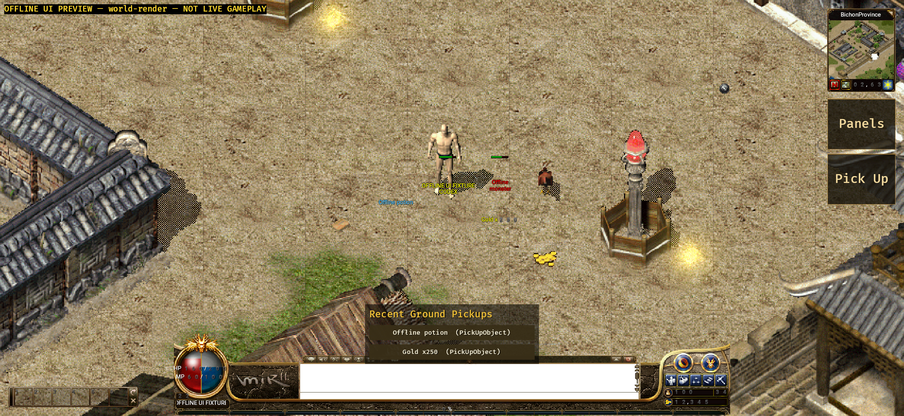

# Native Android actor-overlay evidence (2026-09-11)

## Version and scope

- Branch: `codex/android-player-journey`.
- Implementation commit: `f81ae8415`.
- The Android host projects validated authoritative `selfPlayer`, `player`,
  `monster` and `npc` objects into a bounded actor-overlay model on the same
  1024 x 768 stage as the native map and sprites.
- Names retain server object identity and signed `nameColourArgb`. Player guild
  names, NPC/monster underscore line breaks, Crystal anchors, corpse offsets and
  the existing pet-name offset are preserved without creating client authority.
- The local player's bar uses exact authoritative `hp` / `maxHp`. Monster bars
  use only the server `ObjectHealth` percentage and expiry; a packet revision
  renews the deadline even when the percentage is unchanged. Percentage packets
  are never converted into invented exact HP values.
- Shared `NameView` controls names and guild lines but does not hide health
  feedback. Every overlay node uses `FocusPolicy::Pass` and cannot intercept
  world or HUD input.

## Verification

- Android Rust suite with the preview feature: 134 passed, 0 failed.
- Java MockWebServer/TLS suite: 11 passed, 0 failed.
- API 31 `aarch64-linux-android` target check: passed with Rust 1.95.0 and NDK
  26.1.10909125.
- Unit coverage validates fields, signed ARGB conversion, Crystal geometry,
  duplicate identity rejection, `NameView`, exact self health, server-timed
  monster health expiry and pass-through focus policy.
- Normal debug APK package gate passed:
  `apps/game-client/platform-android/android/app/build/outputs/apk/debug/app-debug.apk`,
  330,971,425 bytes, SHA-256
  `bec89fdd5dd5a5fd893cef7dc764118b6657f20eb1805811839d06fead8bd23d`.
- Offline UI Preview APK package, streamed install and cold launch passed:
  `apps/game-client/platform-android/android/app/build/outputs/apk/uiPreview/app-uiPreview.apk`,
  375,309,145 bytes, SHA-256
  `480370a7f530d4d3a1379e81fe4cfcff3345ea61c2cc24458735990141fb53bd`.

## Emulator-visible result

- Target: `emulator-5554`, Android 12 / API 31, `arm64-v8a`, model
  `sdk_gphone64_arm64`, 2340 x 1080 landscape at 440 dpi.
- Build fingerprint:
  `google/sdk_gphone64_arm64/emulator64_arm64:12/SE1A.220630.001/8789670:userdebug/dev-keys`.
- The explicitly labelled offline `world-render` scene reported seven atlas
  pages, 607 ordinary map draws, 242 standalone draws, four entities, four
  entity layers and zero unresolved visible map/entity entries.
- The screenshot visibly shows the yellow local-player name, guild line and
  exact green health bar, plus a red two-line monster name and its server-timed
  green percentage bar. Ground labels remain separated and visible.
- Screenshot SHA-256:
  `e98060b89023464c849cb90a2aeac025f9a36cfdb0eca370778d8e4768463c51`.

## Acceptance boundary

- `world-render` is compile-time isolated and visibly labelled
  `NOT LIVE GAMEPLAY`; its network entrypoints are disabled. It proves packaged
  rendering and layout coexistence on this emulator, not live server delivery.
- The normal APK was built without an approved Gateway URL or test account.
  This run does not prove real login, StartGame, live health packets, reconnect
  or saved-state restoration.
- No physical Android device was attached. Device touch/IME/background/network,
  performance, thermal, soak and the full player journey remain unaccepted.
- APKs, generated asset packs, caches, credentials and signing material were not
  committed. The tracked evidence contains only this README and screenshot.
