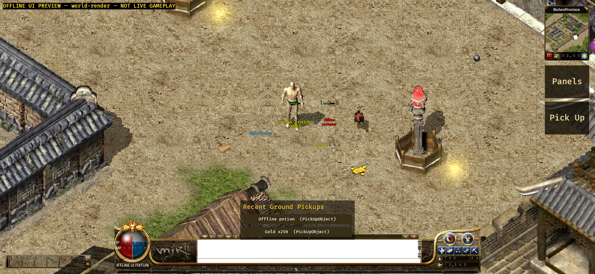

# Native Android damage-feedback evidence (2026-09-11)

## Version and scope

- Branch: `codex/android-player-journey`.
- Implementation commit: `1d6c0a2b329744e80cd579f2de32e24c3a1f216f`.
- The existing authenticated post-`IN_GAME` packet bridge now retains exact,
  bounded `DamageIndicator { objectId, damage, damageType }` events in arrival
  order. It accepts the Gateway's typed camelCase payload and rejects malformed
  or incomplete events.
- The Android presentation projects each event only onto the matching
  authoritative actor. Hit, miss, critical and heal variants use the Crystal
  text, colour, rise and fade rules already implemented by the Windows host.
  There is no fallback to the local player and no local combat calculation.
- At most 48 floaters and 10 per actor are retained. Scene reset, disconnect,
  removal, expiry and duplicate event sequence handling are bounded and
  deterministic. The separate overlay is input-pass-through.
- A real hit may keep an existing server percentage health bar visible for five
  seconds. Miss and heal events do not do so, and the client never derives
  exact monster HP from damage or percentage values.

## Verification

- Android Rust suite with the preview feature: 137 passed, 0 failed.
- Java MockWebServer/TLS suite: 11 passed, 0 failed.
- API 31 `aarch64-linux-android` target check: passed with Rust 1.95.0 and NDK
  26.1.10909125.
- Unit coverage validates exact event fields, malformed-event rejection,
  ordering, deduplication, global/per-actor caps, Crystal animation geometry,
  exact target lookup, input pass-through and the five-second real-hit health
  window.
- Normal debug APK package gate passed:
  `apps/game-client/platform-android/android/app/build/outputs/apk/debug/app-debug.apk`,
  331,044,521 bytes, SHA-256
  `d6266eb97b632efec8d405004ab26130e28a01eecd4fccd1d69fe0538da97705`.
- Offline UI Preview APK package, streamed install and cold launch passed:
  `apps/game-client/platform-android/android/app/build/outputs/apk/uiPreview/app-uiPreview.apk`,
  375,401,865 bytes, SHA-256
  `d55f6662d559b143096f95cb6502caa74889b748e542239c3854755a3e76d7b8`.

## Emulator-visible result

- Target: `emulator-5554`, Android 12 / API 31, `arm64-v8a`, model
  `sdk_gphone64_arm64`, 2340 x 1080 landscape.
- Build fingerprint:
  `google/sdk_gphone64_arm64/emulator64_arm64:12/SE1A.220630.001/8789670:userdebug/dev-keys`.
- The explicitly labelled offline `world-render` scene reported seven atlas
  pages, 607 ordinary map draws, 242 standalone draws, four entities, four
  entity layers and zero unresolved visible map/entity entries.
- The screenshot visibly places the bounded `128` critical-damage floater on
  the fixture monster while the packaged map, player, monster, server
  percentage health bars, names, guild line and ground drops remain present.
- Screenshot SHA-256:
  `d8554eb31bedc6c9d8352404ecb3d2b28f5d8efe691beb46d36c53432e6ed931`.

## Acceptance boundary

- `world-render` is compile-time isolated and visibly labelled
  `NOT LIVE GAMEPLAY`; its network entrypoints are disabled. The injected
  critical event proves packaged Android rendering and timing coexistence, not
  live delivery from a Gateway.
- The normal APK was built without an approved Gateway URL or test account.
  This run does not prove real login, StartGame, live `DamageIndicator`,
  reconnect or saved-state restoration.
- No physical Android device was attached. Device touch/IME/background/network,
  performance, thermal, soak and the full player journey remain unaccepted.
- APKs, generated asset packs, caches, credentials and signing material were
  not committed. The tracked evidence contains only this README and screenshot.
