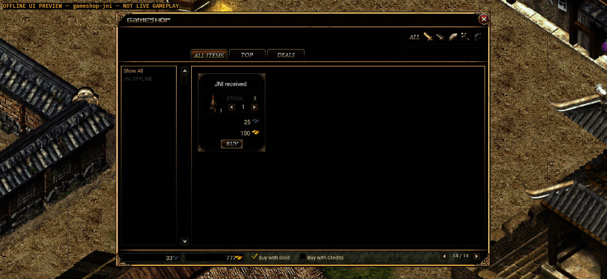
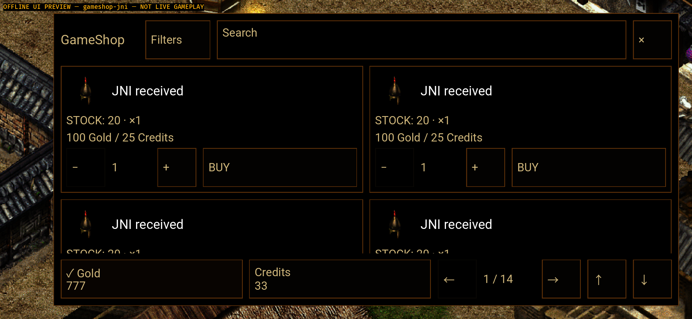
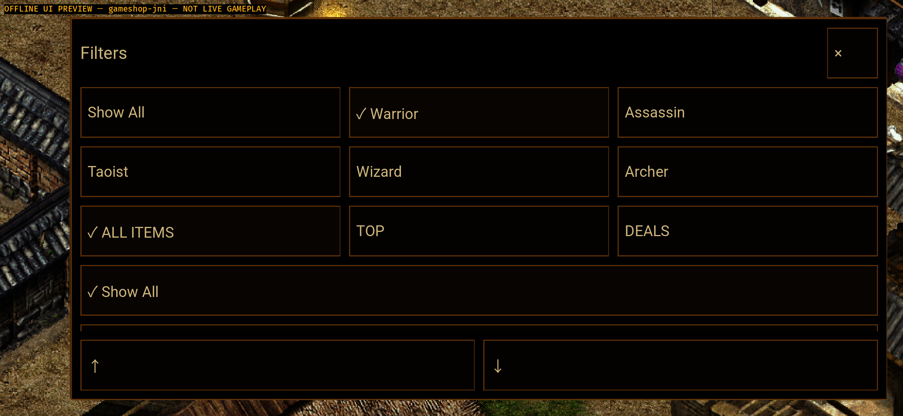
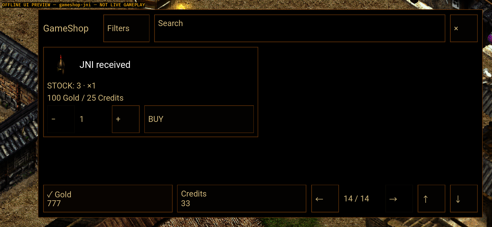

# Native Android v35 — opt-in phone GameShop presentation

2026-10-03，精确打包源码 `bc12249ae35c052d6b5c66aa01f4c04a0f95dee6`，
父提交 `f99edfdbd62b5a80714cce41deaabedc75ec5084`。
只完成 **共享商城手机呈现的有界叶子**；完整 Android/Windows 对齐 goal 仍为 Active，
NI-12 / NI-13 仍 PARTIAL，不是整套 UI、真实购买、在线玩家闭环或真机验收完成。

## 范围与设计依据

五个源文件：新增 `crystal_ui/game_shop_phone.rs`，在共享 GameShopDialog/overlays
接入可选呈现，Android shared_shell 发布安全区/IME 后的工作区，版本递增至
35 / `0.1.32-gameshop-phone`。没有第二套目录、排序、数量、价格、库存、购买、
认证、战斗、交易或存档规则；控件释放时仍交给原共享 OverlayButton 控制器。

design-review 采用原生验证路径：保留黑金 Legendary 风格，实际 14/16dp 文字、
≥48dp 控件、实际 ADB 触控和前后截图；不使用浏览器图替代原生验收。
Android 可选资源不存在/无效时，原桌面 696×476 呈现仍保持；Windows 默认布局
和既有测试保留。本机没有做 Windows 可执行程序构建或 Windows 人工验收。

手机页保留原 105 行、每页八行和 14 页；商品列表支持独立滑动/上下按钮。
Filters 保留来源职业、区段和分类；购买确认使用原共享 prompt，预览使用原素材/
动画来源。只增加呈现和触控所有权，不直接发物品、扣币或修改真实存档。
Java JNI 夹具、正式认证/网络宿主、旧商城/仓库规则、两处渲染文件与父提交逐字节相同。

## 源码与门禁

[50 输入与精确源码绑定](raw/source-commit-binding.json)；
[七门与原生包审计](raw/source-and-package-baseline.json)。

- 编译后红：新增三个检查中 1 通过 / 2 失败，缺手机控件和字号；原八行页数检查仍通过。
  [结果](raw/working-phone-compiled-red-v35-result.json) /
  [原日志](raw/working-phone-compiled-red-v35.log)。
- 初次绿准备触发 E0716 临时搜索标签借用，单独保留为实现编译失败，不冒充产品红：
  [结果](raw/working-phone-green-preparation-v35-result.json) /
  [日志](raw/working-phone-green-preparation-v35.log)。
- 修正后 3/3；最终手机模块 14/14。覆盖原105行、桌面 opt-in 退回、共享动作、
  释放才触发、BUY 上滑不购买、遮挡/裁剪、过滤/页码/会话/布局/焦点取消、
  第二指不能释放第一指、预览实体重建和共享购买拒绝不发物品。
  多指/预览测试是 headless 代码证据，不是实际真机多指/预览验收。
- 归档校验首次错误地把早期3项测试的 phone 模块哈希等同于后来扩展至14项的
  最终模块；这是证据校验准备失败，原输出保留在
  [失败与归属说明](raw/evidence-verifier-preparation-not-product.json)。
  已修正为早期 parent + 五文件 working 哈希、最终14项与提交绑定；
  七项提交后门禁和双APK仍由最终50输入绑定，不重绑早期3项测试。
  另保留[XML字段名准备失败](raw/evidence-verifier-xml-schema-preparation.json)：
  校验器沿用了v34的 name 字段，而v35记录为 file；已读取并直接核对十二份原XML。
  两项都是归档脚本准备问题，未修改产品源码、旧测试或APK。
- 精确提交新鲜七门：Android normal 359 / preview 387；
  shared native-player 1281（保留原10 ignored），runtime 292（保留原1 ignored）；
  arm64 API31 normal/preview 两检查；Java 每变体52项、六类，共12 XML，
  强制无构建缓存和重跑，零失败/跳过。门前后50输入相同；旧测试未修改。

## 精确 APK、资源和保留数据安装

均为含 AArch64 ELF 的原生 Bevy Debug 包，不是 WebView，也不是商店 release。
Gateway URL 为空；没有加载远程页面，因此本叶没有远程 Web 发布版本。
诊断版 JNI 样本是离线合成数据，不是获准在线测试服的数据。

| 包 | 字节 | SHA-256 |
| --- | ---: | --- |
| normal | 387369921 | `5d05f1c38dfa7afc7b95daeafd9a5a60acae2d4adc2033786ba90b849d373d0d` |
| uiPreview | 391500869 | `75ad4cd7766308b1fe4682eede323d1a97a41772a516cb7a08b0c0c354b32a1d` |

本机位置在 [包清单](raw/package-baseline.json) 的 path：
`mir2-web3/apps/game-client/platform-android/target/gameshop-phone-v35-20261003-C6YjqR/final-apks/`。
APK、资源缓存和签名密钥不入 Git。每变体选定6647 PNG + 三 metadata 字节一致，
并核对 native ELF / Java 诊断隔离；这不等于完整资源包验收。

实际 `adb install -r` 从 v34 升级到 v35；两包安装 SHA 与清单一致，
normal / preview 的 firstInstallTime 分别保留 2026-09-14 06:31:04 /
2026-09-12 17:13:30。[安装核验](raw/install-baseline.json)。
没有 uninstall、wipe、pm clear、自动 stash 或 logcat clear；
没有递归哈希应用私有数据，不据此宣称真实存档已验收。

## 原生模拟器实测与截图

API31 `emulator-5554`、sdk_gphone64_arm64，密度440，原物理尺寸1080×2340。
商城 PID25388，正式隔离 PID26483；32张本版未编辑原 PNG 均已逐张查看。
原始尺寸/命令/日志与每张测量见 [截图清单](diagnosis.json)、
[按 PID 合并的日志与测量](raw/ui-evidence-audit.json)。

- 初始 1/14 → 数量2、200 Gold / 50 Credits → 在 BUY 上滑只滚动。
- 实点 BUY 后为原共享确认；覆盖 Filters 的点击不穿透；同PID后台返回保留确认。
  只点 NO 取消，没有点 YES，没有验收实际购买。
- Filters 独立滑动可达分类，选择原分类返回商品页；数量按原分类动作重置1。
- 实际逐页点到2–14，末库存3；末页再 Next 保持14，Prev回13，同PID恢复仍13。
- 临时 `wm size 720x1560` 对应实际1560×720横屏；单列、页13→14及下滚后的完整
  数量/BUY控件可达。结束立即 reset，尺寸/密度与此前相同：
  [恢复证据](raw/screen-restore-verified.json)。较小横屏仍存在渲染错误，
  不记为完整 compact 或全部手机商城通过。
- 正式包传入相同 ui_scene 参数仍为 Login / Test server not configured，
  没有诊断生产者或共享 JNI 样本注入。

测得手机控件节点最小48dp、字体14/16dp（浮点最低13.9999990463）。
屏外/裁剪的节点并非同时可见，不能把节点总数当成首屏可操作数。
所有日志字号/几何是诊断只读测量，正常包不输出这些标记。

前一版桌面缩放（原图来自已发布 v34，不重绑为 v35）：

本版手机商城 / 独立 Filters / 最后一页：

## 失败和未关闭的验收

首次27张原尺寸商城快照 GL506 为0；切小尺寸时64条、恢复后的本PID合并记录145条，
rbo未初始化146条。正式隔离PID另有12/12条，总不同PID GL506 **157**、rbo **158**，
fatal/panic0。没有修改 GPU/renderer，不能由首段零错误宣称完整渲染已修复。
不与 v34 场景/运行时长不同的17条作改善或退化结论；零错误门仍 **FAIL**。

原始 logcat 是累积快照，后段系统环形日志覆盖了最早 JNI 标记；本版按完整
threadtime 记录取每PID各快照最大重复次数，不相加累积日志，也不把最新 false
标记误认为最早未接通。已有冷启动记录证明一次 START/SENT/共享消费。
32份 PID 原日志使用无损 gzip：清单分别保存压缩字节 SHA、解压长度/原 SHA；
未裁日志、未改 PNG，解压逐字节校验。存储36,479,296字节 /
原始663,495,775字节，406项载荷；这些不是新玩法或完成度百分比。

仍 OPEN / FAIL：

- GameShop Android 搜索软键盘未接通；实际原生预览、九语言、真机多指未验收。
  更窄320–480dp/竖屏页脚仍需适配，不用本轮一个小横屏代替全尺寸验收。
- 仓库遮挡背包及 locked-storage IME 未修，本版未跑仓库设备回归；v34证据仅历史。
  保留密码 FLAG_SECURE，不解除保护凑截图。
- NI-12真实购买/Credits/Mail；NI-13在线存取/密码/扩展精确回执；
  NI-14–20所有 Windows 已有 UI/动作/服务读模型，仍按完整矩阵推进。
- 获准 HTTPS/WSS 的真实登录、角色/StartGame、共享Zone权威移动/保存/重连；
  完整资源/音频/更新、零渲染错误、真机与最终人工接受，均未完成。

Windows 完整分母冻结 `3d735745f1117d42a7859e87604a106351dca935` 不变。
本轮核验远端 Windows `6ae080711fc7b3aaf06dd9c6bcf63f121682dbe4`；
不因远端回指降低范围、不推 Windows 分支、不部署生产、不绕认证。
原两个工作区 HEAD/分支/status 字节不变，但没有递归哈希未跟踪内容。

源码已普通快进推送，PR253 OPEN/Draft，独立远端 HEAD=源码，见
[源码发布核验](raw/source-publication-verified.json)。证据/文档另行提交正常推送。
下一叶继续仓库/背包成组呈现及完整 NI 队列；完整 goal Active。

## 校验入口

在仓库中运行 `node mir2-web3/docs/generated/player-qa/native-android-gameshop-phone-20261003/verify-evidence.mjs working`。
`index` / `HEAD` 模式直接验证相应 Git 字节，不从工作区偷读证据。
校验406项载荷/无损原 SHA、50源码输入、旧测试/受保护文件、红与准备编译失败、
七门、双包/安装、原始屏幕恢复、不同PID错误去重和未完成标志。APK在忽略目录，
校验包审计/安装记录而不声称 Git 已保存 APK。
