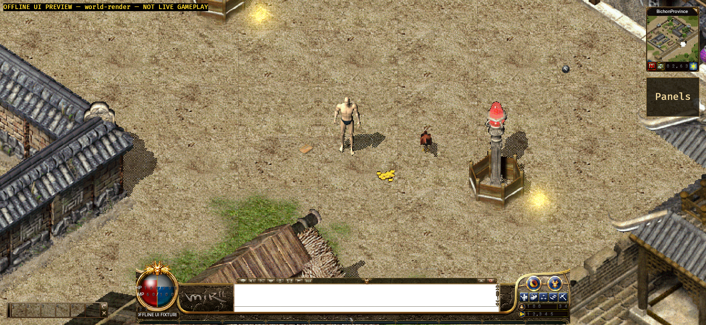

# Native Android ground-drop evidence (2026-09-11)

## Version and scope

- Branch: `codex/android-player-journey`.
- Implementation commit:
  `1ed32d776165f61660f7b4b9ed13c9c652e33efc`.
- Complete authoritative `groundDrops` snapshots and live `ObjectItem` /
  `ObjectGold` packets now populate one bounded Android model/render cache.
- Items retain the server image index. Gold quantities select the Crystal
  `DNItems` 112-116 bands. `ObjectRemove` clears the corresponding model and
  render entry, and actor/drop object IDs cannot coexist.
- Live packets can select only a numeric frame from the prevalidated metadata;
  they cannot supply asset paths. Missing/empty frames remain explicit and a
  complete render load reports them unresolved.

## Immutable assets

- Gradle stages the repository-tracked `original-ui/DNItems` export in every
  variant and fails unless all 5,280 PNGs plus `meta.json` are present.
- `meta.json`: 2,429,754 bytes, SHA-256
  `7933247685480bd1b457c9523dc12f391122c0eebdc9fe20648696d7bb41d503`.
- The build artifact was inspected and contains all 5,280 numeric
  `assets/original-ui/DNItems/*.png` entries plus the metadata.

## Verification

- Android Rust suite: 120 passed, 0 failed.
- Configured real shared-entity-atlas test: 1 passed, 0 failed.
- Java MockWebServer/TLS suite: 11 passed, 0 failed.
- API 31 `aarch64-linux-android` target check: passed with Rust 1.95.0 and NDK
  26.1.10909125.
- Normal debug APK package, streamed install and cold launch: passed. The
  Activity reported `LaunchState: COLD`, resumed in fullscreen, loaded
  `libmir2_platform_android.so`, and produced no fatal exception, Rust panic,
  ANR, native-link error or OOM in the checked log.
- Normal APK path (ignored local output):
  `apps/game-client/platform-android/android/app/build/outputs/apk/debug/app-debug.apk`.
- Normal APK: 330,700,993 bytes, SHA-256
  `8f100a8ca74a418285a818e3b47fabca683c9fd57054c1fbbddbc8c135a5b5fe`.
- Offline UI Preview APK: 375,106,233 bytes, SHA-256
  `07186139bc0c208d0f874fb59661353fd76ecc711fc2b66d56ee83d511466a68`.

## Emulator-visible result

- Target: `emulator-5554`, Android API 31, `arm64-v8a`, model
  `sdk_gphone64_arm64`.
- Build fingerprint:
  `google/sdk_gphone64_arm64/emulator64_arm64:12/SE1A.220630.001/8789670:userdebug/dev-keys`.
- The explicitly labelled offline `world-render` scene reported 849 map draws,
  four objects, four entity layers and zero unresolved map/entity entries.
- The screenshot visibly contains the player, monster, red ground item and gold
  pile: `world-render.png`, SHA-256
  `e8467079d14d3ff10b8d081aaf4bbb826e306a1dce976f24ed221c7534276fcc`.

## Acceptance boundary

- `world-render` is compile-time isolated and labelled `NOT LIVE GAMEPLAY`; its
  network entrypoints are disabled. It proves packaged rendering on the
  emulator, not server drop delivery or pickup.
- The normal APK was built without an approved Gateway URL/test account. This
  run does not prove real login, StartGame, live item/gold packets, pickup or
  reconnect/state restoration.
- Ground-drop name labels, pickup interaction acceptance, effects and broader
  object-family coverage remain open.
- No physical Android device was attached. Touch, IME, background/network,
  thermal and extended player-journey acceptance remain a device gate.
- APKs, generated world/UI packs, caches, credentials and signing material were
  not committed. The tracked evidence contains only this README and screenshot.
