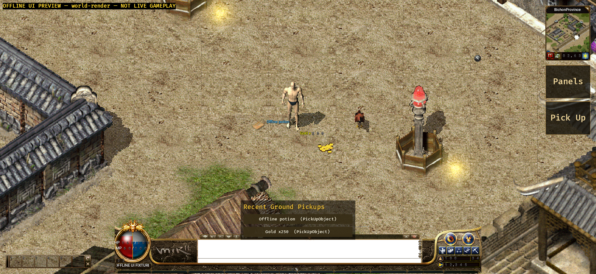

# Native Android ground-label evidence (2026-09-11)

## Version and scope

- Branch: `codex/android-player-journey`.
- Implementation commit: `1d2e2abc5`.
- The Android host projects the same validated authoritative `groundDrops` used
  by its object renderer and pickup UI into a bounded world-label model.
- Labels retain exact object ID, position, quantity and `nameColourArgb`. They
  are placed on the native 1024 x 768 stage with the Crystal 48 x 32 tile
  anchor, centered 80px no-wrap line and four-pixel black outline.
- The shared `DropView` setting controls visibility. Every label node uses
  `FocusPolicy::Pass`, so this presentation layer cannot intercept world/HUD
  input or decide pickup eligibility.
- Complete snapshots replace the model atomically. Accepted live object/remove
  packets rebuild it around the retained authoritative viewport center; scene,
  disconnect and rejection boundaries clear it.

## Verification

- Android Rust suite: 128 passed, 0 failed.
- Java MockWebServer/TLS suite: 11 passed, 0 failed.
- API 31 `aarch64-linux-android` target check: passed with Rust 1.95.0 and NDK
  26.1.10909125.
- Unit coverage validates signed ARGB conversion, quantity text, Crystal anchor
  geometry, duplicate cross-kind identity rejection, stable revisions,
  `DropView` hiding and pass-through focus policy.
- Normal debug APK package gate passed:
  `apps/game-client/platform-android/android/app/build/outputs/apk/debug/app-debug.apk`,
  330,795,033 bytes, SHA-256
  `abb53cd26a0ae223e15adcb1f2dfce47af43213cac8a1eb67bf76f26698dba98`.
- Offline UI Preview APK package and streamed install passed:
  `apps/game-client/platform-android/android/app/build/outputs/apk/uiPreview/app-uiPreview.apk`,
  375,173,545 bytes, SHA-256
  `2aecb697b7095217151ddd5d14ce4f34732337c5ba0e96a306f3a36f159e53d4`.

## Emulator-visible result

- Target: `emulator-5554`, Android 12 / API 31, `arm64-v8a`, model
  `sdk_gphone64_arm64`, 2340 x 1080 landscape at 440 dpi.
- Build fingerprint:
  `google/sdk_gphone64_arm64/emulator64_arm64:12/SE1A.220630.001/8789670:userdebug/dev-keys`.
- The explicitly labelled offline `world-render` scene reported 849 map draws,
  four objects and four entity layers. A cyan `Offline potion` label and yellow
  `Gold x250` label are visibly centered above their corresponding ground
  sprites, together with the shared pickup list and Android action rail.
- After labels were present, tapping `Pick Up` still produced
  `ANDROID_UI_PREVIEW_INTENT pickUp object_id=9101 (queued only, no server)`.
- Screenshot SHA-256:
  `8fd66d54c5845d5840021a8b6006c5dbd32f29c52a9cbb77640af0dee4bddf4c`.

## Acceptance boundary

- `world-render` is compile-time isolated and labelled `NOT LIVE GAMEPLAY`; its
  network entrypoints are disabled. It proves packaged rendering, label layout
  and coexistence with touch UI on this emulator, not live server delivery.
- The normal APK was built without an approved Gateway URL or test account.
  This run does not prove real login, StartGame, live pickup or reconnect/state
  restoration.
- No physical Android device was attached. Device touch/IME/background/network,
  performance, thermal, soak and the full player journey remain unaccepted.
- APKs, generated asset packs, caches, credentials and signing material were not
  committed. The tracked evidence contains only this README and screenshot.
