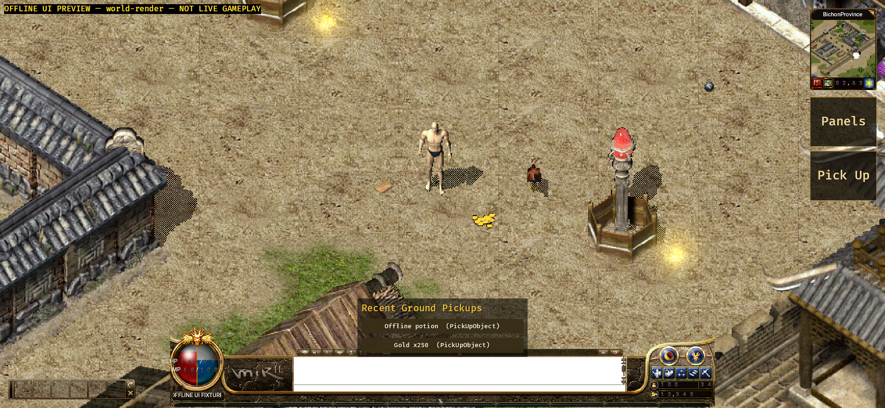

# Native Android ground-pickup UI evidence (2026-09-11)

## Version and scope

- Branch: `codex/android-player-journey`.
- Implementation commit: `8b39367ae`.
- Complete authoritative snapshots and accepted live object packets now project
  `groundDrops` into the existing shared `GroundPickupModel`.
- The adapter validates one authoritative self player, object identity,
  coordinates, labels, quantities and source names. It exposes at most four
  drops, ordered by Chebyshev distance and object ID.
- Both the shared pickup panel and the Android `Pick Up` rail action create the
  existing `QuestUiIntent::PickUpObject`. The Android host then writes the exact
  ID as the shared `GatewayCommand::PickUp` wire shape.
- The local model is never removed on touch or queueing. Server packets and
  replacement snapshots remain authoritative for success and removal.

## Verification

- Android Rust suite: 124 passed, 0 failed.
- Java MockWebServer/TLS suite: 11 passed, 0 failed.
- API 31 `aarch64-linux-android` target check: passed with Rust 1.95.0 and NDK
  26.1.10909125.
- Unit coverage verifies `{"type":"pickUp","objectId":44}` reaches the
  bounded authenticated Android Gateway queue and the shared pickup model still
  retains object 44.
- Normal debug APK package gate passed:
  `apps/game-client/platform-android/android/app/build/outputs/apk/debug/app-debug.apk`,
  330,757,393 bytes, SHA-256
  `6b001f4eb6efae0a90d3e4b7e1db55b2d8f1c65bfe85720ff009b58426991036`.
- Offline UI Preview APK package and streamed install passed:
  `apps/game-client/platform-android/android/app/build/outputs/apk/uiPreview/app-uiPreview.apk`,
  375,143,273 bytes, SHA-256
  `97360c76c9b596e32f57544056e2d03b113a9800e9347366178c1bb1b988ffca`.

## Emulator-visible result

- Target: `emulator-5554`, Android 12 / API 31, `arm64-v8a`, model
  `sdk_gphone64_arm64`, 2340 x 1080 landscape at 440 dpi.
- Build fingerprint:
  `google/sdk_gphone64_arm64/emulator64_arm64:12/SE1A.220630.001/8789670:userdebug/dev-keys`.
- The explicitly labelled offline `world-render` scene reported 849 map draws,
  four objects and four entity layers. It visibly shows the player, monster,
  item, gold, shared `Recent Ground Pickups` panel and Android `Pick Up` action.
- Tapping the 48-logical-pixel mobile action produced:
  `ANDROID_UI_PREVIEW_INTENT pickUp object_id=9101 (queued only, no server)`.
  The panel and world item remain visible after the tap, proving the preview did
  not fabricate a successful pickup.
- Screenshot SHA-256:
  `c610badadfe6e7f5e67c1451a29996457f490f17d69c0ca6766c8a2f501e8091`.

## Acceptance boundary

- `world-render` is compile-time isolated and labelled `NOT LIVE GAMEPLAY`; its
  network entrypoints are disabled. This proves packaged rendering, touch hit
  routing and intent identity on the emulator, not a server-confirmed pickup.
- The normal APK was built without an approved Gateway URL or test account. This
  run does not prove real login, StartGame, live drops, reconnect or state
  restoration.
- The shared pickup panel carries item names and quantities, but exact
  colour-coded labels positioned over each in-world drop remain open.
- No physical Android device was attached. Touch/IME/background/network,
  performance, thermal, soak and player-journey acceptance remain a device gate.
- APKs, generated asset packs, caches, credentials and signing material were not
  committed. The tracked evidence contains only this README and screenshot.
