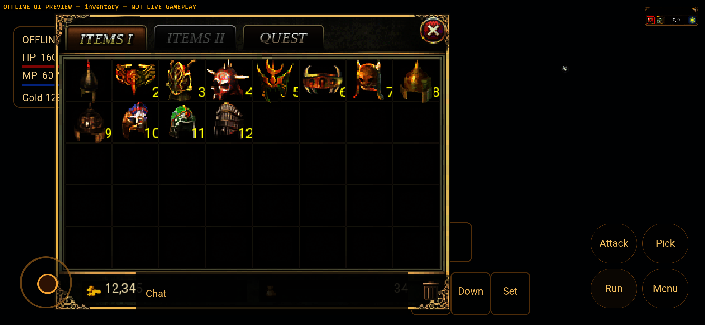
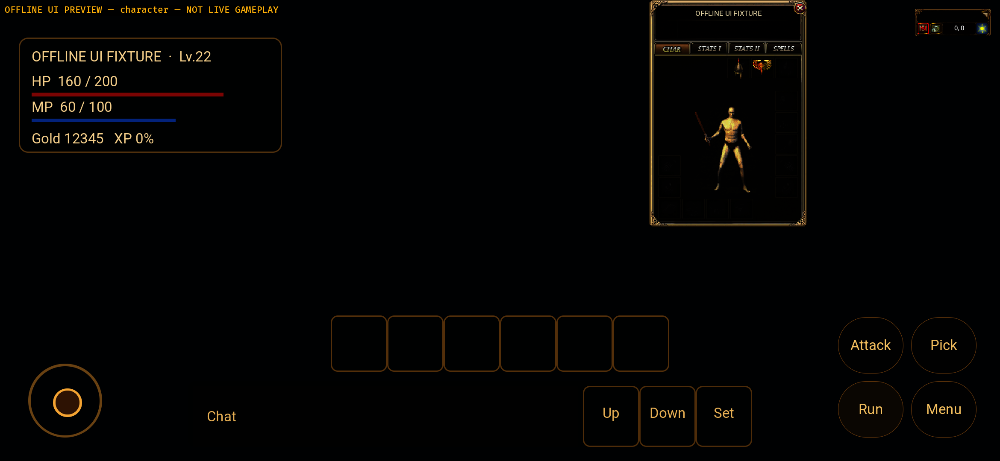

# Android original item geometry — 2026-10-01

Bounded NI-05 source/resource checkpoint after inventory ingress source
`3441c20cd425931efd3d15acc79b778c531bd0c7`. Goal remains Active. No new APK or
actual inventory/equipment image acceptance at this source checkpoint; v9
packages do not contain either new inventory adapter or this geometry seam.

## Bounded implementation

- Android reads only `original-ui/Items/meta.json` and
  `original-ui/StateItem/meta.json` from the APK AssetManager, reusing the existing
  bounded reader. No filesystem path from Windows, server-supplied resource path,
  image ownership/name inference, balance or gameplay mutation.
- Each file is limited to2MiB, schema version3/library extent1..65536, nonempty
  exported frame list bounded by extent, unique u16 indices, exact indexed PNG
  paths, bitmap dimensions0..2048 and integer offsets within±8192. Sparse Items
  catalogue exports are not forced dense. Zero-size frames remain valid source
  entries but supply no geometry, matching Windows.
- Items supplies full-bitmap width/height and ignores library x/y; shared cell
  layout still measures alpha from the original PNG. StateItem retains the
  source width/height/x/y used by equipment rendering. Missing individual source
  frames return None, not guessed offsets. Invalid/missing libraries return an
  error through the existing personal-snapshot disconnect/DataReset path.
- Immutable geometry is cached process-wide, independent of account/character.
  `ANDROID_ITEM_GEOMETRY_READY` records source hashes and drawable counts, not
  credentials or live item custody. Per-character inventory lifetime is unchanged.
- Gradle now validates both metadata files before packaging and stages exactly
  those two alongside existing approved PNGs. Its minimum export coverage is
  Items1003 / StateItem5192. No licensed source metadata/images are added to Git.
- Preview-only fixtures use AndroidInventoryIngress and the real native model
  entry with fourteen explicit **offline** objects. Equipment frame30 is an
  explicit source-index specimen, not an item inferred from a name or an owned
  player item. Storage fixtures remain local; no catalog/online service acceptance.
- Diagnostic version10 is `0.1.7-inventory-ingress`; exact source/APK binding and
  runtime image proof follow a clean commit/build, not this version setting alone.

## Source identity / staging proof

| Metadata | Bytes | SHA-256 | Exported /drawable frames |
| --- | --- | --- | --- |
| Items | 459663 | `ec0eca414ac6c34e17a218f0ed4396f30607c2485482f8760af7706acddcedfe` | 1003 /1003 |
| StateItem | 1489898 | `7d812a76e9a54b1d0535968a8c21ee2064577e7012572daf79b242221ca72e9a` | 5192 /2380 |

`metadata-staged.json` compares the actual Sync output byte-for-byte with the
previously approved v9 diagnostic source pack. The pack is unmodified. These
are staging identities, not a claim of full current item-catalog/world coverage
or resource-publication alignment. Other UI/world/entity proof inputs stay as-is.

## Checks and failure retention

- Android full244/244; ui-preview255/255, zero failures/ignores. Seven geometry
  parser/hash tests plus typed inventory geometry and preview ingress regressions.
- Both real arm64/API31 target checks pass, with the preview **ui-preview feature
  explicitly enabled**. No desktop/server code changed in this leaf; previous
  shared1203+8ignored and Mac desktop6pass/2resource failures are historical,
  not freshly rerun or superseded.
- Fresh Gradle `--rerun-tasks` Java Debug33/33 and uiPreview33/33 pass;
  `java-fresh-final.log`, XML suites and totals distinguish this from the earlier
  `java-stage.log` cached run.
- Thirteen real Gradle controls pass: complete approved source accepted; missing
  metadata, duplicate index, wrong path, negative size, noninteger offset and
  missing PNG rejected independently for both libraries. Failure must be this
  guard, not an environment/toolchain error. The combined source metadata/image
  byte digest before/after is unchanged:
  `535428fc03d0a32bf3798bfcd21dfda292bf6021c3a4e170ec6c5dd0043c0d26`.
- Seven previous magic-icon controls rerun and pass. Test scripts write only
  retained isolated target fixtures. Gradle is offline; wrapper traffic was not
  observed, so no whole-network absence claim.
- `gradle-before.log` retains the failure-first reproduction: missing Items
  metadata was accepted by the old guard (actual BUILD SUCCESSFUL, assertion
  fails). `gradle-after.log` records the corrected13/13 controls.
- `android-target-before.log` retains E0277: sha2.11 digest Array lacks LowerHex.
  Explicit byte hex formatting fixes it, with a standard abc digest regression;
  the final API31 target run compiles the actual Android-only loader.
- Checking `MIR2_ANDROID_VARIANT=uiPreview` originally ignored its feature in the
  build script check branch. `android-preview-target-final.log` is therefore
  **another normal check**, not preview evidence. The script now uses the same
  feature flag as packaging; `android-preview-target-feature.log` is the corrected
  real preview check, and `android-debug-target-feature.log` verifies normal.
- Earlier243/254 full runs remain separate from final244/255, before the digest
  regression. Preserve raw log whitespace separately from source diff gates.
- Independent read-only review of parser, Gradle/script, preview adapter and
  corrected feature check reports no remaining bounded P0/P1/P2. Reviewer did
  not build/test/operate a device; package/runtime acceptance remains separate.

## Remaining leaves

Exact-source v10 packages, actual AssetManager/hash marker, shared BAG/equipment
image and phone input/size proof are pending. Original-source geometry does not
complete all item surfaces, custody, ACK/outbound/use/buy/repair, complete resources,
real JNI/WSS/ordinary player flow, performance, physical-device or human acceptance.
No live environment, real saves, Windows push, production deployment or successful
remote push occurred. Original workspaces are preserved.

## Exact v10 packages and actual emulator checkpoint

The following **later** checkpoint builds both variants serially from clean
`452398d4ca0aca3f426acff125b78994614365f5`, with unchanged HEAD and empty Git
status before/after; no source edits between packages. v10 /0.1.7-inventory-ingress,
arm64-v8a /min31 /target35. Rust release profile inside Gradle Debug diagnostics,
not signed store releases. Actual generated BuildConfig has empty Gateway URL
for both and UI_PREVIEW=true only for the isolated preview. No remote Web page.

| Local diagnostic APK under platform-android | Bytes | SHA-256 |
| --- | --- | --- |
| `target/inventory-v10-20261001/final-apks/mir2-native-inventory-debug-v10.apk` | 386091014 | `5e51e2d26e2a28d491bef21f3455074467ba57a216ed2007f81a1a3f6acfc0b2` |
| `target/inventory-v10-20261001/final-apks/mir2-native-inventory-preview-v10.apk` | 389933242 | `0aaea08a5212eb39088fbe600001640a0233c3551e5750bb2c86617931af43c7` |

Each actual APK contains both byte-identical metadata files,1003 Items PNGs and
5192 StateItem PNGs. All6195 declared original frames are individually compared
byte-for-byte with the approved diagnostic pack, including zero-size source
entries. `package-v10.json`, badging/build configuration and source/status files
bind this to the exact packages, not a claim based solely on Gradle staging.
Magic/world/entity input packs are unchanged from the v9 diagnostic proof;
this is not full resource-release alignment or item-catalog completeness.

Both `adb install -r` operations succeed, retaining app data. Only emulator-5554
is connected: Android12/API31, sdk_gphone64_arm64,2340×1080 landscape,density440;
fingerprint/device files are retained. No physical phone. Actual observed scenes:

- Normal PID4894 shows the empty shared login and **Test server not configured**.
  Its start wait is still **timeout**,12721ms; a later visible frame is not an
  acceptable cold-start/latency result. The form also remains small on the phone.
- Offline BAG PID4973 starts with status ok,9393ms wait. Actual AssetManager log
  reports drawable Items1003/StateItem2380 and both exact metadata SHA-256 values.
  The same typed adapter queues owner42/bag12/equipment2; original item images,
  source counts and12345 offline gold are visible. This is not live owned inventory.
- Offline CHAR PID5037 starts with status ok,8656ms wait. Both metadata identities
  and typed adapter marker are present. The original frame30 sword is visibly
  placed with the body. The fixture deliberately has no armour state image;
  its nude body is not a claim of full equipment appearance/animation coverage.
- Captured PID-scoped logs for all three contain zero ERROR/FATAL/panic/fatal-signal
  lines. This is a bounded capture result, not a soak, global crash or GPU gate.
  Both diagnostic apps are force-stopped afterward; no data clear/AVD wipe.

### Phone layout is not accepted

The source/resource/presence leaf passes, but the screenshots retain concrete
G4 failures. The enlarged BAG covers part of status/chat and overlaps the left
joystick; CHAR/SPELLS still use a small desktop stage-scaled window. The ordinary
login form is also small. Merely making one inventory window large does not
establish usable common phone layouts, thumb separation, minimum cell/tab targets,
keyboard or multi-touch. No touch operation or transaction ACK is claimed here.

Next repair the Android phone panel layout/presentation seams (including shared
marker exposure where needed), with no copied gameplay rules, then reverify input
and exact-source artifacts. NI-10/11/other services, full acceptance denominator,
real authentication/online authoritative state, performance, device and human
acceptance remain in the active goal. This checkpoint was saved locally; it is
not a successful remote push or PR update.

