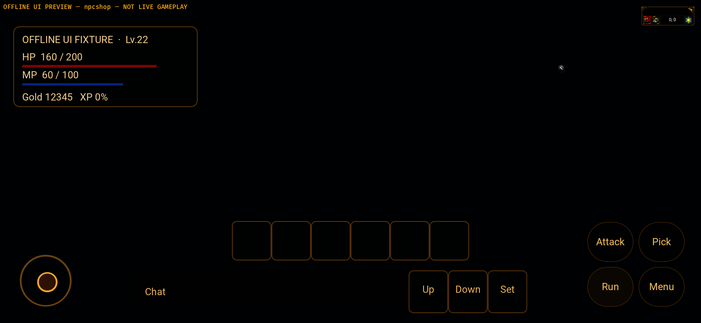
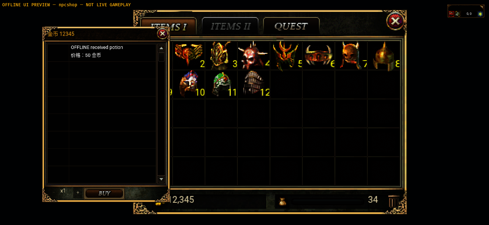
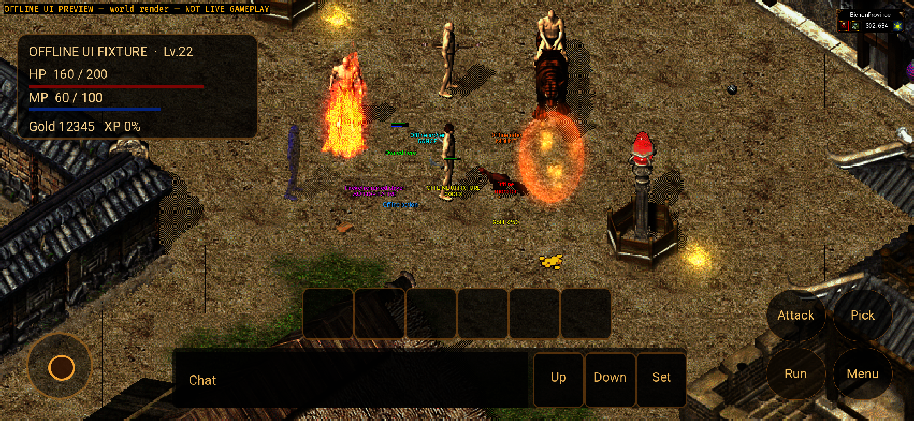

# Native Android refreshed package / NPC consumer — 2026-10-02

Status: **bounded package and offline window-opening checkpoint only**.
The complete Windows-alignment goal is Active. Full phone UI, NPC transactions,
authenticated gameplay, shared-Zone persistence, stable rendering and physical
device acceptance remain OPEN. The error-free runtime gate explicitly FAILS.

## Exact sources, packages and preservation

Frozen Windows gameplay denominator remains
`3d735745f1117d42a7859e87604a106351dca935`, normally merged at
`04ae04fc82badb8dd1a15d5dade108ade0fe586b`. The refreshed Android host includes
the separately tested NPC implementation
`4e35d3a34041f47370ba7f1338d4b5e0f8d7c0f8`; its twelve-body equivalence and
shared/Windows regression boundaries remain in the
[preceding source checkpoint](../native-android-npc-ingress-20261002/README.md).
No current Android package is rebound to an earlier Windows denominator.

Two clean immutable sources were actually packaged and installed:

| Version | Source | Actual result |
| --- | --- | --- |
| v17 / 0.1.14-npc-ingress | `9458ae4a1e11fbfe409f08c1af014fd0703ebff4` | Adapter queued catalogue/service, but original Buy screenshot had no NPC window; FAIL retained |
| v18 / 0.1.15-npc-consumer | `aa1f2c4ada37ed880b71da5168d0b080583524a3` | Four actual shared service windows open; image/picking/GL failures remain |

Both are Rust **release** cdylibs inside Gradle **Debug diagnostic** variants,
arm64-v8a, minimum API31 / target35, Bevy/GameActivity, not WebView and not store
Release or signing acceptance. Both Gateway URLs are empty. No credentials,
live account, production realm, human save, authentication bypass or fabricated
transaction receipt was used.

Latest local APKs are ignored build artifacts, not committed:

- Debug:
  `mir2-web3/apps/game-client/platform-android/target/npc-preview-v18-20261002/final-apks/mir2-native-npc-consumer-debug-v18.apk`
  — 386,456,573 bytes;
  SHA-256 `adabc1838ffe1b9d79318e4ac2fcbf308c5dccc9c626ce4b484edf5878f9610e`.
- Preview:
  `mir2-web3/apps/game-client/platform-android/target/npc-preview-v18-20261002/final-apks/mir2-native-npc-consumer-preview-v18.apk`
  — 390,259,221 bytes;
  SHA-256 `4ba5ff55c101cc060268565065a1a33411d6b9b4587d2982bd4e313ef0e124a2`.

The v17 APKs remain in their separate ignored `npc-preview-v17-20261002`
directory; their [package report](v17/package-v17.json) retains the original
source, sizes and hashes. Nothing was wiped, reset, stashed, force-pushed,
deployed, merged or uploaded as APK/assets/keys. The original main dirty
checkout and original Android checkout were read-only verified unchanged.
The same Mir2_API_31_ARM64 emulator process22274 and all userdata are retained;
only the two task apps were stopped after capture. ADB inventory has an emulator,
not a physical phone.

## Implementation and failure-first sequence

The four feature-isolated NPC previews no longer hand-fill ShopModel or force
UiPanel::NpcShop. They validate the synthetic owner/scene via the production
AndroidPlayerIngress/AndroidNpcIngress, then enqueue typed Catalogue→Service
messages for the real shared runtime consumer. Sell/Repair/SRepair emit only
their corresponding service signal, not a fake Buy catalogue. Synthetic accepted
begin is explicitly marked OFFLINE and does not dispatch an authenticated
Gateway command or claim an ACK. Buy's exact u64 identity9007199254740993 is
preserved; all screenshots carry OFFLINE / NOT LIVE GAMEPLAY watermarks.

Actual v17 installation revealed the missing window that conversion-only tests
did not cover. Its legacy fixture replaced BigMapModel after the accepted
request, introducing a map epoch change; the production shared lifecycle then
correctly discarded the service as stale. A compiled red whole-map regression
reproduced0 pass /1 fail. NPC-only preview now retains the entire existing map;
no shared/Windows/server rule was changed. V18 actual consumer and four original
frames verify the bounded opening correction.

Read-only review additionally caught a possible warm same-mode old-window
receipt: the observer was armed at frame0, while the new fixture queues at
frame3. A compiled apply/report red test reproduced0 pass /1 fail. Frame0 now
disarms the observer; only frame3, after old panel closure and new enqueue,
arms it. The log observes actual shared UI state, **not** a GPU frame or server
receipt. Unit observer tests explicitly do not simulate full runtime acceptance.
Final bounded read-only review found no remaining P0/P1/P2 in those two Android
source files; the reviewer did not execute Cargo, builds or ADB, and did not
sign off the full goal. The invalid-field initial test compile error and the
first auditor's wrong lock-file path are retained separately, not counted as
player passes.

## Actual gates

| Gate | Result | Boundary |
| --- | --- | --- |
| v18 complete Android Rust | 290 normal /309 preview;0 failures/ignores | Serial source regression; five added preview tests, not gameplay percentage |
| Fresh Java | 39+39;0 fail/error/skip,42 tasks actually executed | Local synthetic TLS/MockWebServer; XML retained |
| Actual arm64 API31 | Both target checks and both packages pass | Clean source before/after; correct variants and original assets |
| Selected resource bytes | Each APK6647 PNGs +3 metadata match approved input; four weight frames match frozen Git | Sparse Items1003,StateItem5192,MagIcon224,MagIcon2 224,UI_32bit4; not complete resource release |
| NPC Buy/Sell/Repair/SRepair | Four real consumer-state logs and four visible original windows | Offline only; no purchase/repair result, wallet/custody or real NPC dialogue |
| Native scene specimen | Map849 tiles,8 entities,13 layers, original full-screen frame visible | Synthetic scene, not real login/StartGame or render-ready online switching |
| Chat/IME smoke | Two synthetic received rows visible; Back then actual1000,978 tap gives IME true→false→true | No text entry/draft retention rerun, no Send/echo or extreme-screen acceptance |
| Error-free logs | **FAIL** | Normal11 GL506; Buy6 GL506 +1 missing image; Sell10; SpecialRepair18. Repair/world/chat captures0; old failures remain |
| SpecialRepair close touch | **Unresolved / FAIL observation** | One actual1278,158 red-X tap leaves window visible; target calibration/picking cause unverified |
| Real online / physical device | **OPEN** | No approved environment/account or phone was supplied |

The forty-five GL line entries are from seven **distinct startup PIDs**.
The post-close log repeats the same18 startup entries, not18 additional errors.
Unique full lines and all raw entries are separately recorded. Multiple NPC and
normal startup failures occurred without showSoftInput: initial IME timing is
not an established cause. No GPU/backend/runtime change was attempted here, and
no stable-rendering pass follows from the error-free individual samples.

Buy's synthetic `icon:658` references no exported Items658 frame; original
pack metadata and APK lack it. Label/price display, but image is absent and the
real asset loader logs `Path not found`. This is an explicit defective preview
reference, not proof that real NPC goods render completely. Existing service
windows still use shared art/layout; phone hit targets, drag, overlap and every
screen size have not been signed off. Do not fill those gaps with fake goods,
silent placeholder images or suppressed errors.

## Evidence and next leaf

[source-v18.json](v18/source-v18.json) binds24 exact source files and test inputs.
[package-v18.json](v18/package-v18.json) binds the clean source and APK/resources.
[runtime-v18.json](runtime-v18.json) records original-frame observations, actual
state/logs and false acceptance fields. [curation-integrity.json](curation-integrity.json)
hashes168 raw proof files, including the separate runtime-audit log. APKs and unpacked/source asset
directories are excluded. Original failed logs and screenshots are not rewritten.

A separate Git-blob audit first found that commit `648b05d6f` had normalized
the two SDK `device-avd.txt` files from23 to21 bytes, despite the working copies
matching the raw manifest. Exact-path `-text` attributes now preserve their
original CRLF bytes; neither the captured files nor their manifest hashes are
normalized. The [Git integrity check](git-integrity.mjs) compares all168 working
files and committed blobs to those original hashes. Run it from the repository
root after committing; historical commit `648b05d6f` intentionally fails for
those two Git blobs. This correction changes evidence storage only, not either
APK, source binding, runtime failure or acceptance result.

The [runtime auditor](runtime-audit.mjs) intentionally exits nonzero for the
retained real error-free-log failure; this is not an auditor setup failure.
Package/source auditors need the exact source checkout and original ignored
build/resource inputs. Do not rerun an older source test against newer files
and relabel the result. Re-curation requires the original two raw directories
and preserves bytes, not claims.

Next safe work is valid server-shaped NPC item/image inputs and actual mobile
close/picking, with failure-first tests and new package/frame evidence, plus
bounded GL framebuffer investigation. Continue NI-10 full quest/dialog ingress
and the entire frozen Windows denominator afterward. NI-11 transaction receipts,
NI-19 downstream loss/reset, audio/resources/resume and all other open matrix
rows stay open. Real HTTPS/WSS, shared-Zone saves and phone/human gates need the
separately requested approved environment and device; never use production,
existing human stores or raw account_id fallback.

## Original frames

Failed v17 received-path preview:

V18 shared Buy window (missing item image remains visible):

V18 native scene specimen, not online gameplay:

