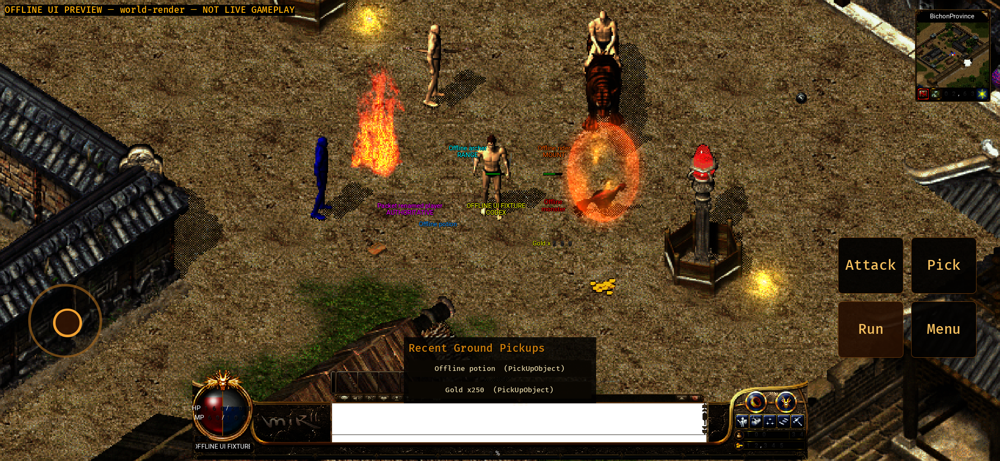

# Native Android authoritative poison tint — 2026-09-13

## Scope

This bounded slice carries the Gateway's existing `ObjectPoisoned` packet from
the post-`IN_GAME` Android host through the authoritative entity cache into the
retained shared Bevy actor sprites.

- The packet requires an existing non-zero object ID and an unsigned 16-bit
  poison bitfield. Unknown or removed objects are ignored; malformed values are
  rejected.
- Initial `ObjectPlayer` / `ObjectHero` / `ObjectMonster` / `ObjectNpc`
  snapshots retain their poison value, so first render and later packets use
  the same model field.
- Current, standing-direction and queued action layer sets all receive the same
  signed ARGB tint. A temporarily hidden actor receives the update in its
  cached model and render state, then returns with the correct tint.
- The shared runtime updates `Sprite.color` in place. It keeps the actor image,
  atlas binding, entity identity, opacity and movement pose; poison clear
  restores white without a sprite respawn.

The bit values and precedence match the pinned Crystal source at commit
`0e315fe327192afe52c3d7357ddd1f5b7e26c5b8`:
[PoisonType values](https://github.com/Suprcode/Crystal/blob/0e315fe327192afe52c3d7357ddd1f5b7e26c5b8/Shared/Enums.cs#L1009-L1024)
and
[PlayerObject DrawColour precedence](https://github.com/Suprcode/Crystal/blob/0e315fe327192afe52c3d7357ddd1f5b7e26c5b8/Client/MirObjects/PlayerObject.cs#L865-L883).
The order is DelayedExplosion orange, paralysis gray, frozen blue, blindness
medium-violet-red, stun/dazed yellow, slow purple, bleeding dark red, red,
green, then white.

The offline specimen applies Frozen (`8`) to object `9003` only after the
packaged scene is render-ready. The left-side player is visibly blue while its
packet-updated magenta name and guild remain separate overlay state.

## Deterministic verification

- Rust formatting passed for the changed Android and shared runtime files.
- Android Rust default suite: **179 passed, 0 failed**.
- Android Rust `ui-preview` suite: **187 passed, 0 failed**.
- Shared Bevy runtime suite: **235 passed, 0 failed**. Its focused regression
  proves blue tint, opacity composition, retained entity identity and white
  clear on one existing sprite.
- Gradle Debug and UI Preview unit suites: **25 passed, 0 failed** in each
  variant. The TLS fixture forwards the exact `ObjectPoisoned` JSON only after
  authoritative world entry.
- `aarch64-linux-android` API 31 target check and release `uiPreview` packaging
  passed with Rust 1.95.0 and NDK 26.1.10909125.
- Streamed installation passed on `Mir2_API_31_ARM64`: Android API 31,
  `sdk_gphone64_arm64`, `arm64-v8a`, density 440. The captured landscape frame
  is 2340x1080.
- [world-render-poison-logcat.txt](world-render-poison-logcat.txt) contains
  `ANDROID_UI_PREVIEW_READY scene=world-render`,
  `ANDROID_OBJECT_METADATA_PRESENTATION_APPLIED`,
  `ANDROID_OBJECT_POISON_PRESENTATION_APPLIED` and
  `ANDROID_WORLD_RENDER_READY` with 849 map draws, seven entities and twelve
  layers. Its 137,624 bytes have no match for `Path not found`, `PathNotFound`,
  `panicked at` or `FATAL EXCEPTION`.

Artifacts:

- Screenshot: 1,418,661 bytes; SHA-256
  `a88bc599be9f9b5d793c72403eff89429034c5dfa137d1cdfa2002be7e129592`.
- Log: 137,624 bytes; SHA-256
  `0c26cc59d422aa81f2d0b7697366a65e7c6c9545417a67817d3218bcd78f62ef`.

## APK

- Path:
  `apps/game-client/platform-android/android/app/build/outputs/apk/uiPreview/app-uiPreview.apk`
- Bytes: `444414488`
- SHA-256:
  `ec6e398d4728cccd43cf5a7818ab965892709c5016b1ecba3990c952d9d9c0d0`
- Entity override pack ID:
  `android-archer-mount-bow-proof-20260912`

The APK, source asset packs, decoded resources and build caches remain outside
Git.

## Acceptance boundary

This is packet-reducer and offline API 31 emulator rendering evidence. No
approved WSS endpoint, test account or physical Android device was available,
so it does not prove real login, online StartGame/render-ready, public
Web/Android asset-release alignment, physical-device behavior or final human
acceptance.

`ObjectLevelEffects` remains open. Crystal maps those flags to repeating
Effect/Magic3 animations, but the required approved effect resources are not
yet packaged for this proof. This slice deliberately does not substitute a
placeholder. Crystal's Slow poison also changes animation cadence; this commit
matches its visible DrawColour but does not claim that cadence behavior.
