# Native Android phone HUD and chat repair — 2026-10-01

This checkpoint repairs the phone-layout defects in the offline world-render
screenshot. It is **not** real authentication, an online player-loop receipt,
complete Bichon coverage, physical-device acceptance or whole-game completion.
The client is native Bevy/GameActivity, not Capacitor or WebView.

## Source and isolation

- APK source: 97411004114903a21963e82e2790bdafd4578962, committed and clean
  before both native builds. Later evidence/documentation commits do not change
  these build inputs.
- Android startup fix: 8ef5580e3, retaining the Schedules resource while removing
  unsupported Android GLES OIT systems. Two new regressions retain other
  schedules and ensure removed systems do not execute. The Rust debug-assertion
  build also boots and renders on the emulator; assertions were not disabled
  to hide the pre-existing panic.
- Integration branch: codex/android-shared-sync; existing Draft PR #253 remains
  separate from Windows and the original Android Draft PR #251.
- The original dirty codex/steam-main checkout remains at 31b2b3960, with the
  same status entries. Original codex/android-player-journey remains clean at
  5d417ca75. No reset, Git clean, stash, force push, PR merge or production write.

## Implemented presentation changes

- Hide the desktop bottom frame and tiny desktop status/menu controls only in
  the Android host. Show a compact name/level, HP/MP and gold/XP read-model card;
  the map keeps the full landscape viewport.
- Reflow the six **shared** belt hit targets into 48dp cells. Preserve their
  inventory actions, item/count presentation and preference state; do not create
  a second mobile item or combat implementation.
- Replace only Android's desktop chat-frame presentation with a translucent
  dark fill. Empty chat does not reserve a blank desktop history rectangle.
  Collapsed history shows at most two rows, or one on short landscape screens.
- Chat, Up, Down and Set use real touch-sized controls. Focused chat retains all
  seven source filters plus Trade/Size; settings still use the shared draft,
  apply/cancel and action queue. The Android adapter does not reflow settings
  descendants as gameplay chat controls.
- Keep actual joystick/action-pad thumb footprints clear, including the short
  landscape four-button row. Account for Android safe insets and the keyboard
  once; hide the belt and gameplay controls while a blocking editor/modal owns
  input. Status footer is omitted on short screens.
- Android's unresolved Arial family now uses the platform SystemUi family;
  explicit asset fonts are preserved. Reorder decoration before UI preparation
  and stacking, with labels above the translucent frame. This fixes black
  numbers and dark/absent control labels observed in actual captures.
- Move the joystick down consistently in visual and touch geometry; use
  translucent gold-trimmed rounded action buttons. Existing shared movement,
  attack, pickup and menu intent paths are retained.

Shared changes are limited to chat.rs presentation markers and an optional
host-owned physical pointer rectangle. Its default is None, preserving desktop
geometry and pointer behavior. Windows typography, HUD assets and game rules
are not changed. All other UI adaptations live in platform-android.

An actual intermediate APK exposed a separate packaging defect: Gradle Sync
can skip doFirst when an invalid external root yields NO-SOURCE. A separate
validateSharedUi dependency now always rejects a missing original UI manifest.
The negative missing-directory test fails as intended, and the correct licensed
input passes. The empty-scene intermediate package is not a deliverable.

## Verification

These suites overlap; their counts must not be summed into a unique denominator.
Existing ignored tests are recorded, not converted into executed passes.

| Gate | Result | Boundary |
| --- | --- | --- |
| Android host Rust | 214 passed / 0 failed | Host/layout regressions |
| Android ui-preview Rust | 222 passed / 0 failed | Includes offline fixtures |
| Shared native-player-ui | 1167 passed / 0 failed / 7 ignored | Shared UI contracts; not Windows execution |
| Shared runtime | 290 passed / 0 failed / 1 ignored | Includes two Android schedule regressions |
| Java Debug / uiPreview | 30 / 30 passed; no failures | In-memory host/network fixtures, not real HTTPS/WSS |
| Android/shared/runtime formatting and diff check | Passed | Scoped source checks |
| Missing licensed UI directory | Rejected before packaging | Negative build-input check |
| API31 native packaging and installation | Both variants passed | Build/package gate only |
| Final-source offline specimens | 34 ready markers/captures; no panic/FATAL/PathNotFound or Path not found marker | Visual smoke, not all interaction or human acceptance |
| Actual settings click | Set → Chat Box → Two → Apply | Local settings tab and shared apply path |
| Actual chat typing / first Back | Test text remains visible above IME; first Back dismisses keyboard and retains draft | No chat message submitted or delivered |
| Actual mobile menu / bag | Menu opens the phone rail; Bag opens the shared inventory | Window interaction, not item-use authority |
| Actual mail typing / first Back | Two draft lines above IME; keyboard dismissal retains magnified shared editor and draft | Local editing, not mail delivery |
| Home / foreground resume | Same PID27969 and rendered phone HUD/map restored | Offline same-process lifecycle, not reconnect/process-death recovery |
| Compact landscape | Density640 screenshot; touch/chat footprints separate | Same emulator, not a second physical device |

## APK identity

Both use versionName 0.1.2-phone-ui, versionCode 5, minSdk31 / targetSdk35,
arm64-v8a, Rust1.95.0 release profile, NDK26.1.10909125 and JDK17. Gradle
Debug/uiPreview are diagnostic variants; these are not signed store releases.
The native libraries are packaged unstripped. FPS, thermal, low-end memory and
store-distribution acceptance remain open.

Paths below are relative to the retained independent worktree. APKs, caches,
passwords and signing keys are excluded from Git.

| Package | Retained APK under mir2-web3/apps/game-client/platform-android/target/phone-ui-qa-20261001/final-apks/ | Bytes | SHA-256 |
| --- | --- | ---: | --- |
| com.mir2.web3 | mir2-native-phone-ui-debug-v5.apk | 384981074 | 4a863654a6083220bd87563b7e63b16e0d23cbe7a72b14ed330dde90493c1f85 |
| com.mir2.web3.uipreview | mir2-native-phone-ui-preview-v5.apk | 388704766 | b6f0c02195df111766bc9549c3dac693b48ae357cdc8d85726a137a83c3ccfbf |

Debug was built with an explicitly empty Gateway URL. Its actual startup shows
Test server not configured; no credentials were entered. uiPreview is a
separate network-disabled package with OFFLINE UI PREVIEW / NOT LIVE GAMEPLAY
labels. Seeded characters, map positions, effects and item counts are fixtures.
Neither package establishes authentication or server-authoritative movement.

The first release-profile uiPreview container retained space from repeated
incremental debug builds. It is kept locally as an intermediate, not delivered.
Regenerating the APK container changes its hash, not the source or native
library: both old/new library SHA-256 values are
740988f1d37bcd98a6859dae34004b45bd5dd2e129dbe3baaa384860ccb5dd19.
The delivered clean-container APK was installed and its captures refreshed.

## Device, resource and screenshot provenance

- Dedicated AVD Mir2_API_31_ARM64, emulator-5554, Android12/API31/arm64.
  Fingerprint: google/sdk_gphone64_arm64/emulator64_arm64:12/SE1A.220630.001/8789670:userdebug/dev-keys.
- Physical display 1080x2340, landscape capture 2340x1080. Density440 normal;
  density640 compact check (585x270 logical), restored to440 afterwards. No
  userdata wipe or change to the old Pixel_5 AVD. Only this emulator is attached.
- Before image: actual old v4 uiPreview APK, source8d50cb8a3, SHA-256
  8fe46d14877c855d7bff33168dae15e10f38049d7b76beb36ad896556ce922ad.
  Old APKs are retained separately; this is not a fabricated comparison image.
- Full logs, build/test outputs and final34 captures are Git-ignored under
  platform-android/target/phone-ui-qa-20261001. Password/safe-key captures remain
  protected by FLAG_SECURE; blank images do not prove confidential UI rendering.
- The design-review workflow led to actual before/after visual checks and
  iterative emulator repairs, not a browser mockup or synthetic screenshot.

Resource manifests were rehashed from the exact unchanged licensed local inputs
under platform-android/target/shared-sync-build-cache:

| Resource | Manifest SHA-256 |
| --- | --- |
| shared-ui-assets/original-ui/manifest.generated.json | 890ae5d8f0fca13246654c26c5826575887bf22faa7d44504c88d0dbd0307cca |
| local-world-20260911-objects/generated/map-atlas/manifest.json | b2ec2e3a73125e781ac8aeead31294e88e6510b1dfd62b2b00c2c2407ad609ce |
| local-world-20260911-objects/generated/native-map-keyed/manifest.json | f69e6ffa100f895d8cf337c3ecc0737a8fabfb142af93004bdd0cccea50c610b |
| entity-proof-assets-with-archer-bow-20260912/bevy-entity-atlases/manifest.json | 929d146535bde9b61c75c33af0e98852dcc3aef83320869aac9f06f4bdd530d9 |

Entity proof-pack ID android-archer-mount-bow-proof-20260912 is not approved
public Web/Android release alignment. The original white Prguse/2221.png still
has SHA-256 4a4431187a71592dbc4ea55407c06ee6e8c60cc7b53132ce324e68578f7ffbd2
in the final APK: its global/Windows asset was not recolored.

The bounded Bichon fixture remains at302,634 with849 map draws,8 entities,
13 entity layers and2 local effects. Full Bichon has7672 referenced keys and
2969 missing source frames; it is not closed by this UI repair.

## Selected actual screenshots

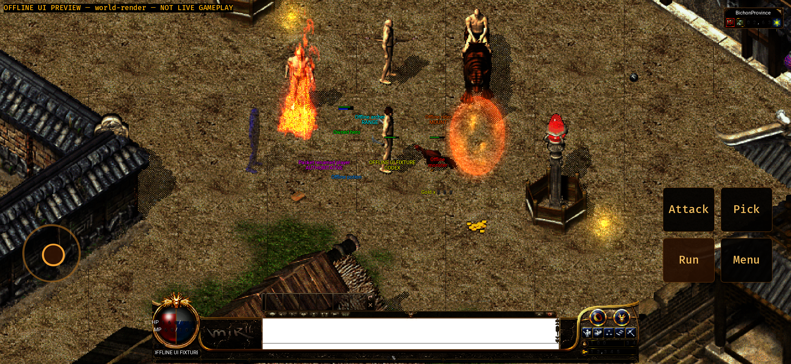
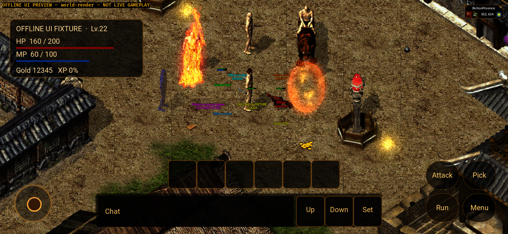
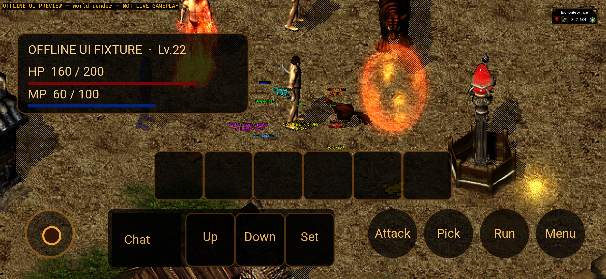
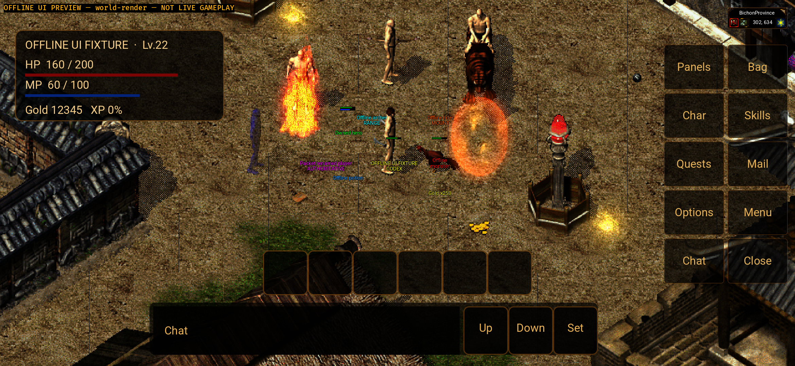
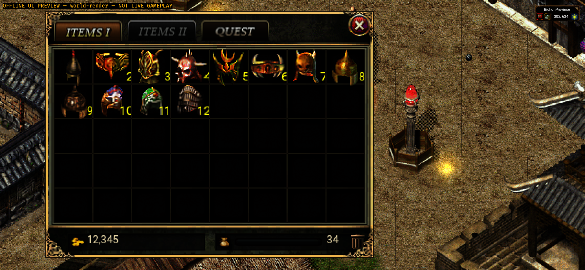
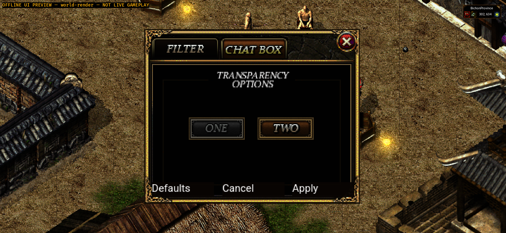
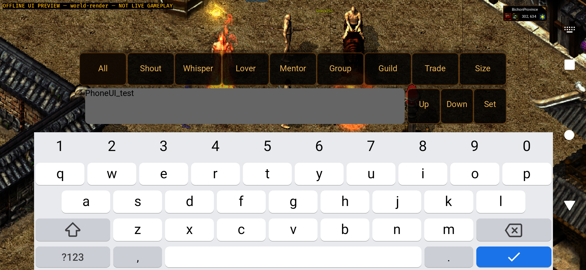
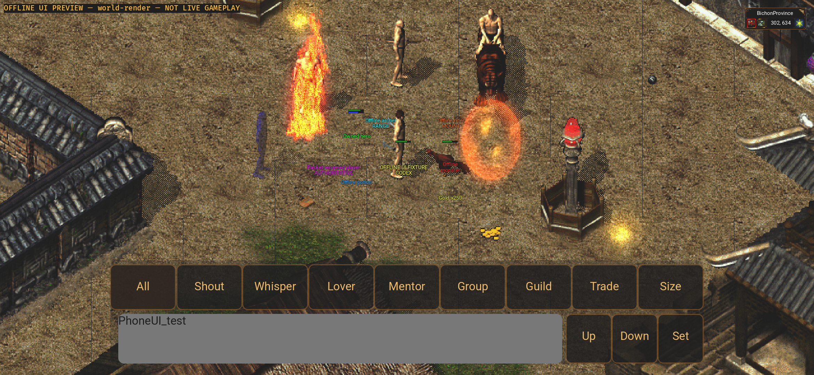
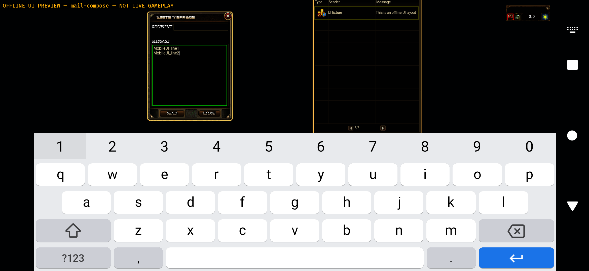
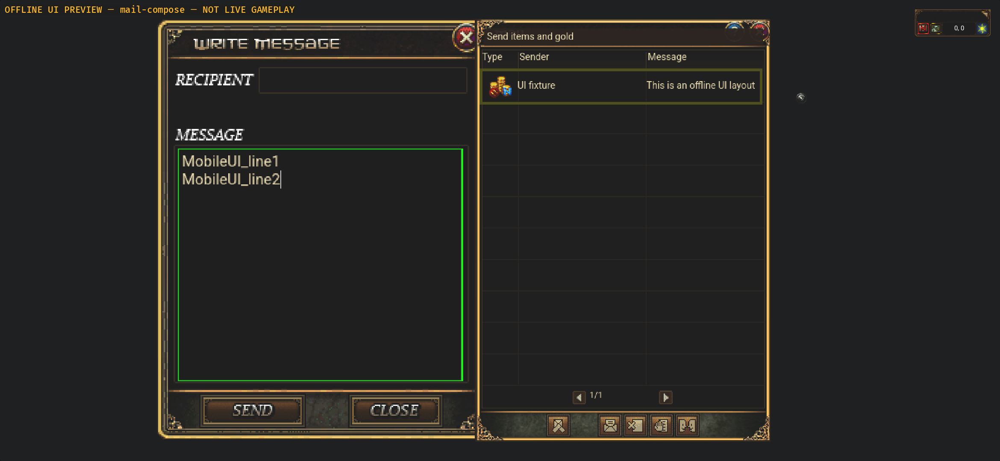
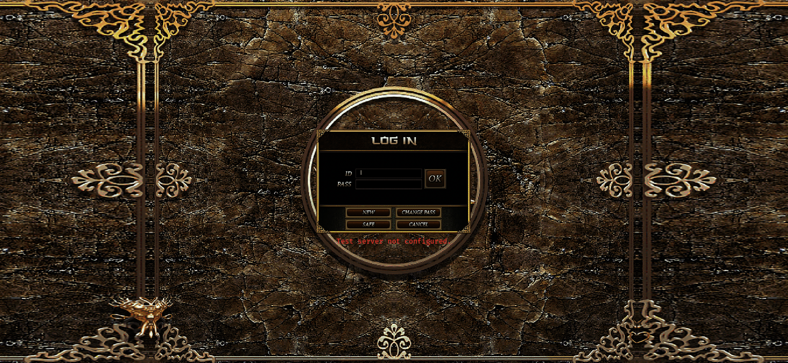

## Remaining gates

This completes the bounded HUD/chat/touch-presentation repair, not the entire
Android game. Retained shared modals still use Android focus magnification;
this is not a phone redesign of every desktop window or nine-locale acceptance.
Minimap details, every item drag/use/equip action, simultaneous multi-finger
joystick/combat, accessibility and human interaction acceptance need separate
device/online evidence.

Next stage is approved real HTTPS/WSS login → character list → StartGame →
server-owned map/position, followed by the online player loop. No account_id
impersonation, production deployment, live save mutation or copied mobile
battle/save rules. Physical touch/keyboard, lifecycle, disconnect/reconnect,
actual GPU performance and human UI acceptance remain unverified. Windows and
repository CI gates are separate and are not declared green by this checkpoint.
