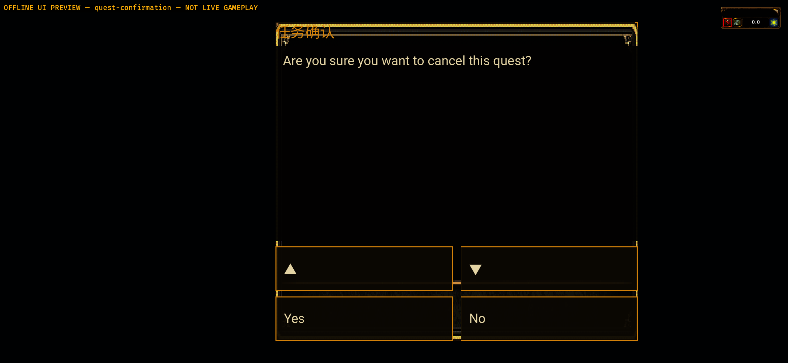
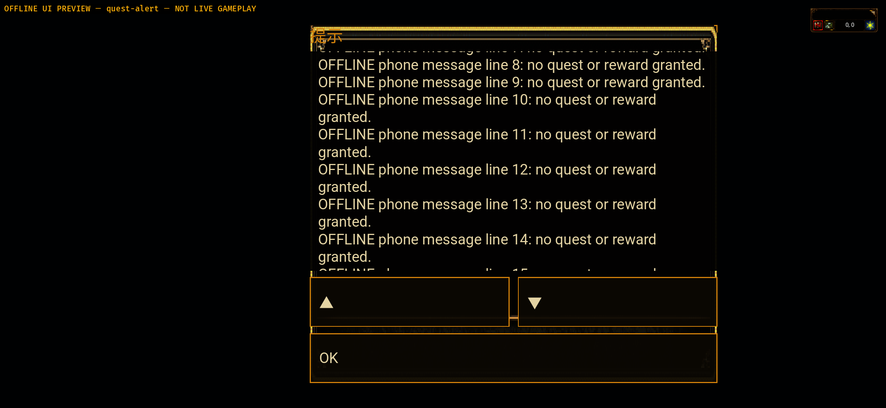

# Android v29 — shared phone quest confirmation and alert

2026-10-02. Status: **bounded offline modal UI PASS; renderer FAIL; whole goal Active**.
Exact clean APK source: `2161a940ec7a59e966ed2638667f0c7b1a8e32b6`.
Frozen Windows gameplay denominator remains
`3d735745f1117d42a7859e87604a106351dca935`; it is an ancestor of this source.
This is native Bevy/Java, not a remote WebView, and not whole Android acceptance.

## What changed

Exactly five source files: optional shared `quest_phone.rs` presentation/input,
`quest_ui.rs` renderer snapshot/modal marker, Android `phone_quests.rs` group
adapter, offline `ui_preview.rs` specimens, and Gradle diagnostic version.
The existing shared confirmation, alert state and release actions are reused.
No separate phone quest eligibility, rewards, account, combat or save rules.

Phone opt-in now supplies 14dp body/16dp heading text, at least 48dp footer/scroll
controls, a long-message scroll viewport, and retained control entities.
The snapshot includes confirmation identity and alert contents: no-op frames no
longer destroy the target between press and release. Modal actions and scrolls
cannot reach covered diary/detail controls; focus/reset/presentation/modal changes
cancel old gesture ownership. Existing NPC dialogue may coexist with this modal's
own close action without unlocking world input. A new alert clears the previous
message's offset before importing the newly rendered scroll geometry.

Without phone opt-in, desktop presentation still takes the existing shared path.
The full shared regression passed; this is not a Windows executable/human gate.

## Failure first and fresh source gates

- Initial same-module compiled regressions: 0 passed/3 failed, then 3/3 passed.
  Original red input and its SHA are retained under `raw/builds/red-source-quest_phone.rs`.
- Old-message scroll inheritance: final settled-fixture replay was 0/1 failed
  (180 versus 0), then the unchanged fixture passed in the final full shared run.
  `message-replay-red-source-quest_phone.rs` is hash-bound to its raw test command.
- Retained preparation failures are classified separately:
  reset originally expected a modal although reset clears it; an unsettled initial
  window broke an early fixture; a reverse-order patch did not apply; the audit
  helper retained one v28 version assertion. These are not product fixes or a
  successful red replay. Earlier raw attempts are not replaced.

Final exact 41-input gates are in `raw/baseline-source-3/`, not the historical
first-pass/failed second-pass folders:

| Gate | Result |
| --- | --- |
| Android normal CPU | 327 pass, 0 fail/ignored |
| Android uiPreview CPU | 351 pass, 0 fail/ignored |
| Shared native player UI | 1247 pass, 0 fail; 10 pre-existing ignored |
| Shared phone quest module, included above | 17 pass; not an additional total |
| Java fresh rerun | Debug 41 and UiPreview 41; 0 fail/skip |
| Actual arm64 API31 target | Debug and uiPreview checks pass |

## Exact packages and installation

Both are diagnostic Gradle Debug APKs with native Rust release cdylibs, not store
Release/distribution builds. Code 29/name `0.1.26-phone-quest-modal`, API31
minimum/API35 target/arm64. Gateway URL is empty; uiPreview disables transport.

Local output root remains outside Git:
`apps/game-client/platform-android/target/quest-modal-v29-20261002-odiiz2/final-apks/`.

| APK | Bytes | SHA-256 |
| --- | --- | --- |
| `mir2-native-phone-quest-modal-debug-v29.apk` | 387199809 | `c5609d50bf6b85adc066f5dd3addaf219d565e08031c75fb4969c9b8ad1dad2a` |
| `mir2-native-phone-quest-modal-preview-v29.apk` | 391032513 | `f40bc449bbf62390a443dd35bf5fe17b61e4e65451d768bcd8fb0c58c0c8e2e5` |

Build HEAD/status were clean before and after; all 41 selected source hashes match
that committed source and all six final gates. APK version/config/native loading
and the selected 6647 original PNGs plus three metadata files were checked per
variant; four UI_32bit originals also match frozen Windows Git bytes. This is
selected-asset integrity, **not a complete resource pack**.

Only `emulator-5554`, `Mir2_API_31_ARM64`, Android12/API31 was used.
2340×1080 original screen, density440. Both apps were upgraded v28→29 with
`install -r -t`; actual installed SHA/version were checked before/after capture.
No wipe/uninstall, physical device, production server, credentials or real save.

## Actual UI checks and originals

16 uncropped/unresized originals were inspected by the primary agent. Commands,
timestamps, actual PID and installed package SHA checks are preserved:

| Scene | Actual observation | Evidence |
| --- | --- | --- |
| Login, map, received diary | Fresh cold and same-PID HOME/resume baseline; no real authentication/JNI | `raw/baseline-v29/`, 6 frames |
| Confirmation manual UI specimen | Visible question/four controls; actual **No**, not Yes, removes modal; one task, diary/detail/HUD/thumbs remain after HOME/resume | `raw/ui-quest-confirmation/`, 3 frames |
| Alert manual UI specimen | Body swipe, Down, Up change visible lines; scroll position survives HOME/resume; actual OK removes modal and stays closed after another resume | `raw/ui-quest-alert/`, 7 frames |

Cold geometry uses canonical Android `I event` records only, not duplicated
RustStdout entries. The four confirmation controls and three alert controls
each measure at least 48dp high. Body/headings measure 14/16dp. The known selected
geometry and inspected frames distinguish these from covered diary/detail
controls. Only this screen size, Chinese shared labels and English test text
were inspected; nine languages/compact/IME/multi-touch are not accepted.

Black backgrounds in UI-only specimens intentionally omit world assets and are
not render-ready map acceptance. Fixtures grant no quest or reward; no actual
abandon/accept/share/reward server receipt was tested.

## Renderer remains failed and remaining work

Five distinct captured PIDs, counting only each latest cumulative canonical log:
login18223=9, world18316=0, received diary18404=8, confirmation18537=0,
alert18716=0: **17 GL0x506**. No recorded fatal/panic or additional resume error.
Cold/latest/duplicated Rust logs are not added together. These independent
captures are not a performance trend versus previous versions.

Both renderer source files remain byte-identical to published `277ab0a6566b`.
All temporary GPU probes are removed. No game GPU repair was made. The fixed
dependency/one Android path candidate is still awaiting the existing scope
question; no dependency vendor/cache patch is authorized or implemented.
The [previous GLES investigation](../native-android-gles-investigation-20261002/README.md)
and all historical failed packages/images keep their own source bindings.
That investigation records the observed Windows ref moving back to6ae080711,
33 commits behind the earlier observed56ee and32 behind frozen3d; reason
uninvestigated, API reverse file list capped at300, no denominator downgrade.

Phone NPC quest list, whole NI-11–20 ingress/actions/receipts, complete phone UI,
extreme dimensions/IME/nine languages/multi-touch, real authentication/JNI/HTTPS/
WSS/Zone/save, complete resources/audio/update, physical-device and final human
acceptance remain open. Continue safe source leaves while external materials
are absent; do not reduce the goal to preview screens or test counts.

Original main and original Android checkout HEAD/branch/status match the previous
read-only record; no write/switch/stash/reset/clean. This is not a recursive content
hash audit of their untracked directories. Independent PR253 remains Draft; no
Windows push, merge or production deployment is part of this leaf.

## Verify

`node verify-evidence.mjs` checks 259 manifest payloads on disk and in HEAD Git
blobs, historical source hashes, final gates, red-input hashes, installation,
original PNG dimensions, modal controls and canonical PID accounting.
Before publication, `--working` checks disk/historical source;
`--index` also checks staged bytes. Neither reruns a device or proves live gameplay.
QA-local `.gitattributes` keeps `raw/**` byte-exact, including Android CRLF replies.

APK/resource extracts/cache/signing keys are deliberately excluded from this
bundle. No credentials were entered or copied.
