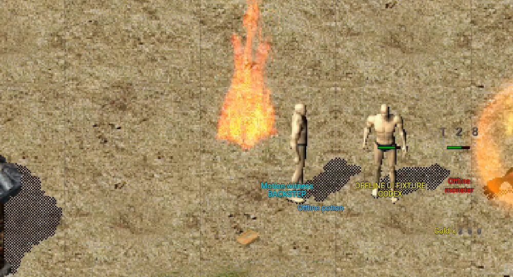
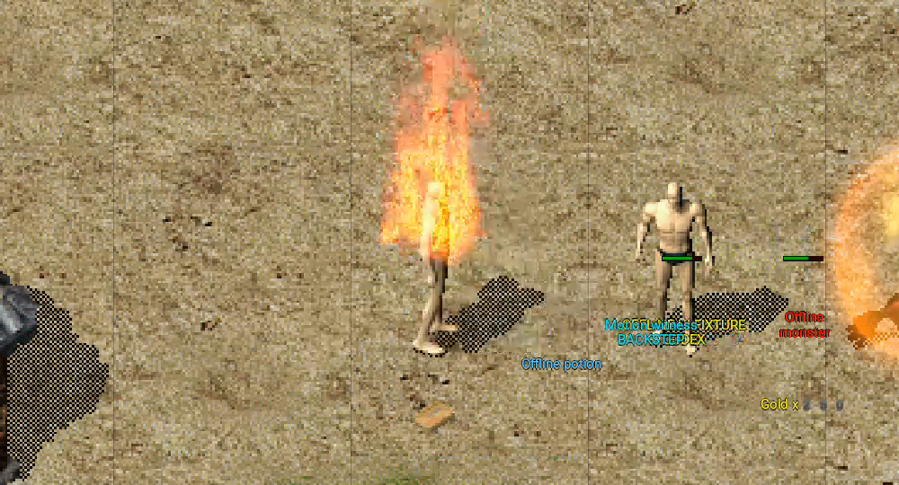
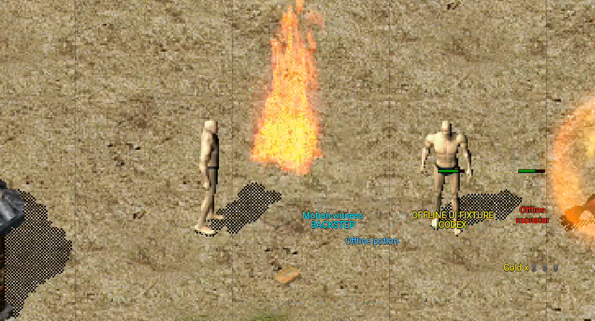

# Native Android remote-motion evidence — 2026-09-12

This evidence pack validates the bounded native Android remote-object
presentation slice from implementation commit
`3efa56d71e22584871a626b76741d7576712a9c2` on
`codex/android-player-journey`. The worktree was clean when capture began.

## What is implemented

- Accepted authoritative `ObjectWalk`, `ObjectRun` and `ObjectBackStep`
  packets keep their server endpoint in the Android object model and also
  mirror the prior and target tiles into the shared Bevy presentation clock.
  The offset is presentation-only; it cannot move gameplay state.
- `ObjectTurn` stops a stale glide at the authoritative pose. Hide, teleport
  out, removal, disconnect, rejected scene data and map-generation changes
  clear retained remote motion.
- Android drains the bounded cross-thread packet queue from a Bevy `NonSend`
  main-thread system. This is required because the shared WASM-compatible
  movement ingress is thread-local; sending from a parallel Android system
  otherwise leaves the renderer with no event.
- The Android name, guild, health and damage overlays consume the same exact
  `PresentationPoseBuffer` entity/camera offset as the sprite renderer and
  compensate the shared UI stage scale.

## API 31 emulator result

The separate network-disabled `com.mir2.web3.uipreview` APK was streamed to
the API 31 ARM64 emulator recorded in `device.txt` and cold-launched with the
offline `world-render` specimen. The top-left banner explicitly says
`OFFLINE UI PREVIEW` and `NOT LIVE GAMEPLAY`.

The three consecutive crops show the exact packaged player specimen and its
`Motion witness` / `BACKSTEP` overlay at active, intermediate and settled
presentation poses:

`ready-markers.txt` independently records:

- a render-ready 849-draw Bichon frame with five objects/five layers;
- one accepted `ObjectBackStep` presentation entry, with zero decode, stale,
  target-mismatch or dropped-event counts;
- an active renderer-owned offset of `(84, 0)` followed by the settled zero
  offset.

The captured log contains no panic, fatal exception or strict `PathNotFound`
marker.

## Build and automated checks

- Android Rust host with `ui-preview`: 142/142 unit tests passed.
- `cargo fmt --check` and `git diff --check` passed.
- API 31 `aarch64-linux-android` release compilation and `uiPreview` package
  gate passed.
- Streamed install and cold launch passed.
- APK (not committed):
  `apps/game-client/platform-android/android/app/build/outputs/apk/uiPreview/app-uiPreview.apk`
- APK SHA-256:
  `e0032b7444dd15c520e00776de073c4f7867634bada39939706447267b23aa64`.

## Acceptance boundary

This is offline emulator-visible presentation evidence. It does not establish
an approved WSS connection, a real account login, live server movement, a
physical Android device, touch/IME/network recovery, soak, signing/store or
human 1:1 acceptance. It also does not fill every class, equipment, mount,
monster and action atlas catalog. Those remain separate gates.
