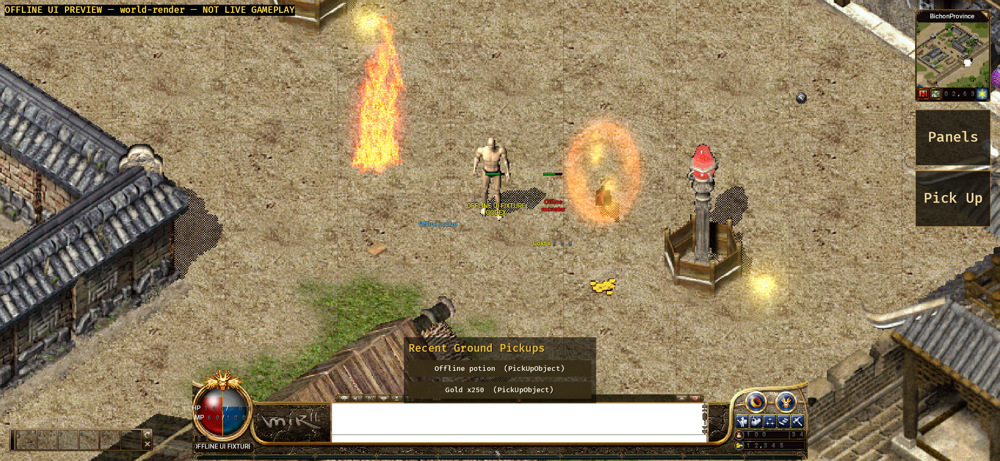

# Native Android scene-effect evidence — 2026-09-12

This evidence pack validates the first bounded native Android scene-effect
slice from implementation commit `b15a297b2947eab540ea79a4af0e2938453e6f0f`
on `codex/android-player-journey`. The worktree was clean at capture time.

## What is implemented

- The Java WSS host forwards authenticated post-`IN_GAME`
  `DamageIndicator`, `ObjectMagic`, `ObjectProjectile`, `ObjectEffect`,
  `MapEffect` and `ObjectSpell` packets instead of dropping them at its packet
  allowlist.
- Android strictly projects the five scene-effect packet families into the
  existing shared Bevy effect-render contract. Cast, projectile, impact,
  return, object-attached, map and persistent-world phases resolve exact frame
  paths from the tracked Crystal manifest; unknown entries do not get a
  placeholder.
- The APK packages 2,067 checked core effect PNGs. Active animations publish a
  unique, bounded 512-image warm set so Android packaged-asset I/O cannot lose
  every short-lived frame before it loads. The shared runtime retains these
  handles without spawning hidden sprites and releases them with the snapshot.
- Scene/session rejection, map transition, disconnect and object removal clear
  the corresponding effect state. Client options can hide the presentation;
  they do not change server combat authority.

## Emulator result

The separate network-disabled `com.mir2.web3.uipreview` APK was cold-launched
with the `world-render` specimen on the API 31 ARM64 emulator recorded in
`device.txt` (`sdk_gphone64_arm64`, 1080x2340, density 440).

The screenshot visibly contains the packaged Bichon scene, shared mobile HUD,
player/monster/drop objects, a persistent FireWall and an amber effect attached
to the fixture monster. The top-left label explicitly says `OFFLINE UI PREVIEW`
and `NOT LIVE GAMEPLAY`.

`ready-markers.txt` records:

- `ANDROID_WORLD_RENDER_READY`: 849 map draws, 4 entities and 4 entity layers.
- `ANDROID_EFFECT_RENDER_STATE_READY`: 2 effect instances accepted by the
  shared runtime.

There are no `original-effects` `Path not found`, native decode, panic or fatal
errors in the captured log. The full log does retain pre-existing URL-loader
retries for `original-ui/CArmour/00/16.png` and
`original-ui/Monster/003/16.png` while the separately uploaded entity atlas is
settling; the final frame visibly renders both actors. This pack therefore does
not claim a globally clean actor-asset log.

## Build and automated checks

- Shared Bevy runtime: 233/233 unit tests passed.
- Android Rust host with `ui-preview`: 141/141 unit tests passed.
- Java/OkHttp host: 11/11 unit tests passed with JDK 17.
- API 31 `aarch64-linux-android` target check passed.
- `uiPreview` package, streamed install and cold launch passed.
- APK (not committed):
  `apps/game-client/platform-android/android/app/build/outputs/apk/uiPreview/app-uiPreview.apk`
- APK size: 376,315,672 bytes.
- APK SHA-256:
  `80462446bf9aace2432f8de225da0a715b9d731aa4cce1731f9a78042af8b6d6`.

## Acceptance boundary

This is emulator-visible, offline, exact-resource presentation evidence. It is
not evidence of an approved WSS endpoint, a real account login, a server combat
result, a physical device, touch/IME/network recovery, soak, signing/store or
human 1:1 acceptance. The generic effect pipeline is present, but
spell-specific Crystal branches, local cast prediction/deduplication, sound,
lighting and the rest of the player loop remain separate work.
