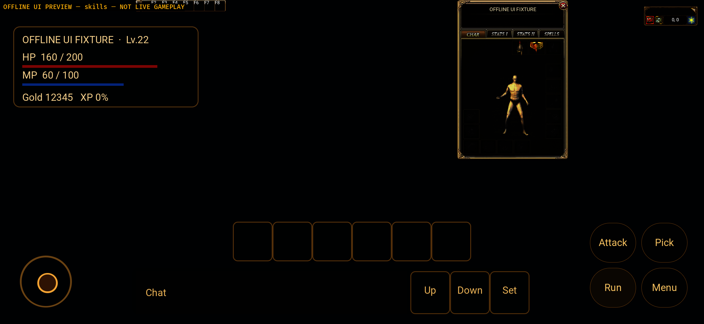
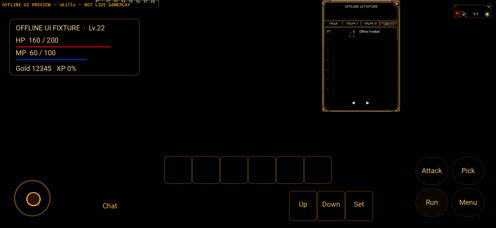

# Native Android NI-07 — shared skill ingress, 2026-10-01

This records **source/compile gates and the subsequent v8 diagnostic package**,
not full Android parity, online combat or physical-device acceptance. The completeness goal stays
Active against frozen Windows `3f5e61533235921369bc13a7760b4a56b0e467e5`.
The previous v7 APK source10bf437f2 does **not** contain these changes.
Exact v8 package source is `8eb1a7d344e2240e1a499f42e37b454264ce3bc0`, clean
before and after both builds. Its actual skill imagery gate **FAILS** below.

## Scope and implementation

- Parent source: `73425a969253f259b6435fb985987272fd08d493`. Independent
  `codex/android-shared-sync` / Draft PR253; no Windows branch, original dirty
  checkout, production service, real account/save or asset release was changed.
- Shared `client-bevy/src/native_skill_ingress.rs` extracts the Windows pure
  cursor and skill field transform. Windows retains its host/Hero wrapper and
  now delegates to the same implementation. The extraction proof compares Rust
  tokens against the parent, excluding only comments/whitespace outside strings;
  cursor, transform and patch helpers are equal after interface renaming.
- Android `skill_ingress.rs` owns authenticated character identity and personal
  cached source. It projects typed learned skills, exact remaining milliseconds,
  names/icons/requirements, owner-success cast sequence and key-result snapshots.
  No client damage, MP expenditure, learned-skill granting or save rule is added.
- Java forwards only eight public personal packet families. Initial bootstrap
  and reconnect cannot forward personal packets without successful StartGame and
  a matched self/owner snapshot. Same-character STARTING map loading can retain
  personal packets; entities/effects remain gated to IN_GAME. Rust never uses
  this private skill source to restore old world/map/entity/render state.
- All personal packets reject explicit foreign, Hero or malformed identity.
  Disconnect, new character and render/data failures reset epoch/models/receipts.
  Owner UserInformation cannot rebind identity. MP/HUD ingress is a separate,
  still incomplete NI-02 leaf.
- Exact key ACK models preserve their original server keys in a16-entry FIFO.
  Failed native enqueue retains them; only ordinary latest models coalesce.
  Cached personal source strips ACKs so unrelated deltas cannot replay them.
  Shared consumption precisely matches session/player/requestId/spell/key/oldKey;
  repeated raw results cannot settle a new request. Repeated results are not
  transport-deduplicated; overflow fails closed rather than evicting an ACK.
- The compile-time, network-disabled `skills` preview now uses server-shaped
  offline input through the actual adapter and native skill ingress. It is not
  an account, learned spell or actual JNI/WSS proof. Diagnostic version8 is
  `0.1.5-skill-ingress`; no APK is claimed by this source checkpoint.

## Verification

Tests overlap and are not a functional completion percentage. Existing ignores
are not passes. Raw selected logs/XML/proof are copied without changing bytes.

| Gate | Result | Boundary |
| --- | --- | --- |
| Android normal Rust | 227 passed | Final owner/transition guards |
| Android ui-preview Rust | 236 passed | Includes typed offline skill fixture |
| Shared native-player-ui | 1196 passed /8existing ignored | Includes duplicate ACK/new request regression |
| Java Debug / uiPreview | 32 /32 passed, zero failures/errors/skips | Local in-memory TLS fixtures, no real account |
| macOS desktop skills | 25 passed,782filtered | Extracted Windows source compatibility, not Windows execution |
| Supplemental desktop boundaries | Seven1/1 focused passes,806filtered each | Success/failure/foreign/tickless/toggle/name/icon/map fences |
| Android arm64/API31 | Passed | Compile only; package and actual runtime separate |
| Format/scoped source diff | Passed | Preserved raw log tail warnings listed separately |
| Independent read-only review | No remaining P0/P1/P2 | Source only; reviewer did not build/use a device |

Failure-first evidence: Java initially missed Magic (1/1fail). Review found
map-transition loss, reproduced as Java1/1fail and Rust6pass/1fail, then fixed.
Initial adapter fixture5pass/2fail lacked server castKind; a later226pass/1fail
fixture omitted mandatory MagicDelay owner ID. Correct server-shaped fields were
used without weakening the shared guard. One preview compile attempt moved a
String in a match guard (E0507); ordinary Result mapping corrected it. Windows
extraction initially left one private test-field reference; the read-only core
diagnostic path repairs it. These intermediate failures remain retained.

The earlier full macOS desktop622pass/180fail/5ignored is **not** rerun or
converted to a pass by these focused tests. See the separate G1 evidence for
resource/Windows-font/environment limitations and historical emulator failures.

## Open gates and next work

- Complete skill imagery: v8 builds/installs and displays the typed offline
  FireBall/F1 row, but the icon is missing and retries repeatedly. Never relabel
  v7 images/packages or a successful build as a passing v8 imagery result.
- Approved real WSS/HTTPS and locally entered ordinary test credentials:
  login/list/StartGame/owner state, actual key/cast sends and authoritative returns,
  reconnect/map transfer/exit/save and an online player loop remain unverified.
- Skill row/assignment/touch/tooltip and full phone-window acceptance. Existing
  approved local diagnostic UI manifest has no MagIcon/MagIcon2 entries; complete
  skill imagery, complete map/entity resources and matched public versions are
  still OPEN. No art was fabricated or asset release republished.
- NI-05/06 inventory plus exact operation outcomes, NI-10/11 NPC/quest/shop, all
  remaining typed domains, Android audio/input/performance and physical devices.
- Push is not verified: prior normal SSH/HTTPS fast-forward attempts failed with
  disconnect/HTTP408. Do not infer remote success from local commits or an
  error-following “Everything up-to-date”. PR remains independent and Draft.

APK/cache/licensed files/passwords/signing keys stay outside Git. Build, source,
offline emulator, online and human/device acceptance remain separate.

## Exact v8 package and actual emulator evidence

Both versionCode8 / `0.1.5-skill-ingress`, minSdk31/targetSdk35/arm64-v8a,
Rust1.95.0 release-profile native library in debuggable/unstripped diagnostic
containers, JDK17 and NDK26.1.10909125. They are not store releases. Debug has an
explicitly empty Gateway URL; preview is separately network-disabled. Both
reuse the unchanged approved local UI/world/entity inputs from the G1 checkpoint.

| APK | Bytes | SHA-256 |
| --- | ---: | --- |
| `mir2-native-skill-ingress-debug-v8.apk` | 385224106 | `c38def5aaa8d5e7792b9da34c0ebbae1a3d8ed92155e271d8e6de9f49c04cf4c` |
| `mir2-native-skill-ingress-preview-v8.apk` | 388810598 | `1a5ce909fa8506e138a2d439c3bcb08c9855d109dd82dd240a484e48bf7dd345` |

Retained outside Git in `apps/game-client/platform-android/target/skill-ingress-v8-20261001/final-apks/`.
Selected build/install/start/PID logs and original screenshots are copied here.

Only device: dedicated `Mir2_API_31_ARM64`, `emulator-5554`, Android12/API31,
`sdk_gphone64_arm64`, fingerprint
`google/sdk_gphone64_arm64/emulator64_arm64:12/SE1A.220630.001/8789670:userdebug/dev-keys`.
Landscape2340x1080, density440. Installation used replacement preserving app
data; no clear, old AVD wipe, real account or physical-device test occurred.

- Debug installed and launched as PID3432. Actual frame below shows shared
  login and **Test server not configured**; no credential was entered.
- Preview installed and launched as PID3589 with the `skills` specimen. Its
  marker confirms owner42 / FireBall / castSequence1 / remainingMs300 went
  through the Android adapter and native typed-model queue.
- Initial frame shows the shared Character tab. A real press on SPELLS opens
  a row labeled **Offline FireBall**, with F1. This proves a bounded offline
  adapter-to-shared-window path, not authenticated learning/casting/key saving,
  JNI transport, complete UI layout or authoritative network state.
- PID-scoped logs record repeated `Path not found: original-ui/MagIcon/54.png`.
  Source model passes while the image gate FAILS; no substitute icon is drawn.
  Both observed PIDs have no fatal-exception/panic/fatal-signal marker, which
  does not make the missing image, repeated work or performance acceptable.
- Both test packages were force-stopped after capture to release emulator CPU.
  v6 SystemUI, v7 foreground black frame/high intervals and earlier Mac failures
  remain retained; they were not reclassified by this bounded v8 check.

The known UI manifest identifies an already-approved local Crystal source Data
directory. Read-only inspection confirms MagIcon.Lib and MagIcon2.Lib exist
there; the next bounded resource step will export them to a **new** local pack,
preserving v8 inputs and evidence. No licensed PNG/cache/APK will enter Git or
be deployed to an online resource release.
