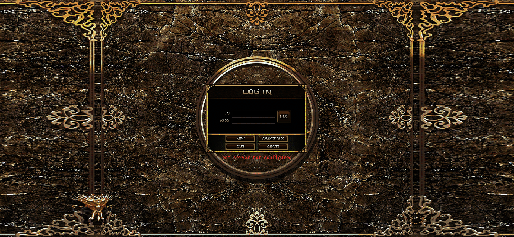
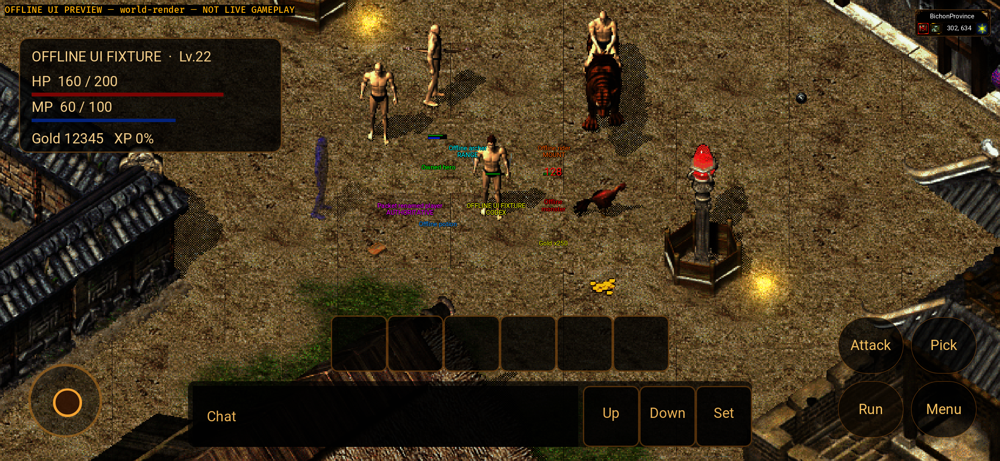
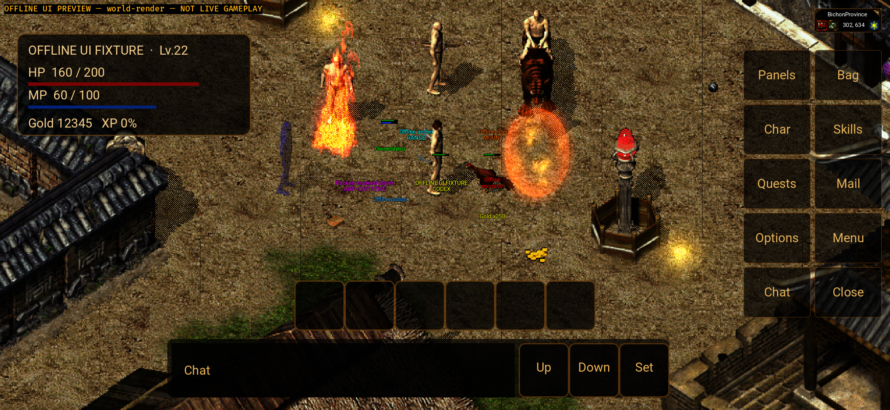
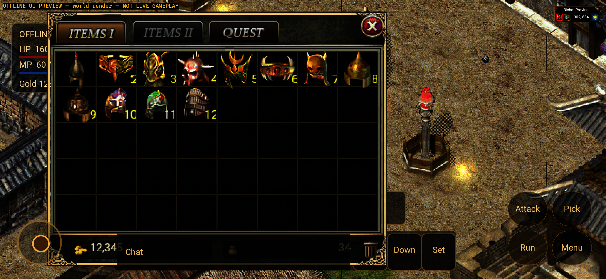
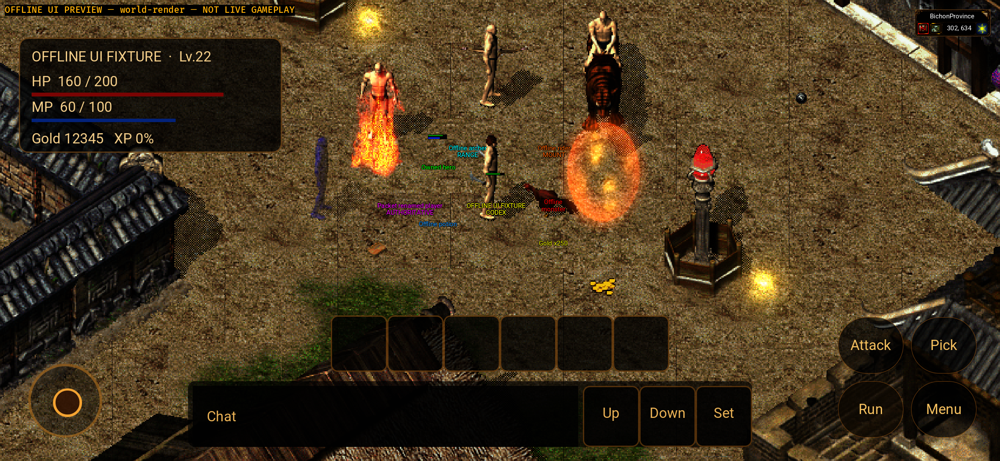
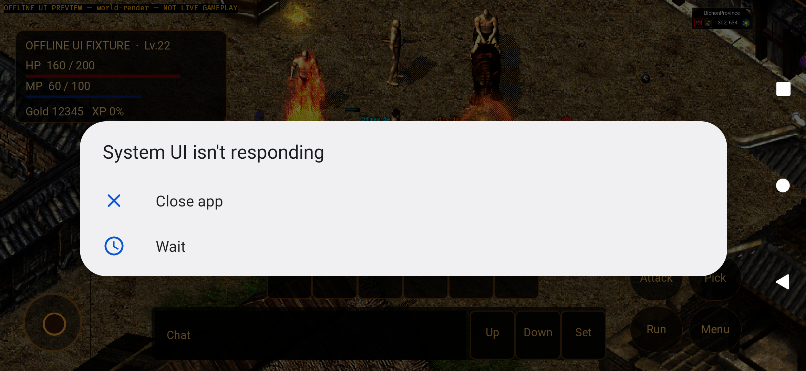

# Native Android / frozen Windows G1 integration — 2026-10-01

This checkpoint closes **G1 source integration and exact diagnostic packaging**,
not the Windows-completeness goal. Android is native Bevy/GameActivity, not a
WebView. Real authentication, online player state, every service/window, complete
resources, physical devices and human acceptance remain OPEN.

## Source and isolation

- Frozen Windows source: `3f5e61533235921369bc13a7760b4a56b0e467e5`,
  `codex/playtest-registration`. It is a source baseline, not a fresh Windows
  device acceptance or the older installed r5 reported by upstream QA.
- Normal merge: `b7caac732ac31a31353b69e8b0bb956ada3f583a`, parents
  `1e98c89b68e4fe5abd7de2745d74c0c46b69e34d` and the frozen Windows SHA.
  All three incoming Windows commits are present; history was not rewritten.
- Final v7 APK source: `10bf437f2d99b09a850fc3359df5172658215681`, committed
  and clean before both builds. Later evidence commits do not change this SHA.
- Android execution remains in independent `codex/android-shared-sync`, Draft
  PR #253, with its existing base. Neither Windows nor the original dirty main
  checkout/original Android branch was switched, reset, stashed or cleaned.
- Write scope: merge conflict resolution, Android nonmodal/pointer wiring,
  two explicit desktop Hero-match compatibility arms, shared pure display-type
  feature gate and diagnostic documentation. No production deployment, database
  migration, credential input, real-save mutation or new client-side game rules.

## Implemented seams

The merge retains phone HUD/chat/IME, affine clipping, the retained entity atlas,
GLES schedule cleanup and `native-player-ui`. Android can compile shared display
geometry but does **not** install desktop resolution settings/plugin or enable
the desktop audio backend. Ordinary shared panels retain phone status/chat and
dedicated movement; real NPC/service/prompts/editor/death guards remain.

Window changes cancel the old shared pointer and require finger release. v6
emulator testing exposed an additional defect: a visually hidden joystick still
accepted movement while the phone menu rail was expanded. The v7 Android-only
fix cancels/rejects fresh and held hidden gestures and includes rail transitions
in pointer ownership. A failing regression was retained before fixing it.

The [20-leaf host ingress inventory](../../../ANDROID-NATIVE-HOST-GAPS.md)
records missing typed inventory, skill, chat, NPC/quest, mail and social ingress.
Shared screens and outbound serializers do not establish their inbound models.
That sub-inventory is not a whole-game completeness percentage.

## Tests and provenance

Counts overlap; do not sum them into unique functional coverage. Existing ignores
are not executed passes. Logs below are copied without changing their bytes.

| Gate | Result | Source/scope |
| --- | --- | --- |
| Android host Rust | 219 passed / 0 failed | Final v7 phone guards |
| Android ui-preview Rust | 227 passed / 0 failed | Final v7; includes offline specimens |
| Java Debug / uiPreview | 30 / 30 passed, zero failures/skips | Final v7 host fixtures, not real WSS |
| Shared native-player-ui | 1195 passed / 8 existing ignored | Merge-source run; shared source unchanged in v7 |
| Runtime | 290 passed / 1 existing ignored | Merge-source run; unchanged in v7 |
| Shared Zone module | 178 passed; 1751 filtered | Merge-source server subset; no DB writes |
| Gateway ordinary skill cadence | 8 passed; 859 filtered | Merge-source focused subset, not full backend green |
| macOS desktop nonmodal / Hero / hover | 8 / 1 / 1 passed | Focused source compatibility, not Windows device execution |
| Full macOS desktop suite | 622 passed / 180 failed / 5 ignored | Retained FAIL; asset/Windows-font/Mac-path gaps, not fully resolved |
| Android arm64/API31 target and both packages | Passed | Native Rust libraries and installable diagnostic containers |
| Scoped format/diff checks | Passed | Raw inherited/generated log tail blank lines retained separately |

Failure ledger: initial nonmodal tests0/2; old global-modal assertion215/216;
shared display-test audio feature error; sparse-checkout SQL/config/fixture
compile inputs missing; full desktop622/180/5; v6 hidden-rail regression0/1.
Tracked SQL/config inputs were materialized only for compilation: no migrations
or database connection. Generated literal Windows-drive test cache on Mac was
moved into ignored QA storage, not committed or destructively erased.

## Exact APK identity

Both: versionCode7, versionName `0.1.4-windows-g1`, minSdk31/targetSdk35,
arm64-v8a, Rust1.95.0 native release profile, NDK26.1.10909125 and JDK17.
Debug/uiPreview containers are diagnostic, debuggable and unstripped; not signed
store releases. Gateway is explicitly empty in Debug; uiPreview is separately
network-disabled. There is no remote Web page involved.

Retained local path under the independent worktree:
`mir2-web3/apps/game-client/platform-android/target/windows-goal-g1-20261001/final-apks/`.
APKs/caches/keys/passwords are not committed.

| Package | APK | Bytes | SHA-256 |
| --- | --- | ---: | --- |
| `com.mir2.web3` | `mir2-native-windows-g1-debug-v7.apk` | 385029150 | `1cb092026a804c80b6aad6eaa20ea8ed469635cd4d812639ccf232e35f0a7a73` |
| `com.mir2.web3.uipreview` | `mir2-native-windows-g1-preview-v7.apk` | 388672390 | `ec909e12cbacd949bf70ac52895ff334b79eb37e01f0d5493bfea686b008e6a5` |

The v6 source was the merge SHA, not the v7 fix. Both intermediate v6 APKs and
their failure screenshots/logs remain in ignored QA storage. Their hashes:
Debug `14b61144ad1ca3ca3351dc070b04f21f9ed18e816de1223cb7c37a54bcb989b7`;
uiPreview `bd530487a8f589fab995ab75183dc1b15e001c24df455b5f1d772c397b4bb08b`.
They are not this checkpoint's passing artifacts; v5/v6 pictures were not
relabeled as v7.

## Actual API31 emulator checks

Dedicated `Mir2_API_31_ARM64`, `emulator-5554`, Android12/API31/arm64;
fingerprint `google/sdk_gphone64_arm64/emulator64_arm64:12/SE1A.220630.001/8789670:userdebug/dev-keys`.
Physical1080x2340, landscape2340x1080, density440/no override,20GB userdata.
No old Pixel_5 wipe, package-data clear, AVD reset or physical-device evidence.
Variants ran serially; installation used replacement preserving data.

- Debug v7 installed with verified version7 and PID2323. The first3-second
  screenshot was white; the delayed actual frame shows shared login and
  **Test server not configured**. Startup latency is not accepted performance.
- uiPreview v7 installed with verified version7, PID2476. Ready logs and actual
  raw screen show849 map draws,8 entities,13 entity layers and2 local effects.
- A real stationary press opened Menu. Sliding over the hidden joystick region
  produced **zero new move log lines** (before0/after0).
- A real Bag press opened shared Inventory and collapsed the phone rail. Sliding
  the visible joystick produced **two offline move intents**, duplicated by the
  two log sinks into four lines (before0/after4). No server was connected;
  this is not Zone movement, collision, saving or item-use acceptance.
- Bag was closed by its shared close button. Home/foreground retained PID2476
  and eventually restored actual world/HUD. The2-second black foreground frame
  is retained; this is not a bounded latency, reconnect or process-death pass.
- Final PID-scoped logs contain no `FATAL EXCEPTION`, `panicked at`, fatal signal
  or missing-path markers. Emulator EGL timing reports commonly hundreds of
  milliseconds per frame; smoothness/soak/thermal/low-end acceptance stay OPEN.

v6 initially displayed **System UI isn't responding**. Those raw screenshots
are retained. `dumpsys activity lastanr` said no ANR since boot, which does not
identify its cause. Wait restored focus. v7's observed ready frames have no such
dialog; this bounded rerun does not resolve the historical stability failure.
An API31 emulator is not a phone, even with input injections and the same ABI.

## Resource identity and remaining scope

Unchanged approved local diagnostic inputs were rehashed:

| Resource manifest | SHA-256 |
| --- | --- |
| original UI | `890ae5d8f0fca13246654c26c5826575887bf22faa7d44504c88d0dbd0307cca` |
| map atlas | `b2ec2e3a73125e781ac8aeead31294e88e6510b1dfd62b2b00c2c2407ad609ce` |
| keyed map | `f69e6ffa100f895d8cf337c3ecc0737a8fabfb142af93004bdd0cccea50c610b` |
| entity proof pack | `929d146535bde9b61c75c33af0e98852dcc3aef83320869aac9f06f4bdd530d9` |

Pack `android-archer-mount-bow-proof-20260912` is not a complete aligned public
Web/Android release. Full Bichon still has2969 missing source frames out of7672
referenced keys. The v7 bag screenshot still shows desktop magnification and
HUD/chat overlap. Full phone windows, nine languages, multi-finger device
interaction, audio/focus, complete render lifecycle and memory budgets remain
separate goal leaves. Successful new guards do not close these differences.

Next: NI-07 typed skills/owner ACK/exact cooldown with stale/identity/reset and
receipt tests; approved HTTPS/WSS real login/list/StartGame when external
materials are supplied; then inventory/NPC/quest and the remaining baseline.
G1's full action/receipt acceptance denominator is still being expanded. The
formal goal remains Active; G2–G6 are not complete.

## Selected raw evidence

The first white/black frames, pointer/gesture logs and failed desktop/hidden-rail
tests are retained alongside passing tests. Full local build/ADB outputs remain
under `platform-android/target/windows-goal-g1-20261001`; selected copies below
do not replace or modify the originals.
