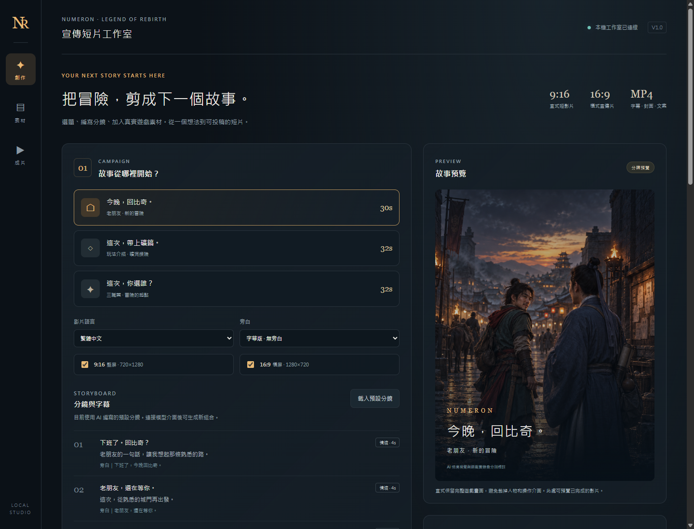
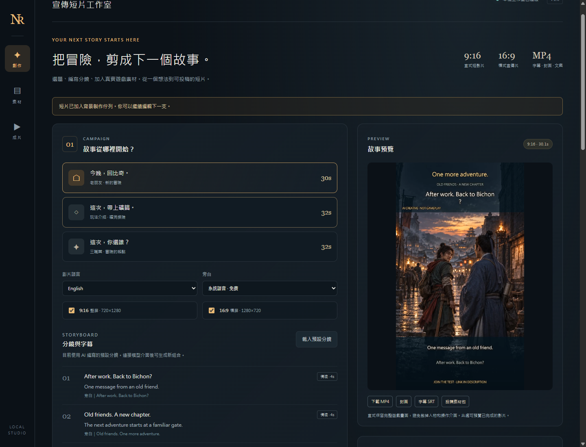
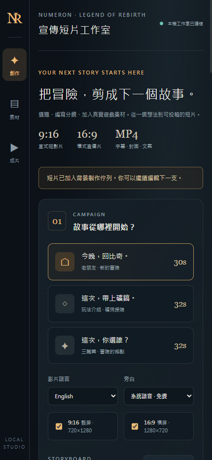
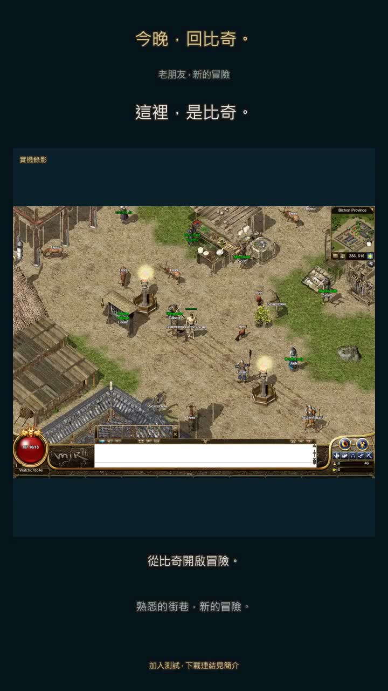

# AI 宣传工作室首版验收 — 2026-10-10

范围：独立的本机宣传短片工具与实际比奇样片。不改变游戏网关、安装器、玩家数据库、经典玩法 Goal 或 Crystal parity。代码在隔离的 `codex/playtest-bilibili-spectator-20261008` 分支。

## 通过的门槛

| 门槛 | 实际证据 | 结果 |
| --- | --- | --- |
| 引擎 / 本机 HTTP 回归 | [42 项独立测试](engine-tests.txt)，11.095 秒；零失败、零跳过 | 通过 |
| 浏览器完整制作流程 | [真实 UI 回执](browser-evidence.json)：上传原创图、载入英文分镜、异步入队、编码时可继续编辑、MP4 播放、206 下载、文案与系统语音、桌面 / 手机宽度 | 通过；无 JS 异常或失败资源 |
| 实际繁中 / 英文成片 | [四个 MP4 的探测与哈希](verification.json)：720×1280 / 1280×720，H.264/yuv420p/30fps/AAC，约 30 秒 | 通过 |
| 配音 | FFmpeg 音量检测与生成记录；繁中 Huihui，英文 Zira | 可听音轨非静音；系统 TTS，未冒充神经网络 AI 配音，未做人工听音评分 |
| 真正的游戏来源 | [录制摘要](capture-summary.json)：序号 213→227，217 张实际截图，21.965 秒，最大帧龄上界 5.169 秒，公共延迟 3 秒 | 实时延迟观战；不是原生 Windows 30fps 录像 |
| 普通自有 QA 生命周期 | [公共 HTTPS/WSS 回执](ordinary-qa-transport.json)：真实共享帧、脱敏、只读及正常 LogOut | 通过；未调用管理命令 |
| 画面与来源一致 | 检查开场 / 中段 / 结尾截图；游戏三个镜头连续取段 0、6、12 秒，保留完整 HUD；AI 图明确标注 | 通过；素材只证明比奇街景 |
| 缺少素材时不误生成 | UI 挖矿选题缺实录时禁用；引擎逐镜角色和玩法标签校验 | 通过；挖矿 / 三职业专题仍需实录 |

引擎用真实 FFmpeg 验证双画幅、中文烧录、连续视频取段、四边画面保留、图片推近和系统配音；另验证队列恢复、存储失败、上传大小 / 清理、媒体签名与固定协议、同源变更、范围下载、事实及逐镜绑定、模拟供应商返回和错误。真实付费文本 / 视频 / 神经语音接口未接入。

## 画面

| 繁中开场 | 实际游戏中段 |
| --- | --- |
|  |  |

## 保留的失败

- [browser-01](browser-01-failure.json)：首次界面读取旧状态缺少 script / assetIds，暴露契约缺陷；引擎补齐字段，UI 对齐 running 状态，加入回归测试。
- [browser-02](browser-02-failure.json)：浏览器验收在平滑滚动尚未完成时点击旧坐标；改为立即滚动后再派发点击。这是验收脚本定位问题，没有把超时算通过。
- [browser-03](browser-03-failure.json)：已创建异步任务，但断言早于界面完成刷新；等待刷新解除按钮忙碌状态后，browser-04 完整通过；末次事实引用修复后 browser-05 再次通过。
- 原始过期录制、刻意使用不存在 FFmpeg 的编码失败保留于开发机 `C:/mir2-promo-studio-20261010/captures`。前者未用作成片；两次专用 Chrome 均已关闭。没有删除失败重新定义成功。

原始帧、视频、完整录制回执及成片在上述开发机目录，未推送进 Git。浏览器证据仅包含自有普通 QA、公共观战和工作室资料；私有登录记录未复制入项目。

末次只读审查还发现分镜可以显式错改事实引用，虽不能更改文字，导出元数据仍会误绑。现按可信 shotId 固定：修改 / 清空 / 重排拒绝，省略则继承；创意镜头不能添引用。新增两项测试覆盖 provider/manual 路径及镜头重排。独立 42/42 通过后重启本机工作室，并由最终代码重新生成四个交付 MP4。

## 交付位置与限制

工作室：`http://127.0.0.1:3921`。

素材包：`C:/mir2-promo-studio-20261010/deliverables/Numeron-Promo-Starter-20261010.zip`，6,415,333 字节。含繁中 / 英文竖屏和横屏各一条，共四个 MP4，SRT、封面、文案 / 来源 JSON、使用说明和验证记录。投稿前需填入实际下载链接并核对内容。

源代码启动说明见 [README](../../../../tools/promo-studio/README.zh-CN.md)。`start-studio.ps1` 完成 PowerShell 语法检查；本轮实际服务启动使用 Python 命令，没有把快捷脚本的原生窗口交互算作验收。

本轮原创 AI 图由内置 imagegen 实际生成。连续 AI 演员短剧、可信 Boss/PK 高光索引、平台自动投稿及传播效果尚未验收。B站 ARC_BASE 权限仍待审核；未上传 / 发布，YouTube OAuth 未接。网关 `clipExport` 的 JSON 接收不等于完整视频导出，本轮未启用它。

录制当时公共测试服 revision 为 `c70436f34eabb432d769e0082c0afa23303294b0`。本轮没有替换网关或调整在线服务配置。
