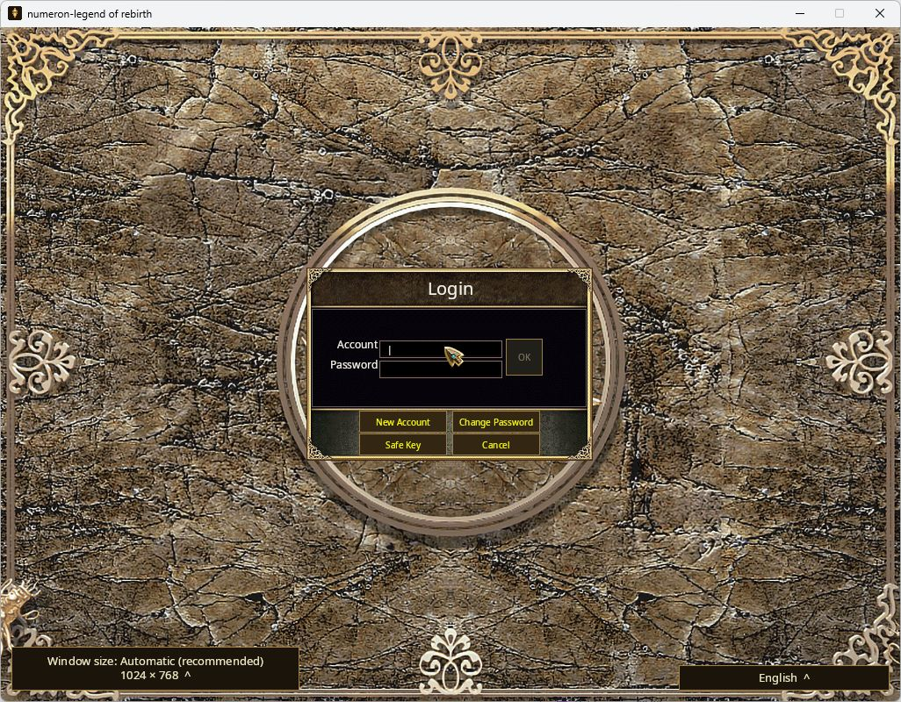

# Actual local Stripe payment / monthly-card trial — 2026-10-10

**The actual sandbox provider and ordinary-player lifecycle pass.** One USD10
Hosted Checkout pays for1000 character Credits. A1000-Credit monthly-card
purchase and exact-UID activation grant one30-day account term. Repeated buy,
consumed-UID activation and ordinary relogin preserve the same expiry and
credit0. This is local test-mode evidence, not a public release or live charge.

Gateway source is `703ebadb73c1bde83710301e6795bffe748ca640`;
compatible native source is `fd660003db5b40d78308b118f8d58e37c1280ab1`.
Binary/helper hashes are in [TRIAL-RECEIPT.json](TRIAL-RECEIPT.json).
Authenticated [CI37969367117](https://github.com/Zombieliu/mir2/actions/runs/37969367117)
completes successfully at the exact703 source; [readback](EXACT-CODE-CI.json)
is retained. Prior local Gateway38/build logs remain in the
[preparation checkpoint](../local-sandbox-20261010/README.md), without being
rewritten as successful payment evidence.

## Actual story

1. Ordinary WebSocket NewAccount, password Login/issued identity and NewCharacter
   create the owned QA account and male Warrior. No Passkey/demo/admin/QA item
   grant or unsafe player command is used.
2. Required monthly access is initially inactive, credit0/pending0. Ordinary
   StartGame returns denied2 and a keepalive barrier confirms clean selection.
3. The server freezes an owned USD10/1000-Credit order and returns a real Stripe
   HTTPS Checkout. Financial IDs are persisted before sends; unknown outcomes
   never receive a new purchase ID automatically. Selection logout closes
   normally before the provider browser trial.
4. Hosted Checkout visibly reports sandbox mode. The initial Adaptive Pricing
   display offers SGD; USD is explicitly selected. WebMCP summary confirms
   `livemode=false`, `currency=usd`, total1000 before submission. The official
   fake4242 card, future12/34 and123 CVC are used with fictional contact/name
   details and saving disabled. Exactly one simulated payment is submitted.
5. Official CLI1.53.1 forwards signed Endive completed events to loopback
   `/v1/billing/stripe/webhook`; that event receives200. Actual server provider
   verification and Source settlement produce credit1000/pending0. A later
   independent read-only GET of the exact owned Checkout and PaymentIntent
   confirms complete/paid and succeeded, canonical1000/usd and frozen
   owner/character/order metadata. [Allowlisted readback](PROVIDER-PAID-READBACK.json)
   hashes provider identifiers and contains no customer/card/credential fields.
6. Ordinary billingBuyMonthlyCard debits1000 and creates one full-width exact UID.
   Repeating its buy ID returns that same unit without another debit.
   billingActivateMonthlyCard consumes it and creates one2592000000ms term;
   consumed-UID replay and explicit refresh leave the expiry unchanged.
7. Ordinary StartGame now returns granted4, bootstrap/barrier and actual
   LogOutSuccess pass. A separate password relogin/status retains credit0,
   pending0, active access and expiry1794185654793; selection logout closes.
   [Redacted ordinary wire assertions](ORDINARY-WS-REDACTED.json) retain five
   actual phases, including repeated status observations without summing them
   as independent coverage.

The cosmetic return page says to check status in the game; it never awards
Credits. These results use the actual paid provider object and signed callback,
not Stripe CLI trigger fixtures or seeded account balances.

## Native entry and isolation

The Windows client is launched with isolated profile/temp directories, exact
loopback WebSocket URL and no account/password/autologin environment.
The empty1024×768 login screen is observed:

This image precedes later minimize/user-input observations. No further native
input is performed after those observations; no native authentication,
payment-panel visual acceptance or completed human billing story is claimed.
The independent Gateway/listener remain running for the operator's manual
trial. The native client later returns normally with exit0; its isolated
launcher is available to reopen it. [Allowlisted exit observation](NATIVE-EXIT-OBSERVED.json)
does not establish login success. Private login and Chinese instructions
remain outside Git.
Assets are read from the existing installation and normal immutable cache;
installed client settings, public services and character saves are not switched.

[Observed health](HEALTH-OBSERVED.json) has one anonymous native connection,
zero active sessions/reconnect/admissions and an empty healthy route/session
cache after the ordinary helpers close. A strict six-counter drain is not
claimed while the native client is connected.

## Retained diagnostics and limits

- The helper initially refuses blank email before any connection/account
  mutation. Only its private config/generator changes to a fictional address;
  normal production validation is not weakened.
- Stripe initially fails a JS chunk and recovers after reload. The requested
  alternate Chrome connector is unavailable and creates no tab. A form-fill
  call times out; fresh observation confirms the fields are already filled,
  so the fill/payment is not repeated blindly.
- The earlier public Quick Tunnel is blocked by automatic approval and is
  never retried through another tool. The official outbound CLI does not create
  a public tunnel or permanent Dashboard callback.
- Adaptive Pricing preserves canonical integration amounts; SGD presentment
  is not evidence of a USD tuple-check bug. Validators are unchanged. No actual
  SGD-paid story is claimed. [Official reporting behavior](https://docs.stripe.com/payments/currencies/localize-prices/adaptive-pricing?payment-ui=stripe-hosted).
- File-store/local Source ownership only: no actual Gateway cold restart,
  production PostgreSQL/fleet schema migration, permanent callback, live keys,
  actual provider refund/dispute or native human billing acceptance.
  Existing isolated PostgreSQL CI evidence retains its separate fixture scope.
- Public R22/Gatewaya41/signed feed17 and original unfinished P1–P7 remain
  unchanged. This payment extension does not establish original Crystal parity.

Provider keys, signing secrets, real account metadata, password hashes/private
saves, tokens and Checkout URLs are excluded. Official test transactions do
not move funds. [Stripe testing](https://docs.stripe.com/testing).
