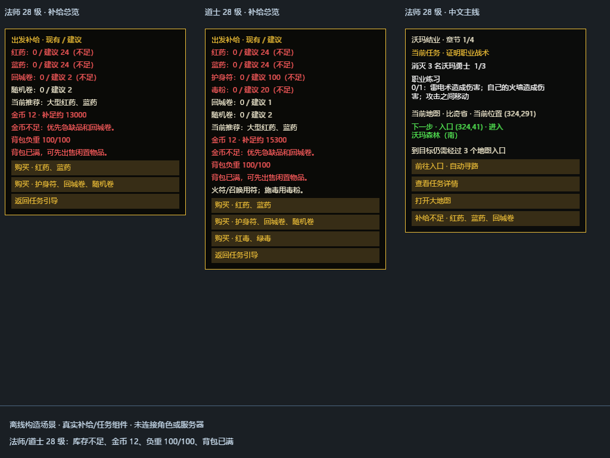
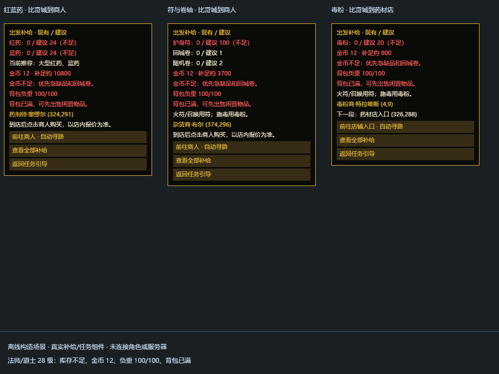
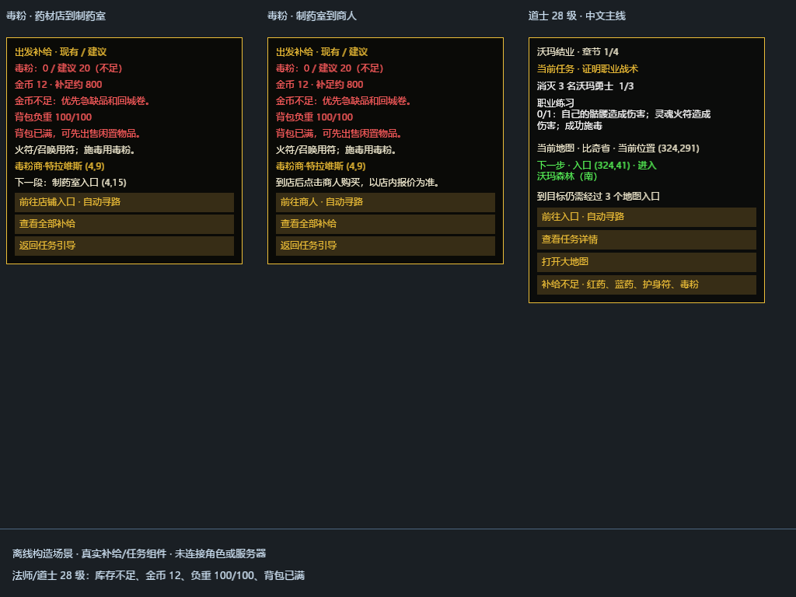

# Caster supplies and Chinese quest UI — 2026-09-28

This follows the [September 24 class/supply audit](caster-acceptance-supplies-20260924.md).
The player's Warrior 0–30 acceptance is retained. Wizard/Taoist live completion,
measured supply balance and whole-game acceptance are not established here.

## Player behavior

- **补给检查** remains accessible after the newcomer main journey. Its separate
  view shows eligible carried HP/MP medicine, learned/required Taoist materials,
  travel scrolls, gold, replenishment estimates, bag fullness and known weight.
- Recommendations use small medicine before level 16, medium at 16–24 and
  large from level 25. Existing medicine still counts. These counts are not
  a guarantee of chapter survival. Each shop view estimates only its displayed
  supplies; the actual shop quote remains authoritative.
- Samuel at Bichon (324,291) supplies medicine; Bull at (374,296) supplies
  scrolls/Amulets; Travis in `0109` at (4,9) supplies poison. The player follows
  one ordinary route leg, opens the real shop and buys with gold. Native
  guidance does not automatically buy, teleport or attack.
- Poison navigation uses Bichon (326,288) → `0108` landing (8,12), then its
  (4,15) entrance → `0109` landing (7,6), then a free tile near Travis. Each new
  map must be acknowledged before the next leg is offered. Occupied endpoints
  can be replaced by another reachable nearby tile. Esc, map/reset changes,
  stale vendor selection and modal checks protect movement.
- The 22 main quests, four growth claims, six chapter labels, class practice,
  supply flow, relevant names, quest controls and supply shop/item labels
  display Simplified Chinese. Wire IDs, canonical English item names, NPC
  identity and purchase keys remain unchanged; unknown text is preserved.

This is not complete game localization. Legacy NPC prose, older UI and
uncovered side-quest/world labels can still be English. Bull's old prose about
scrolls only dropping from monsters remains legacy copy; the new guidance
correctly directs players to his actual Trade inventory. That dialogue
correction remains tracked with broader old-dialog localization.

## Source and checks

Shared policy: `config/quest-guidance/newcomer-supplies.json`. Shared UI modules:
`quest_supplies.rs`, `player_text.rs`, `quest_ui.rs`, `quest_multi_guidance.rs`,
`quest_practice.rs`, `quest_turn_in.rs` and Crystal shop/tooltip renderers under
`apps/game-client/client-bevy/src/`.

Stock checks cover bag, belt and eligible material equipment slots, deduplicate
eligible unique instances and exclude storage/shop previews, expired/sealed,
wrong class/level/gender, broken or unsuitable items. Canonical identity wins
over a conflicting name. A binding alone does not prove a learned skill. The
UI caches eleven supply templates rather than cloning the complete manifest
on each movement-driven guidance refresh.

Native `map_parser.rs`, `input.rs` and `big_map_input.rs` retain raw collision
data. Only an authored unconditional entrance with a valid landing gets the
server-compatible source-cell exception; occupancy, neighboring walls,
conditional/conquest entrances and invalid/out-of-bounds landings keep their
checks. Bichon (326,288) has a door flag but no native wall bit: an earlier
`doorsBlocked=true` audit misclassified it. The raw-wall positive regression
uses Bichon (399,225); the full poison route is separately tested against its
actual geometry.

The V2 runner uses `newcomer-v2-supply-policy.mjs` and
`protocol-supplies.mjs::restockV2Supplies`. It checks MP/material stock before
departure and after recovery/travel. All departure minima precede optional
top-ups, and every optional buy rechecks every minimum. Purchases require
ordinary NPC goods, valid quotes and new authoritative gold/quantity receipts.
Missing funds, capacity, weight, routes or receipts yield a bounded blocked
result. No grants, debug travel or deadline/death resets are added. Non-V2
restocking and one-time quest rewards remain unchanged.

## Verification

Installed Rust `+1.95.0` is required because the older default cannot compile
the existing Bevy version. No dependency upgrade was made.

| Check | Result |
| --- | --- |
| Shared native UI library, serial | 1,100 passed; 0 failed; 1 explicit GPU fixture ignored |
| Windows native host, serial | 749 passed; 0 failed; 3 existing explicit GPU/performance tests ignored |
| Node supply/protocol/loadout/recovery selection below | 166 passed; 0 failed; 0 skipped |
| Explicit offline Bevy GPU fixture | 1 passed; 3 screenshots / 9 real computed-layout cases |
| Native release build | Passed; existing compiler warnings remain |
| Whitespace/diff check | Passed |

Commands, from the project root:

```powershell
cargo +1.95.0 test --offline --manifest-path apps/game-client/client-bevy/Cargo.toml --features native-ui --lib -- --test-threads=1
cargo +1.95.0 test --offline --manifest-path apps/game-client/platform-windows/Cargo.toml --bin mir2-platform-windows -- --test-threads=1
node --test apps/web/scripts/quest-agent/test-newcomer-v2-supply-policy.mjs apps/web/scripts/quest-agent/test-protocol-supplies.mjs apps/web/scripts/quest-agent/test-protocol-newcomer-v2.mjs apps/web/scripts/quest-agent/test-protocol-loadout.mjs apps/web/scripts/quest-agent/test-newcomer-v2-recovery-ledger.mjs
$env:MIR2_SUPPLY_VISUAL_OUTPUT = Join-Path $env:TEMP 'mir2-caster-supplies'
cargo +1.95.0 test --offline --manifest-path apps/game-client/client-bevy/Cargo.toml --features native-ui caster_supplies_and_chinese_quest_cards_offscreen -- --ignored --nocapture --test-threads=1
cargo +1.95.0 build --offline --release --manifest-path apps/game-client/platform-windows/Cargo.toml
```

The fixture uses production components at 1024×768, checks glyph bounds, row
separation and HUD clearance, then renders on the GPU without a window or
account/server connection. Cases include both casters at 28, zero eligible
stock, gold 12, full weight/bag, indoor poison legs and Chinese quest cards.
These are synthetic fixtures, not authenticated gameplay screenshots. ICU4X
Japanese segmentation-model warnings appeared; Chinese glyphs rendered and
the measured layout checks passed.







Matching JSON files record actual text/layout bounds. No player save was
edited and no new caster playthrough was started for these tests.

## Remaining acceptance and release

Fresh ordinary Wizard/Taoist 0–30 routes still need per-chapter purchases,
expenditure, consumption, death/time and normal save/relogin evidence, followed
by native player acceptance. Historical cohorts retain their original clocks
and deaths. Full translation, live all-map performance/stability and Crystal
visual acceptance remain separate. This convenience UI adds no global parity
percentage.

Source commit `dee30a74d96c986d92922f3f0269cbb43f42e271` was pushed to
`origin/codex/windows-player-journey`; `git ls-remote` confirmed the same SHA.
The development package is `C:/numeron-legend-of-rebirth-20260928-caster-supplies`.
It retains the Gateway built from `abee09b21d33a7e5a23f36609ee31f0da3246f83`,
the existing client configuration, shared asset junction, fixed daylight,
store and identity/recovery keys.

| Packaged file | SHA-256 |
| --- | --- |
| `mir2-platform-windows.exe` | `B852102B77BCB2FECB4ED9875174F6DE112D30447A20EB6B489E9E9A12C15653` |
| `mir2-gateway.exe` | `A79307FB7F7ED779771E5C6C49A3E47504196C59F2353D6B5C60B010FFA5D201` |
| `mir2-client.toml` | `01E4A40E54A5B8C7D6B1DABD7E4C13F7BEF434EC26EAEB1B77180E4BCEFEE834` |

Both old game processes and ports were stopped before handoff. The existing
`accounts.json` was copied to the local player-save-backups directory and the
copy's SHA-256 checked against the source before launch; the package's local
`candidate-manifest.json` retains its exact path/hash. Gateway33580 starts
against that original store on ports 19900/19910. Native client52320 is
responsive with window title `numeron-legend of rebirth`; the established
WebSocket and client log confirm generation1 connected to port19910.
This is startup/connection evidence, not a new authenticated caster run.
Movement/render logs use `20260928-230421-929` in the local `render-live`
directory. No player character was edited or driven for this handoff.

## Separate repository maintenance finding

The source commit succeeded, but its automatic Git garbage-collection step
reported a corrupt historical object
`1ae7f886fa87573bdbb59caf0772103929fac94c`. History identifies it as an older
`apps/web/public/bevy-runtime/pkg-webgl2/mir2_bevy_runtime_bg.wasm` blob associated
with commit `064fbcd159085e3f5e10d2e7ea1b83c4ebf36a8f`. The current worktree no
longer contains that file. An attempted GitHub blob API recovery returned404;
the object store was not altered. This maintenance issue remains open.
The new branch push succeeded and its remote SHA was independently checked;
the native release was built and launched successfully. Pre-existing generated
quest-agent JSON changes were preserved outside this task's commits.
