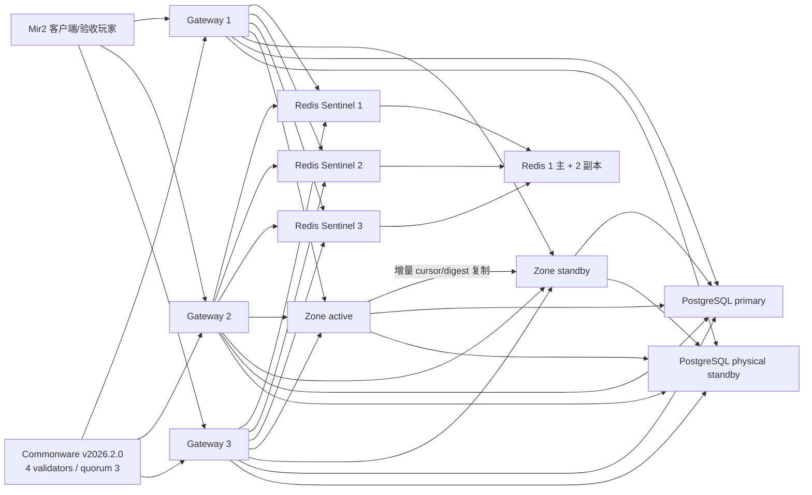

# Gate 19：Regional 高可用运行与验收

Gate 19 的目标不是“容器数量看起来像集群”，而是在真实 Mir2 Session、Zone
状态和 PostgreSQL 经济事务上证明单节点故障不会破坏玩家状态。机器口径来自
[`../regional/profile.json`](../regional/profile.json)：

- `500` 个不同账号和角色，运行 `900` 秒；
- `120` 个同时活跃 Zone；
- 命令错误率 `<0.1%`；
- Zone 故障恢复 `<5s`，Gateway 路由恢复 `<10s`；
- 至少注入 active Zone、standby Zone、Gateway、Redis primary、
  PostgreSQL primary、Commonware validator 六类单故障；
- 经济重复、运行时/账本偏差均为 `0`。

## 拓扑



Gateway 使用三个 Redis Sentinel 发现当前可写主节点；连接失败或收到只读错误时，
重新发现主节点后只重试一次。PostgreSQL 使用 multi-host DSN 和
`target_session_attrs=read-write`，故障后只选择已晋升的可写实例。Zone
promotion 先要求备用节点拥有同一 cursor/digest，再通过 PostgreSQL CAS
切换 owner generation，最后才允许备用节点接收生产命令。

## 一键验收

需要 Docker Desktop、Rust `1.89.0`、`jq`、`rg`、`gh` 和可访问 GitHub 的网络。
Commonware 镜像会额外安装仓库已固定的编译工具链，其依赖仍严格使用
`v2026.2.0` tag。

先运行 15 分钟正式负载：

```bash
./infra/gate19/run-load-acceptance.sh
```

脚本从当前 commit 重建镜像，把 Git SHA 和负载镜像 digest 写入证据，清空专用
测试卷后创建 500 名真实玩家。初始化玩家的时间不计入 900 秒；中点的安全
promotion 暂停也不计入有效负载时长。

再运行六类故障：

```bash
./infra/gate19/run-fault-acceptance.sh
```

故障脚本会删除名为 `mir2-gate19` 的一次性 Compose 数据卷，不能指向生产集群。
它依次完成：

1. 备用 Zone `SIGKILL` 后在 active 上执行十项真实玩法断言；
2. Gateway 1 `SIGKILL`，等待同一 Redis route lease 过期，由 Gateway 2 接管；
3. Redis primary `SIGKILL`，等待 Sentinel 选出不同的可写主节点；
4. active Zone `SIGKILL`，要求复制控制器和真实玩家连续性探针都以 `0` 退出；
5. PostgreSQL primary 停止，提升 physical standby 并验证 multi-host 写入；
6. Commonware validator 3 停止，在剩余 `3/4` 下最终确认命令，重启后导入证书
   并追平相同 state root。

最后独立聚合：

```bash
./infra/gate19/verify-gate19.sh
```

聚合器重新读取每个底层字段，不会只相信来源文件的 `success`。成功后生成
`docs/generated/regional/gate19.json`，并保存所有来源文件的 SHA-256。

## 人工观察

运行中可查看：

```bash
docker compose -f infra/gate19/docker-compose.yml --profile acceptance ps
docker compose -f infra/gate19/docker-compose.yml logs -f zone-failover-controller zone-seed
docker stats --no-stream
```

在本次 10 CPU / 7.75 GiB Docker Desktop 环境中，500 人混合负载会让 active
Zone 使用约 `8–9` 个 CPU 和约 `2 GiB` 内存。这是压力测试结果，不是生产容量
承诺。Gate 20 会通过热点地图分线、AOI/批处理、RPC 背压和调度优化降低单 Zone
瓶颈；不能把 Gate 19 的本机数字线性外推成 Commercial 容量。

## 关键证据

| 文件 | 证明内容 |
| --- | --- |
| `gate19-load.json` | 500 玩家、900 秒、120 Zone、混合行为、经济对账 |
| `gate19-zone-failover.json` | cursor/digest、generation、Zone RTO |
| `gate19-zone-session.json` | 玩家身份、地图和晋升后生产命令连续 |
| `gate19-standby-zone-kill.json` | 备用节点死亡不影响 active 真实玩法 |
| `gate19-infra-gateway-kill.json` | Gateway quorum 与跨实例 route lease |
| `gate19-infra-redis-failover.json` | Sentinel 发现不同可写 Redis master |
| `gate19-infra-postgres-failover.json` | PostgreSQL standby 晋升并接收 fenced write |
| `gate19-commonware-validator.json` | `3/4` 共识活性和落后验证者追赶 |
| `gate19.json` | 以上来源的严格聚合结果与 SHA-256 |

## 已通过的正式结果

历史 `mir2-regional-v1` 一小时证据已通过独立聚合；当前重新运行使用
`mir2-regional-v1-3000-15m`：

- 500/500 名不同玩家、120 个活跃 Zone，有效负载 `3,600.294s`；
- 尝试 `2,642,287` 条、完成 `2,642,218` 条真实命令，覆盖率
  `96.9977%`，错误率 `0.002611%`；
- p50 / p95 / p99 为 `34.57 / 185.67 / 317.59ms`；
- active Zone `SIGKILL` 后 generation `1 → 2`，RTO `7.80ms`，真实玩家
  恢复后的首条命令 `54.15ms`；
- Gateway 1 `SIGKILL` 后 Gateway 2 在 `2.52s` 内接管同一 route lease；
- Redis Sentinel 与 PostgreSQL physical standby 均切换到不同可写主节点；
- Commonware `v2026.2.0` 在 `3/4` validator 下继续 finality，恢复节点追平
  height `14` 和相同 state root；
- 经济重复、运行时/账本偏差、负余额、无 Outbox 事务和 dead letter 均为 `0`。

本机长跑还暴露出 checkpoint command journal 会随命令数增长。它没有破坏
历史 Gate 19 的一小时 SLO 已通过。当前 Gate 21 把长期资源增长移出发布门槛，
只在 15 分钟窗口观测内存与 WAL；商业服阶段仍必须补做长期耐久认证。Gate 21
必须在保留可验证复制 cursor/digest 的前提下实现 durable base snapshot、
已确认前缀截断和 WAL 上限。

## Gateway save-recovery 运维边界

三个 Gateway 使用固定实例身份 gate19-gateway-1/2/3、互不相同的绝对 root 和
以下固定 physical volume：

- mir2-gate19-gateway-1-save-recovery-v1
- mir2-gate19-gateway-2-save-recovery-v1
- mir2-gate19-gateway-3-save-recovery-v1

gateway-1/2/3 都必须显式声明 `com.obelisk.mir2.role=gateway`。这是验证器的权威
Gateway 清单，不依赖 service 名称、镜像名或显式监听地址。build target、Gateway
image token 和 TCP/Web 环境变量仅作为疑似 Gateway 守卫；缺少或错写角色标签会让
静态验收失败。

MIR2_GATEWAY_1/2/3_SAVE_RECOVERY_MAC_KEY 都必须由密钥管理系统注入且彼此独立。
Compose 只拒绝缺失或空值；malformed、placeholder、重复弱值等非空内容由
Gateway Rust 启动校验负责。静态检查不会把这项强度校验报告为已通过。

每个实例的 key、physical volume 与 MIR2_GATEWAY_INSTANCE_ID 必须在重启、滚动
更新和备份恢复后保持同一映射。固定 physical names 不受
COMPOSE_PROJECT_NAME/-p 影响，但也意味着同一 Docker daemon 只能部署一套
Gate 19；不同 -p 会连接同一组 sidecar。独立集群必须使用不同主机/daemon，或经
审计后显式改名。不要输出展开后的 docker compose config。
