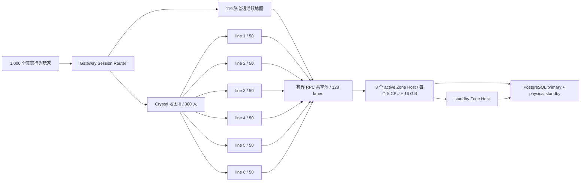

# Gate 20：热点地图分线与 1,000 玩家性能验收

Gate 20 把 Gate 19 已证明的 HA 边界扩展到热点场景。它不是把 `1,000` 条 Session
各自伪装成一个独立世界，而是运行 `120` 张实际 Mir2 地图，并让 Crystal
地图 `0` 的 `300` 名玩家由同一个调度策略自动拆成六条可见性线路。

机器验收口径：

- `1,000` 个不同账号和角色，持续有效负载 `900` 秒；
- `120` 张地图同时有人，其中地图 `0` 恰好 `300` 人；
- 热点目标每线 `50` 人、硬上限 `64` 人，结果必须为六条各 `50` 人；
- 队伍、公会等 affinity key 固定在同一线路，玩家显式选线不会被后台迁移；
- 仅空线路经过 grace period 后缩容，存活 Session 不做隐式搬迁；
- Gateway 到 Zone Host 使用 MessagePack、长连接共享池、队列背压和控制保留通道；
- `1,000` 条 Session 对 Zone Host 的活动 TCP 连接不得超过 `130`；
- 全部玩法命令 p95 `<=200 ms`、错误率 `<=0.1%`；
- 中途安全 promotion 后全部 Session 可刷新并继续真实命令；
- 经济重复和运行态/账本偏差均为 `0`。

## 数据面



热点线路本身就是隔离的权威 Zone，因此不同线路的玩家不会互相看到。线路内的
世界快照仍按 Crystal `ObjectDataRange` 做空间裁剪；移动包在待发队列中按对象
合并，避免慢客户端积累同一对象的过期位置。控制 RPC 使用保留 lane，不会被
游戏流量占满后阻塞健康检查、复制、fence 或 promotion。

## 一键运行

需要 Docker、Rust `1.89.0` 和 `jq`。Gate 20 是本机开发验收层，入口先执行
`preflight-reference.sh`，要求 Docker 实际暴露至少 `10 CPU / 7.5GiB`，并把
真实主机配置绑定到证据。容器资源值是上限而不是内存预留：负载器为
`2 CPU / 2GiB`，每个 Zone Host 为 `2 CPU / 2GiB`，PostgreSQL 主备各为
`2 CPU / 4GiB`。是否通过最终由 1,000 CCU 的 p95、错误率和经济一致性决定，
不能只凭机器规格宣称容量。

先运行正式 15 分钟负载：

```bash
./infra/gate20/run-load-acceptance.sh
```

脚本会清理名为 `mir2-gate20` 的一次性 Compose 卷、从当前 commit 构建镜像，
并把 Git SHA、镜像 digest、Docker 主机资源证明、负载容器 cgroup 配额、原始
计数和延迟直方图写入：

```text
docs/generated/regional/gate20-load.json
```

再做独立聚合：

```bash
./infra/gate20/verify-gate20.sh
```

聚合器逐字段检查人数、地图、线路平衡、连接复用、SLO、promotion 和经济一致性，
成功后生成 `docs/generated/regional/gate20.json`，并绑定负载证据的 SHA-256。

开发阶段可以在同一 Compose 拓扑中直接覆盖负载容器的时长与输出路径，先跑
五分钟发现明显回归，但它不能冒充正式结果：

```bash
docker compose -f infra/gate20/docker-compose.yml --profile acceptance up -d \
  postgres-primary postgres-standby \
  zone-active zone-active-2 zone-active-3 zone-active-4 \
  zone-active-5 zone-active-6 zone-active-7 zone-active-8 zone-standby
docker compose -f infra/gate20/docker-compose.yml --profile acceptance run --rm --no-deps \
  -e MIR2_REGIONAL_ALLOW_DEV_PROFILE=true \
  -e MIR2_REGIONAL_LOAD_DURATION_SECONDS=300 \
  -e MIR2_REGIONAL_LOAD_OUT=/evidence/gate20-load-dev.json \
  regional-load
```

`run-load-acceptance.sh` 始终只接受 `profileExact=true`、`1,000` 人和 `900`
秒，并写入正式路径；开发 profile 使用独立文件，不能覆盖正式证据。

## 人工观察

```bash
docker compose -f infra/gate20/docker-compose.yml --profile acceptance ps
docker compose -f infra/gate20/docker-compose.yml logs -f zone-active zone-standby
docker stats --no-stream
```

重点观察：

1. `zoneHostSessionCount=1000`，但 `zoneHostActiveConnections<=130`；
2. `hotMapLinePlayers` 恰好六项且每项 `50`；
3. p95 未因背压队列超时或 promotion 突增到 `200 ms` 以上；
4. `economyDuplicateCount` 与 `economyRuntimeLedgerMismatchCount` 都为 `0`。

Gate 20 是本机开发验收层；证据绑定实际 Docker 主机资源，不能线性外推
Commercial 容量。Gate 21 的 `3,000` CCU、完整故障矩阵和滚动升级仍是
Regional 正式认证边界，但当前窗口同样为 15 分钟；长期耐久另行认证。
