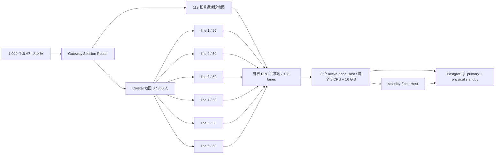

# Gate 20：热点地图分线与 1,000 玩家性能验收

Gate 20 把 Gate 19 已证明的 HA 边界扩展到热点场景。它不是把 `1,000` 条 Session
各自伪装成一个独立世界，而是运行 `120` 张实际 Mir2 地图，并让 Crystal
地图 `0` 的 `300` 名玩家由同一个调度策略自动拆成六条可见性线路。

机器验收口径：

- `1,000` 个不同账号和角色，持续有效负载 `900` 秒；
- `120` 张地图同时有人，其中地图 `0` 恰好 `300` 人；
- 热点目标每线 `50` 人、硬上限 `64` 人，结果必须为六条各 `50` 人；
- 队伍、公会等 affinity key 固定在同一线路，玩家显式选线不会被后台迁移；
- 仅空线路经过 grace period 后缩容，存活 Session 不做隐式搬迁；
- Gateway 到 Zone Host 使用 MessagePack、长连接共享池、队列背压和控制保留通道；
- `1,000` 条 Session 对 Zone Host 的活动 TCP 连接不得超过 `130`；
- 全部玩法命令 p95 `<=200 ms`、错误率 `<=0.1%`；
- 中途安全 promotion 后全部 Session 可刷新并继续真实命令；
- 经济重复和运行态/账本偏差均为 `0`。

## 数据面



热点线路本身就是隔离的权威 Zone，因此不同线路的玩家不会互相看到。线路内的
世界快照仍按 Crystal `ObjectDataRange` 做空间裁剪；移动包在待发队列中按对象
合并，避免慢客户端积累同一对象的过期位置。控制 RPC 使用保留 lane，不会被
游戏流量占满后阻塞健康检查、复制、fence 或 promotion。

## 一键运行

需要 Docker、Rust `1.89.0` 和 `jq`。正式入口先执行
`preflight-reference.sh`，要求单机 Docker 实际暴露至少 `24 CPU / 28GiB`，
并把真实主机配置绑定到证据。这不是容量宣称，而是防止把容器预算超卖给宿主机：
负载器为 `2 CPU / 2GiB`，八个 active 与一个 promotion standby Zone Host
各为 `2 CPU / 2GiB`，PostgreSQL 主备各为 `2 CPU / 4GiB`。机器满足资源前置
条件后，仍必须由 1,000 CCU 的 p95、错误率和经济一致性决定是否通过。

先运行正式 15 分钟负载：

```bash
./infra/gate20/run-load-acceptance.sh
```

脚本会清理名为 `mir2-gate20` 的一次性 Compose 卷、从当前 commit 构建镜像，
并把 Git SHA、镜像 digest、Docker 主机资源证明、负载容器 cgroup 配额、原始
计数和延迟直方图写入：

```text
docs/generated/regional/gate20-load.json
```

再做独立聚合：

```bash
./infra/gate20/verify-gate20.sh
```

聚合器逐字段检查人数、地图、线路平衡、连接复用、SLO、promotion 和经济一致性，
成功后生成 `docs/generated/regional/gate20.json`，并绑定负载证据的 SHA-256。

开发阶段可以在同一 Compose 拓扑中直接覆盖负载容器的时长与输出路径，先跑
五分钟发现明显回归，但它不能冒充正式结果：

```bash
docker compose -f infra/gate20/docker-compose.yml --profile acceptance up -d \
  postgres-primary postgres-standby \
  zone-active zone-active-2 zone-active-3 zone-active-4 \
  zone-active-5 zone-active-6 zone-active-7 zone-active-8 zone-standby
docker compose -f infra/gate20/docker-compose.yml --profile acceptance run --rm --no-deps \
  -e MIR2_REGIONAL_ALLOW_DEV_PROFILE=true \
  -e MIR2_REGIONAL_LOAD_DURATION_SECONDS=300 \
  -e MIR2_REGIONAL_LOAD_OUT=/evidence/gate20-load-dev.json \
  regional-load
```

`run-load-acceptance.sh` 始终只接受 `profileExact=true`、`1,000` 人和 `900`
秒，并写入正式路径；开发 profile 使用独立文件，不能覆盖正式证据。

## 当前本机容量边界

2026-07-25 在 Docker 实际可用 `10 CPU / 7.75GiB` 的机器上，commit
`ac893dff` 完成了一次完整 `1,000 CCU / 900 秒` 正式运行。它证明功能闭环
成立，但**没有通过 Gate 20 性能认证**：

| 指标 | 实测 | 门槛 | 结果 |
| --- | ---: | ---: | --- |
| 连接 / 独立账号 / 角色 | 1,000 / 1,000 / 1,000 | 全部 1,000 | 通过 |
| 活跃地图 / Zone | 120 / 125 | 120 / 125 | 通过 |
| 热点线路 | 6 × 50 | 6 × 50 | 通过 |
| 业务命令失败 | 0 / 808,875 | 错误率 ≤0.1% | 通过 |
| 行为负载覆盖率 | 59.39% | ≥95% | **失败** |
| 全命令 p95 | 278.00ms | ≤200ms | **失败** |
| promotion / 经济一致性 | 成功 / 0 重复 / 0 偏差 | 全部通过 | 通过 |

该历史运行把负载发生器限制在 `2 CPU / 2GiB`，且每条命令都争用同一个统计锁。
当前实现已改为 worker-local metrics、阶段末合并，负载器维持
`2 CPU / 2GiB`。此外，非变更型的实时出站轮询已从每 Zone 串行 mutation gate
移出，并使用独立的共享连接 lane，避免 1,000 个实时会话的轮询饿死玩法命令；
认证、frame bound、Session 隔离和序列恢复约束保持不变。SLO、行为频率和业务
路径没有放宽。`10 CPU / 7.5GiB` 只能采集明确标记为开发 profile 的诊断，
不能再进入正式验收。4 CPU / 8GiB 的 Early 配置仍只承诺约 100 CCU；只有在
非超卖 runner 上取得新的完整 15 分钟通过证据，才能更新 Gate 20 认证结论。

在同一台 `10 CPU / 7.75GiB` Docker 主机上又执行了三次独立
`1,000 CCU / 60 秒`开发探针。三次均为 `0` 命令错误、promotion 成功和经济
零重复，但 p95 分别为 `275.12 / 274.32 / 277.81ms`，覆盖率为
`60.58% / 61.10% / 61.10%`；活动窗口内八个 Zone Host 合计已接近占满主机
CPU。随后一次独立 `1,000 CCU / 15 秒` 调度诊断在活动窗口观察到八个 active
Zone Host 合计约 `930% CPU`；加上负载器与 PostgreSQL 后已耗尽宿主机的十核，
而各 Zone Host 的 `2 CPU` cgroup 只出现极少量限流。这把当前阻塞定位为
**单机 CPU 超卖**，不是某个 Zone 容器撞到自身上限。短测不能替代正式证据，
正式入口现在要求 `24 CPU / 28GiB` 的非超卖单机；较小机器仍可按下文命令运行
开发 profile，但不能写入正式证据路径或宣称 Gate 20 通过。

## 人工观察

```bash
docker compose -f infra/gate20/docker-compose.yml --profile acceptance ps
docker compose -f infra/gate20/docker-compose.yml logs -f zone-active zone-standby
docker stats --no-stream
```

重点观察：

1. `zoneHostSessionCount=1000`，但 `zoneHostActiveConnections<=130`；
2. `hotMapLinePlayers` 恰好六项且每项 `50`；
3. p95 未因背压队列超时或 promotion 突增到 `200 ms` 以上；
4. `economyDuplicateCount` 与 `economyRuntimeLedgerMismatchCount` 都为 `0`。

Gate 20 是单机 1,000 CCU 验收层；证据绑定实际 Docker 主机资源，不能线性外推
Commercial 容量。Gate 21 的 `3,000` CCU、完整故障矩阵和滚动升级仍是
Regional 正式认证边界，但当前窗口同样为 15 分钟；长期耐久另行认证。

## Gateway save-recovery 范围

Gate 20 的 Compose 只启动 PostgreSQL、Zone Host 和 acceptance 负载器，不启动
mir2-gateway，因此没有 Gateway recovery 变量或卷。当前渲染模型中，
`com.obelisk.mir2.role=gateway` 的 service 为 0，build target、Gateway image
token 和 TCP/Web runtime environment 疑似守卫也发现 0 个。

角色标签是权威 Gateway 清单。未来若在 Gate 20 增加实际 Gateway，必须显式添加该
标签并接入 recovery；启发式守卫只负责拒绝明显的缺标/错标，不能声称能识别任意
generic image、默认监听地址的未标注进程。
